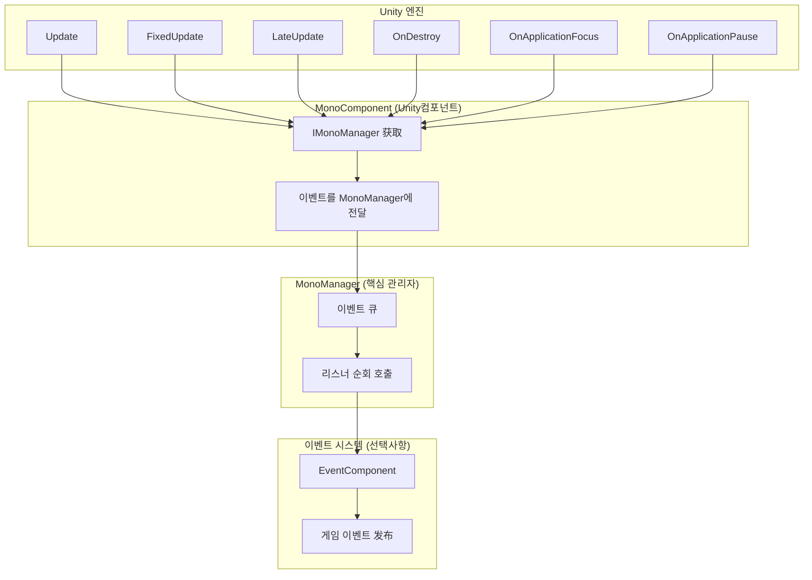
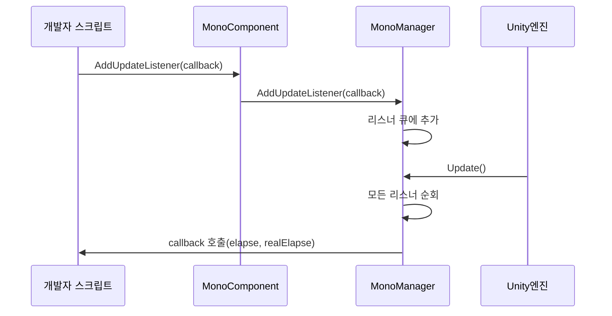

# 기초 사용

GameFrameX Mono 생명주기 컴포넌트의 기초 사용 안내서로, 개발자가 빠르게 프레임워크를 시작하고 핵심 사용법을 이해할 수 있도록 도와줍니다.

## 개요

Mono 생명주기 컴포넌트는 GameFrameX 프레임워크의 핵심 모듈 중 하나로, Unity에서 `MonoBehaviour`의 다양한 생명주기 이벤트를 통합 관리합니다. 이 컴포넌트는 간결한 리스너 모드를 제공하여 개발자가 `Update`, `FixedUpdate`, `LateUpdate`, `OnDestroy`, `OnApplicationFocus`, `OnApplicationPause` 등의 이벤트를 편리하게 구독하고 관리할 수 있게 하며, 각 스크립트에서 개별적으로これらの 콜백을 처리할 필요가 없습니다.

> **설계 의도**:分散된 생명주기 콜백 로직을 통합된 이벤트 관리 시스템에集中させ, 코드 결합을 피하고 유지보수와 확장을 용이하게 합니다.

## 아키텍처 개요



**아키텍처 설명**:
- **MonoComponent**: GameObject에 Attach된 Unity 컴포넌트로, Unity 생명주기 콜백을 수신하여 MonoManager에 전달
- **MonoManager**: 핵심 관리자로, 각 이벤트 리스너 목록을 유지하고 콜백 수신 시 모든 리스너를 순차적으로 호출
- **EventSystem**: 선택사항 모듈로,焦点 또는 일시정지 상태 변화 시 EventComponent를 통해 게임 이벤트를 发布하여 다른 모듈에서 구독 가능

## 핵심 개념

### 리스너 모드

프레임워크는 전형적인 리스너(옵저버) 모드를 채택하여 개발자가 관심 있는 이벤트를 구독하고 이벤트 발생 시 통지를 받을 수 있습니다.



### 스레드 안전 설계

모든 리스너의 추가 및 제거操作은 `lock`으로 보호되어 다중 스레드 환경에서의 안전성을 보장합니다. 리스너 호출도 잠금 내에서 실행되어 호출 중 리스너가意外 수정되는 것을 방지합니다.

> **성능 최적화**: MonoManager는 `LinkedList<T>`를 사용하여 리스너 저장을 지원하며高效的な 추가, 제거 및 순회 操作을 지원합니다.

## 사용 방식

### 첫 번째 단계: MonoComponent 추가

Unity 편집기에서 생명주기 이벤트를 사용해야 하는 GameObject를 선택하고, **Add Component**를 클릭하여 **GameFrameX/Mono**를 검색하여 추가합니다.

```csharp
// 소스 위치: Runtime/Mono/MonoComponent.cs#L42-L44
[DisallowMultipleComponent]
[AddComponentMenu("GameFrameX/Mono")]
public class MonoComponent : GameFrameworkComponent
```

또는 코드를 통해 동적으로 추가:

```csharp
var monoComponent = gameObject.AddComponent<GameFrameX.Mono.Runtime.MonoComponent>();
```
> Source: [MonoComponent.cs](https://github.com/GameFrameX/com.gameframex.unity.mono/blob/main/Runtime/Mono/MonoComponent.cs#L42-L44)

### 두 번째 단계: 생명주기 이벤트 구독

스크립트에서 `MonoComponent` 인스턴스를获取한 후 해당 메서드를 호출하여 이벤트를 구독할 수 있습니다. 다음은 완전한使用 예시입니다:

```csharp
using UnityEngine;
using GameFrameX.Mono.Runtime;
using System;

public class Example : MonoBehaviour
{
    private MonoComponent _monoComponent;

    private void Awake()
    {
        // MonoComponent 인스턴스获取
        _monoComponent = GetComponent<MonoComponent>();
    }

    private void Start()
    {
        // Update 이벤트 구독
        _monoComponent.AddUpdateListener(OnGameUpdate);
        
        // FixedUpdate 이벤트 구독
        _monoComponent.AddFixedUpdateListener(OnFixedUpdate);
        
        // LateUpdate 이벤트 구독
        _monoComponent.AddLateUpdateListener(OnLateUpdate);
        
        // OnDestroy 이벤트 구독
        _monoComponent.AddDestroyListener(OnGameObjectDestroy);
        
        //焦点 변화 이벤트 구독
        _monoComponent.AddOnApplicationFocusListener(OnApplicationFocus);
        
        //일시정지 상태 변화 이벤트 구독
        _monoComponent.AddOnApplicationPauseListener(OnApplicationPause);
    }

    private void OnDestroy()
    {
        // 페이지 파괴 시 리스너 제거, 메모리 누수 방지
        if (_monoComponent != null)
        {
            _monoComponent.RemoveUpdateListener(OnGameUpdate);
            _monoComponent.RemoveFixedUpdateListener(OnFixedUpdate);
            _monoComponent.RemoveLateUpdateListener(OnLateUpdate);
            _monoComponent.RemoveDestroyListener(OnGameObjectDestroy);
            _monoComponent.RemoveOnApplicationFocusListener(OnApplicationFocus);
            _monoComponent.RemoveOnApplicationPauseListener(OnApplicationPause);
        }
    }

    // Update: 매 프레임 호출, 첫 번째 파라미터는上一프레임からの 경과 시간, 두 번째 파라미터는 실제 경과 시간
    private void OnGameUpdate(float elapseSeconds, float realElapseSeconds)
    {
        // 게임 로직 작성
    }

    // FixedUpdate: 고정 프레임레이트로 호출, 물리 관련 로직에 적합
    private void OnFixedUpdate(float elapseSeconds, float fixedElapseSeconds)
    {
        // 물리 로직 작성
    }

    // LateUpdate: 모든 Update 호출 후 호출, 카메라 추적 등 모든 이동 로직 실행 후 필요한操作에 적합
    private void OnLateUpdate(float elapseSeconds, float fixedElapseSeconds)
    {
        // 마지막에 실행할 로직 작성
    }

    // OnDestroy: GameObject 파괴 시 호출, 리소스 정리に適合
    private void OnGameObjectDestroy()
    {
        // 리소스 정리
    }

    // OnApplicationFocus: 앱焦点 변화 시 호출
    private void OnApplicationFocus(bool focusStatus)
    {
        if (focusStatus)
        {
            Debug.Log("앱이焦点 획득");
        }
        else
        {
            Debug.Log("앱이焦点 상실");
        }
    }

    // OnApplicationPause: 앱일시정지 상태 변화 시 호출
    private void OnApplicationPause(bool pauseStatus)
    {
        if (pauseStatus)
        {
            Debug.Log("게임이 일시정지됨");
        }
        else
        {
            Debug.Log("게임이恢复了됨");
        }
    }
}
```

> Source: [MonoComponent.cs](https://github.com/GameFrameX/com.gameframex.unity.mono/blob/main/Runtime/Mono/MonoComponent.cs#L126-L300)

## 이벤트 타입 상세

| 이벤트 타입 | 콜백 파라미터 | 호출 시기 | 적용 시나리오 |
|---------|---------|---------|---------|
| **Update** | `(float elapseSeconds, float realElapseSeconds)` | 매 프레임 호출, 먼저 실행 | 게임 메인 루프 로직, 입력 감지 |
| **FixedUpdate** | `(float elapseSeconds, float fixedElapseSeconds)` | 고정 프레임레이트 호출 (기본 0.02초) | 물리 엔진 관련 로직 |
| **LateUpdate** | `(float elapseSeconds, float fixedElapseSeconds)` | 모든 Update 후 호출 | 카메라 추적, 캐릭터 이동 후 처리 |
| **OnDestroy** | `()` | GameObject 파괴 시 호출 | 리소스 정리, 이벤트 등록 해제 |
| **OnApplicationFocus** | `(bool focusStatus)` | 앱이焦点 획득/상실 시 호출 | 게임 일시정지, 상태 기록 |
| **OnApplicationPause** | `(bool pauseStatus)` | 앱 일시정지/恢复了 시 호출 | 데이터 저장, 음악 중지 |

### 파라미터 설명

- **elapseSeconds**:上一프레임からの 경과 시간(초), 시간 배율 영향 받음
- **realElapseSeconds**: 실제 경과 시간(초), 시간 배율 영향 받지 않음
- **fixedElapseSeconds**: 고정 업데이트 모드의 경과 시간
- **focusStatus**:焦点 상태, `true`는焦点 획득, `false`는焦点 상실
- **pauseStatus**:일시정지 상태, `true`는 일시정지, `false`는恢复了

## 이벤트 시스템 통합

리스너 콜백 외에도, `OnApplicationFocus` 및 `OnApplicationPause` 이벤트는 GameFrameX의 이벤트 시스템을 통해 发布되므로 개발자는 이벤트 시스템을 사용하여 이러한 변화를 구독할 수도 있습니다:

```csharp
using GameFrameX.Event.Runtime;
using GameFrameX.Mono.Runtime;

//焦点 변화 이벤트 구독
EventComponent.Subscribe<OnApplicationFocusChangedEventArgs>(OnFocusChanged);

//일시정지 변화 이벤트 구독
EventComponent.Subscribe<OnApplicationPauseChangedEventArgs>(OnPauseChanged);

private void OnFocusChanged(OnApplicationFocusChangedEventArgs args)
{
    Debug.Log($"焦点 변화: {args.IsFocus}");
}

private void OnPauseChanged(OnApplicationPauseChangedEventArgs args)
{
    Debug.Log($"일시정지 상태: {args.IsPause}");
}
```

> **주의**: 이벤트 시스템의 发布는 MonoComponent에서 구현되어, 상세한 설명은 [이벤트 시스템 문서](../5-events.1-event-types)를 참조하세요.

## 모범 사례

### 1. 적시에 리스너 제거

`OnDestroy` 또는 컴포넌트 비활성화 시 리스너를 제거하여 메모리 누수 및 null 참조 예외 방지:

```csharp
private void OnDestroy()
{
    // null인지 확인 필요, Unity가 컴포넌트 파괴 시 먼저 참조를 정리할 수 있음
    _monoComponent?.RemoveUpdateListener(OnGameUpdate);
}
```

### 2. 리스너에서 시간 소모 operation 실행 금지

생명주기 이벤트는 매 프레임 호출되므로 시간 소모 operation은 게임 메인 스레드를 차단하고 성능에 영향:

```csharp
// ❌ 비권장: 시간 소모 operation 실행
private void OnGameUpdate(float elapse, float realElapse)
{
    LoadLargeResource(); // 메인 스레드 차단
}

// ✅ 권장: 코루틴 또는 비동기 operation 사용
private void OnGameUpdate(float elapse, float realElapse)
{
    StartCoroutine(LoadResourceAsync());
}
```

### 3. 예외 격리

MonoManager는 예외 격리 메커니즘을 구현하여 단일 리스너의 예외가 다른 리스너 실행에 영향 주지 않도록 합니다:

```csharp
// MonoManager 내부 구현（소스 코드 발췌）
private static void QueueInvoking(LinkedList<Action<float, float>> list, float elapseSeconds, float fixedElapseSeconds)
{
    lock (Lock)
    {
        foreach (var action in list)
        {
            try
            {
                action.Invoke(elapseSeconds, fixedElapseSeconds);
            }
            catch (Exception e)
            {
                Log.Error(e); // 예외 기록 but 다른 리스너 계속 실행
            }
        }
    }
}
```
> Source: [MonoManager.cs](https://github.com/GameFrameX/com.gameframex.unity.mono/blob/main/Runtime/Mono/MonoManager.cs#L364-L380)

### 4. 의미 있는 리스너 메서드명 사용

리스너에 설명적인 메서드명을 사용하여 코드 가독성 향상:

```csharp
// ✅ 권장
_monoComponent.AddUpdateListener(UpdatePlayerMovement);
_monoComponent.AddFixedUpdateListener(SyncPhysicsState);

// ❌ 비권장
_monoComponent.AddUpdateListener(Update);
_monoComponent.AddFixedUpdateListener(Fixed);
```

## 자주 묻는 질문

### Q1: MonoComponent는 어디에 Attach해야 하나요?

MonoComponent는 생명주기 이벤트를 수신해야 하는 GameObject에 Attach해야 합니다. 게임 진입 GameObject(예: GameManager)에 Attach하여 하나의 곳에서 모든 생명주기 이벤트를 관리하는 것을 권장합니다.

### Q2: 리스너 콜백의 예외가 게임 실행에 영향 주나요?

영향 없습니다. MonoManager는 예외 격리를 구현하여 단일 리스너의 예외가 캡처되어 기록되므로 다른 리스너 실행에 영향 주지 않습니다.

### Q3: Update, FixedUpdate, LateUpdate의 차이는 무엇인가요?

- **Update**: 매 프레임 호출, 시간 간격은 `Time.timeScale` 영향 받음
- **FixedUpdate**: 고정 시간 간격 호출 (기본 0.02초), 물리 계산에 적합
- **LateUpdate**: 모든 Update 호출 후 호출, 카메라 추적 등 다른 로직 완료 후 필요한 operation에 적합

### Q4: MonoManager 인스턴스를 어떻게 获取하나요?

GameFrameworkEntry를 통해 获取:

```csharp
var monoManager = GameFrameworkEntry.GetModule<IMonoManager>();
```

### Q5: 이벤트 리스너와 이벤트 시스템의 차이는 무엇인가요?

- **리스너**: MonoComponent를 통해 콜백 추가, 이벤트 발생 시 직접 호출, 일대일 통신에 적합
- **이벤트 시스템**: EventComponent를 통해 이벤트 发布/구독, 다중 구독자 지원, 일대다 통신에 적합

## 관련 링크

- [MonoManager 핵심 컴포넌트 상세](../4-core-components.1-monomanager)
- [MonoComponent 컴포넌트 상세](../4-core-components.2-monocomponent)
- [이벤트 타입 상세](../5-events.1-event-types)
- [이벤트 파라미터 상세](../5-events.2-event-args)
- [설치 가이드](../2-installation.1-installation-methods)
- [플러그인 소개](../1-overview.1-introduction)