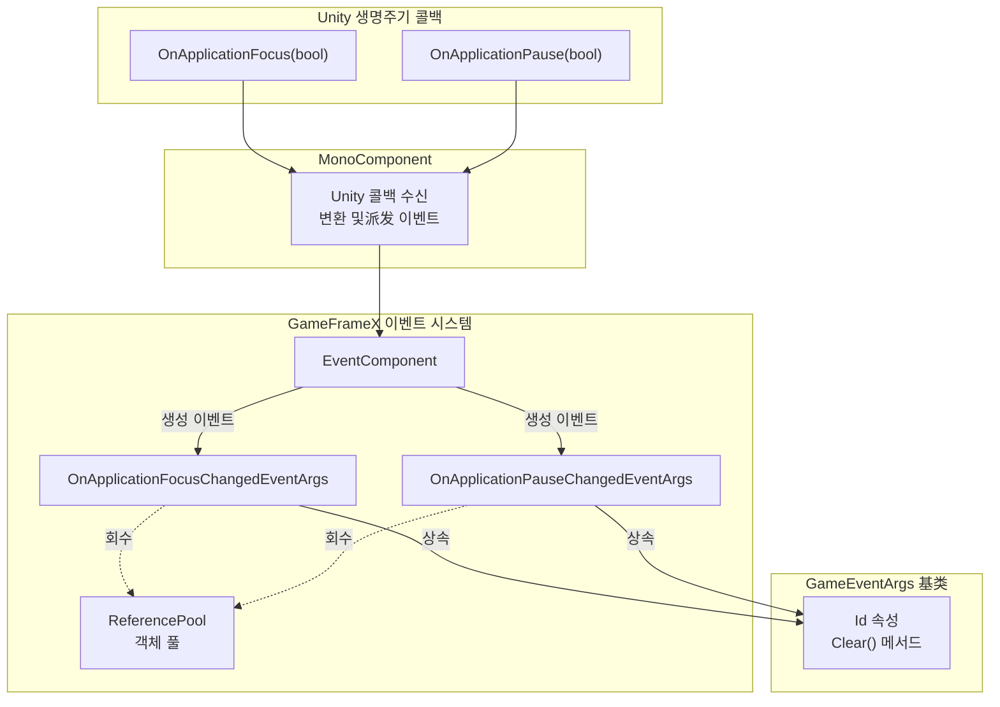
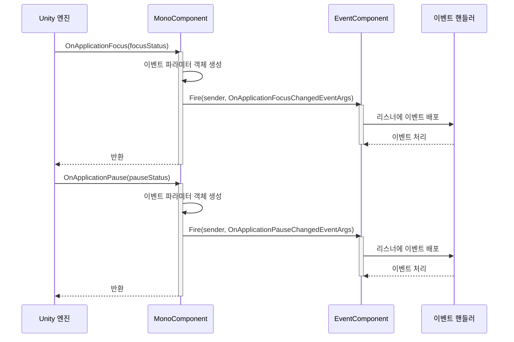

# 이벤트 타입

本文档介绍 GameFrameX Mono 插件中定义的事件类型，用于处理 Unity 应用程序生命周期中的焦点和暂停状态变化。

## 개요

GameFrameX Mono 플러그인은 Unity 애플리케이션 생명주기 중焦点 및 일시정지 상태 변화를 처리하기 위한 두 가지 핵심 이벤트 타입을 제공합니다. 이 이벤트들은 GameFrameX 이벤트 시스템을 기반으로 구축되어 객체 풀 회수 메커니즘을 지원하며, 애플리케이션 포그라운드/백그라운드 전환 및 일시정지恢复了 시나리오를 효율적으로 처리할 수 있습니다.

**이벤트 타입 목록:**

| 이벤트 타입 | 용도 | 이벤트ID |
|---------|------|--------|
| OnApplicationFocusChangedEventArgs | 앱 포그라운드/백그라운드 전환 이벤트 | 클래스의 완전한 이름 |
| OnApplicationPauseChangedEventArgs | 앱 일시정지/恢复了 이벤트 | 클래스의 완전한 이름 |

## 아키텍처



**아키텍처 설명:**

1. **MonoComponent**: 장면에 Attach된 Unity 컴포넌트로, Unity 생명주기 콜백 (`OnApplicationFocus` 및 `OnApplicationPause`)을 수신
2. **이벤트 변환**: Unity의 부울 파라미터를 강형 이벤트 파라미터 객체로 변환
3. **EventComponent**: GameFrameX 핵심 이벤트 컴포넌트로, 이벤트派发 및 리스너 관리 담당
4. **이벤트 파라미터**: `GameEventArgs` 基类를 상속하여 통합 인터페이스 및 객체 풀 지원 제공

## 이벤트 타입 상세

### OnApplicationFocusChangedEventArgs

애플리케이션 포그라운드/백그라운드 전환 이벤트로서, 애플리케이션이焦点을 획득하거나 상실할 때 트리거됩니다.

```csharp
public sealed class OnApplicationFocusChangedEventArgs : GameEventArgs
{
    /// <summary>
    /// 애플리케이션 포그라운드/백그라운드 전환 이벤트 번호.
    /// </summary>
    public static readonly string EventId = typeof(OnApplicationFocusChangedEventArgs).FullName;

    /// <summary>
    /// 포그라운드인지 여부.
    /// </summary>
    public bool IsFocus { get; private set; }

    /// <summary>
    /// 애플리케이션 포그라운드/백그라운드 전환 이벤트를 생성합니다.
    /// </summary>
    public static OnApplicationFocusChangedEventArgs Create(bool isFocus)
    {
        var args = ReferencePool.Acquire<OnApplicationFocusChangedEventArgs>();
        args.IsFocus = isFocus;
        return args;
    }

    /// <summary>
    /// 포그라운드/백그라운드 전환 이벤트를 정리합니다.
    /// </summary>
    public override void Clear()
    {
        IsFocus = false;
    }
}
```

> Source: [OnApplicationFocusChangedEventArgs.cs](https://github.com/GameFrameX/com.gameframex.unity.mono/blob/main/Runtime/EventArgs/OnApplicationFocusChangedEventArgs.cs#L40-L87)

**속성 설명:**

| 속성 | 타입 | 설명 |
|-----|------|------|
| Id | string (override) | 이벤트 고유 식별자 반환 |
| IsFocus | bool | true는焦点 획득 (포그라운드 진입), false는焦点 상실 (백그라운드 진입) |

**사용 시나리오:**
- 플레이어가 다른 앱으로 전환할 때 게임 음악 일시정지
- 백그라운드로 전환할 때 게임 진행 상황 저장
- 사용자가 게임과 상호작용 중인지 감지

### OnApplicationPauseChangedEventArgs

애플리케이션 일시정지 상태 변화 이벤트로서, 애플리케이션이 일시정지되거나恢复了될 때 트리거됩니다.

```csharp
public sealed class OnApplicationPauseChangedEventArgs : GameEventArgs
{
    /// <summary>
    /// 애플리케이션이 일시정지 상태 변화 이벤트 번호.
    /// </summary>
    public static readonly string EventId = typeof(OnApplicationPauseChangedEventArgs).FullName;

    /// <summary>
    /// 일시정지 여부.
    /// </summary>
    public bool IsPause { get; private set; }

    /// <summary>
    /// 애플리케이션이 일시정지 상태 변화 이벤트를 생성합니다.
    /// </summary>
    public static OnApplicationPauseChangedEventArgs Create(bool isPause)
    {
        var args = ReferencePool.Acquire<OnApplicationPauseChangedEventArgs>();
        args.IsPause = isPause;
        return args;
    }

    /// <summary>
    /// 애플리케이션이 일시정지 상태 변화 이벤트를 정리합니다.
    /// </summary>
    public override void Clear()
    {
        IsPause = false;
    }
}
```

> Source: [OnApplicationPauseChangedEventArgs.cs](https://github.com/GameFrameX/com.gameframex.unity.mono/blob/main/Runtime/EventArgs/OnApplicationPauseChangedEventArgs.cs#L40-L88)

**속성 설명:**

| 속성 | 타입 | 설명 |
|-----|------|------|
| Id | string (override) | 이벤트 고유 식별자 반환 |
| IsPause | bool | true는 애플리케이션 일시정지, false는 애플리케이션 실행恢复了 |

**사용 시나리오:**
- 게임 로직 일시정지
- 일시정지 인터페이스 표시
- iOS/Android 시스템 전화割り込み 처리

## 이벤트 흐름



**흐름 설명:**

1. Unity 엔진이 애플리케이션焦点 또는 일시정지 상태 변화를 감지
2. `MonoComponent`의 `OnApplicationFocus` 또는 `OnApplicationPause` 콜백 호출
3. 대응하는 이벤트 파라미터 객체 생성 (`Create` 정적 메서드 사용)
4. `EventComponent.Fire()`를 통해 이벤트派发
5. 해당 이벤트 타입을 구독한 모든 핸들러가 순차적으로 호출
6. 이벤트 처리 완료 후 객체가 `ReferencePool`에 회수되어后续使用 가능

## 사용 예시

### 애플리케이션焦点 변화 이벤트 구독

```csharp
using GameFrameX.Event.Runtime;
using GameFrameX.Mono.Runtime;

// 리스너를 추가해야 하는 클래스에서
public class GameManager : MonoBehaviour
{
    private void Start()
    {
        // 애플리케이션焦点 변화 이벤트 구독
        EventComponent.Instance.Subscribe<OnApplicationFocusChangedEventArgs>(OnAppFocusChanged);
    }

    private void OnDestroy()
    {
        // 이벤트 구독 취소 (중요: 메모리 누수 방지)
        EventComponent.Instance.Unsubscribe<OnApplicationFocusChangedEventArgs>(OnAppFocusChanged);
    }

    private void OnAppFocusChanged(object sender, OnApplicationFocusChangedEventArgs e)
    {
        if (e.IsFocus)
        {
            Debug.Log("애플리케이션 포그라운드 진입");
            // 게임恢复了
        }
        else
        {
            Debug.Log("애플리케이션 백그라운드 진입");
            // 게임 진행 상황 저장
        }
    }
}
```

> Source: [MonoComponent.cs](https://github.com/GameFrameX/com.gameframex.unity.mono/blob/main/Runtime/Mono/MonoComponent.cs#L100-L107)

### 애플리케이션 일시정지 이벤트 구독

```csharp
using GameFrameX.Event.Runtime;
using GameFrameX.Mono.Runtime;

public class PauseManager : MonoBehaviour
{
    private void Start()
    {
        EventComponent.Instance.Subscribe<OnApplicationPauseChangedEventArgs>(OnAppPauseChanged);
    }

    private void OnDestroy()
    {
        EventComponent.Instance.Unsubscribe<OnApplicationPauseChangedEventArgs>(OnAppPauseChanged);
    }

    private void OnAppPauseChanged(object sender, OnApplicationPauseChangedEventArgs e)
    {
        if (e.IsPause)
        {
            Debug.Log("게임이 일시정지됨");
            Time.timeScale = 0f; // 게임 시간 일시정지
        }
        else
        {
            Debug.Log("게임이恢复了됨");
            Time.timeScale = 1f; // 게임 시간恢复了
        }
    }
}
```

> Source: [MonoComponent.cs](https://github.com/GameFrameX/com.gameframex.unity.mono/blob/main/Runtime/Mono/MonoComponent.cs#L113-L120)

## 주의 사항

1. **반드시 구독 취소 필요**: `OnDestroy` 또는 컴포넌트 파괴 시 `Unsubscribe`를 호출하여 이벤트 구독을 취소해야 메모리 누수를 방지할 수 있습니다
2. **객체 풀 메커니즘**: 이벤트 파라미터는 ReferencePool을 통해 관리되므로, 이벤트 생성 시 `Create` 메서드를 사용해야 하며 직접 인스턴스화하면 안 됩니다
3. **상태 정리**: 이벤트 사용 후 시스템이 자동으로 `Clear()` 메서드를 호출하여 상태를 초기화하고 객체를 풀에 회수합니다
4. **스레드 안전성**: 이벤트派发는 메인 스레드에서 수행되므로 스레드 안전性问题 걱정할 필요 없습니다

## 관련 링크

- [MonoManager](./4-core-components.1-monomanager) - Mono 관리자 문서
- [MonoComponent](./4-core-components.2-monocomponent) - Mono 컴포넌트 문서
- [이벤트 파라미터](./5-events.2-event-args) - 이벤트 파라미터 상세 설명
- [기초 사용](./3-getting-started.1-basic-usage) - 플러그인 기초 사용 안내서