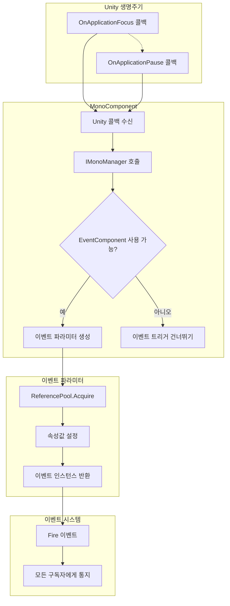

# 이벤트 파라미터

이벤트 파라미터(EventArgs)는 GameFrameX Mono 플러그인에서 애플리케이션 생명주기 이벤트가 트리거될 때 데이터를 전달하는 컨테이너 클래스입니다. 本文档详细介绍현재 플러그인이 제공하는 두 가지 이벤트 파라미터 타입及其使用方式.

## 개요

Unity 애플리케이션 실행 중 일부 시스템 레벨 이벤트(예: 애플리케이션이 백그라운드로 전환, 일시정지 등)는 다른 모듈에서 감지하여 대응해야 합니다. 이벤트 파라미터(EventArgs)는 이벤트 시스템의 핵심组成部分로 이벤트 관련 데이터를 캡슐화하는 역할을 담당합니다.

GameFrameX Mono 플러그인은 GameFrameX 이벤트 시스템을 기반으로 구축되어, Unity 애플리케이션 생명주기에 대한 두 가지 이벤트 파라미터 타입을 제공합니다:

- **OnApplicationFocusChangedEventArgs**: 앱 포그라운드/백그라운드 전환 이벤트
- **OnApplicationPauseChangedEventArgs**: 앱 일시정지/恢复了 이벤트

これらの 이벤트 파라미터는 객체 풀 모드를 채택하여 설계되었으며, `ReferencePool`을 통해 객체 재사용을 실현하여 가비지 컬렉션(GC)으로 인한 성능 오버헤드를 효과적으로 줄입니다.

## 아키텍처 설계

### 클래스 다이어그램 구조

```mermaid
classDiagram
    class GameEventArgs {
        <<abstract>>
        +Id: string { get; }
        +Clear(): void
    }
    
    class OnApplicationFocusChangedEventArgs {
        +EventId: string
        +IsFocus: bool
        +Create(isFocus: bool): OnApplicationFocusChangedEventArgs
    }
    
    class OnApplicationPauseChangedEventArgs {
        +EventId: string
        +IsPause: bool
        +Create(isPause: bool): OnApplicationPauseChangedEventArgs
    }
    
    class ReferencePool {
        +Acquire~T~(): T
        +Release(instance): void
    }
    
    GameEventArgs <|-- OnApplicationFocusChangedEventArgs
    GameEventArgs <|-- OnApplicationPauseChangedEventArgs
    OnApplicationFocusChangedEventArgs ..> ReferencePool : uses
    OnApplicationPauseChangedEventArgs ..> ReferencePool : uses
```

### 이벤트 흐름 프로세스



## 핵심 컴포넌트 상세

### OnApplicationFocusChangedEventArgs

애플리케이션 포그라운드/백그라운드 전환 이벤트 파라미터로서, Unity 애플리케이션의焦点 상태가 변화할 때 트리거됩니다.

```csharp
public sealed class OnApplicationFocusChangedEventArgs : GameEventArgs
{
    /// <summary>
    /// 애플리케이션 포그라운드/백그라운드 전환 이벤트 번호.
    /// </summary>
    public static readonly string EventId = typeof(OnApplicationFocusChangedEventArgs).FullName;

    /// <summary>
    /// 포그라운드인지 여부.
    /// </summary>
    public bool IsFocus { get; private set; }

    /// <summary>
    /// 애플리케이션 포그라운드/백그라운드 전환 이벤트를 생성합니다.
    /// </summary>
    public static OnApplicationFocusChangedEventArgs Create(bool isFocus)
    {
        var loadDictionaryUpdateChangedEventArgs = ReferencePool.Acquire<OnApplicationFocusChangedEventArgs>();
        loadDictionaryUpdateChangedEventArgs.IsFocus = isFocus;
        return loadDictionaryUpdateChangedEventArgs;
    }

    /// <summary>
    /// 포그라운드/백그라운드 전환 이벤트를 정리합니다.
    /// </summary>
    public override void Clear()
    {
        IsFocus = false;
    }
}
```

> Source: [OnApplicationFocusChangedEventArgs.cs](https://github.com/GameFrameX/com.gameframex.unity.mono/blob/main/Runtime/EventArgs/OnApplicationFocusChangedEventArgs.cs#L40-L87)

**속성 설명:**

| 속성 | 타입 | 설명 |
|------|------|------|
| EventId | string | 이벤트의 고유 식별자로, 타입의 완전한 한정 이름 사용 |
| IsFocus | bool | 애플리케이션이焦点을 획득했는지 여부, `true`는 포그라운드, `false`는 백그라운드 |

### OnApplicationPauseChangedEventArgs

애플리케이션 일시정지 상태 변화 이벤트 파라미터로서, Unity 애플리케이션의 일시정지 상태가变化할 때 트리거됩니다.

```csharp
public sealed class OnApplicationPauseChangedEventArgs : GameEventArgs
{
    /// <summary>
    /// 애플리케이션이 일시정지 상태 변화 이벤트 번호.
    /// </summary>
    public static readonly string EventId = typeof(OnApplicationPauseChangedEventArgs).FullName;

    /// <summary>
    /// 일시정지 여부.
    /// </summary>
    public bool IsPause { get; private set; }

    /// <summary>
    /// 애플리케이션이 일시정지 상태 변화 이벤트를 생성합니다.
    /// </summary>
    public static OnApplicationPauseChangedEventArgs Create(bool isPause)
    {
        var loadDictionaryUpdateEventArgs = ReferencePool.Acquire<OnApplicationPauseChangedEventArgs>();
        loadDictionaryUpdateEventArgs.IsPause = isPause;
        return loadDictionaryUpdateEventArgs;
    }

    /// <summary>
    /// 애플리케이션이 일시정지 상태 변화 이벤트를 정리합니다.
    /// </summary>
    public override void Clear()
    {
        IsPause = false;
    }
}
```

> Source: [OnApplicationPauseChangedEventArgs.cs](https://github.com/GameFrameX/com.gameframex.unity.mono/blob/main/Runtime/EventArgs/OnApplicationPauseChangedEventArgs.cs#L40-L88)

**속성 설명:**

| 속성 | 타입 | 설명 |
|------|------|------|
| EventId | string | 이벤트의 고유 식별자로, 타입의 완전한 한정 이름 사용 |
| IsPause | bool | 애플리케이션이 일시정지되었는지 여부, `true`는 일시정지, `false`는恢复了 |

## 이벤트 트리거时机

### OnApplicationFocus 이벤트

애플리케이션이焦点을 획득하거나 상실할 때 트리거됩니다. Unity에서 이는 `MonoBehaviour.OnApplicationFocus(bool)` 콜백에 의해 트리거됩니다.

```csharp
/// <summary>
/// 애플리케이션이焦点을 상실하거나 획득할 때 호출됩니다.
/// </summary>
/// <param name="focusStatus">애플리케이션의焦点 상태. true는焦点 획득, false는焦点 상실.</param>
private void OnApplicationFocus(bool focusStatus)
{
    _monoManager.OnApplicationFocus(focusStatus);
    if (m_EventComponent != null)
    {
        m_EventComponent.Fire(this, OnApplicationFocusChangedEventArgs.Create(focusStatus));
    }
}
```

> Source: [MonoComponent.cs](https://github.com/GameFrameX/com.gameframex.unity.mono/blob/main/Runtime/Mono/MonoComponent.cs#L96-L107)

### OnApplicationPause 이벤트

애플리케이션이 일시정지되거나恢复了될 때 트리거됩니다. Unity에서 이는 `MonoBehaviour.OnApplicationPause(bool)` 콜백에 의해 트리거됩니다.

```csharp
/// <summary>
/// 애플리케이션이 일시정지되거나恢复了될 때 호출됩니다.
/// </summary>
/// <param name="pauseStatus">애플리케이션의 일시정지 상태. true는 일시정지, false는恢复了.</param>
private void OnApplicationPause(bool pauseStatus)
{
    _monoManager.OnApplicationPause(pauseStatus);
    if (m_EventComponent != null)
    {
        m_EventComponent.Fire(this, OnApplicationPauseChangedEventArgs.Create(pauseStatus));
    }
}
```

> Source: [MonoComponent.cs](https://github.com/GameFrameX/com.gameframex.unity.mono/blob/main/Runtime/Mono/MonoComponent.cs#L109-L120)

## 사용 예시

### 애플리케이션 포그라운드/백그라운드 이벤트 구독

```csharp
using GameFrameX.Event.Runtime;
using GameFrameX.Mono.Runtime;

public class GameController : MonoBehaviour
{
    private void Start()
    {
        // 애플리케이션焦点变化 이벤트 구독
        EventComponent.Instance.Subscribe<OnApplicationFocusChangedEventArgs>(OnFocusChanged);
        
        // 애플리케이션 일시정지 변화 이벤트 구독
        EventComponent.Instance.Subscribe<OnApplicationPauseChangedEventArgs>(OnPauseChanged);
    }

    private void OnDestroy()
    {
        // 이벤트 구독 취소
        EventComponent.Instance.Unsubscribe<OnApplicationFocusChangedEventArgs>(OnFocusChanged);
        EventComponent.Instance.Unsubscribe<OnApplicationPauseChangedEventArgs>(OnPauseChanged);
    }

    private void OnFocusChanged(object sender, OnApplicationFocusChangedEventArgs e)
    {
        if (e.IsFocus)
        {
            Debug.Log("애플리케이션焦点 획득 - 포그라운드 진입");
        }
        else
        {
            Debug.Log("애플리케이션焦点 상실 - 백그라운드 진입");
        }
    }

    private void OnPauseChanged(object sender, OnApplicationPauseChangedEventArgs e)
    {
        if (e.IsPause)
        {
            Debug.Log("애플리케이션 일시정지");
        }
        else
        {
            Debug.Log("애플리케이션恢复了");
        }
    }
}
```

> Source: [MonoComponent.cs](https://github.com/GameFrameX/com.gameframex.unity.mono/blob/main/Runtime/Mono/MonoComponent.cs#L64-L120)

### 모바일 생명주기 이벤트 처리

모바일 기기에서 애플리케이션은 종종 다양한 상태 사이를 전환합니다. 다음 예시는 이러한 시나리오를 처리하는 방법을 보여줍니다:

```csharp
public class MobileLifecycleHandler : MonoBehaviour
{
    private bool _isBackground;

    private void OnEnable()
    {
        EventComponent.Instance.Subscribe<OnApplicationFocusChangedEventArgs>(HandleFocusChange);
        EventComponent.Instance.Subscribe<OnApplicationPauseChangedEventArgs>(HandlePauseChange);
    }

    private void OnDisable()
    {
        EventComponent.Instance.Unsubscribe<OnApplicationFocusChangedEventArgs>(HandleFocusChange);
        EventComponent.Instance.Unsubscribe<OnApplicationPauseChangedEventArgs>(HandlePauseChange);
    }

    private void HandleFocusChange(object sender, OnApplicationFocusChangedEventArgs e)
    {
        _isBackground = !e.IsFocus;
        
        if (_isBackground)
        {
            // 게임 진행 상황 저장
            SaveGame();
        }
        else
        {
            // 게임恢复了
            ResumeGame();
        }
    }

    private void HandlePauseChange(object sender, OnApplicationPauseChangedEventArgs e)
    {
        if (e.IsPause)
        {
            // 일시정지 시 음악 일시정지
            AudioManager.Instance.PauseMusic();
        }
        else
        {
            //恢复了 시 음악 계속
            AudioManager.Instance.ResumeMusic();
        }
    }
}
```

## 설계 모드 설명

### 객체 풀 모드

이벤트 파라미터 클래스는 객체 풀 모드로 설계되어 다음과 같은advantages이 있습니다:

1. **GC压力 감소**: 객체를 재사용하여 빈번한 생성 및 파괴 피하기
2. **성능 향상**: 객체 풀이 객체를 사전 할당하여 메모리 할당 오버헤드 감소

객체 풀의 핵심 메서드:

```csharp
// 객체 풀에서 인스턴스获取
ReferencePool.Acquire<OnApplicationFocusChangedEventArgs>();

// 인스턴스를 객체 풀에 반환 (Clear 메서드를 통해)
public override void Clear()
{
    IsFocus = false;
}
```

### 팩토리 메서드 모드

각 이벤트 파라미터 클래스는 정적 `Create()` 팩토리 메서드를 제공합니다:

- **생성 로직 캡슐화**: 객체 获取 및 속성 초기화의 로직을 팩토리 메서드에 캡슐화
- **일관성 보장**: 매번 생성되는 이벤트 파라미터가 올바르게 초기화되었는지 보장
- **호출 간소화**: 호출자는 하나의 메서드만 호출하면 완전한 설정의 이벤트 파라미터를获取할 수 있음

## API 참고

### OnApplicationFocusChangedEventArgs

#### 속성

| 속성명 | 타입 | 접근 수준 | 설명 |
|--------|------|----------|------|
| EventId | string | public static readonly | 이벤트 고유 식별자 |
| Id | string | public override | 基类 속성 오버라이드, EventId 반환 |
| IsFocus | bool | public get; private set | 애플리케이션이 포그라운드에 있는지 여부 |

#### 메서드

| 메서드명 | 반환 타입 | 설명 |
|--------|----------|------|
| Create(bool isFocus) | OnApplicationFocusChangedEventArgs | 정적 팩토리 메서드, 이벤트 인스턴스 생성 |
| Clear() | void | 이벤트 상태 초기화, 객체 풀 회수용 |

---

### OnApplicationPauseChangedEventArgs

#### 속성

| 속성명 | 타입 | 접근 수준 | 설명 |
|--------|------|----------|------|
| EventId | string | public static readonly | 이벤트 고유 식별자 |
| Id | string | public override | 基类 속성 오버라이드, EventId 반환 |
| IsPause | bool | public get; private set | 애플리케이션이 일시정지되었는지 여부 |

#### 메서드

| 메서드명 | 반환 타입 | 설명 |
|--------|----------|------|
| Create(bool isPause) | OnApplicationPauseChangedEventArgs | 정적 팩토리 메서드, 이벤트 인스턴스 생성 |
| Clear() | void | 이벤트 상태 초기화, 객체 풀 회수용 |

## 관련 링크

- [이벤트 타입](./5-events.1-event-types) - GameFrameX 이벤트 시스템의 완전한 타입 체계 파악
- [MonoComponent](./4-core-components.2-monocomponent) - 이러한 이벤트를 트리거하는 컴포넌트 이해
- [MonoManager](./4-core-components.1-monomanager) - Mono 관리자의 핵심 기능 이해