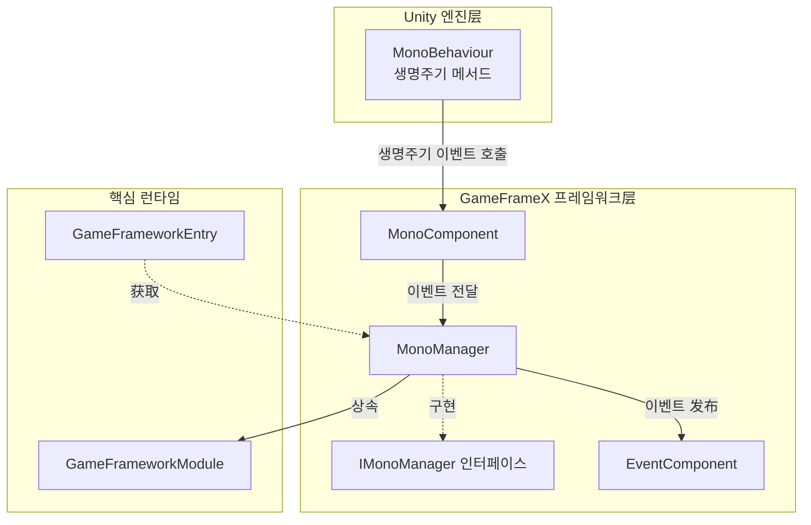
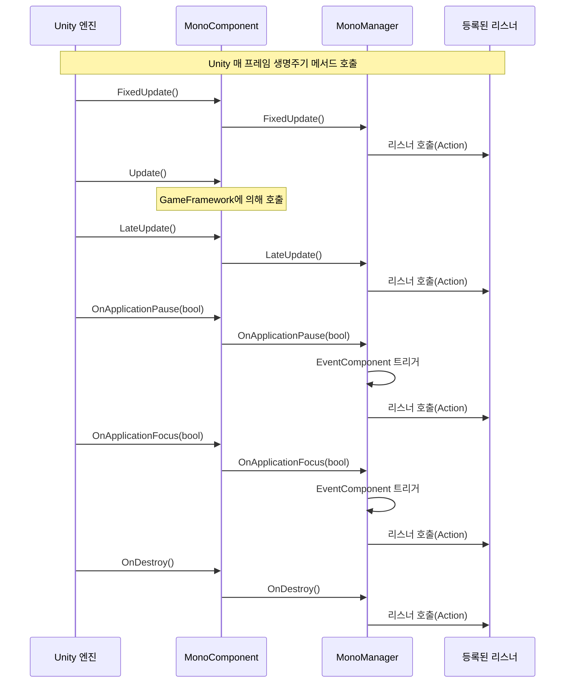
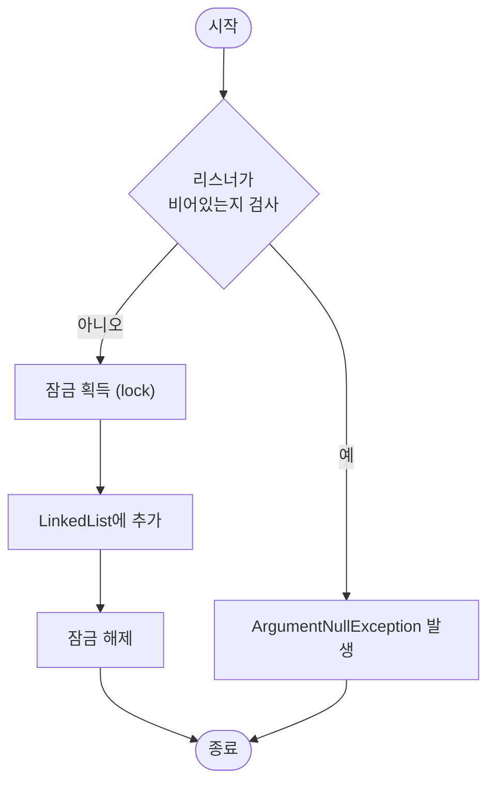

# MonoManager

MonoManager는 GameFrameX 프레임워크의 핵심 모듈로, Unity MonoBehaviour의 생명주기 이벤트를 통합 관리합니다. 여기에는 Update, FixedUpdate, LateUpdate, OnDestroy, OnApplicationPause, OnApplicationFocus 등이 포함됩니다.

## 개요

MonoManager는 Unity 생명주기 이벤트를 집중 관리하는 메커니즘을 제공합니다. 전통적인 Unity 개발에서 개발자는 일반적으로 각 MonoBehaviour 스크립트에서 分别实现 이러한 생명주기 메서드를 구현해야 하며,이로 인해 코드가分散되어 유지보수가 어려워집니다. MonoManager는 옵저버 모드(리스너 모드)를 통해 개발자가 특정 생명주기 이벤트에 대한 리스너를 注册 및 취소할 수 있어 코드의 결합을 분리할 수 있게 합니다.

본 모듈은 `GameFrameworkModule`를 상속하며 GameFrameX 프레임워크의 핵심 컴포넌트 중 하나입니다. `MonoComponent`를 통해 Unity 엔진의 MonoBehaviour 생명주기와 브릿지 연결하여 Unity의 생명주기 이벤트를 통합 수집하여 등록된 리스너에 배포합니다.

### 핵심 기능

- **통합된 이벤트 관리**: 모든 MonoBehaviour 생명주기 이벤트를 집중 관리
- **스레드 안전성**: 잠금 메커니즘을 사용하여 다중 스레드 환경에서의 안전 접근 보장
- **성능 최적화**: Unity Profiler를 사용한 성능 분석 지원
- **이벤트 전달**: EventComponent를 통해 앱焦点 및 일시정지 이벤트를 프레임워크 이벤트로 发布 지원

## 아키텍처



### 컴포넌트 설명

| 컴포넌트 | 역할 | 설명 |
|------|------|------|
| MonoBehaviour | Unity 진입점 | Unity 엔진의 생명주기 콜백 진입점 |
| MonoComponent | 브릿지 | Unity 생명주기 이벤트를 MonoManager에 전달 |
| MonoManager | 핵심 관리자 | 모든 생명주기 이벤트 리스너 관리 및 배포 |
| IMonoManager | 인터페이스 정의 | MonoManager의 공개 인터페이스 정의 |
| EventComponent | 이벤트 시스템 | 일부 이벤트를 프레임워크 이벤트로 변환하여 发布 |

## 작업 흐름

### 이벤트 순환 흐름



### 리스너 등록 흐름



## 사용 예시

### 기본 사용

`MonoComponent`를 통해 Update 리스너 추가:

```csharp
using UnityEngine;
using GameFrameX.Mono.Runtime;

public class ExampleScript : MonoBehaviour
{
    private MonoComponent _monoComponent;

    private void Awake()
    {
        // MonoComponent 컴포넌트 获取 (장면에 이미 추가되어 있어야 함)
        _monoComponent = GetComponent<MonoComponent>();
    }

    private void OnEnable()
    {
        // Update 리스너 추가
        _monoComponent.AddUpdateListener(OnUpdate);
    }

    private void OnDisable()
    {
        // Update 리스너 제거
        _monoComponent.RemoveUpdateListener(OnUpdate);
    }

    private void OnUpdate(float elapseSeconds, float realElapseSeconds)
    {
        // 매 프레임 Update 시 실행
        Debug.Log($"Update: {elapseSeconds:F2}s");
    }
}
```
> Source: [MonoComponent.cs](https://github.com/GameFrameX/com.gameframex.unity.mono/blob/main/Runtime/Mono/MonoComponent.cs#L186-L195)

### FixedUpdate 사용

FixedUpdate는 물리 관련 업데이트에 적합하며, 고정 시간마다 호출됩니다:

```csharp
private MonoComponent _monoComponent;

private void OnEnable()
{
    // FixedUpdate 리스너 추가
    _monoComponent.AddFixedUpdateListener(OnFixedUpdate);
}

private void OnDisable()
{
    // FixedUpdate 리스너 제거
    _monoComponent.RemoveFixedUpdateListener(OnFixedUpdate);
}

private void OnFixedUpdate(float elapseSeconds, float realElapseSeconds)
{
    // 물리 업데이트 로직
}
```
> Source: [MonoComponent.cs](https://github.com/GameFrameX/com.gameframex.unity.mono/blob/main/Runtime/Mono/MonoComponent.cs#L156-L164)

### 앱 일시정지 이벤트 리스닝

```csharp
private MonoComponent _monoComponent;

private void OnEnable()
{
    // 앱 일시정지 이벤트 리스닝
    _monoComponent.AddOnApplicationPauseListener(OnApplicationPause);
}

private void OnDisable()
{
    // 앱 일시정지 리스너 제거
    _monoComponent.RemoveOnApplicationPauseListener(OnApplicationPause);
}

private void OnApplicationPause(bool pauseStatus)
{
    if (pauseStatus)
    {
        Debug.Log("게임이 일시정지됨");
    }
    else
    {
        Debug.Log("게임이恢复了됨");
    }
}
```
> Source: [MonoComponent.cs](https://github.com/GameFrameX/com.gameframex.unity.mono/blob/main/Runtime/Mono/MonoComponent.cs#L246-L254)

### 앱焦点 이벤트 리스닝

```csharp
private MonoComponent _monoComponent;

private void OnEnable()
{
    // 앱焦点变化 이벤트 리스닝
    _monoComponent.AddOnApplicationFocusListener(OnApplicationFocus);
}

private void OnDisable()
{
    // 앱焦点 리스너 제거
    _monoComponent.RemoveOnApplicationFocusListener(OnApplicationFocus);
}

private void OnApplicationFocus(bool focusStatus)
{
    Debug.Log(focusStatus ? "앱이焦点 획득" : "앱이焦点 상실");
}
```
> Source: [MonoComponent.cs](https://github.com/GameFrameX/com.gameframex.unity.mono/blob/main/Runtime/Mono/MonoComponent.cs#L276-L284)

### 파괴 이벤트 리스닝

```csharp
private MonoComponent _monoComponent;

private void OnEnable()
{
    // 객체 파괴 이벤트 리스닝
    _monoComponent.AddDestroyListener(OnDestroyCallback);
}

private void OnDisable()
{
    // 파괴 리스너 제거
    _monoComponent.RemoveDestroyListener(OnDestroyCallback);
}

private void OnDestroyCallback()
{
    // 객체 파괴 시 정리 로직
    Debug.Log("객체即将 파괴, 정리 실행...");
}
```
> Source: [MonoComponent.cs](https://github.com/GameFrameX/com.gameframex.unity.mono/blob/main/Runtime/Mono/MonoComponent.cs#L216-L224)

## API 참고

### IMonoManager 인터페이스

`IMonoManager` 인터페이스는 MonoManager의 모든 공개 메서드를 정의합니다.

#### Update 리스너

```csharp
void AddUpdateListener(Action<float, float> action)
```
Update期间 호출될 리스너를 추가합니다.

**파라미터:**
- `action` (Action<float, float>): 리스너 함수. 첫 번째 파라미터는 경과 시간, 두 번째 파라미터는 실제 경과 시간입니다.

```csharp
void RemoveUpdateListener(Action<float, float> action)
```
Update에서 리스너를 제거합니다.

**파라미터:**
- `action` (Action<float, float>): 리스너 함수.

#### FixedUpdate 리스너

```csharp
void AddFixedUpdateListener(Action<float, float> action)
```
FixedUpdate期间 호출될 리스너를 추가합니다.

**파라미터:**
- `action` (Action<float, float>): 리스너 함수. 첫 번째 파라미터는 경과 시간, 두 번째 파라미터는 고정 경과 시간입니다.

```csharp
void RemoveFixedUpdateListener(Action<float, float> action)
```
FixedUpdate에서 리스너를 제거합니다.

**파라미터:**
- `action` (Action<float, float>): 리스너 함수.

#### LateUpdate 리스너

```csharp
void AddLateUpdateListener(Action<float, float> action)
```
LateUpdate期间 호출될 리스너를 추가합니다.

**파라미터:**
- `action` (Action<float, float>): 리스너 함수. 첫 번째 파라미터는 경과 시간, 두 번째 파라미터는 고정 경과 시간입니다.

```csharp
void RemoveLateUpdateListener(Action<float, float> action)
```
LateUpdate에서 리스너를 제거합니다.

**파라미터:**
- `action` (Action<float, float>): 리스너 함수.

#### Destroy 리스너

```csharp
void AddDestroyListener(Action action)
```
OnDestroy期间 호출될 리스너를 추가합니다.

**파라미터:**
- `action` (Action): 리스너 함수.

```csharp
void RemoveDestroyListener(Action action)
```
Destroy에서 리스너를 제거합니다.

**파라미터:**
- `action` (Action): 리스너 함수.

#### ApplicationPause 리스너

```csharp
void AddOnApplicationPauseListener(Action<bool> action)
```
OnApplicationPause期间 호출될 리스너를 추가합니다.

**파라미터:**
- `action` (`Action<bool>`): 리스너 함수. 파라미터는 일시정지 상태입니다.

```csharp
void RemoveOnApplicationPauseListener(Action<bool> action)
```
OnApplicationPause에서 리스너를 제거합니다.

**파라미터:**
- `action` (`Action<bool>`): 리스너 함수.

#### ApplicationFocus 리스너

```csharp
void AddOnApplicationFocusListener(Action<bool> action)
```
OnApplicationFocus期间 호출될 리스너를 추가합니다.

**파라미터:**
- `action` (`Action<bool>`): 리스너 함수. 파라미터는焦点 상태입니다.

```csharp
void RemoveOnApplicationFocusListener(Action<bool> action)
```
OnApplicationFocus에서 리스너를 제거합니다.

**파라미터:**
- `action` (`Action<bool>`): 리스너 함수.

### MonoManager 내부 메서드

다음 메서드는 MonoComponent에 의해 호출되며, 직접 사용하지 않는 것이 좋습니다:

```csharp
void FixedUpdate()
```
고정 프레임레이트로 호출됩니다.

```csharp
void LateUpdate()
```
모든 Update 함수 호출 후 매 프레임 호출됩니다.

```csharp
void OnDestroy()
```
MonoBehaviour가 파괴될 때 호출됩니다.

```csharp
void OnApplicationFocus(bool focusStatus)
```
앱이焦点을 상실하거나 획득할 때 호출됩니다.

**파라미터:**
- `focusStatus` (bool): 앱의焦点 상태. true는焦点 획득, false는焦点 상실.

```csharp
void OnApplicationPause(bool pauseStatus)
```
앱이 일시정지되거나恢复了될 때 호출됩니다.

**파라미터:**
- `pauseStatus` (bool): 앱의 일시정지 상태. true는 일시정지, false는恢复了.

## 설계 의도

### 왜 리스너 모드를 상속 대신 사용하나?

전통적인 Unity 개발에서 개발자는 일반적으로 스크립트가 MonoBehaviour를 상속하고 그 생명주기 메서드를 재정의해야 합니다. 이러한 방식에는 다음과 같은 문제가 있습니다:
1. **코드 결합**: 비즈니스 로직이 Unity 생명주기 메서드와 긴밀하게 결합됨
2. **테스트 어려움**: 비즈니스 로직의 단위 테스트가 어려움
3. **유지보수 어려움**: 생명주기 로직이 각 스크립트에分散됨

MonoManager는 리스너 모드를 통해这些问题를 해결하여 어느 위치에서든 리스너를 등록할 수 있어 더 나은 코드 분리를 실현합니다.

### 스레드 안전성 고려

MonoManager는 `lock` 키워드를 사용하여 모든 리스너 큐 수정操作을 보호하여 Job System이나 다중 스레드 스크립트 사용 시에도 안전하게 리스너를 추가 및 제거할 수 있도록 보장합니다.

### 성능 최적화

1. **Unity Profiler 통합**: `Profiler.BeginSample` 및 `Profiler.EndSample`을 사용하여 주요 성능 경로를标记하여 Unity Profiler에서 성능 병목 현상 분석 용이
2. **예외 격리**: 각 리스너의 호출은 try-catch 블록에 포함되어 단일 리스너의 예외가 다른 리스너의 실행에 영향 주지 않도록 보장
3. **LinkedList 최적화**: LinkedList를 사용하여 리스너 저장, List보다 O(1)의 추가 및 제거 시간 복잡도 제공

## 관련 링크

- [MonoComponent](./4-core-components.2-monocomponent) - MonoComponent 컴포넌트 문서
- [이벤트 타입](./5-events.1-event-types) - 프레임워크 이벤트 타입
- [이벤트 파라미터](./5-events.2-event-args) - 프레임워크 이벤트 파라미터
- [GitHub 저장소](https://github.com/GameFrameX/com.gameframex.unity.mono.git) - 공식 GitHub 저장소
- [공식 문서](https://gameframex.doc.alianblank.com/) - GameFrameX 공식 문서