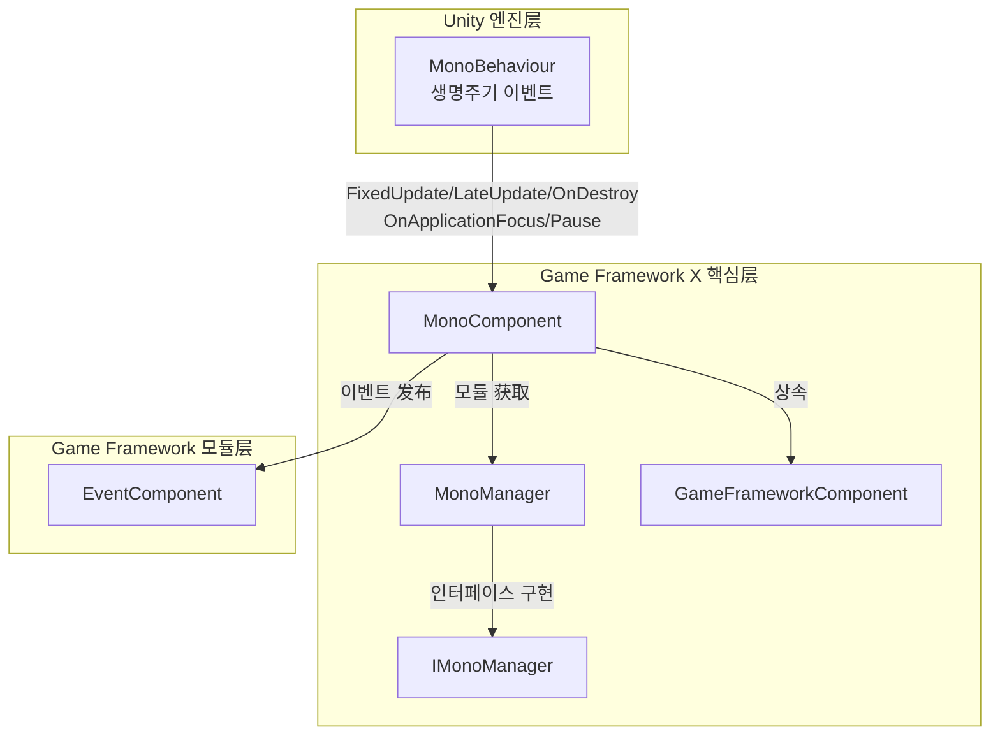

# MonoComponent

MonoComponent는 Game Framework X의 핵심 컴포넌트 중 하나로, Unity MonoBehaviour의 생명주기 이벤트를 관리하고 외부에서 다양한 업데이트 순환 이벤트 리스너를 추가 및 제거할 수 있는 통합된 인터페이스를 제공합니다.

## 개요

MonoComponent는 `GameFrameworkComponent`를 상속하는 Unity `MonoBehaviour` 컴포넌트입니다. Game Framework와 Unity 생명주기 이벤트 시스템 사이의 브릿지 역할을 하며, 주요 기능은 다음과 같습니다:

1. **생명주기 이벤트代理**: Unity의 `Update`, `FixedUpdate`, `LateUpdate`, `OnDestroy` 등의 생명주기 메서드를 내부의 `MonoManager`에 전달
2. **이벤트 리스너 관리**: 다양한 이벤트 리스너를 추가 및 제거하는 공개 인터페이스 제공
3. **앱 레벨 이벤트 전달**: EventComponent를 통합하여 앱焦点 변화 또는 일시정지 상태 변화 시 대응하는 이벤트를 发布

### 핵심 특성

- **스레드 안전성**: `lock` 메커니즘을 사용하여 다중 스레드 환경에서의 리스너 목록 안전성 보장
- **예외 처리**: 리스너 실행 과정에서 try-catch를 사용하여 예외捕获, 단일 리스너 오류가 전체 시스템에 영향 주지 않도록 보장
- **성능 최적화**: Unity Profiler 통합, 성능 분석 지원
- **이벤트 发布**: 앱 레벨 이벤트 (`OnApplicationFocusChangedEventArgs`, `OnApplicationPauseChangedEventArgs`) 자동 发布

## 아키텍처

MonoComponent의 Game Framework X에서의 아키텍처 위치는 다음과 같습니다:



### 컴포넌트 상호작용 흐름

```mermaid
sequenceDiagram
    participant Unity as Unity 엔진
    participant MC as MonoComponent
    participant MM as MonoManager
    participant EC as EventComponent
    participant Listener as 비즈니스 리스너

    Unity->>MC: Awake()
    MC->>MC: 컴포넌트 타입 및 인터페이스 초기화
    MC->>MM: GetModule&lt;IMonoManager&gt;()
    MC->>EC: GameEntry.GetComponent&lt;EventComponent&gt;()

    Unity->>MC: Update(deltaTime, realDeltaTime)
    MC->>MM: Update()
    MM->>MM: QueueInvoking(_updateQueue)
    MM->>Listener: Update 리스너 콜백

    Unity->>MC: OnApplicationFocus(focusStatus)
    MC->>MM: OnApplicationFocus(focusStatus)
    MC->>EC: Fire(this, OnApplicationFocusChangedEventArgs)
    EC->>Listener: 해당 이벤트에关注的 컴포넌트에 통지

    Unity->>MC: OnApplicationPause(pauseStatus)
    MC->>MM: OnApplicationPause(pauseStatus)
    MC->>EC: Fire(this, OnApplicationPauseChangedEventArgs)
```

## 핵심 기능

### 1. Update 리스너 관리

MonoComponent는 `Update` 이벤트 리스너를 추가 및 제거할 수 있게 합니다. `Update`는 매 프레임 호출되어 가장 많이 사용되는 업데이트 순환입니다.

```csharp
// Update 리스너 추가
MonoComponent.Instance.AddUpdateListener(OnGameUpdate);

// Update 리스너 제거
MonoComponent.Instance.RemoveUpdateListener(OnGameUpdate);

// 리스너 콜백 함수 시그니처
private void OnGameUpdate(float elapseSeconds, float realElapseSeconds)
{
    // elapseSeconds:上一프레임からの 경과 시간
    // realElapseSeconds: 실제 경과 시간 (시간 배율 영향 받지 않음)
}
```

> Source: [MonoComponent.cs](https://github.com/GameFrameX/com.gameframex.unity.mono/blob/main/Runtime/Mono/MonoComponent.cs#L186-L210)

### 2. FixedUpdate 리스너 관리

`FixedUpdate`는 고정 시간 간격으로 호출되어 물리 관련 로직에 적합합니다.

```csharp
// FixedUpdate 리스너 추가
MonoComponent.Instance.AddFixedUpdateListener(OnFixedUpdate);

// FixedUpdate 리스너 제거
MonoComponent.Instance.RemoveFixedUpdateListener(OnFixedUpdate);

// 리스너 콜백 함수 시그니처
private void OnFixedUpdate(float elapseSeconds, float fixedElapseSeconds)
{
    // elapseSeconds:上一프레임からの 경과 시간
    // fixedElapseSeconds: 고정 시간 간격
}
```

> Source: [MonoComponent.cs](https://github.com/GameFrameX/com.gameframex.unity.mono/blob/main/Runtime/Mono/MonoComponent.cs#L156-L180)

### 3. LateUpdate 리스너 관리

`LateUpdate`는 모든 `Update` 메서드 후에 호출되어 다른 업데이트 완료 후 실행해야 하는 로직에 적합합니다.

```csharp
// LateUpdate 리스너 추가
MonoComponent.Instance.AddLateUpdateListener(OnLateUpdate);

// LateUpdate 리스너 제거
MonoComponent.Instance.RemoveLateUpdateListener(OnLateUpdate);

// 리스너 콜백 함수 시그니처
private void OnLateUpdate(float elapseSeconds, float fixedElapseSeconds)
{
    // elapseSeconds:上一프레임からの 경과 시간
    // fixedElapseSeconds: 고정 시간 간격
}
```

> Source: [MonoComponent.cs](https://github.com/GameFrameX/com.gameframex.unity.mono/blob/main/Runtime/Mono/MonoComponent.cs#L126-L150)

### 4. OnDestroy 리스너 관리

`OnDestroy`는 컴포넌트가 파괴될 때 호출되어 정리 작업에 적합합니다.

```csharp
// OnDestroy 리스너 추가
MonoComponent.Instance.AddDestroyListener(OnGameDestroy);

// OnDestroy 리스너 제거
MonoComponent.Instance.RemoveDestroyListener(OnGameDestroy);

// 리스너 콜백 함수 시그니처
private void OnGameDestroy()
{
    // 리소스 정리, 이벤트 구독 취소 등
}
```

> Source: [MonoComponent.cs](https://github.com/GameFrameX/com.gameframex.unity.mono/blob/main/Runtime/Mono/MonoComponent.cs#L216-L240)

### 5. 앱焦点 변화 리스닝

앱이焦点을 획득하거나 상실하는 이벤트를 리스닝합니다.

```csharp
// 앱焦点变化 리스너 추가
MonoComponent.Instance.AddOnApplicationFocusListener(OnAppFocusChanged);

// 앱焦点变化 리스너 제거
MonoComponent.Instance.RemoveOnApplicationFocusListener(OnAppFocusChanged);

// 리스너 콜백 함수 시그니처
private void OnAppFocusChanged(bool hasFocus)
{
    // hasFocus: true는焦点 획득, false는焦点 상실
    Debug.Log($"앱焦点 상태: {(hasFocus ? "焦点 획득" : "焦点 상실")}");
}
```

> Source: [MonoComponent.cs](https://github.com/GameFrameX/com.gameframex.unity.mono/blob/main/Runtime/Mono/MonoComponent.cs#L276-L300)

### 6. 앱 일시정지 상태 리스닝

앱이 일시정지되거나 실행을恢复了하는 이벤트를 리스닝합니다.

```csharp
// 앱 일시정지 상태 리스너 추가
MonoComponent.Instance.AddOnApplicationPauseListener(OnAppPauseChanged);

// 앱 일시정지 상태 리스너 제거
MonoComponent.Instance.RemoveOnApplicationPauseListener(OnAppPauseChanged);

// 리스너 콜백 함수 시그니처
private void OnAppPauseChanged(bool isPaused)
{
    // isPaused: true는 일시정지, false는恢复了
    Debug.Log($"앱 일시정지 상태: {(isPaused ? "일시정지됨" : "恢复了됨")}");
}
```

> Source: [MonoComponent.cs](https://github.com/GameFrameX/com.gameframex.unity.mono/blob/main/Runtime/Mono/MonoComponent.cs#L246-L270)

## 사용 예시

### 기초 사용

다음 예시는 간단한 Update 리스너를 등록하는 방법을 보여줍니다:

```csharp
using GameFrameX.Mono.Runtime;
using UnityEngine;

public class GameLoopExample : MonoBehaviour
{
    private void Start()
    {
        // Update 리스너 추가
        MonoComponent.Instance.AddUpdateListener(OnUpdate);
    }

    private void OnUpdate(float elapseSeconds, float realElapseSeconds)
    {
        // 여기에서 매 프레임 업데이트해야 하는 로직 실행
        // 예: 캐릭터 이동, 입력 처리 등
    }

    private void OnDestroy()
    {
        // 리스너 제거, 메모리 누수 방지
        MonoComponent.Instance.RemoveUpdateListener(OnUpdate);
    }
}
```

> Source: [MonoComponent.cs](https://github.com/GameFrameX/com.gameframex.unity.mono/blob/main/Runtime/Mono/MonoComponent.cs#L182-L211)

### 고급 사용: 이벤트 시스템 활용

리스너 직접 추가 외에도 이벤트 시스템을 통해 앱 레벨 이벤트를 구독할 수 있습니다:

```csharp
using GameFrameX.Event.Runtime;
using GameFrameX.Mono.Runtime;
using UnityEngine;

public class AppStateExample : MonoBehaviour
{
    private void Start()
    {
        // 앱 일시정지 이벤트 구독
        var eventComponent = GameEntry.GetComponent<EventComponent>();
        eventComponent.Subscribe(OnApplicationPauseChangedEventArgs.EventId, OnAppPauseHandler);
        
        // 앱焦点 이벤트 구독
        eventComponent.Subscribe(OnApplicationFocusChangedEventArgs.EventId, OnAppFocusHandler);
    }

    private void OnAppPauseHandler(object sender, GameEventArgs e)
    {
        var args = e as OnApplicationPauseChangedEventArgs;
        Debug.Log($"앱 일시정지 상태 변화: {(args.IsPause ? "일시정지" : "恢复了")}");
    }

    private void OnAppFocusHandler(object sender, GameEventArgs e)
    {
        var args = e as OnApplicationFocusChangedEventArgs;
        Debug.Log($"앱焦点 변화: {(args.IsFocus ? "焦点 획득" : "焦点 상실")}");
    }

    private void OnDestroy()
    {
        // 이벤트 구독 취소
        var eventComponent = GameEntry.GetComponent<EventComponent>();
        eventComponent.Unsubscribe(OnApplicationPauseChangedEventArgs.EventId, OnAppPauseHandler);
        eventComponent.Unsubscribe(OnApplicationFocusChangedEventArgs.EventId, OnAppFocusHandler);
    }
}
```

> Source: [MonoComponent.cs](https://github.com/GameFrameX/com.gameframex.unity.mono/blob/main/Runtime/Mono/MonoComponent.cs#L99-L120)

### 전형적인 적용 시나리오

| 시나리오 | 권장 사용하는 이벤트 | 설명 |
|------|---------------|------|
| 게임 로직 업데이트 | `Update` | 매 프레임 실행하는 일반 게임 로직 |
| 물리 계산 | `FixedUpdate` | 물리 엔진 관련 로직, 고정 시간 스텝 필요 |
| 카메라 추적 | `LateUpdate` | 모든 이동 로직 완료 후 실행하는 카메라 추적 |
| 리소스 정리 | `OnDestroy` | 컴포넌트 파괴 시 정리 작업 |
| 백그라운드 실행 처리 | `OnApplicationPause` | 백그라운드로 전환 시 게임 일시정지/恢复了 |
| 화면 전환 처리 | `OnApplicationFocus` | 앱이焦点을 상실/획득 처리 |

## API 참고

### MonoComponent 공개 메서드

#### `AddUpdateListener(Action<float, float> fun)`

Update 리스너를 추가합니다.

**파라미터:**
- `fun` (Action&lt;float, float&gt;): Update 콜백 함수, 첫 번째 파라미터는 경과 시간, 두 번째 파라미터는 실제 경과 시간.

**예시:**
```csharp
MonoComponent.Instance.AddUpdateListener((elapsed, realElapsed) => {
    // 업데이트 로직 처리
});
```

> Source: [MonoComponent.cs#L186-L195](https://github.com/GameFrameX/com.gameframex.unity.mono/blob/main/Runtime/Mono/MonoComponent.cs#L186-L195)

---

#### `RemoveUpdateListener(Action<float, float> fun)`

Update 리스너를 제거합니다.

**파라미터:**
- `fun` (Action&lt;float, float&gt;): 제거할 Update 콜백 함수.

> Source: [MonoComponent.cs#L201-L210](https://github.com/GameFrameX/com.gameframex.unity.mono/blob/main/Runtime/Mono/MonoComponent.cs#L201-L210)

---

#### `AddFixedUpdateListener(Action<float, float> fun)`

FixedUpdate 리스너를 추가합니다.

**파라미터:**
- `fun` (Action&lt;float, float&gt;): FixedUpdate 콜백 함수, 첫 번째 파라미터는 경과 시간, 두 번째 파라미터는 고정 경과 시간.

> Source: [MonoComponent.cs#L156-L165](https://github.com/GameFrameX/com.gameframex.unity.mono/blob/main/Runtime/Mono/MonoComponent.cs#L156-L165)

---

#### `RemoveFixedUpdateListener(Action<float, float> fun)`

FixedUpdate 리스너를 제거합니다.

**파라미터:**
- `fun` (Action&lt;float, float&gt;): 제거할 FixedUpdate 콜백 함수.

> Source: [MonoComponent.cs#L171-L180](https://github.com/GameFrameX/com.gameframex.unity.mono/blob/main/Runtime/Mono/MonoComponent.cs#L171-L180)

---

#### `AddLateUpdateListener(Action<float, float> fun)`

LateUpdate 리스너를 추가합니다.

**파라미터:**
- `fun` (Action&lt;float, float&gt;): LateUpdate 콜백 함수, 첫 번째 파라미터는 경과 시간, 두 번째 파라미터는 고정 경과 시간.

> Source: [MonoComponent.cs#L126-L135](https://github.com/GameFrameX/com.gameframex.unity.mono/blob/main/Runtime/Mono/MonoComponent.cs#L126-L135)

---

#### `RemoveLateUpdateListener(Action<float, float> fun)`

LateUpdate 리스너를 제거합니다.

**파라미터:**
- `fun` (Action&lt;float, float&gt;): 제거할 LateUpdate 콜백 함수.

> Source: [MonoComponent.cs#L141-L150](https://github.com/GameFrameX/com.gameframex.unity.mono/blob/main/Runtime/Mono/MonoComponent.cs#L141-L150)

---

#### `AddDestroyListener(Action fun)`

OnDestroy 리스너를 추가합니다.

**파라미터:**
- `fun` (Action): OnDestroy 콜백 함수, 파라미터 없음.

> Source: [MonoComponent.cs#L216-L225](https://github.com/GameFrameX/com.gameframex.unity.mono/blob/main/Runtime/Mono/MonoComponent.cs#L216-L225)

---

#### `RemoveDestroyListener(Action fun)`

OnDestroy 리스너를 제거합니다.

**파라미터:**
- `fun` (Action): 제거할 OnDestroy 콜백 함수.

> Source: [MonoComponent.cs#L231-L240](https://github.com/GameFrameX/com.gameframex.unity.mono/blob/main/Runtime/Mono/MonoComponent.cs#L231-L240)

---

#### `AddOnApplicationPauseListener(Action<bool> fun)`

앱 일시정지 상태 변화 리스너를 추가합니다.

**파라미터:**
- `fun` (Action&lt;bool&gt;): 일시정지 상태 변화 콜백 함수, 파라미터는 일시정지 상태.

> Source: [MonoComponent.cs#L246-L255](https://github.com/GameFrameX/com.gameframex.unity.mono/blob/main/Runtime/Mono/MonoComponent.cs#L246-L255)

---

#### `RemoveOnApplicationPauseListener(Action<bool> fun)`

앱 일시정지 상태 변화 리스너를 제거합니다.

**파라미터:**
- `fun` (Action&lt;bool&gt;): 제거할 콜백 함수.

> Source: [MonoComponent.cs#L261-L270](https://github.com/GameFrameX/com.gameframex.unity.mono/blob/main/Runtime/Mono/MonoComponent.cs#L261-L270)

---

#### `AddOnApplicationFocusListener(Action<bool> fun)`

앱焦点变化 리스너를 추가합니다.

**파라미터:**
- `fun` (Action&lt;bool&gt;):焦点 상태 변화 콜백 함수, 파라미터는焦点 상태.

> Source: [MonoComponent.cs#L276-L285](https://github.com/GameFrameX/com.gameframex.unity.mono/blob/main/Runtime/Mono/MonoComponent.cs#L276-L285)

---

#### `RemoveOnApplicationFocusListener(Action<bool> fun)`

앱焦点变化 리스너를 제거합니다.

**파라미터:**
- `fun` (Action&lt;bool&gt;): 제거할 콜백 함수.

> Source: [MonoComponent.cs#L291-L300](https://github.com/GameFrameX/com.gameframex.unity.mono/blob/main/Runtime/Mono/MonoComponent.cs#L291-L300)

---

### MonoManager 핵심 메서드

MonoManager는 실제로 리스너를 실행하는 핵심 클래스이며, 주요 메서드는 다음과 같습니다:

#### `QueueInvoking`

비공개 메서드로서 리스너 큐의 모든 콜백을 순회 실행하는 데 사용됩니다.

```csharp
private static void QueueInvoking(LinkedList<Action<float, float>> list, float elapseSeconds, float realElapseSeconds)
{
    lock (Lock)
    {
        foreach (var action in list)
        {
            try
            {
                action.Invoke(elapseSeconds, realElapseSeconds);
            }
            catch (Exception e)
            {
                Log.Error(e);
            }
        }
    }
}
```

**설계 의도:**
- `lock`을 사용하여 스레드 안전성 보장
- try-catch로包裹하여 단일 리스너 예외가 다른 리스너에 영향 주지 않도록 보장
- Unity Profiler 성능 분석 지원

> Source: [MonoManager.cs#L364-L380](https://github.com/GameFrameX/com.gameframex.unity.mono/blob/main/Runtime/Mono/MonoManager.cs#L364-L380)

## 관련 링크

- [MonoManager](./4-core-components.1-monomanager) - Mono 관리자 모듈
- [이벤트 타입](./5-events.1-event-types) - Game Framework 이벤트 시스템
- [이벤트 파라미터](./5-events.2-event-args) - 이벤트 파라미터 상세
- [빠른 시작](./3-getting-started.1-basic-usage) - 기초 사용 안내서