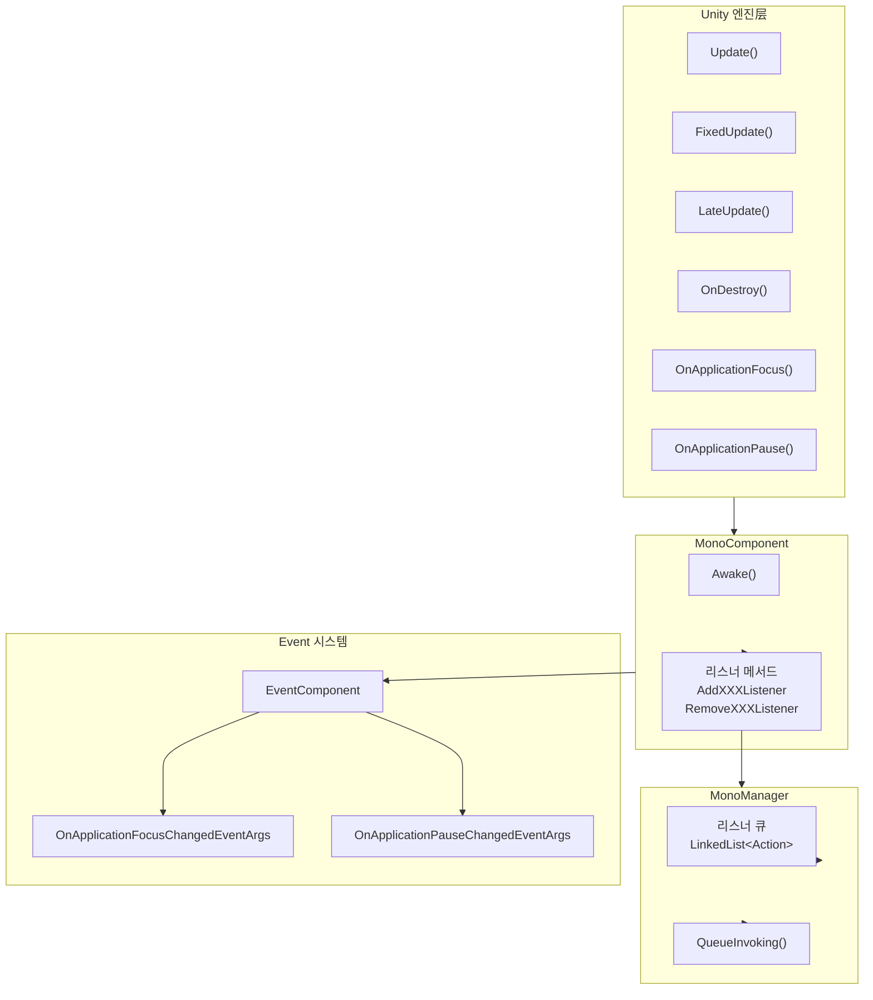

# 자주 묻는 질문

本文档汇总了使用 GameFrameX Unity Mono 生命周期组件时常见的疑问解答를 통합하여 한국어로 제공합니다.

## 개요

Mono 생명주기 컴포넌트는 GameFrameX 프레임워크의 핵심 모듈 중 하나로, Unity MonoBehaviour의 다양한 생명주기 이벤트를 통합 관리합니다. 여기에는 Update, FixedUpdate, LateUpdate, OnDestroy, OnApplicationFocus, OnApplicationPause가 포함됩니다. 본 문서는 개발자가使用过程中에 자주 마주치는 일반적인 문제를 빠르게 해결할 수 있도록 돕는 것을 목표로 합니다.

## 의존성 문제

### Q1: GameFrameX.Runtime 네임스페이스를 찾을 수 없어 컴파일 오류 발생

**문제 설명:**
프로젝트에 Mono 컴포넌트를 추가한 후 컴파일 시 다음과 같은 오류가 발생합니다:
```
The type or namespace name 'Runtime' does not exist in the namespace 'GameFrameX'
```

**원인 분석:**
Mono 컴포넌트는 GameFrameX 핵심 런타임 라이브러리에 의존합니다. 해당 라이브러리는 전체 GameFrameX 프레임워크의 기반으로 반드시 먼저 설치해야 합니다.

**해결책:**
`com.alianblank.gameframex.unity.runtime` 패키지를 설치해야 합니다. 설치 방식은プロジェクトの `manifest.json`에 의존성을 추가합니다:

```json
{
  "dependencies": {
    "com.alianblank.gameframex.unity.runtime": "https://github.com/GameFrameX/com.alianblank.gameframex.unity.runtime.git"
  }
}
```

> Source: [README.md](https://github.com/GameFrameX/com.gameframex.unity.mono/blob/main/README.md#L42)

---

### Q2: Event 컴포넌트를 찾을 수 없어 컴파일 오류 발생

**문제 설명:**
컴파일 시 다음 오류가 발생합니다:
```
The type or namespace name 'Event' does not exist in the namespace 'GameFrameX'
```

**원인 분석:**
MonoComponent는 `OnApplicationFocus` 및 `OnApplicationPause` 이벤트 발생 시 EventComponent를 통해 게임 이벤트를 发布합니다. 따라서 Event 컴포넌트를 설치해야 합니다.

**해결책:**
Event 컴포넌트 패키지를 설치합니다:

```json
{
  "dependencies": {
    "com.alianblank.gameframex.unity.event": "https://github.com/GameFrameX/com.alianblank.gameframex.unity.event.git"
  }
}
```

> Source: [README.md](https://github.com/GameFrameX/com.gameframex.unity.mono/blob/main/README.md#L42)

---

## 사용 문제

### Q3: Update 리스너를 등록하는 방법은?

**문제 설명:**
개발자는 게임 매 프레임 특정 로직을 실행하고 싶지만 추가 MonoBehaviour 스크립트를 생성하고 싶지 않습니다.

**해결책:**
MonoComponent가 제공하는 리스너 메서드를 사용합니다. 首先需要在 장면에 MonoComponent 컴포넌트가 있는지 확인하고 (일반적으로 GameFramework가 자동으로 생성함), 그런 다음 해당 컴포넌트를 통해 리스너를 등록합니다:

```csharp
// MonoComponent 인스턴스 获取 (Unity 컴포넌트 또는 GameEntry를 통해)
var monoComponent = GameEntry.GetComponent<MonoComponent>();

// Update 리스너 등록
monoComponent.AddUpdateListener(OnGameUpdate);

// 콜백 메서드 정의
private void OnGameUpdate(float elapseSeconds, float realElapseSeconds)
{
    // elapseSeconds: 경과 시간
    // realElapseSeconds: 실제 경과 시간
    Debug.Log($"Update 호출, 경과: {elapseSeconds}");
}

// 중요: 더 이상 사용하지 않을 때 리스너를 제거해야 함
monoComponent.RemoveUpdateListener(OnGameUpdate);
```

> Source: [MonoComponent.cs](https://github.com/GameFrameX/com.gameframex.unity.mono/blob/main/Runtime/Mono/MonoComponent.cs#L186-L210)

---

### Q4: Update, FixedUpdate, LateUpdate의 차이는 무엇인가요?

**문제 설명:**
이 세 가지 메서드에 모두 대응하는 리스너가 있어 개발자는どれを 선택해야 할지 잘 모르겠습니다.

**기술 설명:**
- **Update**: 매 프레임 한 번 호출, 호출 간격이 고정되지 않으며 프레임레이트의 영향을 받습니다. 대부분의 게임 로직에 적합합니다.
- **FixedUpdate**: 고정 시간 간격으로 호출 (기본 0.02초, 즉 50번/초). 물리 관련 로직에 적합합니다.
- **LateUpdate**: 모든 Update 호출 완료 후 호출됩니다. 카메라 추적 등 다른 업데이트 후 실행해야 하는 로직에 적합합니다.

**使用 권장:**
- 일반 게임 로직 → Update 사용
- 물리 계산 관련 → FixedUpdate 사용
- 카메라 추적, UI 업데이트 등 → LateUpdate 사용

```csharp
// Update 예시 - 매 프레임 실행
monoComponent.AddUpdateListener((elapsed, realElapsed) => {
    // 게임 메인 로직
});

// FixedUpdate 예시 - 고정 간격 실행
monoComponent.AddFixedUpdateListener((elapsed, fixedElapsed) => {
    // 물리 로직
});

// LateUpdate 예시 - 마지막에 실행
monoComponent.AddLateUpdateListener((elapsed, fixedElapsed) => {
    // 카메라 추적 등
});
```

> Source: [MonoManager.cs](https://github.com/GameFrameX/com.gameframex.unity.mono/blob/main/Runtime/Mono/MonoManager.cs#L63-L76)

---

### Q5: 리스너에 null을 전달하면 어떻게 되나요?

**문제 설명:**
개발자가 리스너 등록 시 실수로 null을 전달하고 싶어 해당 결과가 궁금합니다.

**코드 동작:**
소스 코드를 살펴보면 시스템이 null 파라미터를 감지하여 예외를 발생시킵니다:

```csharp
public void AddUpdateListener(Action<float, float> fun)
{
    if (fun == null)
    {
        Log.Fatal(nameof(fun) + "is invalid.");
        return;
    }
    _monoManager.AddUpdateListener(fun);
}
```

MonoComponent에서 null을 전달하면 치명적인 로그가 기록되고 바로 반환되며, 예외를 발생시키지 않습니다. MonoManager에서 null을 전달하면 `ArgumentNullException`이 발생합니다.

> Source: [MonoComponent.cs](https://github.com/GameFrameX/com.gameframex.unity.mono/blob/main/Runtime/Mono/MonoComponent.cs#L188-L195)
> Source: [MonoManager.cs](https://github.com/GameFrameX/com.gameframex.unity.mono/blob/main/Runtime/Mono/MonoManager.cs#L176-L187)

---

### Q6: 앱 일시정지/恢复了 이벤트를 리스닝하는 방법은?

**문제 설명:**
개발자는 플레이어가 백그라운드로 전환하거나 게임을恢复了할 때 특정 작업을 실행해야 합니다.

**해결책:**
`OnApplicationPause` 리스너를 사용합니다:

```csharp
// 일시정지 리스너 등록
monoComponent.AddOnApplicationPauseListener(OnApplicationPauseChanged);

// 콜백 메서드
private void OnApplicationPauseChanged(bool isPaused)
{
    if (isPaused)
    {
        Debug.Log("게임이 일시정지됨");
        // 게임 데이터 저장
    }
    else
    {
        Debug.Log("게임이恢复了됨");
        // 게임 상태恢复了
    }
}
```

마찬가지로 `OnApplicationFocusListener`를 사용하여焦点 변화를 리스닝할 수 있습니다:

```csharp
monoComponent.AddOnApplicationFocusListener(OnApplicationFocusChanged);

private void OnApplicationFocusChanged(bool hasFocus)
{
    Debug.Log($"애플리케이션焦点: {hasFocus}");
}
```

> Source: [MonoComponent.cs](https://github.com/GameFrameX/com.gameframex.unity.mono/blob/main/Runtime/Mono/MonoComponent.cs#L246-L270)

---

### Q7: MonoComponent 대신 MonoManager를 직접 사용하는 것이 좋지 않은 이유는?

**문제 설명:**
개발자는 `GameFrameworkEntry.GetModule<IMonoManager>()`를 통해 MonoManager를 직접 获取할 수 있어 왜 MonoComponent를 사용해야 하는지 궁금합니다.

**설계 설명:**
MonoComponent는 Unity의 MonoBehaviour를 상속하며 다음과 같은 advantages가 있습니다:

1. **자동 생명주기 바인딩**: MonoComponent가 Unity의 생명주기 메서드(Update, OnDestroy 등)에 자동으로 바인딩되어 수동 호출이 필요 없습니다.
2. **GameFramework无缝集成**: MonoComponent는 GameFramework의 컴포넌트 시스템의 일부로 GameEntry를 통해 쉽게 접근할 수 있습니다.
3. **편집기 친화적**: MonoComponent는 `[DisallowMultipleComponent]` 및 `[AddComponentMenu("GameFrameX/Mono")]` 속성을 가져 Unity 편집기에서 쉽게 검색 및 관리할 수 있습니다.

```csharp
// GameEntry를 통해 MonoComponent 获取
var monoComponent = GameEntry.GetComponent<MonoComponent>();

// 또는 장면의 GameObject에서 직접 获取
var monoComponent = someGameObject.GetComponent<MonoComponent>();
```

> Source: [MonoComponent.cs](https://github.com/GameFrameX/com.gameframex.unity.mono/blob/main/Runtime/Mono/MonoComponent.cs#L42-L70)

---

## 생명주기 관리 문제

### Q8: 리스너를 제거하지 않으면 어떤后果가 발생하나요?

**문제 설명:**
개발자가 장면 전환 또는 객체 파괴 시 리스너 제거를 잊어버려 어떤 문제가 발생하는지 알고 싶습니다.

**可能的的后果:**
1. **메모리 누수**: 리스너가 참조하는 객체가 가비지 컬렉션되지 않습니다.
2. **null 참조 예외**: 리스너 콜백이 이미 파괴된 객체에 접근하려 합니다.
3. **로직 오류**: 만료된 리스너가 잘못된 게임 로직을 실행할 수 있습니다.

**모범 사례:**
항상 적절한 시점에 리스너를 제거합니다, 예시:

```csharp
public class MyController : MonoBehaviour
{
    private MonoComponent _monoComponent;

    private void OnEnable()
    {
        _monoComponent = GameEntry.GetComponent<MonoComponent>();
        _monoComponent.AddUpdateListener(OnUpdate);
        _monoComponent.AddDestroyListener(OnDestroy);
    }

    private void OnDisable()
    {
        if (_monoComponent != null)
        {
            _monoComponent.RemoveUpdateListener(OnUpdate);
            _monoComponent.RemoveDestroyListener(OnDestroy);
        }
    }

    private void OnUpdate(float elapse, float realElapse) { }
    private void OnDestroy() { }
}
```

---

### Q9: MonoManager는 스레드 안전성이 있나요?

**문제 설명:**
개발자가 다중 스레드 환경에서 리스너를 사용하면 스레드 안전성 문제가 있는지 알고 싶습니다.

**기술 설명:**
네, MonoManager는 스레드 안전합니다. 모든 리스너의 추가 및 제거 操作은 안전을 위해 `lock` 잠금으로 보호됩니다:

```csharp
public void AddUpdateListener(Action<float, float> action)
{
    if (action == null)
    {
        throw new ArgumentNullException(nameof(action));
    }

    lock (Lock)
    {
        _updateQueue.AddLast(action);
    }
}
```

단, 리스너 콜백 자체의 실행은 Unity 메인 스레드에서 호출되므로 콜백 내의 스레드 안전性问题를 걱정할 필요가 없습니다.

> Source: [MonoManager.cs](https://github.com/GameFrameX/com.gameframex.unity.mono/blob/main/Runtime/Mono/MonoManager.cs#L364-L380)

---

## 이벤트 시스템 문제

### Q10: 이벤트 시스템을 통해 앱 상태 변화를 리스닝하는 방법은?

**문제 설명:**
리스너 콜백 외에도 개발자는 이벤트 시스템(EventSystem)을 통해 앱 상태 변화에 대응하고 싶습니다.

**해결책:**
MonoComponent는 OnApplicationFocus 및 OnApplicationPause를 트리거할 때 동시에 게임 이벤트를 发布합니다. 이러한 이벤트를 구독하여 대응할 수 있습니다:

```csharp
// 이벤트 구독
EventComponent eventComponent = GameEntry.GetComponent<EventComponent>();
eventComponent.Subscribe<OnApplicationFocusChangedEventArgs>(OnFocusChanged);
eventComponent.Subscribe<OnApplicationPauseChangedEventArgs>(OnPauseChanged);

// 이벤트 처리 메서드
private void OnFocusChanged(object sender, OnApplicationFocusChangedEventArgs e)
{
    Debug.Log($"焦点 변화: {e.IsFocus}");
}

private void OnPauseChanged(object sender, OnApplicationPauseChangedEventArgs e)
{
    Debug.Log($"일시정지 상태: {e.IsPause}");
}

// 이벤트 구독 취소
eventComponent.Unsubscribe<OnApplicationFocusChangedEventArgs>(OnFocusChanged);
eventComponent.Unsubscribe<OnApplicationPauseChangedEventArgs>(OnPauseChanged);
```

> Source: [OnApplicationFocusChangedEventArgs.cs](https://github.com/GameFrameX/com.gameframex.unity.mono/blob/main/Runtime/EventArgs/OnApplicationFocusChangedEventArgs.cs#L40-L87)

---

## 설치 문제

### Q11: Mono 컴포넌트를 설치하는 방법은?

**문제 설명:**
해당 플러그인을 처음使用하여 정확한 설치 방법을 잘 모르겠습니다.

**해결책:**
세 가지 설치 방식을 선택할 수 있습니다:

**방식 1: manifest.json을 통해 설치 (권장)**
프로젝트의 `Packages/manifest.json` 파일에 의존성을 추가합니다:

```json
{
  "dependencies": {
    "com.gameframex.unity.mono": "https://github.com/GameFrameX/com.gameframex.unity.mono.git"
  }
}
```

**방식 2: Unity Package Manager를 통해**
1. Unity 편집기를 엶
2. Window → Package Manager로 이동
3. + 버튼을 클릭하고 "Add package from git URL" 선택
4. 입력: `https://github.com/GameFrameX/com.gameframex.unity.mono.git`

**방식 3: 직접 다운로드하여 배치**
GitHub에서 저장소를 직접 다운로드하여 내용을 Unity 프로젝트의 `Packages` 디렉토리에 복사하면 시스템이 자동으로 인식하여 로드합니다.

> Source: [README.md](https://github.com/GameFrameX/com.gameframex.unity.mono/blob/main/README.md#L44-L51)

---

## 아키텍처 다이어그램

다음 다이어그램은 Mono 컴포넌트의 내부 아키텍처 및 이벤트 흐름을 보여줍니다:



**다이어그램 설명:**
1. Unity 엔진의 생명주기 메서드가 자동으로 MonoComponent에 호출됩니다
2. MonoComponent가 공개 리스너 메서드를 통해 외부에 제공합니다
3. MonoManager는 스레드 안전한 LinkedList를 사용하여 리스너를 저장합니다
4. OnApplicationFocus 및 OnApplicationPause 이벤트는 Event 시스템에도 发布됩니다

---

## 관련 링크

- [플러그인 소개](../1-overview.1-introduction)
- [설치 가이드](../2-installation.1-installation-methods)
- [기초 사용](../3-getting-started.1-basic-usage)
- [MonoManager 상세](../4-core-components.1-monomanager)
- [MonoComponent 상세](../4-core-components.2-monocomponent)
- [이벤트 타입](../5-events.1-event-types)
- [이벤트 파라미터](../5-events.2-event-args)