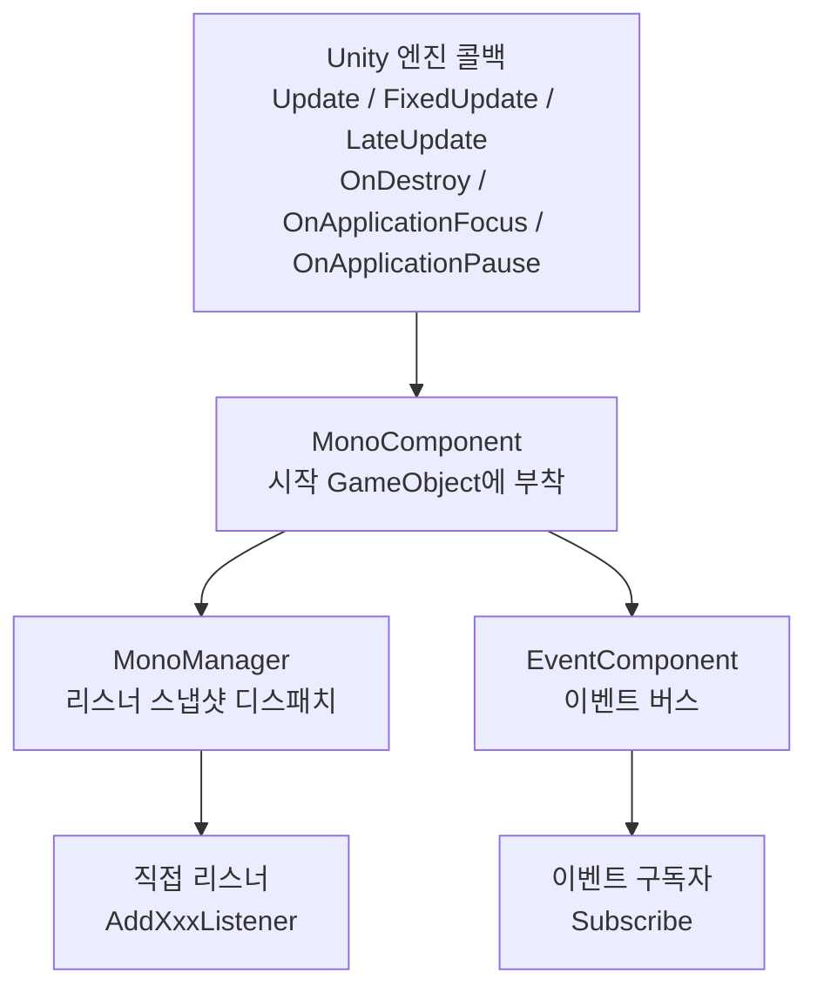

# Mono 컴포넌트 패키지 소개

`com.gameframex.unity.mono`는 GameFrameX 프레임워크의 Mono 생명주기 컴포넌트 패키지로, Unity `MonoBehaviour`의 `Update`, `FixedUpdate`, `LateUpdate`, `OnDestroy`, `OnApplicationFocus`, `OnApplicationPause` 등의 콜백을 전역 리스너 목록에 통합 등록하기 위해 사용됩니다. 비즈니스 측은 `MonoBehaviour`를 상속하지 않고도 이러한 이벤트를 구독할 수 있습니다. 패키지 내부는 `MonoComponent`(GameFramework 시작 GameObject에 부착)와 `MonoManager`(실제 디스패처)의两级 협력을 통해, 포커스 / 일시정지 이벤트를 `EventComponent`의 이벤트 버스로 전달합니다.

## 빠른 시작

### 1. 패키지 설치

Unity 프로젝트의 `Packages/manifest.json`을 편집하여 `dependencies`에 다음을 추가합니다:

```json
"com.gameframex.unity.mono": "1.1.1"
```

아직 GameFrameX의 UPM 레지스트리를 설정하지 않았다면, 동시에 `scopedRegistries`(`scopes: ["com.gameframex"]`)를 선언하고 `https://gameframex.upm.alianblank.uk`를 가리키도록 해야 합니다. 전체 예제는 `README.zh-CN.md`를 참조하세요.

종속 항목은 `com.gameframex.unity.event` 1.1.0뿐입니다.

### 2. MonoComponent 부착

`MonoComponent`를 GameFramework 시작 GameObject에 부착합니다(`EventComponent`, `BaseComponent` 등과 동일한 레벨). 이 컴포넌트는 `Awake` 시 리플렉션으로 `MonoManager` 구현 클래스를 찾고, `Start` 시 포커스/일시정지 이벤트 전달을 위한 `EventComponent`를 가져옵니다.

```csharp
// MonoComponent 클래스 선언과 컴포넌트 메뉴 경로
[DisallowMultipleComponent]
[AddComponentMenu("GameFrameX/Mono")]
public sealed class MonoComponent : GameFrameworkComponent
```

출처: [MonoComponent.cs#L42-L44](https://github.com/GameFrameX/com.gameframex.unity.mono/blob/main/Runtime/Mono/MonoComponent.cs#L42-L44)

### 3. 생명주기 리스너 등록

임의의 스크립트에서 먼저 컴포넌트를 가져온 다음 콜백을 등록합니다:

```csharp
var monoComponent = GameEntry.GetComponent<MonoComponent>();

private void OnUpdate(float elapseSeconds, float realElapseSeconds) { /* 매 프레임 */ }
private void OnFixedUpdate(float elapseSeconds, float realElapseSeconds) { /* 물리 스텝 */ }
private void OnLateUpdate(float elapseSeconds, float realElapseSeconds) { /* 프레임 끝 */ }
private void OnDestroyCallback() { /* 컴포넌트 파괴 */ }
private void OnApplicationFocus(bool isFocus) { /* 포커스 변화 */ }
private void OnApplicationPause(bool isPause) { /* 일시정지 변화 */ }

monoComponent.AddUpdateListener(OnUpdate);
monoComponent.AddFixedUpdateListener(OnFixedUpdate);
monoComponent.AddLateUpdateListener(OnLateUpdate);
monoComponent.AddDestroyListener(OnDestroyCallback);
monoComponent.AddOnApplicationFocusListener(OnApplicationFocus);
monoComponent.AddOnApplicationPauseListener(OnApplicationPause);
```

`Update / FixedUpdate / LateUpdate` 콜백의 `elapseSeconds`는 스케일링된 증분 시간이고, `realElapseSeconds`는 스케일링되지 않은 실제 증분 시간으로, `IMonoManager` 인터페이스에 정의되어 있습니다.

출처: [IMonoManager.cs](https://github.com/GameFrameX/com.gameframex.unity.mono/blob/main/Runtime/Mono/IMonoManager.cs)

### 4. 포커스 / 일시정지 이벤트 버스 구독(선택사항)

`MonoComponent`는 Unity 포커스/일시정지 콜백을 받을 때, 직접 리스너를 호출하는 것 외에도 `EventComponent`로 이벤트를 전달하므로, 비즈니스에서 이벤트 버스를 통해 구독할 수 있습니다:

```csharp
var eventComponent = GameEntry.GetComponent<EventComponent>();
eventComponent.Subscribe(OnApplicationFocusChangedEventArgs.EventId, OnFocusChanged);
eventComponent.Subscribe(OnApplicationPauseChangedEventArgs.EventId, OnPauseChanged);

private void OnFocusChanged(object sender, GameEventArgs e)
{
    var args = (OnApplicationFocusChangedEventArgs)e;
    if (args.IsFocus) { /* 포커스 획득 */ }
}
private void OnPauseChanged(object sender, GameEventArgs e)
{
    var args = (OnApplicationPauseChangedEventArgs)e;
    if (args.IsPause) { /* 일시정지 진입 */ }
}
```

이벤트는 `MonoComponent.OnApplicationFocus / OnApplicationPause`에서 `EventComponent.Fire`를 통해 발생합니다.

출처: [MonoComponent.cs#L111-L141](https://github.com/GameFrameX/com.gameframex.unity.mono/blob/main/Runtime/Mono/MonoComponent.cs#L111-L141)

## 작동 원리 간략 보기

전체 패키지에는 두 개의 주요 링크만 있습니다: `Unity 콜백 → MonoComponent → MonoManager → 비즈니스 리스너`, 그리고 `Unity 콜백 → MonoComponent → EventComponent → 이벤트 구독자`.



## 다음 단계

- 리스너 등록, 제거의 세부 사항과 스레드 안전성 설명은 [README.zh-CN.md](https://github.com/GameFrameX/com.gameframex.unity.mono/blob/main/README.zh-CN.md) 참조
- 인터페이스 시그니처와 기본 구현은 [IMonoManager.cs](https://github.com/GameFrameX/com.gameframex.unity.mono/blob/main/Runtime/Mono/IMonoManager.cs) 및 [MonoManager.cs](https://github.com/GameFrameX/com.gameframex.unity.mono/blob/main/Runtime/Mono/MonoManager.cs) 참조
- 이벤트 매개변수 정의는 [OnApplicationFocusChangedEventArgs.cs](https://github.com/GameFrameX/com.gameframex.unity.mono/blob/main/Runtime/EventArgs/OnApplicationFocusChangedEventArgs.cs) 및 [OnApplicationPauseChangedEventArgs.cs](https://github.com/GameFrameX/com.gameframex.unity.mono/blob/main/Runtime/EventArgs/OnApplicationPauseChangedEventArgs.cs) 참조
- Inspector 커스터마이즈는 [MonoComponentInspector.cs](https://github.com/GameFrameX/com.gameframex.unity.mono/blob/main/Editor/Inspector/MonoComponentInspector.cs) 참조
- 단위 테스트는 [UnitTests.cs](https://github.com/GameFrameX/com.gameframex.unity.mono/blob/main/Tests/UnitTests.cs) 참조