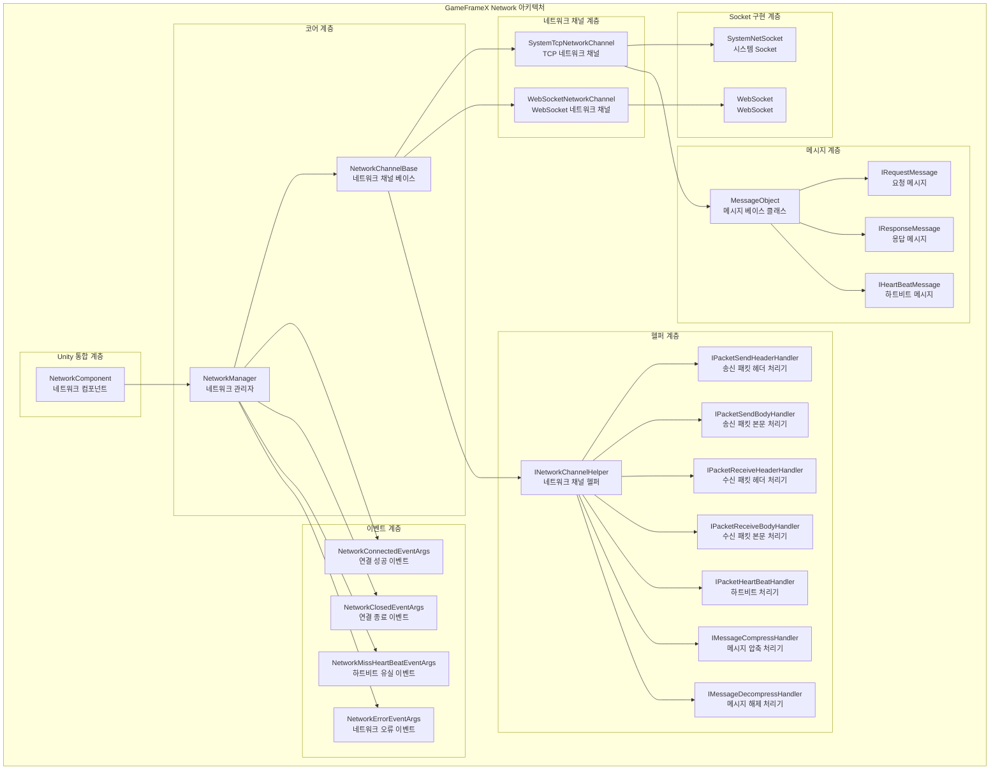
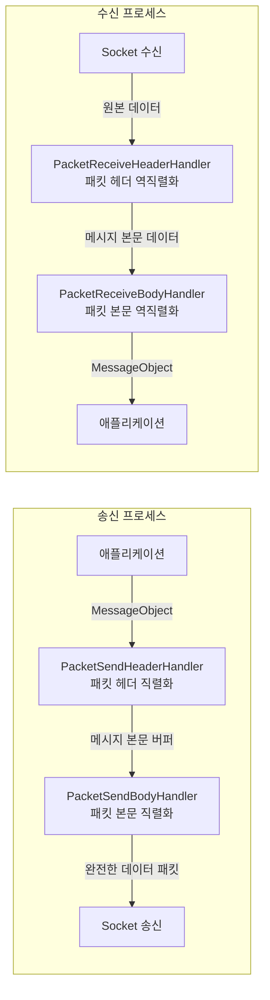
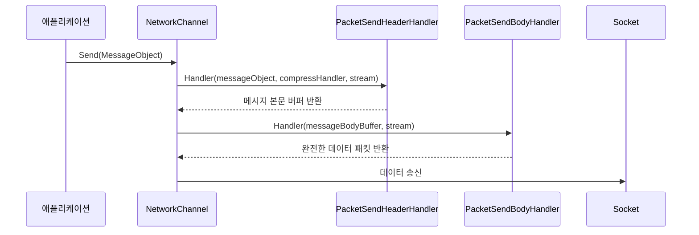
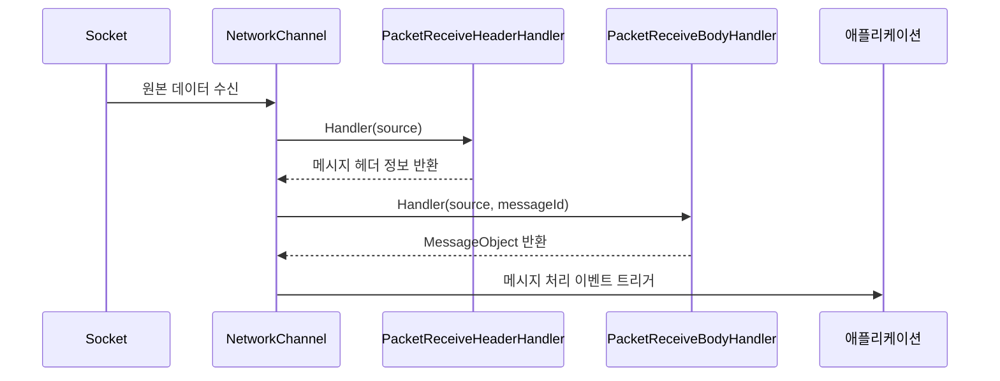
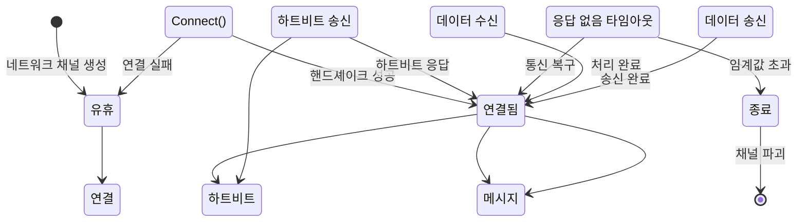
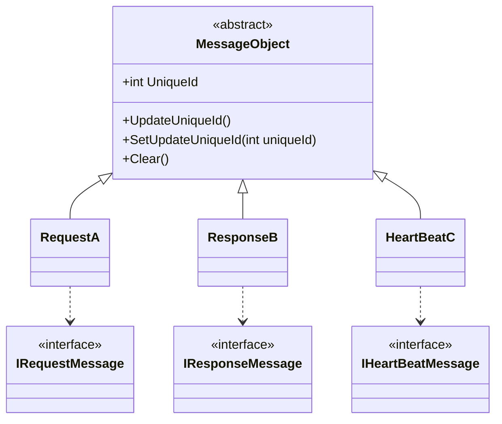
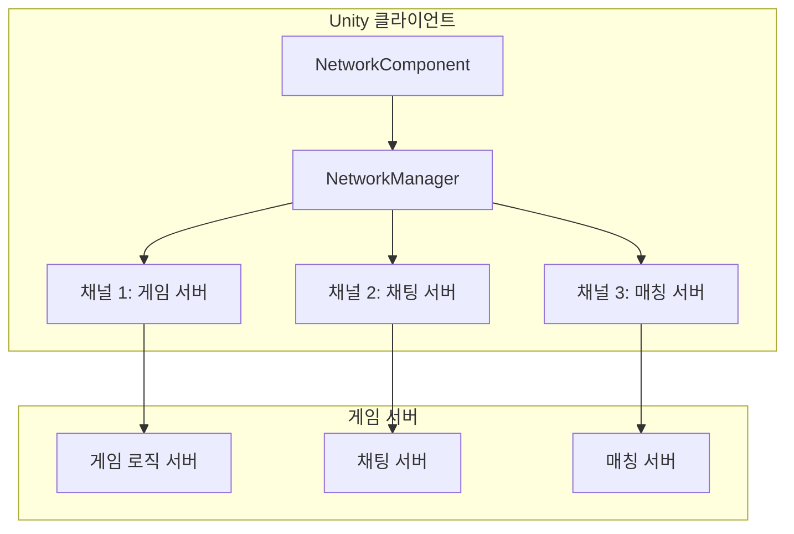

# 개요

GameFrameX Network 롱컬렉션 네트워크 컴포넌트는 GameFrameX 프레임워크의 핵심 네트워크 모듈로, Unity 게임을 위한 신뢰할 수 있는 롱컬렉션 통신 능력을 제공합니다. 이 컴포넌트는 TCP와 WebSocket 두 가지 전송 프로토콜을 지원하고, 완전한 하트비트 메커니즘, RPC 원격 호출, 메시지 압축等功能을 구현합니다.

> Source: [README.md](https://github.com/GameFrameX/com.gameframex.unity.network/blob/main/README.md#L1-L9)

## Overview

GameFrameX Network 롱컬렉션 네트워크 컴포넌트는 Unity 게임을 위해 설계된高性能 네트워크 통신 라이브러리입니다. GameFrameX 프레임워크의 핵심 컴포넌트 중 하나로, 안정적이고 신뢰할 수 있는 롱컬렉션 네트워크 통신 능력을 제공하며, 서버와 실시간 데이터 상호작용이 필요한 다양한 게임 시나리오에 적합합니다.

이 컴포넌트는 모듈식 설계를 채택하여 네트워크 연결의各个方面(연결 관리, 메시지 직렬화, 하트비트 감지, 이벤트 알림 등)을 독립적인 컴포넌트로 분리하여, 개발자가 실제 요구에 따라 유연하게 구성하고 확장할 수 있도록 합니다.

## Architecture



### 핵심 컴포넌트 설명

#### 1. NetworkManager（네트워크 관리자）

NetworkManager는 전체 네트워크 컴포넌트의 핵심으로, 모든 네트워크 채널(NetworkChannel)을 관리합니다. GameFrameworkModule을 상속하며 GameFrameX 프레임워크의 표준 모듈 구현입니다.

```csharp
public sealed partial class NetworkManager : GameFrameworkModule, INetworkManager
{
    private readonly Dictionary<string, NetworkChannelBase> m_NetworkChannels;
}
```

> Source: [NetworkManager.cs](https://github.com/GameFrameX/com.gameframex.unity.network/blob/main/Runtime/Network/Network/NetworkManager.cs#L37-L63)

**주요 책임:**
- 네트워크 채널 생성 및 파괴
- 여러 동시 네트워크 연결 관리
- 네트워크 관련 이벤트 트리거
- 모든 네트워크 채널 상태 폴링 업데이트

#### 2. NetworkChannel（네트워크 채널）

네트워크 채널은 독립적인 네트워크 연결을 나타냅니다. 각 채널은 고유한 이름을 가지고 있으며 TCP와 WebSocket 두 가지 구현을 지원합니다:

- **SystemTcpNetworkChannel**: System.Net.Sockets 기반 TCP 연결 구현
- **WebSocketNetworkChannel**: WebSocket 기반 연결 구현 (WebGL 플랫폼에 적합)

```csharp
#if (ENABLE_GAME_FRAME_X_WEB_SOCKET && UNITY_WEBGL) || FORCE_ENABLE_GAME_FRAME_X_WEB_SOCKET
    NetworkChannelBase networkChannel = new WebSocketNetworkChannel(channelName, networkChannelHelper, rpcTimeout);
#else
    NetworkChannelBase networkChannel = new SystemTcpNetworkChannel(channelName, networkChannelHelper, rpcTimeout);
#endif
```

> Source: [NetworkManager.cs](https://github.com/GameFrameX/com.gameframex.unity.network/blob/main/Runtime/Network/Network/NetworkManager.cs#L212-L216)

#### 3. 메시지 처리 파이프라인

메시지 처리는 계층화된 파이프라인 설계를 채택하며, 각 계층은 특정 기능을 담당합니다:



#### 4. 이벤트 시스템

네트워크 컴포넌트는 이벤트 시스템을 통해 애플리케이션에 연결 상태 변경을 알립니다:

| 이벤트 | 설명 | 용도 |
|------|------|------|
| NetworkConnected | 연결 성공 이벤트 | 네트워크 연결 성공 수립 시 트리거 |
| NetworkClosed | 연결 종료 이벤트 | 네트워크 연결 종료 시 트리거 |
| NetworkMissHeartBeat | 하트비트 유실 이벤트 | 연속적인 하트비트 유실이 임계값에 도달 시 트리거 |
| NetworkError | 네트워크 오류 이벤트 | 네트워크 오류 발생 시 트리거 |

## 기능 특성

### 1. 멀티 채널 지원

NetworkManager는 여러 네트워크 채널을 동시에 관리할 수 있으며, 각 채널은 독립적으로 다른 서버에 연결할 수 있습니다:

```csharp
// 여러 네트워크 채널 생성
var channel1 = networkManager.CreateNetworkChannel("GameServer", helper1, 5000);
var channel2 = networkManager.CreateNetworkChannel("ChatServer", helper2, 3000);
```

> Source: [NetworkManager.cs](https://github.com/GameFrameX/com.gameframex.unity.network/blob/main/Runtime/Network/Network/NetworkManager.cs#L196-L223)

### 2. RPC 원격 호출

컴포넌트는 RPC 스타일의 요청-응답 모드를 지원하며, Task를 사용하여 비동기 대기를 구현합니다:

```csharp
// RPC 요청을 송신하고 응답을 대기
Task<TResult> Call<TResult>(MessageObject messageObject, bool isIgnoreErrorCode = false) where TResult : MessageObject, IResponseMessage;
```

> Source: [INetworkChannel.cs](https://github.com/GameFrameX/com.gameframex.unity.network/blob/main/Runtime/Network/Interface/INetworkChannel.cs#L235-L241)

### 3. 하트비트 메커니즘

내장된 하트비트 감지 메커니즘으로, 연결이 여전히 활성 상태인지 감지합니다:

- **기본 하트비트 간격**: 30초
- **기본 허용 유실 횟수**: 10회
- **포커스 하트비트 지원**: 애플리케이션이 포커스를 잃었을 때 하트비트 송신 여부

```csharp
/// <summary>
/// 기본 하트비트 간격
/// </summary>
private const float DefaultHeartBeatInterval = 30f;

/// <summary>
/// 기본 하트비트 유실 종료 횟수
/// </summary>
private const int DefaultMissHeartBeatCountByClose = 10;
```

> Source: [NetworkManager.NetworkChannelBase.cs](https://github.com/GameFrameX/com.gameframex.unity.network/blob/main/Runtime/Network/Network/NetworkManager.NetworkChannelBase.cs#L50-L57)

### 4. 메시지 압축

사용자 정의 메시지 압축 처리기를 지원하여 네트워크 대역폭占用을 줄입니다:

```csharp
public interface IMessageCompressHandler
{
    byte[] Compress(byte[] data);
}

public interface IMessageDecompressHandler
{
    byte[] Decompress(byte[] data);
}
```

> Source: [IMessageCompressHandler.cs](https://github.com/GameFrameX/com.gameframex.unity.network/blob/main/Runtime/Network/Interface/IMessageCompressHandler.cs)

### 5. Unity 통합

NetworkComponent 컴포넌트를 통해 Unity 장면에서 네트워크 기능을 편리하게 사용할 수 있습니다:

```csharp
[DisallowMultipleComponent]
[AddComponentMenu("GameFrameX/Network")]
public sealed class NetworkComponent : GameFrameworkComponent
{
    [SerializeField] private int m_rpcTimeout = 5000;
    [SerializeField] private bool m_FocusHeartbeat = false;
}
```

> Source: [NetworkComponent.cs](https://github.com/GameFrameX/com.gameframex.unity.network/blob/main/Runtime/Network/NetworkComponent.cs#L39-L68)

## 데이터 플로우

### 메시지 송신 프로세스



### 메시지 수신 프로세스



### 연결 생명 주기



## 메시지 타입 체계

모든 네트워크 메시지는 MessageObject 베이스 클래스를 상속합니다:



> Source: [MessageObject.cs](https://github.com/GameFrameX/com.gameframex.unity.network/blob/main/Runtime/Network/Base/MessageObject.cs#L1-L56)

## 사용 시나리오

### 전형적인 게임 네트워크 아키텍처



### 적용 시나리오

1. **실시간 게임 통신**: 플레이어 동작 동기화, 상태 업데이트
2. **멀티플레이어 게임**: 방 관리, 플레이어 목록, 채팅 기능
3. **데이터 지속성**: 게임 저장 클라우드 동기화
4. **실시간 리더보드**: 점수 업로드, 순위 조회
5. **매칭 시스템**: 플레이어 매칭,对战 방 생성

## 플랫폼 지원

| 플랫폼 | 지원 상황 | 설명 |
|------|----------|------|
| Windows | ✅ 완전 지원 | TCP + WebSocket |
| macOS | ✅ 완전 지원 | TCP + WebSocket |
| Linux | ✅ 완전 지원 | TCP + WebSocket |
| Android | ✅ 완전 지원 | TCP + WebSocket |
| iOS | ✅ 완전 지원 | TCP + WebSocket |
| WebGL | ⚠️ 부분 지원 | WebSocket만 지원 |

## 버전 정보

현재 버전: 2.5.0

이 컴포넌트는 MIT 라이선스와 Apache License 2.0 이중 라이선스로 배포됩니다.

> Source: [CHANGELOG.md](https://github.com/GameFrameX/com.gameframex.unity.network/blob/main/CHANGELOG.md#L1-L22)

## 관련 링크

- [설치 가이드](./2-installation)
- [빠른 시작](./3-getting-started)
- [네트워크 관리자](./4-core-concepts.1-network-manager)
- [네트워크 채널](./4-core-concepts.2-network-channel)
- [메시지 타입](./4-core-concepts.3-message-types)
- [패킷 처리기](./4-core-concepts.4-packet-handlers)
- [하트비트 메커니즘](./5-heartbeat)
- [이벤트 시스템](./6-events)
- [메시지 압축](./7-message-compression)
- [RPC远程호출](./8-rpc)
- [편집기 설정](./9-editor-configuration)
- [자주 묻는 질문](./10-troubleshooting)