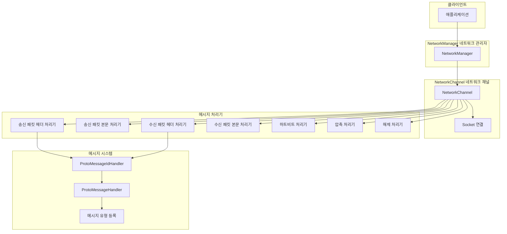
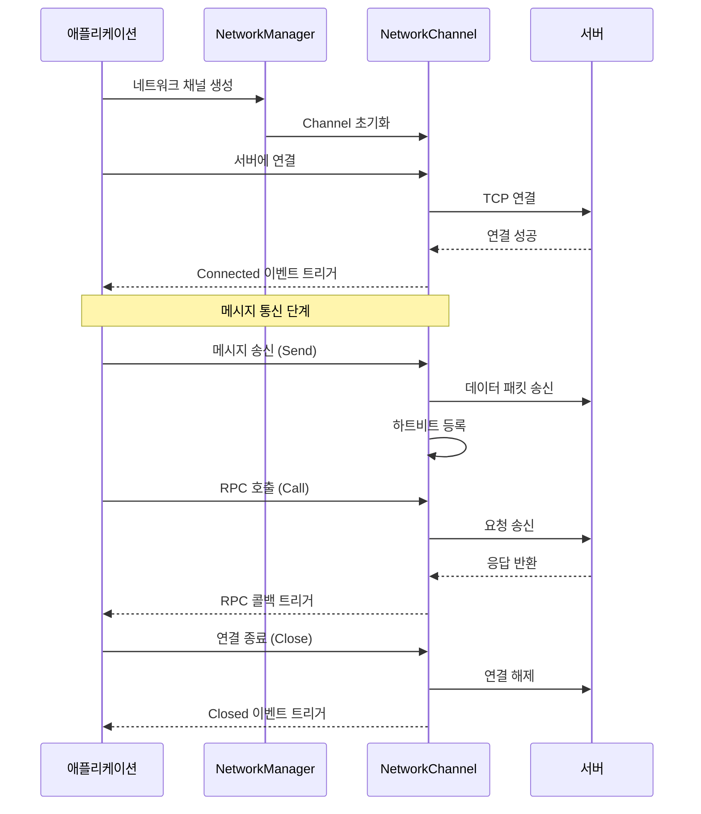
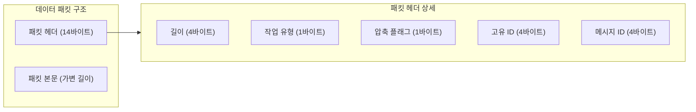

# 빠른 시작

이 문서는 GameFrameX Network 네트워크 컴포넌트를 빠르게 시작하고 핵심 개념을 이해하며 네트워크 애플리케이션을 구축하는 데 도움을 줍니다.

## 개요

GameFrameX Network는 GameFrameX 게임 프레임워크의 핵심 네트워크 컴포넌트로, TCP 롱컬렉션 기능을 지원합니다:
- TCP 기반 신뢰할 수 있는 연결
- Protocol Buffers 메시지 직렬화
- RPC 원격 프로시저 호출
- 하트비트 감지 및 자동 재연결
- 메시지 압축 및 해제

## 핵심 아키텍처



## 기본 사용 프로세스



## 메시지 유형 정의

먼저 요청과 응답 메시지 유형을 정의해야 합니다. 메시지는 반드시 `MessageObject` 클래스를 상속해야 합니다:

### 요청 메시지

```csharp
using GameFrameX.Network.Runtime;
using ProtoBuf;

namespace MyGame.Network.Messages
{
    /// <summary>
    /// 로그인 요청 메시지
    /// </summary>
    [MessageTypeHandler(1001)]  // 메시지ID, 중복 불가
    [ProtoContract]
    public class C2G_LoginRequest : MessageObject, IRequestMessage
    {
        /// <summary>
        /// 사용자 이름
        /// </summary>
        [ProtoMember(1)]
        public string UserName { get; set; }

        /// <summary>
        /// 비밀번호
        /// </summary>
        [ProtoMember(2)]
        public string Password { get; set; }
    }
}
```

> Source: [MessageObject.cs](https://github.com/GameFrameX/com.gameframex.unity.network/blob/main/Runtime/Network/Base/MessageObject.cs#L15-L56)
> Source: [MessageTypeHandlerAttribute.cs](https://github.com/GameFrameX/com.gameframex.unity.network/blob/main/Runtime/Network/Base/MessageTypeHandlerAttribute.cs#L10-L27)

### 응답 메시지

```csharp
using GameFrameX.Network.Runtime;
using ProtoBuf;

namespace MyGame.Network.Messages
{
    /// <summary>
    /// 로그인 응답 메시지
    /// </summary>
    [MessageTypeHandler(1002)]  // 대응 응답 메시지ID
    [ProtoContract]
    public class G2C_LoginResponse : MessageObject, IResponseMessage
    {
        /// <summary>
        /// 오류 코드, 0은 성공을 의미
        /// </summary>
        [ProtoMember(1)]
        public int ErrorCode { get; set; }

        /// <summary>
        /// 플레이어ID
        /// </summary>
        [ProtoMember(2)]
        public long PlayerId { get; set; }

        /// <summary>
        /// 플레이어 이름
        /// </summary>
        [ProtoMember(3)]
        public string PlayerName { get; set; }
    }
}
```

> Source: [IResponseMessage.cs](https://github.com/GameFrameX/com.gameframex.unity.network/blob/main/Runtime/Network/Base/IResponseMessage.cs#L1-L13)

### 하트비트 메시지

```csharp
using GameFrameX.Network.Runtime;
using ProtoBuf;

namespace MyGame.Network.Messages
{
    /// <summary>
    /// 하트비트 메시지
    /// </summary>
    [MessageTypeHandler(1)]  // 하트비트 메시지ID
    [ProtoContract]
    public class HeartBeatMessage : MessageObject, IHeartBeatMessage
    {
        /// <summary>
        /// 타임스탬프
        /// </summary>
        [ProtoMember(1)]
        public long Timestamp { get; set; }
    }
}
```

## 메시지 처리기 생성

`MessageHandlerAttribute` 특성을 사용하여 메시지 처리 함수를 등록합니다:

```csharp
using GameFrameX.Network.Runtime;
using GameFrameX.Runtime;

namespace MyGame.Network.Handlers
{
    /// <summary>
    /// 로그인 메시지 처리기
    /// </summary>
    public class LoginMessageHandler : MonoBehaviour
    {
        /// <summary>
        /// 로그인 응답 처리
        /// </summary>
        /// <param name="message">로그인 응답 메시지</param>
        [MessageHandler(typeof(G2C_LoginResponse), nameof(OnLoginResponse))]
        private void OnLoginResponse(G2C_LoginResponse message)
        {
            if (message.ErrorCode == 0)
            {
                Debug.Log($"로그인 성공! 플레이어ID: {message.PlayerId}, 이름: {message.PlayerName}");
            }
            else
            {
                Debug.LogError($"로그인 실패, 오류 코드: {message.ErrorCode}");
            }
        }
    }
}
```

> Source: [MessageHandlerAttribute.cs](https://github.com/GameFrameX/com.gameframex.unity.network/blob/main/Runtime/Network/Base/MessageHandlerAttribute.cs#L1-L60)

## 네트워크 컴포넌트 초기화

### 단계 1: 메시지 유형 초기화

애플리케이션 시작 시 메시지 유형 매핑을 초기화해야 합니다:

```csharp
using GameFrameX.Network.Runtime;
using GameFrameX.Runtime;
using System.Reflection;

public class GameEntry : MonoBehaviour
{
    public void Awake()
    {
        // 메시지ID 매핑 초기화
        ProtoMessageIdHandler.Init(typeof(GameEntry).Assembly);
    }
}
```

> Source: [ProtoMessageIdHandler.cs](https://github.com/GameFrameX/com.gameframex.unity.network/blob/main/Runtime/Network/Network/ProtoMessageIdHandler.cs#L107-L168)

### 단계 2: 네트워크 채널 생성

```csharp
using GameFrameX.Network.Runtime;
using GameFrameX.Runtime;

// 네트워크 관리자 가져오기
var networkManager = GameEntry.GetComponent<NetworkManager>();

// 네트워크 채널 생성
// 매개변수 설명:
// - channelName: 채널 이름, 다른 연결을 식별하는 데 사용
// - networkChannelHelper: 네트워크 채널 헬퍼
// - rpcTimeout: RPC 타임아웃 시간(밀리초), 최소값 3000
var networkChannel = networkManager.CreateNetworkChannel(
    "GameServer",
    new DefaultNetworkChannelHelper(),
    30000  // 30초 타임아웃
);

// 하트비트 간격 설정 (단위: 초)
networkChannel.HeartBeatInterval = 30f;

// 패킷 수신 시 하트비트 타이머 재설정
networkChannel.ResetHeartBeatElapseSecondsWhenReceivePacket = true;
```

> Source: [NetworkManager.cs](https://github.com/GameFrameX/com.gameframex.unity.network/blob/main/Runtime/Network/Network/NetworkManager.cs#L196-L223)

### 단계 3: 네트워크 이벤트 구독

```csharp
using GameFrameX.Network.Runtime;
using GameFrameX.Runtime;

// 네트워크 관리자 가져오기
var networkManager = GameEntry.GetComponent<NetworkManager>();

// 연결 성공 이벤트 구독
networkManager.NetworkConnected += OnNetworkConnected;

// 연결 종료 이벤트 구독
networkManager.NetworkClosed += OnNetworkClosed;

// 하트비트 유실 이벤트 구독
networkManager.NetworkMissHeartBeat += OnNetworkMissHeartBeat;

// 네트워크 오류 이벤트 구독
networkManager.NetworkError += OnNetworkError;

private void OnNetworkConnected(object sender, NetworkConnectedEventArgs e)
{
    Debug.Log($"네트워크 연결 성공: {e.NetworkChannel.Name}");
    // 연결 성공 후 로직 처리 가능
}

private void OnNetworkClosed(object sender, NetworkClosedEventArgs e)
{
    Debug.Log($"네트워크 연결 종료: {e.NetworkChannel.Name}, 이유: {e.Reason}, 오류 코드: {e.ErrorCode}");
    // 재연결 로직 처리 가능
}

private void OnNetworkMissHeartBeat(object sender, NetworkMissHeartBeatEventArgs e)
{
    Debug.LogWarning($"하트비트 유실: {e.NetworkChannel.Name}, 유실 횟수: {e.MissCount}");
}

private void OnNetworkError(object sender, NetworkErrorEventArgs e)
{
    Debug.LogError($"네트워크 오류: {e.NetworkChannel.Name}, 오류 코드: {e.ErrorCode}, 오류 정보: {e.ErrorMessage}");
}
```

> Source: [NetworkConnectedEventArgs.cs](https://github.com/GameFrameX/com.gameframex.unity.network/blob/main/Runtime/EventArgs/NetworkConnectedEventArgs.cs#L40-L98)

### 단계 4: 서버에 연결

```csharp
using System;

// Uri 생성
var address = new Uri("tcp://127.0.0.1:8888");

// 네트워크 채널 가져오기 및 연결
var networkChannel = networkManager.GetNetworkChannel("GameServer");
networkChannel.Connect(address, "사용자 데이터");
```

> Source: [INetworkChannel.cs](https://github.com/GameFrameX/com.gameframex.unity.network/blob/main/Runtime/Network/Interface/INetworkChannel.cs#L207-L212)

## 메시지 송신

### 단방향 송신 (응답 대기 불필요)

```csharp
using MyGame.Network.Messages;

// 메시지 객체 생성
var request = new C2G_LoginRequest
{
    UserName = "player1",
    Password = "123456"
};

// 메시지 송신
networkChannel.Send(request);
```

> Source: [INetworkChannel.cs](https://github.com/GameFrameX/com.gameframex.unity.network/blob/main/Runtime/Network/Interface/INetworkChannel.cs#L228-L233)

### RPC 호출 (응답 대기)

```csharp
using MyGame.Network.Messages;
using System.Threading.Tasks;

// 요청 메시지 생성
var request = new C2G_LoginRequest
{
    UserName = "player1",
    Password = "123456"
};

// RPC 요청을 송신하고 응답 대기
var response = await networkChannel.Call<G2C_LoginResponse>(request);

// 응답 처리
if (response.ErrorCode == 0)
{
    Debug.Log($"로그인 성공, 플레이어ID: {response.PlayerId}");
}
else
{
    Debug.LogError($"로그인 실패, 오류 코드: {response.ErrorCode}");
}
```

> Source: [INetworkChannel.cs](https://github.com/GameFrameX/com.gameframex.unity.network/blob/main/Runtime/Network/Interface/INetworkChannel.cs#L235-L242)

### 오류 코드를 무시하는 RPC 호출

```csharp
// isIgnoreErrorCode = true로 설정하면 서버가 오류 코드를 반환해도 예외를 발생시키지 않음
var response = await networkChannel.Call<G2C_LoginResponse>(request, isIgnoreErrorCode: true);
```

## 연결 종료

```csharp
// 네트워크 채널 종료
// 매개변수: 종료 이유, 오류 코드
networkChannel.Close("사용자가 능동적으로 종료", 0);

// 또는 관리자를 통해 파괴
networkManager.DestroyNetworkChannel("GameServer");
```

> Source: [INetworkChannel.cs](https://github.com/GameFrameX/com.gameframex.unity.network/blob/main/Runtime/Network/Interface/INetworkChannel.cs#L221-L226)

## 완전한 예시

다음은 연결부터 메시지 송신까지의 완전한 프로세스를 보여주는 완전한 클라이언트 예시입니다:

```csharp
using GameFrameX.Network.Runtime;
using GameFrameX.Runtime;
using MyGame.Network.Messages;
using System;
using System.Threading.Tasks;
using UnityEngine;

public class NetworkExample : MonoBehaviour
{
    private NetworkManager _networkManager;
    private INetworkChannel _channel;

    private void Start()
    {
        // 1. 메시지 유형 매핑 초기화
        ProtoMessageIdHandler.Init(typeof(NetworkExample).Assembly);

        // 2. 네트워크 관리자 가져오기
        _networkManager = GameEntry.GetComponent<NetworkManager>();

        // 3. 네트워크 이벤트 구독
        _networkManager.NetworkConnected += OnConnected;
        _networkManager.NetworkClosed += OnClosed;
        _networkManager.NetworkMissHeartBeat += OnMissHeartBeat;
        _networkManager.NetworkError += OnError;

        // 4. 네트워크 채널 생성
        _channel = _networkManager.CreateNetworkChannel(
            "GameServer",
            new DefaultNetworkChannelHelper(),
            30000
        );

        // 5. 하트비트 설정
        _channel.HeartBeatInterval = 30f;
        _channel.ResetHeartBeatElapseSecondsWhenReceivePacket = true;

        // 6. 서버에 연결
        _channel.Connect(new Uri("tcp://127.0.0.1:8888"));
    }

    private async void Login(string userName, string password)
    {
        if (_channel == null || !_channel.Connected)
        {
            Debug.LogError("서버에 연결되지 않음");
            return;
        }

        var request = new C2G_LoginRequest
        {
            UserName = userName,
            Password = password
        };

        try
        {
            var response = await _channel.Call<G2C_LoginResponse>(request);
            if (response.ErrorCode == 0)
            {
                Debug.Log($"로그인 성공! 플레이어ID: {response.PlayerId}");
            }
            else
            {
                Debug.LogError($"로그인 실패, 오류 코드: {response.ErrorCode}");
            }
        }
        catch (Exception ex)
        {
            Debug.LogError($"RPC 호출 실패: {ex.Message}");
        }
    }

    private void OnConnected(object sender, NetworkConnectedEventArgs e)
    {
        Debug.Log($"연결됨: {e.NetworkChannel.Name}");
    }

    private void OnClosed(object sender, NetworkClosedEventArgs e)
    {
        Debug.Log($"연결 종료됨: {e.Reason}");
    }

    private void OnMissHeartBeat(object sender, NetworkMissHeartBeatEventArgs e)
    {
        Debug.LogWarning($"하트비트 유실 횟수: {e.MissCount}");
    }

    private void OnError(object sender, NetworkErrorEventArgs e)
    {
        Debug.LogError($"네트워크 오류: {e.ErrorMessage}");
    }

    private void OnDestroy()
    {
        if (_channel != null)
        {
            _channel.Close("클라이언트 파괴");
        }
    }
}
```

## 메시지 프로토콜 형식

네트워크 컴포넌트는 사용자 정의 바이너리 프로토콜 형식을 사용하며, 14바이트 패킷 헤더를 포함합니다:



| 필드 | 길이 | 설명 |
|------|------|------|
| PacketLength | 4바이트 | 전체 데이터 패킷의 길이 (네트워크 바이트 순서) |
| OperationType | 1바이트 | 작업 유형: 1=하트비트, 4=일반 메시지 |
| ZipFlag | 1바이트 | 압축 플래그: 0=미압축, 1=압축됨 |
| UniqueId | 4바이트 | 메시지 고유 번호, RPC 매칭용 |
| MessageId | 4바이트 | 메시지 유형 ID |

> Source: [DefaultPacketSendHeaderHandler.cs](https://github.com/GameFrameX/com.gameframex.unity.network/blob/main/Runtime/Network/Helper/DefaultPacketSendHeaderHandler.cs#L38-L44)

## 구성 옵션

### NetworkChannel 구성

`INetworkChannel` 인터페이스를 통해 다음 옵션을 구성할 수 있습니다:

| 속성 | 유형 | 기본값 | 설명 |
|------|------|--------|------|
| HeartBeatInterval | float | 30f | 하트비트 송신 간격 (초) |
| ResetHeartBeatElapseSecondsWhenReceivePacket | bool | true | 패킷 수신 시 하트비트 타이머 재설정 여부 |
| PacketSendHeaderHandler | IPacketSendHeaderHandler | DefaultPacketSendHeaderHandler | 송신 패킷 헤더 처리기 |
| PacketSendBodyHandler | IPacketSendBodyHandler | - | 송신 패킷 본문 처리기 |
| PacketReceiveHeaderHandler | IPacketReceiveHeaderHandler | DefaultPacketReceiveHeaderHandler | 수신 패킷 헤더 처리기 |
| PacketReceiveBodyHandler | IPacketReceiveBodyHandler | - | 수신 패킷 본문 처리기 |
| MessageCompressHandler | IMessageCompressHandler | - | 메시지 압축 처리기 |
| MessageDecompressHandler | IMessageDecompressHandler | - | 메시지 해제 처리기 |

> Source: [INetworkChannel.cs](https://github.com/GameFrameX/com.gameframex.unity.network/blob/main/Runtime/Network/Interface/INetworkChannel.cs#L42-L132)

## 관련 링크

- [개요](./1-overview) - 네트워크 컴포넌트의 전체 설계 자세히 알아보기
- [설치](./2-installation) - 네트워크 컴포넌트 설치 및 구성
- [네트워크 관리자](./4-core-concepts.1-network-manager) - NetworkManager 상세 API
- [네트워크 채널](./4-core-concepts.2-network-channel) - NetworkChannel 상세 API
- [메시지 유형](./4-core-concepts.3-message-types) - 메시지 유형 시스템 상세
- [패킷 처리기](./4-core-concepts.4-packet-handlers) - 데이터 패킷 처리 메커니즘
- [하트비트 메커니즘](./5-heartbeat) - 하트비트 감지 메커니즘 상세
- [이벤트 시스템](./6-events) - 네트워크 이벤트 시스템
- [메시지 압축](./7-message-compression) - 메시지 압축 구성
- [RPC 원격 호출](./8-rpc) - RPC 호출 메커니즘
- [자주 묻는 질문](./10-troubleshooting) - 자주 묻는 질문 및 해결 방법