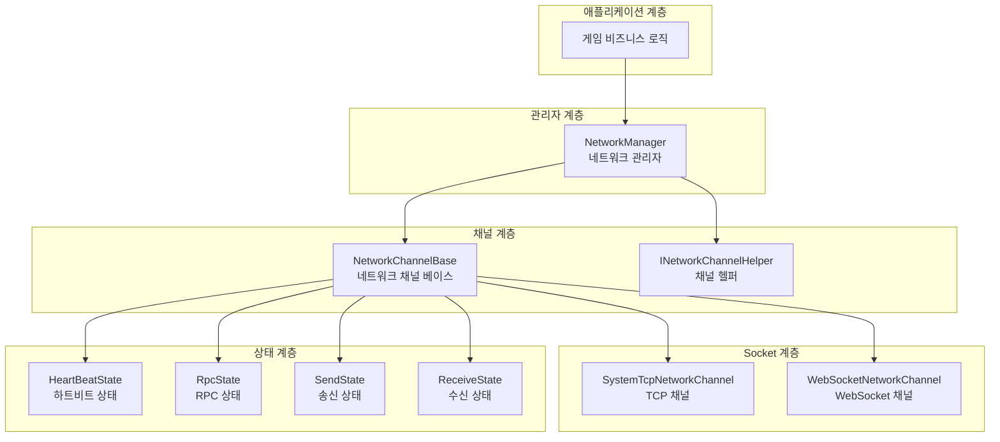
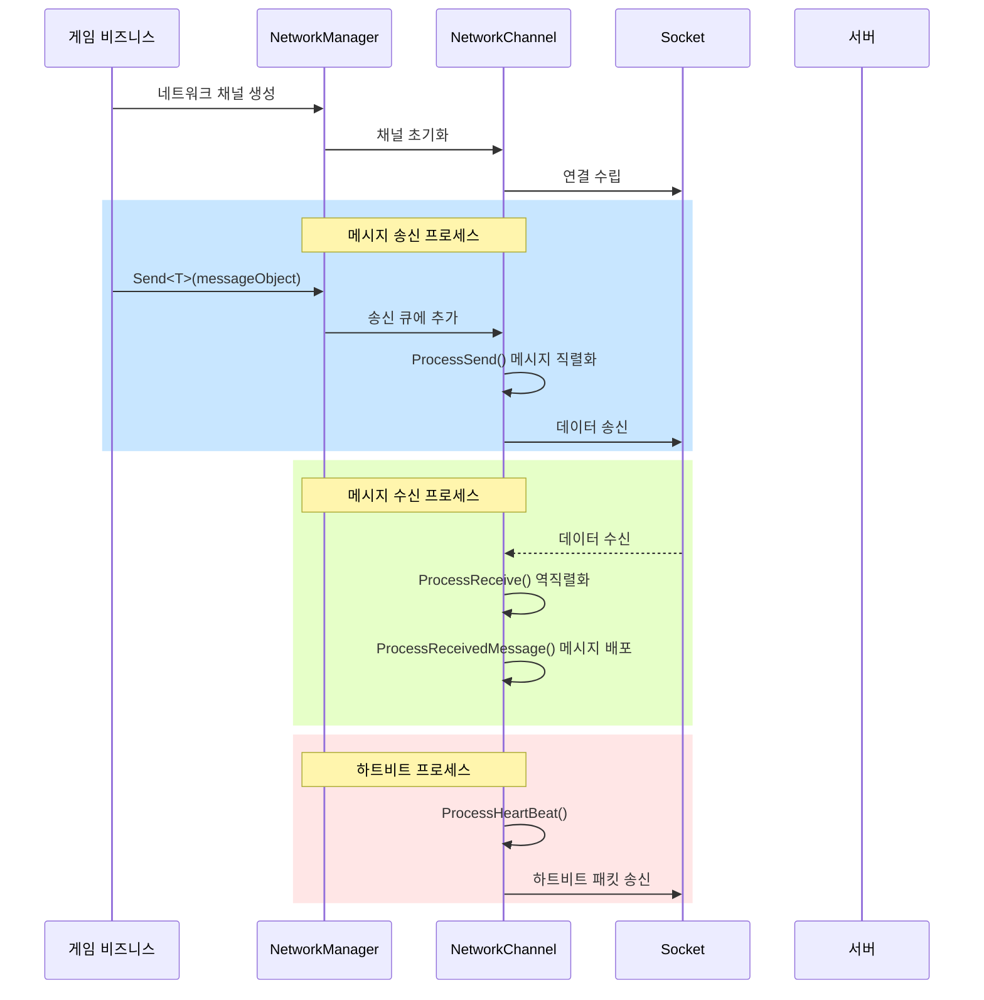
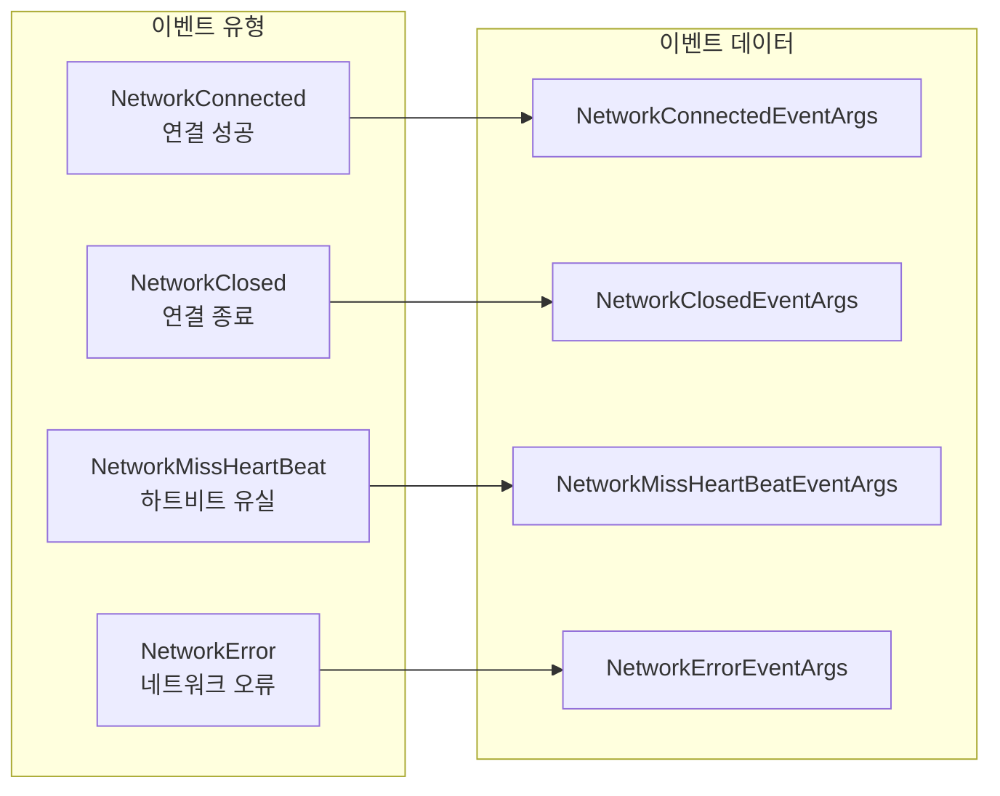

# 네트워크 관리자

NetworkManager는 GameFrameX 네트워크 모듈의 핵심 컴포넌트로, 게임의 모든 네트워크 연결 채널을統一 관리합니다. 네트워크 채널 생성 및 파괴, 연결 상태 관리, 하트비트 감지, RPC 원격 호출 등의 핵심 기능을 제공합니다.

## 개요

네트워크 관리자는 GameFrameX 프레임워크의 네트워크 계층 핵심으로, 게임 클라이언트와 서버 연결의 핵심 역할을 합니다. 그 설계 철학은 통합적이고 간결하며 강력한 네트워크 추상화 계층을 제공하여, 개발자가 세부 네트워크 통신 디테일을 걱정하지 않고 비즈니스 로직에 집중할 수 있도록 하는 것입니다.

### 핵심 책임

NetworkManager의 주요 책임은 다음과 같습니다:

1. **멀티 채널 관리**: 동시에 여러 독립적인 네트워크 채널 유지 관리 지원, 각 채널은 다른 서버에 연결 가능
2. **연결 생명 주기**: 네트워크 연결 수립, 유지 및 종료 프로세스 관리
3. **하트비트 감지**: 정기적인 하트비트 패킷 송신을 통해 연결 건강 상태 감지, 자동 연결 끊기 처리
4. **RPC 스케줄링**: 원격 프로시저 호출의 요청/응답 메커니즘 캡슐화, 비동기 서버 응답 대기 지원
5. **이벤트 알림**: 이벤트 시스템을 통해 비즈니스 계층에 네트워크 상태 변경 알림

### 설계 철학

NetworkManager는 다음 설계 원칙을 채택합니다:

- **모듈식 설계**: 네트워크 채널, 하트비트, RPC 등을 독립적인 상태 클래스로 분리하여 유지 관리 및 확장 용이
- **이벤트驱动**: 이벤트 메커니즘을 사용하여 네트워크 상태 변경과 비즈니스 처리 분리
- **통합 인터페이스**: INetworkChannel 인터페이스를 통해 TCP/WebSocket 등 다양한 네트워크 구현 추상화
- **자동 관리**: 게임 메인 루프에서 모든 네트워크 채널 자동 업데이트, 수동 폴링 부담 감소

## 아키텍처

NetworkManager는 계층화된 아키텍처 설계를 채택하며, 상위에서 하위로 다음과 같은 여러 계층으로 나뉩니다:



### 컴포넌트 설명

| 컴포넌트 | 설명 |
|------|------|
| NetworkManager | 네트워크 관리자 메인 클래스로, 모든 네트워크 채널의 생명 주기 관리 |
| NetworkChannelBase | 네트워크 채널 추상 베이스 클래스로, Socket 조작 및 메시지 처리 로직 캡슐화 |
| INetworkChannelHelper | 채널 헬퍼 인터페이스로, 메시지의 직렬화 및 역직렬화 담당 |
| HeartBeatState | 하트비트 상태 클래스로, 하트비트 타이머 및 유실 카운트 관리 |
| RpcState | RPC 상태 클래스로, 응답 대기를 중인 RPC 요청 및 타임아웃 처리 관리 |
| SendState | 송신 상태 클래스로, 송신 대기 메시지 큐 관리 |
| ReceiveState | 수신 상태 클래스로, 수신 버퍼 및 데이터 패킷 파싱 관리 |

### 메시지 처리 프로세스



## 핵심 기능

### 네트워크 채널 관리

NetworkManager는 딕셔너리 구조를 사용하여 모든 네트워크 채널을 저장하며, 채널 이름을 통해 빠른 검색을 지원합니다:

```csharp
// 네트워크 채널 생성
INetworkChannel channel = networkManager.CreateNetworkChannel("MainServer", channelHelper, 30000);

// 채널 존재 여부 확인
if (networkManager.HasNetworkChannel("MainServer"))
{
    // 채널 가져오기
    INetworkChannel channel = networkManager.GetNetworkChannel("MainServer");
}

// 모든 채널 가져오기
INetworkChannel[] channels = networkManager.GetAllNetworkChannels();

// 채널 파괴
networkManager.DestroyNetworkChannel("MainServer");
```

> Source: [NetworkManager.cs](https://github.com/GameFrameX/com.gameframex.unity.network/blob/main/Runtime/Network/Network/NetworkManager.cs#L203-L247)

### 연결 관리

네트워크 채널은 원격 서버 연결을 지원하며 완전한 연결 상태 관리를 제공합니다:

```csharp
// 서버에 연결
channel.Connect(new Uri("tcp://127.0.0.1:8888"), userData);

// 연결 종료
channel.Close("능동적 종료");
```

> Source: [NetworkManager.NetworkChannelBase.cs](https://github.com/GameFrameX/com.gameframex.unity.network/blob/main/Runtime/Network/Network/NetworkManager.NetworkChannelBase.cs#L638-L756)

### RPC 원격 호출

NetworkManager는 Task 기반 비동기 RPC 호출 메커니즘을 제공하며, 서버 응답 대기를 지원합니다:

```csharp
// RPC 요청을 송신하고 응답 대기
var request = new C2S_LoginRequest { Username = "test", Password = "123" };
var response = await channel.Call<C2S_LoginResponse>(request);

// RPC 콜백 설정
channel.SetRPCStartHandler((sender, msg) => { 
    Debug.Log($"RPC 시작: {msg.GetType().Name}");
});

channel.SetRPCEndHandler((sender, msg) => { 
    Debug.Log($"RPC 종료: {msg.GetType().Name}");
});

channel.SetRPCErrorHandler((sender, msg) => { 
    Debug.Log($"RPC 오류: {msg.GetType().Name}");
});
```

> Source: [NetworkManager.RpcState.cs](https://github.com/GameFrameX/com.gameframex.unity.network/blob/main/Runtime/Network/Network/NetworkManager.RpcState.cs#L125-L144)

### 하트비트 감지

네트워크 채널은 내장된 하트비트 감지 메커니즘을 갖추고 있으며, 하트비트 유실이 임계값에 도달하면 자동으로 연결을 끊습니다:

```csharp
// 하트비트 간격 설정 (초)
channel.HeartBeatInterval = 30f;

// 패킷 수신 시 하트비트 타이머 재설정
channel.ResetHeartBeatElapseSecondsWhenReceivePacket = true;

// 포커스 손실 시 하트비트 송신 여부 설정
networkManager.SetFocusHeartbeat(true);
```

> Source: [NetworkManager.NetworkChannelBase.cs](https://github.com/GameFrameX/com.gameframex.unity.network/blob/main/Runtime/Network/Network/NetworkManager.NetworkChannelBase.cs#L293-L311)

## 이벤트 시스템

NetworkManager는 네트워크 상태 변경을 알리기 위한 완전한 이벤트 시스템을 제공합니다:



### 이벤트 유형 설명

| 이벤트 | 설명 | 이벤트 매개변수 |
|------|------|----------|
| NetworkConnected | 서버에 성공적으로 연결 시 트리거 | NetworkConnectedEventArgs |
| NetworkClosed | 연결 종료 시 트리거 | NetworkClosedEventArgs |
| NetworkMissHeartBeat | 하트비트 유실 시 트리거 | NetworkMissHeartBeatEventArgs |
| NetworkError | 네트워크 오류 발생 시 트리거 | NetworkErrorEventArgs |

### 이벤트 구독 예시

```csharp
// 연결 성공 이벤트 구독
networkManager.NetworkConnected += OnNetworkConnected;

// 연결 종료 이벤트 구독
networkManager.NetworkClosed += OnNetworkClosed;

// 하트비트 유실 이벤트 구독
networkManager.NetworkMissHeartBeat += OnNetworkMissHeartBeat;

// 네트워크 오류 이벤트 구독
networkManager.NetworkError += OnNetworkError;

private void OnNetworkConnected(object sender, NetworkConnectedEventArgs e)
{
    Debug.Log($"연결 성공: {e.NetworkChannel.Name}");
}

private void OnNetworkClosed(object sender, NetworkClosedEventArgs e)
{
    Debug.Log($"연결 종료: {e.NetworkChannel.Name}, 이유: {e.Reason}, 오류 코드: {e.ErrorCode}");
}

private void OnNetworkMissHeartBeat(object sender, NetworkMissHeartBeatEventArgs e)
{
    Debug.Log($"하트비트 유실 횟수: {e.MissHeartBeatCount}");
}

private void OnNetworkError(object sender, NetworkErrorEventArgs e)
{
    Debug.Log($"네트워크 오류: {e.ErrorCode}, 메시지: {e.ErrorMessage}");
}
```

> Source: [NetworkConnectedEventArgs.cs](https://github.com/GameFrameX/com.gameframex.unity.network/blob/main/Runtime/EventArgs/NetworkConnectedEventArgs.cs)

## 데이터 패킷 처리기

NetworkManager는 플러그형 처리기 메커니즘을 통해 데이터 패킷의 송신 및 수신을 처리합니다:

```csharp
// 송신 헤더 처리기 등록
channel.RegisterHandler(new DefaultPacketSendHeaderHandler());

// 송신 본문 처리기 등록
channel.RegisterHandler(new DefaultPacketSendBodyHandler());

// 수신 헤더 처리기 등록
channel.RegisterHandler(new DefaultPacketReceiveHeaderHandler());

// 수신 본문 처리기 등록
channel.RegisterHandler(new DefaultPacketReceiveBodyHandler());

// 하트비트 처리기 등록
channel.RegisterHeartBeatHandler(new DefaultPacketHeartBeatHandler());
```

> Source: [INetworkChannel.cs](https://github.com/GameFrameX/com.gameframex.unity.network/blob/main/Runtime/Network/Interface/INetworkChannel.cs#L100-L174)

### 메시지 압축

메시지 압축을 지원하여 네트워크 전송 데이터량을 줄입니다:

```csharp
// 메시지 압축 처리기 등록
channel.RegisterMessageCompressHandler(new DefaultMessageCompressHandler());

// 메시지 해제 처리기 등록
channel.RegisterMessageDecompressHandler(new DefaultMessageDecompressHandler());
```

## 구성 옵션

### NetworkManager 구성

NetworkManager 자체는 GameFrameworkModule으로 작동하므로 직접 구성할 필요가 없습니다. 모든 구성은 네트워크 채널 생성 시 지정됩니다.

### NetworkChannel 구성

| 옵션 | 유형 | 기본값 | 설명 |
|------|------|--------|------|
| HeartBeatInterval | float | 30.0 | 하트비트 송신 간격 (초) |
| ResetHeartBeatElapseSecondsWhenReceivePacket | bool | false | 패킷 수신 시 하트비트 타이머 재설정 여부 |
| MissHeartBeatCountByClose | int | 10 | 하트비트 유실 횟수 임계값, 초과 시 연결 끊기 |

> Source: [NetworkManager.NetworkChannelBase.cs](https://github.com/GameFrameX/com.gameframex.unity.network/blob/main/Runtime/Network/Network/NetworkManager.NetworkChannelBase.cs#L52-L77)

## API 참고

### `NetworkManager` 클래스

`GameFrameworkModule`을 상속하며, 네트워크 모듈의 주요 진입점입니다.

#### 속성

| 속성 | 유형 | 설명 |
|------|------|------|
| NetworkChannelCount | int | 네트워크 채널 수 가져오기 |

#### 이벤트

| 이벤트 | 설명 |
|------|------|
| NetworkConnected | 네트워크 연결 성공 이벤트 |
| NetworkClosed | 네트워크 연결 종료 이벤트 |
| NetworkMissHeartBeat | 하트비트 유실 이벤트 |
| NetworkError | 네트워크 오류 이벤트 |

#### 메서드

### `HasNetworkChannel(channelName: string): bool`

지정 이름의 네트워크 채널 존재 여부를 확인합니다.

**매개변수:**
- `channelName` (string): 네트워크 채널 이름

**반환:** 네트워크 채널 존재 여부

---

### `GetNetworkChannel(channelName: string): INetworkChannel`

지정 이름의 네트워크 채널을 가져옵니다.

**매개변수:**
- `channelName` (string): 네트워크 채널 이름

**반환:** 네트워크 채널 인터페이스, 존재하지 않으면 null 반환

---

### `CreateNetworkChannel(channelName: string, networkChannelHelper: INetworkChannelHelper, rpcTimeout: int): INetworkChannel`

새 네트워크 채널을 생성합니다.

**매개변수:**
- `channelName` (string): 네트워크 채널 이름
- `networkChannelHelper` (INetworkChannelHelper): 네트워크 채널 헬퍼
- `rpcTimeout` (int): RPC 타임아웃 시간 (밀리초), 최소값 3000

**반환:** 생성된 네트워크 채널

**예외:**
- `GameFrameworkException`: 채널이 이미 존재할 때 발생

---

### `DestroyNetworkChannel(channelName: string): bool`

지정 네트워크 채널을 파괴합니다.

**매개변수:**
- `channelName` (string): 네트워크 채널 이름

**반환:** 파괴 성공 여부

---

### `SetFocusHeartbeat(hasFocus: bool): void`

애플리케이션이 포커스를 잃었을 때 하트비트 패킷을 송신할지 설정합니다.

**매개변수:**
- `hasFocus` (bool): 포커스 획득 시 하트비트 송신 여부

---

### `INetworkChannel` 인터페이스

네트워크 채널 인터페이스로, 네트워크 채널의 핵심 조작을 정의합니다.

#### 속성

| 속성 | 유형 | 설명 |
|------|------|------|
| Name | string | 채널 이름 가져오기 |
| Socket | INetworkSocket | Socket 객체 가져오기 |
| Connected | bool | 연결 여부 가져오기 |
| AddressFamily | AddressFamily | 주소 유형 가져오기 |
| SendPacketCount | int | 송신 대기 메시지 수 가져오기 |
| SentPacketCount | int | 송신 완료 메시지 수 가져오기 |
| ReceivedPacketCount | int | 수신 완료 메시지 수 가져오기 |
| HeartBeatInterval | float | 하트비트 간격 가져오기 또는 설정 |
| HeartBeatElapseSeconds | float | 하트비트 경과 시간 가져오기 |
| MissHeartBeatCount | int | 하트비트 유실 횟수 가져오기 |

#### 메서드

### `Connect(address: Uri, userData: object): void`

원격 서버에 연결합니다.

**매개변수:**
- `address` (Uri): 서버 주소
- `userData` (object): 사용자 정의 데이터

---

### `Send<T>(messageObject: T): void` 

서버에 메시지를 송신합니다.

**매개변수:**
- `messageObject` (T): MessageObject를 상속해야 하는 메시지 객체

---

### `Call<TResult>(messageObject: MessageObject, isIgnoreErrorCode: bool): Task<TResult>`

RPC 요청을 송신하고 응답을 기다립니다.

**매개변수:**
- `messageObject` (MessageObject): 요청 메시지
- `isIgnoreErrorCode` (bool): 오류 코드 무시 여부

**반환:** 응답 메시지의 Task

---

### `Close(reason: string, code: ushort): void`

네트워크 채널을 종료합니다.

**매개변수:**
- `reason` (string): 종료 이유
- `code` (ushort): 오류 코드

---

### `RegisterHandler(handler: IPacketSendHeaderHandler): void`

데이터 패킷 송신 헤더 처리기를 등록합니다.

---

### `RegisterHeartBeatHandler(handler: IPacketHeartBeatHandler): void`

하트비트 처리기를 등록합니다.

---

### `SetRPCErrorHandler(handler: EventHandler<MessageObject>): void`

RPC 오류 처리 함수를 설정합니다.

---

### `SetRPCStartHandler(handler: EventHandler<MessageObject>): void`

RPC 시작 처리 함수를 설정합니다.

---

### `SetRPCEndHandler(handler: EventHandler<MessageObject>): void`

RPC 종료 처리 함수를 설정합니다.

---

## 관련 링크

- [네트워크 채널](./4-core-concepts.2-network-channel) - 네트워크 채널 구현 자세히 알아보기
- [메시지 유형](./4-core-concepts.3-message-types) - 메시지 객체 정의 알아보기
- [패킷 처리기](./4-core-concepts.4-packet-handlers) - 데이터 패킷의 직렬화 및 처리 알아보기
- [하트비트 메커니즘](./5-heartbeat) - 하트비트 감지 메커니즘 자세히 알아보기
- [이벤트 시스템](./6-events) - 이벤트 시스템 사용 알아보기
- [메시지 압축](./7-message-compression) - 메시지 압축 기능 알아보기
- [RPC 원격 호출](./8-rpc) - RPC 메커니즘 자세히 알아보기