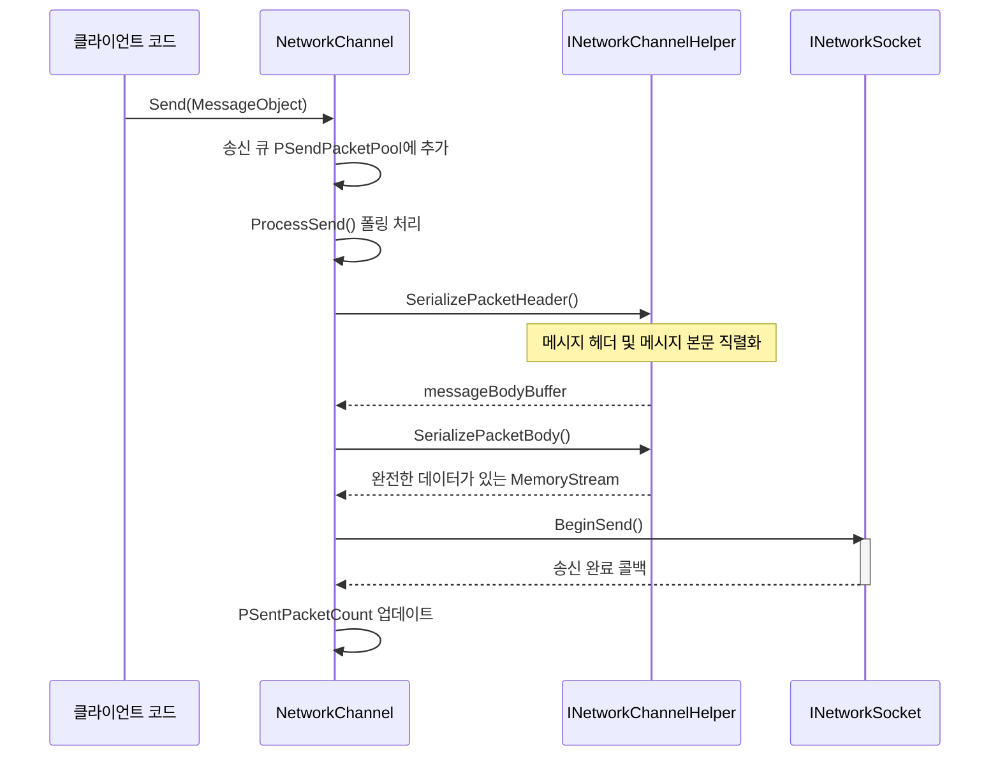
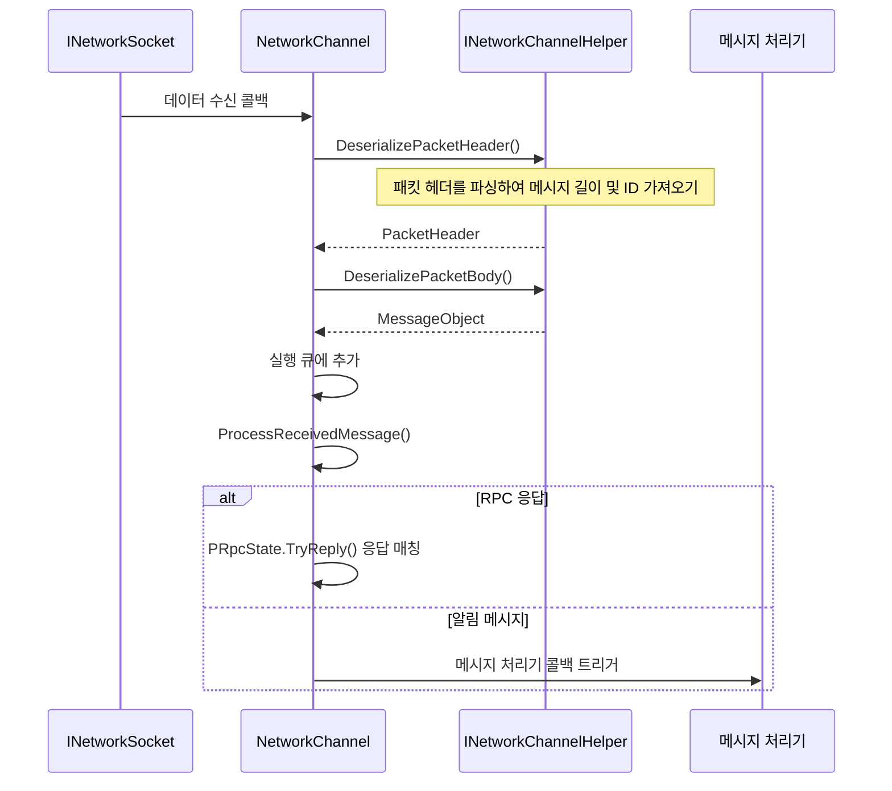
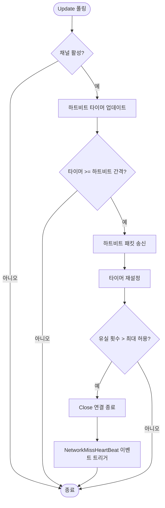

# 네트워크 채널

네트워크 채널(Network Channel)은 GameFrameX 네트워크 프레임워크의 핵심 컴포넌트로, 원격 서버와의 단일 연결 관리를 담당합니다. Socket 통신, 메시지 직렬화/역직렬화, 하트비트 감지, RPC 호출 등 완전한 기능을 캡슐화하여, 개발자가 편리하게 네트워크 통신 개발을 할 수 있게 합니다.

## 개요

GameFrameX 네트워크 프레임워크에서 각 네트워크 채널은 독립적인 네트워크 연결을 나타냅니다. 프레임워크는 여러 채널을 동시에 생성하여 다른 서버에 연결하는 것을 지원하며, 각 채널은 자신의 연결 상태, 송신 큐, 수신 큐 및 하트비트 상태를 유지합니다.

네트워크 채널 설계는 계층화된 아키텍처를 채택합니다:

- **인터페이스 계층**: `INetworkChannel` 인터페이스를 정의하여 모든 네트워크 조작 추상화
- **베이스 클래스 계층**: `NetworkChannelBase` 추상 베이스 클래스를 제공하여 공통 로직 구현
- **구현 계층**: `SystemTcpNetworkChannel`(TCP 연결)과 `WebSocketNetworkChannel`(WebSocket 연결) 포함
- **헬퍼 계층**: `INetworkChannelHelper`를 통해 메시지의 직렬화 및 역직렬화를 위임

### 핵심 기능

네트워크 채널은 다음 핵심 기능을 제공합니다:

1. **연결 관리**: 원격 서버 연결 수립 및 유지
2. **메시지 송신**: MessageObject를 네트워크 데이터로 직렬화하여 송신
3. **메시지 수신**: 네트워크 데이터를 수신하여 MessageObject로 역직렬화
4. **하트비트 메커니즘**: 정기적인 하트비트 패킷을 송신하여 연결 상태 감지
5. **RPC 호출**: 요청-응답 모드의 원격 프로시저 호출 지원
6. **메시지 압축**: 메시지 압축을 지원하여 네트워크 전송량 감소
7. **이벤트 알림**: 이벤트 시스템을 통해 연결 상태 변경 알림

## 아키텍처

```mermaid
graph TD
    subgraph "외부 호출"
        NetworkComponent
        GameLogic
    end
    
    subgraph "NetworkManager"
        Manager[네트워크 관리자]
    end
    
    subgraph "네트워크 채널 계층"
        INetworkChannel[INetworkChannel 인터페이스]
        BaseChannel[NetworkChannelBase 베이스 클래스]
        TcpChannel[SystemTcpNetworkChannel]
        WsChannel[WebSocketNetworkChannel]
    end
    
    subgraph "처리기 계층"
        SendHeader[IPacketSendHeaderHandler]
        SendBody[IPacketSendBodyHandler]
        RecvHeader[IPacketReceiveHeaderHandler]
        RecvBody[IPacketReceiveBodyHandler]
        HeartBeat[IPacketHeartBeatHandler]
        Compress[IMessageCompressHandler]
        Decompress[IMessageDecompressHandler]
    end
    
    subgraph "헬퍼 계층"
        Helper[INetworkChannelHelper]
        DefaultHelper[DefaultNetworkChannelHelper]
    end
    
    subgraph "하위 네트워크"
        Socket[INetworkSocket]
    end
    
    NetworkComponent --> Manager
    Manager --> INetworkChannel
    INetworkChannel <|-- BaseChannel
    BaseChannel --> TcpChannel
    BaseChannel --> WsChannel
    BaseChannel --> Helper
    BaseChannel --> SendHeader
    BaseChannel --> SendBody
    BaseChannel --> RecvHeader
    BaseChannel --> RecvBody
    BaseChannel --> HeartBeat
    BaseChannel --> Compress
    BaseChannel --> Decompress
    Helper <|.. DefaultHelper
    TcpChannel --> Socket
    WsChannel --> Socket
```

### 컴포넌트 설명

| 컴포넌트 | 설명 |
|------|------|
| `INetworkChannel` | 네트워크 채널 인터페이스로, 모든 네트워크 조작 정의 |
| `NetworkChannelBase` | 추상 베이스 클래스로, 공통 로직 및 상태 관리 구현 |
| `SystemTcpNetworkChannel` | System.Net.Sockets 기반 TCP 구현 |
| `WebSocketNetworkChannel` | WebSocket 기반 연결 구현 |
| `INetworkChannelHelper` | 메시지 직렬화/역직렬화 헬퍼 인터페이스 |
| `DefaultNetworkChannelHelper` | 기본 구현으로, 자동으로 처리기 등록 |

## 메시지 처리 프로세스

### 송신 프로세스

클라이언트가 `Send` 메서드를 호출하여 메시지를 송신할 때, 네트워크 채널은 다음 프로세스에 따라 처리합니다:



> Source: [NetworkManager.NetworkChannelBase.cs](https://github.com/GameFrameX/com.gameframex.unity.network/blob/main/Runtime/Network/Network/NetworkManager.NetworkChannelBase.cs#L779-L822)

### 수신 프로세스

네트워크 데이터를 수신할 때, 네트워크 채널은 다음 프로세스에 따라 처리합니다:



> Source: [NetworkManager.NetworkChannelBase.cs](https://github.com/GameFrameX/com.gameframex.unity.network/blob/main/Runtime/Network/Network/NetworkManager.NetworkChannelBase.cs#L392-L430)

## 하트비트 메커니즘

네트워크 채널은 내장된 하트비트 메커니즘을 갖추고 있어 연결이 여전히 유효한지 감지합니다.



> Source: [NetworkManager.NetworkChannelBase.cs](https://github.com/GameFrameX/com.gameframex.unity.network/blob/main/Runtime/Network/Network/NetworkManager.NetworkChannelBase.cs#L436-L479)

### 하트비트 구성

| 속성 | 기본값 | 설명 |
|------|--------|------|
| `HeartBeatInterval` | 30초 | 하트비트 송신 간격 |
| `MissHeartBeatCountByClose` | 10 | 유실 횟수 임계값, 초과 시 자동 연결 끊기 |
| `ResetHeartBeatElapseSecondsWhenReceivePacket` | false | 패킷 수신 시 하트비트 타이머 재설정 여부 |

## 사용 예시

### 채널 생성

```csharp
// NetworkComponent를 통해 네트워크 채널 생성
var networkChannel = networkComponent.CreateNetworkChannel(
    "GameServer", 
    new DefaultNetworkChannelHelper()
);
```

> Source: [NetworkComponent.cs](https://github.com/GameFrameX/com.gameframex.unity.network/blob/main/Runtime/Network/NetworkComponent.cs#L176-L180)

### 서버에 연결

```csharp
// 원격 서버에 연결
var channel = networkComponent.GetNetworkChannel("GameServer");
channel.Connect(new Uri("tcp://127.0.0.1:8888"));
```

> Source: [NetworkManager.NetworkChannelBase.cs](https://github.com/GameFrameX/com.gameframex.unity.network/blob/main/Runtime/Network/Network/NetworkManager.NetworkChannelBase.cs#L638-L706)

### 메시지 송신

```csharp
// 메시지 송신 (비동기 응답 없음)
var message = new C2S_LoginMessage 
{ 
    Username = "player1", 
    Password = "password" 
};
channel.Send(message);

// RPC 요청 송신 (응답 대기)
var response = await channel.Call<S2C_LoginResponse>(new C2S_LoginMessage 
{ 
    Username = "player1", 
    Password = "password" 
});
```

> Source: [NetworkManager.NetworkChannelBase.cs](https://github.com/GameFrameX/com.gameframex.unity.network/blob/main/Runtime/Network/Network/NetworkManager.NetworkChannelBase.cs#L765-L771)

### 하트비트 구성

```csharp
// 하트비트 간격을 15초로 설정
channel.HeartBeatInterval = 15f;

// 5번 하트비트 유실 후 연결 끊기
MissHeartBeatCountByClose = 5;

// 패킷 수신 시 하트비트 타이머 재설정
channel.ResetHeartBeatElapseSecondsWhenReceivePacket = true;
```

> Source: [NetworkManager.NetworkChannelBase.cs](https://github.com/GameFrameX/com.gameframex.unity.network/blob/main/Runtime/Network/Network/NetworkManager.NetworkChannelBase.cs#L290-L297)

### 메시지 처리기 등록

```csharp
// DefaultNetworkChannelHelper.Initialize에서 자동으로 모든 처리기 등록
// 개발자는 INetworkChannelHelper를 상속하여 처리기 등록 로직 사용자 정의 가능

// 사용자 정의 하트비트 처리기 등록
channel.RegisterHeartBeatHandler(new CustomHeartBeatHandler());
```

> Source: [DefaultNetworkChannelHelper.cs](https://github.com/GameFrameX/com.gameframex.unity.network/blob/main/Runtime/Network/Helper/DefaultNetworkChannelHelper.cs#L40-L107)

### 채널 종료

```csharp
// 네트워크 채널 종료
channel.Close("능동적 종료", (ushort)NetworkErrorCode.Normal);
```

> Source: [NetworkManager.NetworkChannelBase.cs](https://github.com/GameFrameX/com.gameframex.unity.network/blob/main/Runtime/Network/Network/NetworkManager.NetworkChannelBase.cs#L714-L756)

## INetworkChannel 인터페이스 참고

### 연결 관리

| 메서드 | 설명 |
|------|------|
| `Connect(Uri address, object userData = null)` | 원격 서버에 연결 |
| `Close(string reason, ushort code = 0)` | 네트워크 연결 종료 |
| `Send<T>(T messageObject) where T : MessageObject` | 메시지 송신 |
| `Call<TResult>(MessageObject messageObject, bool isIgnoreErrorCode = false)` | RPC 요청을 송신하고 응답 대기 |

### 속성

| 속성 | 유형 | 설명 |
|------|------|------|
| `Name` | string | 채널 이름 가져오기 |
| `Connected` | bool | 연결 여부 가져오기 |
| `AddressFamily` | AddressFamily | 주소 유형 (IPv4/IPv6) 가져오기 |
| `Socket` | INetworkSocket | 하위 Socket 가져오기 |
| `SendPacketCount` | int | 송신 대기 메시지 수 가져오기 |
| `SentPacketCount` | int | 송신 완료 메시지 총 수 가져오기 |
| `ReceivedPacketCount` | int | 수신 완료 메시지 총 수 가져오기 |
| `HeartBeatInterval` | float | 하트비트 간격 가져오기 또는 설정 (초) |
| `HeartBeatElapseSeconds` | float | 하트비트 경과 시간 가져오기 |
| `MissHeartBeatCount` | int | 하트비트 유실 횟수 가져오기 |

### 처리기 관리

| 메서드 | 설명 |
|------|------|
| `RegisterHandler(IPacketSendHeaderHandler)` | 송신 패킷 헤더 처리기 등록 |
| `RegisterHandler(IPacketSendBodyHandler)` | 송신 패킷 본문 처리기 등록 |
| `RegisterHandler(IPacketReceiveHeaderHandler)` | 수신 패킷 헤더 처리기 등록 |
| `RegisterHandler(IPacketReceiveBodyHandler)` | 수신 패킷 본문 처리기 등록 |
| `RegisterHeartBeatHandler(IPacketHeartBeatHandler)` | 하트비트 처리기 등록 |
| `RegisterMessageCompressHandler(IMessageCompressHandler)` | 메시지 압축 처리기 등록 |
| `RegisterMessageDecompressHandler(IMessageDecompressHandler)` | 메시지 해제 처리기 등록 |

### RPC 콜백 설정

| 메서드 | 설명 |
|------|------|
| `SetRPCErrorCodeHandler(EventHandler<MessageObject>)` | RPC 오류 코드 콜백 설정 |
| `SetRPCErrorHandler(EventHandler<MessageObject>)` | RPC 오류 콜백 설정 |
| `SetRPCStartHandler(EventHandler<MessageObject>)` | RPC 시작 콜백 설정 |
| `SetRPCEndHandler(EventHandler<MessageObject>)` | RPC 종료 콜백 설정 |

> Source: [INetworkChannel.cs](https://github.com/GameFrameX/com.gameframex.unity.network/blob/main/Runtime/Network/Interface/INetworkChannel.cs)

## INetworkChannelHelper 인터페이스 참고

`INetworkChannelHelper`는 네트워크 채널의 헬퍼 인터페이스로, 메시지의 직렬화 및 역직렬화를 담당합니다.

| 메서드 | 설명 |
|------|------|
| `Initialize(INetworkChannel)` | 헬퍼 초기화 |
| `Shutdown()` | 종료 및 정리 |
| `PrepareForConnecting()` | 연결 전 준비 작업 |
| `SendHeartBeat()` | 하트비트 메시지 송신 |
| `SerializePacketHeader<T>()` | 메시지 헤더 직렬화 |
| `SerializePacketBody()` | 메시지 본문 직렬화 |
| `DeserializePacketHeader()` | 메시지 헤더 역직렬화 |
| `DeserializePacketBody()` | 메시지 본문 역직렬화 |

> Source: [INetworkChannelHelper.cs](https://github.com/GameFrameX/com.gameframex.unity.network/blob/main/Runtime/Network/Interface/INetworkChannelHelper.cs)

## 관련 링크

- [네트워크 관리자](./4-core-concepts.1-network-manager)
- [메시지 유형](./4-core-concepts.3-message-types)
- [패킷 처리기](./4-core-concepts.4-packet-handlers)
- [하트비트 메커니즘](./5-heartbeat)
- [이벤트 시스템](./6-events)
- [메시지 압축](./7-message-compression)
- [RPC 원격 호출](./8-rpc)