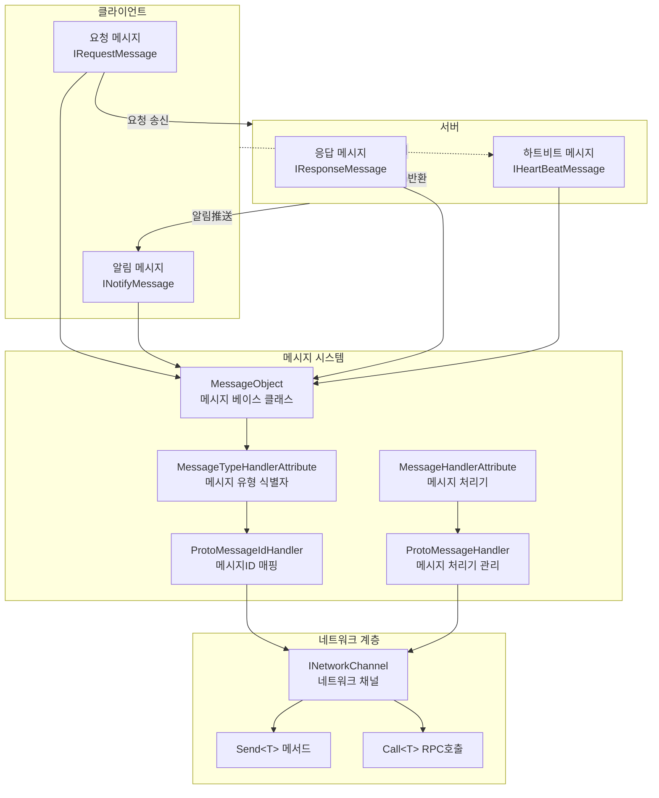
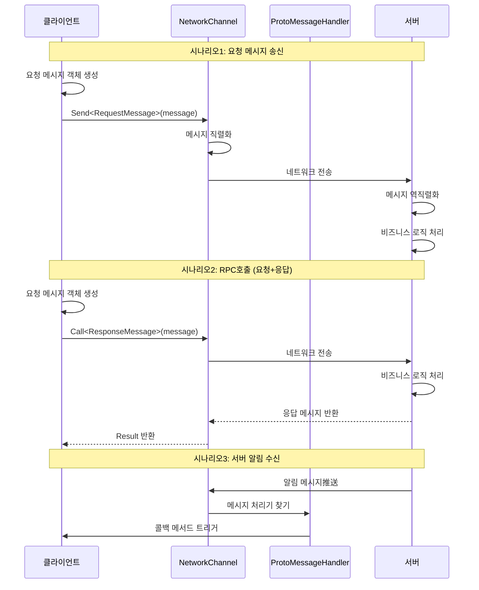

# 메시지 유형

메시지 유형은 GameFrameX 네트워크 프레임워크에서 클라이언트와 서버 간 통신 데이터 구조를 정의하는 시스템입니다. 메시지 유형을 통해 개발자는 요청 메시지, 응답 메시지, 알림 메시지 및 하트비트 메시지를 정의하여 신뢰할 수 있는 네트워크 통신을 구현할 수 있습니다.

## 개요

GameFrameX 네트워크 프레임워크는 메시지 기반 통신 모드를 채택하며, 네트워크 전송의 모든 데이터는 메시지 객체로 캡슐화됩니다. 프레임워크는 완전한 메시지 유형 체계를 제공하여 지원합니다:

- **요청 메시지 (Request)**: 클라이언트가 서버에 송신하는 요청
- **응답 메시지 (Response)**: 서버가 클라이언트 요청에 대한 응답
- **알림 메시지 (Notify)**: 서버가 클라이언트에 능동적으로推送하는 메시지
- **하트비트 메시지 (HeartBeat)**: 연결 활성 유지를 위한 경량 메시지

메시지 유형 시스템은 `MessageObject` 베이스 클래스를 기반으로 구축되며, JSON과 Protobuf 두 가지 직렬화 방식을 지원하며, `MessageTypeHandlerAttribute`와 함께 사용하여 각 메시지에 고유한 메시지 ID를 할당할 수 있습니다.

## 아키텍처



### 메시지 흐름 프로세스



## 핵심 개념

### MessageObject - 메시지 베이스 클래스

모든 네트워크 메시지는 반드시 `MessageObject` 베이스 클래스를 상속해야 합니다. 이 클래스는 고유 ID 생성 및 직렬화 지원을 제공합니다.

> Source: [MessageObject.cs](https://github.com/GameFrameX/com.gameframex.unity.network/blob/main/Runtime/Network/Base/MessageObject.cs#L1-L56)

```csharp
public class MessageObject : IReference
{
    /// <summary>
    /// 메시지 고유 번호
    /// </summary>
    public int UniqueId { get; private set; }

    protected MessageObject()
    {
        UpdateUniqueId();
    }

    /// <summary>
    /// 고유编码 업데이트
    /// </summary>
    public void UpdateUniqueId()
    {
        UniqueId = Utility.IdGenerator.GetNextUniqueIntId();
    }

    /// <summary>
    /// 참조 정리
    /// </summary>
    public virtual void Clear()
    {
    }
}
```

### 메시지 유형 인터페이스

프레임워크는 네 가지 핵심 인터페이스를 정의하여 다양한 유형의 메시지를 구분합니다:

| 인터페이스 | 용도 | 설명 |
|------|------|------|
| `IRequestMessage` | 요청 메시지 | 클라이언트가 서버에 송신하는 요청 |
| `IResponseMessage` | 응답 메시지 | 서버가 클라이언트에 반환하는 응답으로, ErrorCode 속성 포함 |
| `INotifyMessage` | 알림 메시지 | 서버가 클라이언트에 능동적으로推送하는 메시지 |
| `IHeartBeatMessage` | 하트비트 메시지 | 연결 활성 유지를 위한 경량 메시지 |

> Source: [IRequestMessage.cs](https://github.com/GameFrameX/com.gameframex.unity.network/blob/main/Runtime/Network/Base/IRequestMessage.cs#L1-L9)
> Source: [IResponseMessage.cs](https://github.com/GameFrameX/com.gameframex.unity.network/blob/main/Runtime/Network/Base/IResponseMessage.cs#L1-L13)
> Source: [INotifyMessage.cs](https://github.com/GameFrameX/com.gameframex.unity.network/blob/main/Runtime/Network/Base/INotifyMessage.cs#L1-L9)
> Source: [IHeartBeatMessage.cs](https://github.com/GameFrameX/com.gameframex.unity.network/blob/main/Runtime/Network/Base/IHeartBeatMessage.cs#L1-L9)

### MessageTypeHandlerAttribute - 메시지 유형 식별자

메시지 클래스의 고유 ID를 표시하는 데 사용됩니다. 이 특성은 메시지ID 매핑 시스템의 핵심으로, `ProtoMessageIdHandler`와 함께 사용하여 메시지ID와 유형의 양방향 매핑을 구현합니다.

> Source: [MessageTypeHandlerAttribute.cs](https://github.com/GameFrameX/com.gameframex.unity.network/blob/main/Runtime/Network/Base/MessageTypeHandlerAttribute.cs#L1-L27)

### MessageHandlerAttribute - 메시지 처리기

특정 메시지 유형의 콜백 메서드를 표시하는 데 사용됩니다. 이 특성을 통해 개발자는 선언적으로 메시지 처리기를 등록할 수 있습니다.

> Source: [MessageHandlerAttribute.cs](https://github.com/GameFrameX/com.gameframex.unity.network/blob/main/Runtime/Network/Base/MessageHandlerAttribute.cs#L1-L196)

## 사용 예시

### 요청 메시지 정의

클라이언트가 서버에 송신하는 요청 메시지를 정의합니다:

```csharp
using GameFrameX.Network.Runtime;

#if ENABLE_GAME_FRAME_X_PROTOBUF
using ProtoBuf;
#endif

#if ENABLE_GAME_FRAME_X_PROTOBUF
[ProtoContract]
#endif
[MessageTypeHandler(1)]  // 메시지ID가 1
public class C2S_LoginRequest : MessageObject, IRequestMessage
{
#if ENABLE_GAME_FRAME_X_PROTOBUF
    [ProtoMember(1)]
#endif
    public string UserName { get; set; }

#if ENABLE_GAME_FRAME_X_PROTOBUF
    [ProtoMember(2)]
#endif
    public string Password { get; set; }
}
```

### 응답 메시지 정의

서버가 클라이언트에 반환하는 응답 메시지를 정의합니다:

```csharp
#if ENABLE_GAME_FRAME_X_PROTOBUF
[ProtoContract]
#endif
[MessageTypeHandler(101)]  // 메시지ID가 101
public class S2C_LoginResponse : MessageObject, IResponseMessage
{
#if ENABLE_GAME_FRAME_X_PROTOBUF
    [ProtoMember(1)]
#endif
    public int ErrorCode { get; set; }

#if ENABLE_GAME_FRAME_X_PROTOBUF
    [ProtoMember(2)]
#endif
    public string Token { get; set; }

#if ENABLE_GAME_FRAME_X_PROTOBUF
    [ProtoMember(3)]
#endif
    public long UserId { get; set; }
}
```

### 알림 메시지 정의

서버가 클라이언트에 능동적으로推送하는 알림 메시지를 정의합니다:

```csharp
#if ENABLE_GAME_FRAME_X_PROTOBUF
[ProtoContract]
#endif
[MessageTypeHandler(201)]  // 메시지ID가 201
public class S2C_NoticeNotify : MessageObject, INotifyMessage
{
#if ENABLE_GAME_FRAME_X_PROTOBUF
    [ProtoMember(1)]
#endif
    public string Title { get; set; }

#if ENABLE_GAME_FRAME_X_PROTOBUF
    [ProtoMember(2)]
#endif
    public string Content { get; set; }
}
```

### 하트비트 메시지 정의

연결 활성 유지를 위한 하트비트 메시지를 정의합니다:

```csharp
#if ENABLE_GAME_FRAME_X_PROTOBUF
[ProtoContract]
#endif
[MessageTypeHandler(10001)]  // 메시지ID가 10001
public class HeartBeatMessage : MessageObject, IHeartBeatMessage
{
#if ENABLE_GAME_FRAME_X_PROTOBUF
    [ProtoMember(1)]
#endif
    public long Timestamp { get; set; }
}
```

### 메시지 처리기 등록

`MessageHandlerAttribute`를 사용하여 서버가推送한 메시지를 수신하는 메시지 처리기를 등록합니다:

```csharp
public class NetworkMessageHandler : IMessageHandler
{
    public void Register()
    {
        ProtoMessageHandler.Add(this);
    }

    [MessageHandler(typeof(S2C_LoginResponse), nameof(OnLoginResponse))]
    private void OnLoginResponse(S2C_LoginResponse message)
    {
        if (message.ErrorCode == 0)
        {
            UnityEngine.Debug.Log($"로그인 성공! UserId: {message.UserId}");
        }
        else
        {
            UnityEngine.Debug.LogError($"로그인 실패! ErrorCode: {message.ErrorCode}");
        }
    }

    [MessageHandler(typeof(S2C_NoticeNotify), nameof(OnNoticeNotify))]
    private void OnNoticeNotify(S2C_NoticeNotify message)
    {
        UnityEngine.Debug.Log($"알림 수신: {message.Title} - {message.Content}");
    }
}
```

### 메시지 송신

`INetworkChannel`을 통해 메시지를 송신합니다:

```csharp
// 일반 요청 메시지 송신
var loginRequest = new C2S_LoginRequest
{
    UserName = "player1",
    Password = "password123"
};
networkChannel.Send(loginRequest);

// RPC 요청을 송신하고 응답 대기
var loginRequest2 = new C2S_LoginRequest
{
    UserName = "player1",
    Password = "password123"
};
var response = await networkChannel.Call<S2C_LoginResponse>(loginRequest2);
if (response.ErrorCode == 0)
{
    UnityEngine.Debug.Log($"RPC 호출 성공! Token: {response.Token}");
}
```

> Source: [INetworkChannel.cs](https://github.com/GameFrameX/com.gameframex.unity.network/blob/main/Runtime/Network/Interface/INetworkChannel.cs#L228-L241)

## ProtoMessageIdHandler - 메시지ID 매핑 관리

`ProtoMessageIdHandler`는 모든 메시지 유형과 메시지ID 간의 매핑 관계를 관리합니다. 프로그램 시작 시 `Init` 메서드를 호출하여 모든 메시지 유형을 스캔하고 등록해야 합니다.

> Source: [ProtoMessageIdHandler.cs](https://github.com/GameFrameX/com.gameframex.unity.network/blob/main/Runtime/Network/Network/ProtoMessageIdHandler.cs#L1-L170)

### 메시지ID 매핑 초기화

```csharp
// 프로그램 시작 시 호출
var assembly = typeof(C2S_LoginRequest).Assembly;
ProtoMessageIdHandler.Init(assembly);
```

`Init` 메서드는 자동으로 프로그램 어셈블리에서 `MessageTypeHandlerAttribute`가 표시된 모든 유형을 스캔하고, 구현된 인터페이스에 따라 해당 매핑 딕셔너리에 추가합니다:

- `IRequestMessage` 구현 → 요청 메시지 딕셔너리에 추가
- `IResponseMessage` 구현 → 응답 메시지 딕셔너리에 추가
- `INotifyMessage` 구현 → 응답 메시지 딕셔너리에 추가 (알림 메시지도 응답 메시지 채널을 통해 수신)
- `IHeartBeatMessage` 구현 → 하트비트 메시지 목록에 추가

## ProtoMessageHandler - 메시지 처리기 관리

`ProtoMessageHandler`는 메시지 처리기의 등록 및 호출을 관리합니다.

> Source: [ProtoMessageHandler.cs](https://github.com/GameFrameX/com.gameframex.unity.network/blob/main/Runtime/Network/Network/ProtoMessageHandler.cs#L1-L144)

### 메시지 처리기 등록

```csharp
var messageHandler = new NetworkMessageHandler();
ProtoMessageHandler.Add(messageHandler);
```

### 메시지 처리기 제거

```csharp
ProtoMessageHandler.Remove(messageHandler);
```

## API 참고

### MessageObject

모든 메시지의 베이스 클래스입니다.

**속성:**
| 속성 | 유형 | 설명 |
|------|------|------|
| UniqueId | int | 메시지 고유 식별자 |

**메서드:**
| 메서드 | 반환 유형 | 설명 |
|------|----------|------|
| UpdateUniqueId() | void | 메시지의 고유ID 업데이트 |
| SetUpdateUniqueId(int uniqueId) | void | 메시지의 고유ID 설정 |
| Clear() | void | 참조 리소스 정리 |

### MessageTypeHandlerAttribute

메시지 클래스를 표시하고 고유 메시지ID를 할당합니다.

**생성자:**
```csharp
public MessageTypeHandlerAttribute(int messageId)
```

**속성:**
| 속성 | 유형 | 설명 |
|------|------|------|
| MessageId | int | 메시지의 고유ID |

### MessageHandlerAttribute

메시지 처리 메서드를 표시합니다.

**생성자:**
```csharp
public MessageHandlerAttribute(Type message, string invokeMethodName)
```

**매개변수:**
- `message` (Type): MessageObject를 상속하고 INotifyMessage를 구현하는 메시지 유형
- `invokeMethodName` (string): 메시지를 처리하는 메서드 이름

### ProtoMessageHandler

메시지 처리기의 등록 및 호출을 관리합니다.

**메서드:**
| 메서드 | 설명 |
|------|------|
| Add(IMessageHandler) | 메시지 처리기 등록 |
| Remove(IMessageHandler) | 메시지 처리기 제거 |

### ProtoMessageIdHandler

메시지ID와 유형의 양방향 매핑을 관리합니다.

**메서드:**
| 메서드 | 반환 유형 | 설명 |
|------|----------|------|
| Init(Assembly) | void | 메시지ID 매핑 초기화 |
| GetReqTypeById(int) | Type | 메시지ID에 따라 요청 유형 가져오기 |
| GetReqMessageIdByType(Type) | int | 유형에 따라 요청 메시지ID 가져오기 |
| GetRespTypeById(int) | Type | 메시지ID에 따라 응답 유형 가져오기 |
| GetRespMessageIdByType(Type) | int | 유형에 따라 응답 메시지ID 가져오기 |
| IsHeartbeat(Type) | bool | 하트비트 메시지 유형인지 판단 |

### INetworkChannel

네트워크 채널 인터페이스로, 메시지 송신 기능을 제공합니다.

**메서드:**
| 메서드 | 설명 |
|------|------|
| `Send<T>`(T messageObject) | 서버에 메시지 송신 |
| `Call<TResult>`(MessageObject, bool) | RPC 요청을 송신하고 응답 대기 |

## 관련 링크

- [네트워크 관리자](./4-core-concepts.1-network-manager) - NetworkManager를 사용하여 네트워크 연결을 생성 및 관리하는 방법 알아보기
- [네트워크 채널](./4-core-concepts.2-network-channel) - 네트워크 채널의 구성 및 메시지 처리 자세히 알아보기
- [패킷 처리기](./4-core-concepts.4-packet-handlers) - 데이터 패킷의 처리 프로세스 알아보기
- [하트비트 메커니즘](./5-heartbeat) - 하트비트 메시지의 작동 원리 알아보기
- [이벤트 시스템](./6-events) - 네트워크 이벤트 처리 알아보기
- [RPC 원격 호출](./8-rpc) - RPC 호출의 상세 사용법 알아보기