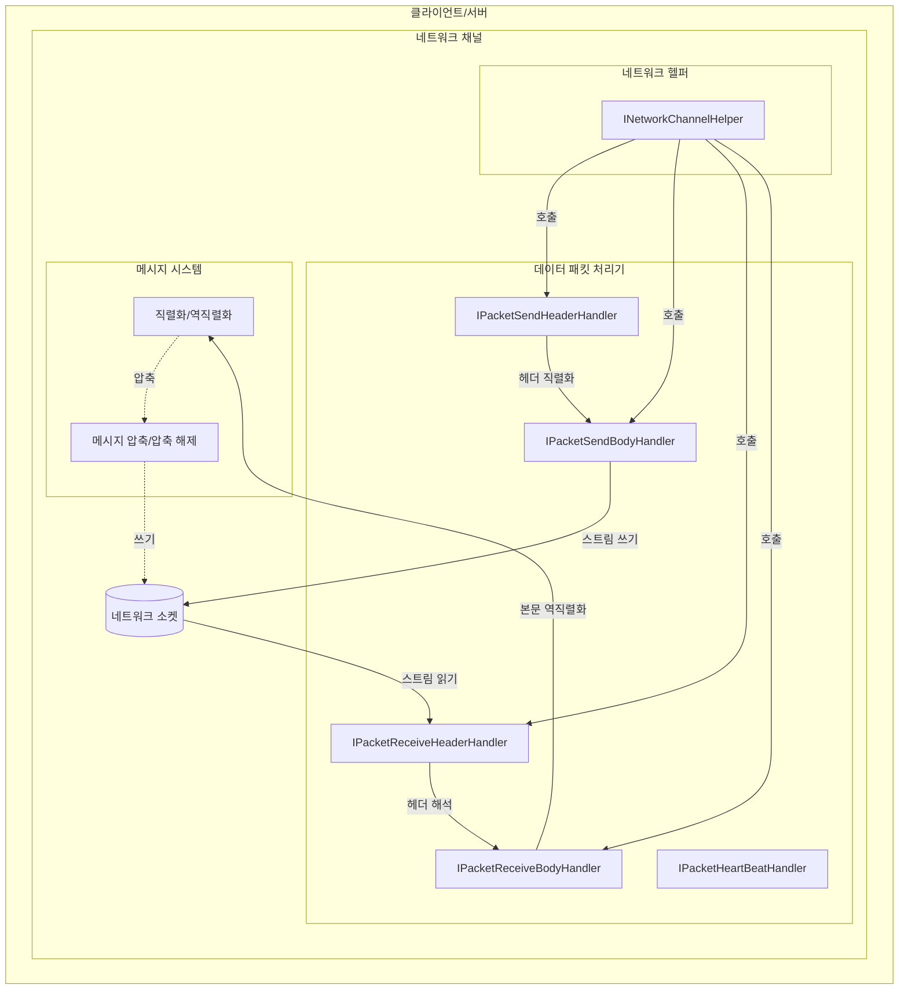
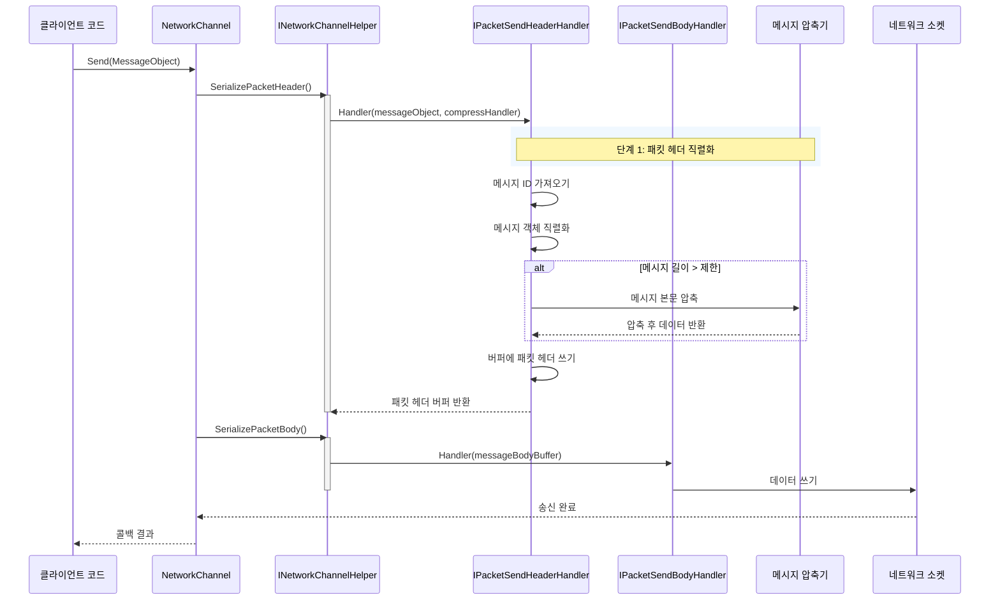
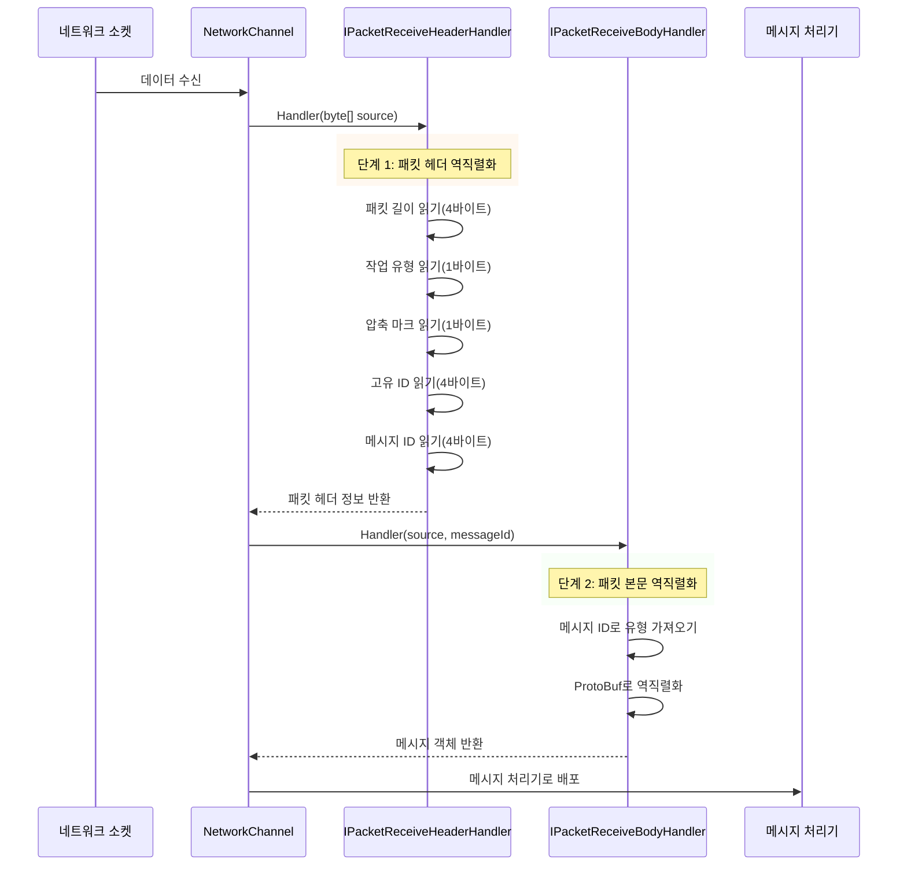

# 데이터 패킷 처리기

데이터 패킷 처리기는 GameFrameX 네트워크 라이브러리의 핵심 컴포넌트로, 네트워크 메시지의 직렬화 및 역직렬화 작업을 담당합니다. 애플리케이션 계층의 메시지 객체를 네트워크 바이트 스트림으로 변환(송신 시)하고, 수신된 바이트 스트림을 메시지 객체로 변환(수신 시)합니다.

## 개요

네트워크 통신에서 데이터는 특정 형식으로 처리되어야 네트워크를 통해 전송할 수 있습니다. 데이터 패킷 처리기는 바로 이 역할을 담당하는 핵심 컴포넌트로, 네트워크 메시지의 구조와 해석 방식을 정의하여 개발자가 비즈니스 로직에 집중할 수 있도록 합니다.

GameFrameX 네트워크 라이브러리는 다섯 가지 유형의 데이터 패킷 처리기를 제공합니다:
- **송신 패킷 헤더 처리기**: 메시지 헤더 정보 직렬화 담당
- **송신 패킷 본문 처리기**: 메시지 본문 내용 직렬화 담당
- **수신 패킷 헤더 처리기**: 메시지 헤더 정보 역직렬화 담당
- **수신 패킷 본문 처리기**: 메시지 본문 내용 역직렬화 담당
- **하트비트 패킷 처리기**: 하트비트 감지 관련 로직 처리 담당

## 아키텍처



위 그림은 데이터 패킷 처리기가 네트워크 통신에서 핵심 위치를 차지하는 것을 보여줍니다. 它们通过网络辅助器（INetworkChannelHelper）被调用，完成消息的序列化和反序列化工作.

## 메시지 송신 프로세스

클라이언트가 메시지를 송신해야 할 때, 데이터 패킷 처리기는 특정 순서에 따라 메시지 객체를 처리합니다:



송신 프로세스는 두 가지 주요 단계로 나뉩니다:
1. **패킷 헤더 직렬화**: 송신 패킷 헤더 처리기가 먼저 호출되어 메시지 유형 정보(메시지 ID)를 가져오고, 메시지 객체를 바이트 배열로 직렬화한 후, 구성에 따라 압축 여부를 결정하고, 마지막으로 패킷 정보(패킷 길이, 작업 유형, 압축 마크, 고유 ID, 메시지 ID)를 패킷 헤더에 씁니다.
2. **패킷 본문 직렬화**: 송신 패킷 본문 처리기가 처리된 패킷 본문 데이터를 대상 스트림에 씁니다.

## 메시지 수신 프로세스

네트워크에서 데이터를 수신할 때, 데이터 패킷 처리기는 바이트 스트림을 역순으로 처리하여 메시지 객체로 변환합니다:



수신 프로세스도 두 가지 단계로 나뉩니다:
1. **패킷 헤더 역직렬화**: 수신 패킷 헤더 처리기가 바이트 스트림에서 패킷 길이, 작업 유형, 압축 마크, 고유 ID 및 메시지 ID 등의 정보를 해석합니다.
2. **패킷 본문 역직렬화**: 수신 패킷 본문 처리기가 메시지 ID에 따라 대응하는 메시지 유형을 찾고, ProtoBuf를 사용하여 메시지 객체로 역직렬화합니다.

## 인터페이스 정의

### IPacketHandler

마커 인터페이스로, 모든 데이터 패킷 처리기가 이 인터페이스를 구현해야 합니다:

```csharp
namespace GameFrameX.Network.Runtime
{
    public interface IPacketHandler
    {
    }
}
```
> Source: [IPacketHandler.cs](https://github.com/GameFrameX/com.gameframex.unity.network/blob/main/Runtime/Network/Interface/IPacketHandler.cs#L3-L5)

### IPacketSendHeaderHandler

송신 패킷 헤더 처리기 인터페이스로, 메시지 헤더 직렬화를 담당합니다:

```csharp
public interface IPacketSendHeaderHandler
{
    /// 메시지 패킷 헤더 길이
    ushort PacketHeaderLength { get; }

    /// 네트워크 메시지 패킷 프로토콜 번호 가져오기
    int Id { get; }

    /// 네트워크 메시지 패킷 길이 가져오기
    uint PacketLength { get; }

    /// 메시지 내용 압축 여부
    bool IsZip { get; }

    /// 메시지 길이가 이 값을 초과할 때 압축 활성화. 이 값은 압축기를 설정할 때만 적용됩니다
    uint LimitCompressLength { get; }

    /// 메시지 처리
    bool Handler<T>(T messageObject, IMessageCompressHandler messageCompressHandler, 
        MemoryStream destination, out byte[] messageBodyBuffer) where T : MessageObject;
}
```
> Source: [IPacketSendHeaderHandler.cs](https://github.com/GameFrameX/com.gameframex.unity.network/blob/main/Runtime/Network/Interface/IPacketSendHeaderHandler.cs#L8-L45)

### IPacketSendBodyHandler

송신 패킷 본문 처리기 인터페이스로, 메시지 본문을 대상 스트림에 씁니다:

```csharp
public interface IPacketSendBodyHandler
{
    /// 메시지 본문 처리
    bool Handler(byte[] messageBodyBuffer, MemoryStream destination);
}
```
> Source: [IPacketSendBodyHandler.cs](https://github.com/GameFrameX/com.gameframex.unity.network/blob/main/Runtime/Network/Interface/IPacketSendBodyHandler.cs#L39-L48)

### IPacketReceiveHeaderHandler

수신 패킷 헤더 처리기 인터페이스로, 메시지 헤더 역직렬화를 담당합니다:

```csharp
public interface IPacketReceiveHeaderHandler
{
    /// 네트워크 메시지 패킷 길이 가져오기
    uint PacketLength { get; }

    /// 메시지 패킷 헤더 길이
    ushort PacketHeaderLength { get; }

    /// 네트워크 메시지 패킷 프로토콜 번호 가져오기
    int Id { get; }

    /// 메시지 고유 번호
    int UniqueId { get; }

    /// 메시지 작업 유형
    byte OperationType { get; }

    /// 압축 마크
    byte ZipFlag { get; }

    /// 메시지 패킷 처리
    bool Handler(object source);
}
```
> Source: [IPacketReceiveHeaderHandler.cs](https://github.com/GameFrameX/com.gameframex.unity.network/blob/main/Runtime/Network/Interface/IPacketReceiveHeaderHandler.cs#L37-L75)

### IPacketReceiveBodyHandler

수신 패킷 본문 처리기 인터페이스로, 메시지 본문 역직렬화를 담당합니다:

```csharp
public interface IPacketReceiveBodyHandler
{
    /// 네트워크 메시지 패킷 처리 함수
    bool Handler<T>(byte[] source, int messageId, out T messageObject) where T : MessageObject;
}
```
> Source: [IPacketReceiveBodyHandler.cs](https://github.com/GameFrameX/com.gameframex.unity.network/blob/main/Runtime/Network/Interface/IPacketReceiveBodyHandler.cs#L6-L15)

### IPacketHeartBeatHandler

하트비트 패킷 처리기 인터페이스로, 하트비트 메시지 생성과 처리를 담당합니다:

```csharp
public interface IPacketHeartBeatHandler
{
    /// 매 하트비트 간격
    float HeartBeatInterval { get; }

    /// 몇 번 하트비트 유실 시 네트워크 연결 해제
    int MissHeartBeatCountByClose { get; }

    /// 처리기
    MessageObject Handler();
}
```
> Source: [IPacketHeartBeatHandler.cs](https://github.com/GameFrameX/com.gameframex.unity.network/blob/main/Runtime/Network/Interface/IPacketHeartBeatHandler.cs#L6-L23)

## 기본 구현

### DefaultPacketSendHeaderHandler

기본 송신 패킷 헤더 처리기로, 완전한 패킷 헤더 직렬화 로직을 구현합니다:

```csharp
public class DefaultPacketSendHeaderHandler : IPacketSendHeaderHandler, IPacketHandler
{
    private const int NetPacketLength = sizeof(uint);
    private const int NetCmdIdLength = sizeof(int);
    private const int NetOperationTypeLength = sizeof(byte);
    private const int NetZipFlagLength = sizeof(byte);
    private const int NetUniqueIdLength = sizeof(int);

    public ushort PacketHeaderLength { get; }
    public int Id { get; private set; }
    public uint PacketLength { get; private set; }
    public bool IsZip { get; private set; }
    public virtual uint LimitCompressLength { get; } = 512;

    private int m_Offset;
    private readonly byte[] m_CachedByte;

    public DefaultPacketSendHeaderHandler()
    {
        PacketHeaderLength = NetPacketLength + NetOperationTypeLength + 
            NetZipFlagLength + NetUniqueIdLength + NetCmdIdLength;
        m_CachedByte = new byte[PacketHeaderLength];
    }

    public bool Handler<T>(T messageObject, IMessageCompressHandler messageCompressHandler, 
        MemoryStream destination, out byte[] messageBodyBuffer) where T : MessageObject
    {
        m_Offset = 0;
        var messageType = messageObject.GetType();
        Id = ProtoMessageIdHandler.GetReqMessageIdByType(messageType);
        messageBodyBuffer = SerializerHelper.Serialize(messageObject);
        
        // 길이에 따라 압축 여부 결정
        if (messageCompressHandler != null && messageBodyBuffer.Length > LimitCompressLength)
        {
            IsZip = true;
            messageBodyBuffer = messageCompressHandler.Handler(messageBodyBuffer);
        }
        else
        {
            IsZip = false;
        }

        var messageLength = messageBodyBuffer.Length;
        PacketLength = (uint)(PacketHeaderLength + messageLength);
        
        // 패킷 헤더 데이터 쓰기
        m_CachedByte.WriteUInt(PacketLength, ref m_Offset);
        m_CachedByte.WriteByte((byte)(ProtoMessageIdHandler.IsHeartbeat(messageType) ? 1 : 4), ref m_Offset);
        m_CachedByte.WriteByte((byte)(IsZip ? 1 : 0), ref m_Offset);
        m_CachedByte.WriteInt(messageObject.UniqueId, ref m_Offset);
        m_CachedByte.WriteInt(Id, ref m_Offset);
        destination.Write(m_CachedByte, 0, PacketHeaderLength);
        return true;
    }
}
```
> Source: [DefaultPacketSendHeaderHandler.cs](https://github.com/GameFrameX/com.gameframex.unity.network/blob/main/Runtime/Network/Helper/DefaultPacketSendHeaderHandler.cs#L11-L114)

### DefaultPacketReceiveHeaderHandler

기본 수신 패킷 헤더 처리기로, 완전한 패킷 헤더 해석 로직을 구현합니다:

```csharp
public sealed class DefaultPacketReceiveHeaderHandler : IPacketReceiveHeaderHandler, IPacketHandler
{
    public uint PacketLength { get; private set; }
    public int Id { get; private set; }
    public int UniqueId { get; private set; }
    public byte OperationType { get; private set; }
    public byte ZipFlag { get; private set; }
    public ushort PacketHeaderLength { get; } = 14; // 4+1+1+4+4

    public bool Handler(object source)
    {
        byte[] reader = source as byte[];
        if (reader == null)
        {
            return false;
        }

        int offset = 0;
        PacketLength = reader.ReadUInt(ref offset);
        OperationType = reader.ReadByte(ref offset);
        ZipFlag = reader.ReadByte(ref offset);
        UniqueId = reader.ReadInt(ref offset);
        Id = reader.ReadInt(ref offset);
        return true;
    }
}
```
> Source: [DefaultPacketReceiveHeaderHandler.cs](https://github.com/GameFrameX/com.gameframex.unity.network/blob/main/Runtime/Network/Helper/DefaultPacketReceiveHeaderHandler.cs#L9-L64)

### DefaultPacketSendBodyHandler

기본 송신 패킷 본문 처리기로, 메시지 본문을 대상 스트림에 씁니다:

```csharp
public sealed class DefaultPacketSendBodyHandler : IPacketSendBodyHandler, IPacketHandler
{
    public bool Handler(byte[] messageBodyBuffer, MemoryStream destination)
    {
        destination.Write(messageBodyBuffer, 0, messageBodyBuffer.Length);
        return true;
    }
}
```
> Source: [DefaultPacketSendBodyHandler.cs](https://github.com/GameFrameX/com.gameframex.unity.network/blob/main/Runtime/Network/Helper/DefaultPacketSendBodyHandler.cs#L9-L16)

### DefaultPacketReceiveBodyHandler

기본 수신 패킷 본문 처리기로, ProtoBuf를 사용하여 메시지를 역직렬화합니다:

```csharp
public sealed class DefaultPacketReceiveBodyHandler : IPacketReceiveBodyHandler, IPacketHandler
{
    public bool Handler<T>(byte[] source, int messageId, out T messageObject) where T : MessageObject
    {
        var messageType = ProtoMessageIdHandler.GetRespTypeById(messageId);
        messageObject = (T)SerializerHelper.Deserialize(source, messageType);
        return true;
    }
}
```
> Source: [DefaultPacketReceiveBodyHandler.cs](https://github.com/GameFrameX/com.gameframex.unity.network/blob/main/Runtime/Network/Helper/DefaultPacketReceiveBodyHandler.cs#L9-L17)

### BasePacketHeartBeatHandler

기본 하트비트 패킷 처리기 베이스 클래스:

```csharp
public class BasePacketHeartBeatHandler : IPacketHeartBeatHandler, IPacketHandler
{
    public virtual float HeartBeatInterval
    {
        get { return 5; }
    }

    public virtual int MissHeartBeatCountByClose { get; } = 5;

    public virtual MessageObject Handler()
    {
        throw new System.NotImplementedException();
    }
}
```
> Source: [DefaultPacketHeartBeatHandler.cs](https://github.com/GameFrameX/com.gameframex.unity.network/blob/main/Runtime/Network/Helper/DefaultPacketHeartBeatHandler.cs#L7-L26)

## 사용자 정의 데이터 패킷 처리기

기본 처리기로 요구 사항을 충족할 수 없는 경우, 개발자는 사용자 정의 데이터 패킷 처리기를 생성할 수 있습니다. 사용자 정의 처리기는 해당 인터페이스를 구현하고 `IPacketHandler` 마커 인터페이스를 상속해야 합니다.

### 사용자 정의 수신 패킷 헤더 처리기 생성

```csharp
using UnityEngine;
using GameFrameX.Network.Runtime;
using GameFrameX.Runtime;

[UnityEngine.Scripting.Preserve]
public sealed class CustomPacketReceiveHeaderHandler : IPacketReceiveHeaderHandler, IPacketHandler
{
    public uint PacketLength { get; private set; }
    public ushort PacketHeaderLength { get; } = 14;
    public int Id { get; private set; }
    public int UniqueId { get; private set; }
    public byte OperationType { get; private set; }
    public byte ZipFlag { get; private set; }

    public bool Handler(object source)
    {
        // 사용자 정의 해석 로직
        byte[] reader = source as byte[];
        if (reader == null || reader.Length < PacketHeaderLength)
        {
            return false;
        }

        // 사용자 정의 해석 구현...
        return true;
    }
}
```

### 사용자 정의 하트비트 패킷 처리기 생성

```csharp
using UnityEngine;
using GameFrameX.Network.Runtime;

[UnityEngine.Scripting.Preserve]
public sealed class CustomHeartBeatHandler : BasePacketHeartBeatHandler
{
    // 하트비트 간격을 10초로 설정
    public override float HeartBeatInterval => 10;

    // 5번 하트비트 유실 시 연결 해제 설정
    public override int MissHeartBeatCountByClose => 5;

    public override MessageObject Handler()
    {
        // 사용자 정의 하트비트 메시지 객체 반환
        return new C2SHeartBeat();
    }
}
```

## 구성 옵션

데이터 패킷 처리기의 동작은 다음 방식을 통해 구성할 수 있습니다:

| 구성 항목 | 유형 | 기본값 | 설명 |
|--------|------|--------|------|
| LimitCompressLength | uint | 512 | 이 길이를 초과할 때 메시지 압축 활성화 |
| HeartBeatInterval | float | 5.0 | 하트비트 패킷 송신 간격(초) |
| MissHeartBeatCountByClose | int | 5 | 유실 허용 하트비트 횟수, 초과 시 연결 해제 |

## 관련 링크

- [네트워크 관리자](./4-core-concepts.1-network-manager)
- [네트워크 채널](./4-core-concepts.2-network-channel)
- [메시지 유형](./4-core-concepts.3-message-types)
- [하트비트 메커니즘](./5-heartbeat)
- [메시지 압축](./7-message-compression)