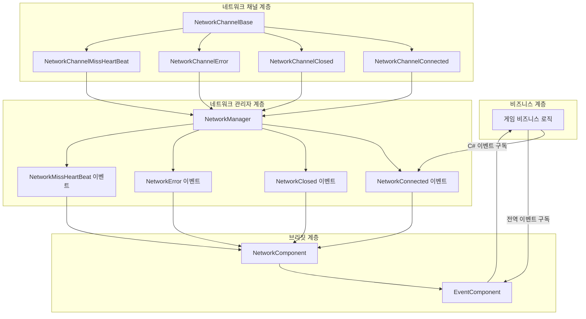
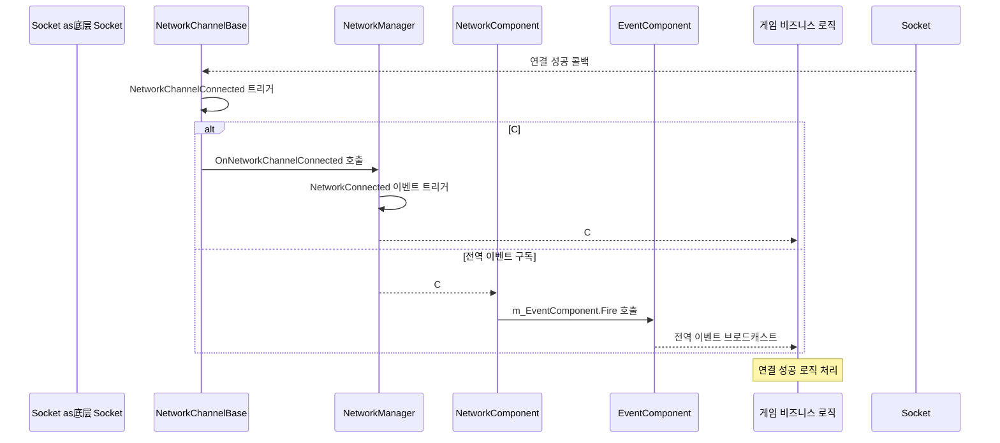

# 이벤트 시스템

GameFrameX Unity Network 모듈은 네트워크 연결 상태 변화, 오류 발생 및 하트비트 유실 등의 핵심 네트워크 이벤트를 알리기 위한 완전한 이벤트 시스템을 제공합니다. 이 이벤트 시스템은 이중 아키텍처를 채택하여 C#原生 이벤트와 GameFrameX 전역 이벤트 시스템을 모두 지원합니다.

## 개요

네트워크 이벤트 시스템은 GameFrameX Unity Network 모듈의 핵심 컴포넌트 중 하나로, 네트워크 로직과 비즈니스 로직을 분리합니다. 이벤트 시스템 설계는 다음 원칙을 따릅니다:

- **분리 설계**: 네트워크底层는 이벤트를 통해上层에 상태 변화를 알리고, 비즈니스 계층은 이벤트 구독을 통해 네트워크 상태를 처리합니다
- **이중 지원**: C#原生 이벤트 위임과 GameFrameX 전역 이벤트 시스템을 동시에 지원합니다
- **객체 재사용**: 객체 풀 기술을 사용하여 이벤트 매개변수를 관리하고, 메모리 할당 오버헤드를 줄입니다

이벤트 시스템은 게임 개발에서 특히 중요하며, 네트워크 핵심 코드를 수정하지 않고도 게임에 연결 해제 후 재연결, 연결 끊김 알림, 하트비트 예외 처리 등의 기능을 추가할 수 있습니다.

## 아키텍처

GameFrameX Unity Network의 이벤트 시스템은 이중 아키텍처 설계를 채택하며, 이러한 설계는 사용성과 유연성을 동시에兼顾합니다.



### 아키텍처 설명

**네트워크 채널 계층（NetworkChannelBase）** 은 네트워크 이벤트의 출발점입니다.底层 Socket 연결 성공, 연결 끊김, 오류 발생 또는 하트비트 유실 시, NetworkChannelBase는 대응하는 Action 위임을 트리거합니다.

**네트워크 관리자 계층（NetworkManager）** 은 NetworkChannelBase의 내부 이벤트를 구독한 후, 이를 공개 C# 이벤트(event)로 변환합니다. 이 계층은 개발자가 직접 상호작용하는 주요 인터페이스입니다.

**브리짓 계층（NetworkComponent）** 은 C# 이벤트 시스템과 GameFrameX 전역 이벤트 시스템 사이의 브리짓 역할을 합니다. C# 이벤트의 직접 구독 방식과 EventComponent를 통한 전역 이벤트 구독 능력을 모두 제공합니다.

## 이벤트 유형

GameFrameX Unity Network 모듈은 네 가지 핵심 네트워크 이벤트를 정의하며, 각 이벤트에는 대응하는 EventArgs 클래스가 있어 이벤트 관련 데이터를 전달합니다.

### NetworkConnectedEventArgs - 연결 성공 이벤트

네트워크 연결이 성공적으로 수립되면 이 이벤트가 트리거됩니다. 이 이벤트는 가장 많이 사용되는 네트워크 이벤트 중 하나로, 게임 로그인, 서버 시간 가져오기 등 후속 작업 트리거에 일반적으로 사용됩니다.

```csharp
using GameFrameX.Network.Runtime;

// 이벤트 매개변수 속성 설명
public sealed class NetworkConnectedEventArgs : GameEventArgs
{
    // 이벤트 고유 식별자
    public static readonly string EventId = typeof(NetworkConnectedEventArgs).FullName;

    // 네트워크 연결 성공 이벤트 번호 가져오기
    public override string Id => EventId;

    // 네트워크 채널 가져오기 - 이 이벤트를 트리거한 채널 객체
    public INetworkChannel NetworkChannel { get; private set; }

    // 사용자 정의 데이터 가져오기 - Connect 메서드에 전달된 userData 매개변수
    public object UserData { get; private set; }
}
```

> Source: [NetworkConnectedEventArgs.cs](https://github.com/GameFrameX/com.gameframex.unity.network/blob/main/Runtime/EventArgs/NetworkConnectedEventArgs.cs#L41-L97)

### NetworkClosedEventArgs - 연결 닫기 이벤트

네트워크 연결이 닫히면 이 이벤트가 트리거됩니다. 이 이벤트는 닫기 이유와 오류 코드를 전달하여, 정상 닫기인지 비정상 연결 끊김인지 판단하는 데 사용됩니다.

```csharp
public sealed class NetworkClosedEventArgs : GameEventArgs
{
    // 이벤트 고유 식별자
    public static readonly string EventId = typeof(NetworkClosedEventArgs).FullName;

    // 네트워크 채널 가져오기
    public INetworkChannel NetworkChannel { get; private set; }

    // 닫기 이유 가져오기
    // 가능한 값: Normal, Timeout, Dispose, ConnectClose, ConnectAddressError, ConnectAddressExceptionError, MissHeartBeat
    public string Reason { get; private set; }

    // 오류 코드 가져오기
    public ushort ErrorCode { get; private set; }
}
```

> Source: [NetworkClosedEventArgs.cs](https://github.com/GameFrameX/com.gameframex.unity.network/blob/main/Runtime/EventArgs/NetworkClosedEventArgs.cs#L41-L103)

### NetworkErrorEventArgs - 네트워크 오류 이벤트

네트워크 오류가 발생하면 이 이벤트가 트리거됩니다. 이 이벤트는 애플리케이션 계층 오류 코드와底层 Socket 오류 코드를 포함하여 다양한 오류 정보를 제공합니다.

```csharp
public sealed class NetworkErrorEventArgs : GameEventArgs
{
    // 이벤트 고유 식별자
    public static readonly string EventId = typeof(NetworkErrorEventArgs).FullName;

    // 네트워크 채널 가져오기
    public INetworkChannel NetworkChannel { get; private set; }

    // 애플리케이션 계층 오류 코드 가져오기
    // 열거형 값: Unknown, AddressFamilyError, SocketError, ConnectError, SendError, ReceiveError, SerializeError, DeserializePacketHeaderError, DeserializePacketError, MissHeartBeatError, DisposeError
    public NetworkErrorCode ErrorCode { get; private set; }

    //底层 Socket 오류 코드 가져오기
    public SocketError SocketErrorCode { get; private set; }

    // 오류 정보 가져오기
    public string ErrorMessage { get; private set; }
}
```

> Source: [NetworkErrorEventArgs.cs](https://github.com/GameFrameX/com.gameframex.unity.network/blob/main/Runtime/EventArgs/NetworkErrorEventArgs.cs#L42-L116)

### NetworkMissHeartBeatEventArgs - 하트비트 유실 이벤트

하트비트 패킷이 일정 횟수 유실되면 이 이벤트가 트리거됩니다. 이 이벤트는 더 세밀한 연결 해제 후 재연결 로직 구현에 사용할 수 있습니다. 예를 들어, 3번 하트비트 유실 시 사용자에게 네트워크가 불안정하다는 알림을 표시할 수 있습니다.

```csharp
public sealed class NetworkMissHeartBeatEventArgs : GameEventArgs
{
    // 이벤트 고유 식별자
    public static readonly string EventId = typeof(NetworkMissHeartBeatEventArgs).FullName;

    // 네트워크 채널 가져오기
    public INetworkChannel NetworkChannel { get; private set; }

    // 하트비트 패킷 유실 횟수 가져오기
    // 유실 횟수가 MissHeartBeatCountByClose(기본값 10)를 초과하면 연결이 자동으로 닫힙니다
    public int MissCount { get; private set; }
}
```

> Source: [NetworkMissHeartBeatEventArgs.cs](https://github.com/GameFrameX/com.gameframex.unity.network/blob/main/Runtime/EventArgs/NetworkMissHeartBeatEventArgs.cs#L41-L97)

## 이벤트 프로세스

네트워크 이벤트의 완전한 프로세스는 여러 컴포넌트의 협력을 포함합니다. 이 프로세스를 이해하면 이벤트 시스템을 사용하여 안정적인 네트워크 기능을 구축하는 데 도움이 됩니다.



### 이벤트 트리거 시점

| 이벤트 유형 | 트리거 시점 | 후속 동작 |
|---------|---------|---------|
| NetworkConnected | TCP 연결 성공 수립 후 | 로그인 요청 전송 또는 서버 시간 가져오기 가능 |
| NetworkClosed | 연결 끊김 시(정상/비정상) | 리소스 정리, 재연결 로직 트리거 |
| NetworkError | 네트워크 오류 발생 시 | 로그 기록, 연결 끊김 트리거 가능 |
| NetworkMissHeartBeat | 하트비트 패킷 유실 시 | UI 알림 업데이트, 연결 끊김 트리거 가능 |

## 사용 예시

### 방식 1: C#原生 이벤트 사용

C#原生 이벤트는 가장 직접적인 이벤트 구독 방식으로, 간단한 네트워크 이벤트 처리 시나리오에 적합합니다.

```csharp
using GameFrameX.Network.Runtime;
using UnityEngine;

public class NetworkExample : MonoBehaviour
{
    private INetworkManager networkManager;
    private INetworkChannel channel;

    private void Start()
    {
        // 네트워크 관리자 가져오기
        networkManager = GameFrameworkEntry.GetModule<INetworkManager>();
        
        // 네트워크 이벤트 구독
        networkManager.NetworkConnected += OnNetworkConnected;
        networkManager.NetworkClosed += OnNetworkClosed;
        networkManager.NetworkError += OnNetworkError;
        networkManager.NetworkMissHeartBeat += OnNetworkMissHeartBeat;
        
        // 네트워크 채널 생성
        var helper = new DefaultNetworkChannelHelper();
        channel = networkManager.CreateNetworkChannel("GameServer", helper, 5000);
        
        // 서버에 연결
        channel.Connect(new Uri("tcp://127.0.0.1:8888"));
    }

    private void OnNetworkConnected(object sender, NetworkConnectedEventArgs e)
    {
        Debug.Log($"연결 성공! 채널: {e.NetworkChannel.Name}, 사용자 데이터: {e.UserData}");
    }

    private void OnNetworkClosed(object sender, NetworkClosedEventArgs e)
    {
        Debug.Log($"연결 닫기! 이유: {e.Reason}, 오류 코드: {e.ErrorCode}");
    }

    private void OnNetworkError(object sender, NetworkErrorEventArgs e)
    {
        Debug.LogError($"네트워크 오류! 오류 코드: {e.ErrorCode}, Socket 오류: {e.SocketErrorCode}, 메시지: {e.ErrorMessage}");
    }

    private void OnNetworkMissHeartBeat(object sender, NetworkMissHeartBeatEventArgs e)
    {
        Debug.LogWarning($"하트비트 유실! 횟수: {e.MissCount}");
    }

    private void OnDestroy()
    {
        // 이벤트 구독 취소
        if (networkManager != null)
        {
            networkManager.NetworkConnected -= OnNetworkConnected;
            networkManager.NetworkClosed -= OnNetworkClosed;
            networkManager.NetworkError -= OnNetworkError;
            networkManager.NetworkMissHeartBeat -= OnNetworkMissHeartBeat;
        }
    }
}
```

> Source: [NetworkManager.cs](https://github.com/GameFrameX/com.gameframex.unity.network/blob/main/Runtime/Network/Network/NetworkManager.cs#L261-L311)

### 방식 2: NetworkComponent를 통한 전역 이벤트 구독

NetworkComponent는 GameFrameX EventComponent와의 통합을 제공하며, 전역 이벤트 구독을 통해 네트워크 상태 변화를 처리할 수 있습니다. 이러한 방식은 크로스 모듈 통신이 필요한 시나리오에 더 적합합니다.

```csharp
using GameFrameX.Event.Runtime;
using GameFrameX.Network.Runtime;
using UnityEngine;

public class GlobalEventExample : MonoBehaviour
{
    private EventComponent eventComponent;

    private void Start()
    {
        // 이벤트 컴포넌트 가져오기
        eventComponent = GameEntry.GetComponent<EventComponent>();
        
        // 전역 이벤트 구독
        eventComponent.Subscribe(NetworkConnectedEventArgs.EventId, OnNetworkConnected);
        eventComponent.Subscribe(NetworkClosedEventArgs.EventId, OnNetworkClosed);
        eventComponent.Subscribe(NetworkErrorEventArgs.EventId, OnNetworkError);
        eventComponent.Subscribe(NetworkMissHeartBeatEventArgs.EventId, OnNetworkMissHeartBeat);
    }

    private void OnNetworkConnected(object sender, GameEventArgs e)
    {
        var args = e as NetworkConnectedEventArgs;
        Debug.Log($"전역 이벤트 - 연결 성공! 채널: {args.NetworkChannel.Name}");
    }

    private void OnNetworkClosed(object sender, GameEventArgs e)
    {
        var args = e as NetworkClosedEventArgs;
        Debug.Log($"전역 이벤트 - 연결 닫기! 이유: {args.Reason}");
    }

    private void OnNetworkError(object sender, GameEventArgs e)
    {
        var args = e as NetworkErrorEventArgs;
        Debug.LogError($"전역 이벤트 - 네트워크 오류: {args.ErrorMessage}");
    }

    private void OnNetworkMissHeartBeat(object sender, GameEventArgs e)
    {
        var args = e as NetworkMissHeartBeatEventArgs;
        Debug.LogWarning($"전역 이벤트 - 하트비트 유실 횟수: {args.MissCount}");
    }

    private void OnDestroy()
    {
        // 전역 이벤트 구독 취소
        if (eventComponent != null)
        {
            eventComponent.Unsubscribe(NetworkConnectedEventArgs.EventId, OnNetworkConnected);
            eventComponent.Unsubscribe(NetworkClosedEventArgs.EventId, OnNetworkClosed);
            eventComponent.Unsubscribe(NetworkErrorEventArgs.EventId, OnNetworkError);
            eventComponent.Unsubscribe(NetworkMissHeartBeatEventArgs.EventId, OnNetworkMissHeartBeat);
        }
    }
}
```

> Source: [NetworkComponent.cs](https://github.com/GameFrameX/com.gameframex.unity.network/blob/main/Runtime/Network/NetworkComponent.cs#L196-L214)

### 방식 3: NetworkComponent 이벤트 속성 사용

NetworkComponent는 NetworkManager와 동일한 이벤트 속성을 직접 노출하여, Unity 편집기에서 Inspector를 통하거나 스크립트를 통해 직접 구독할 수 있습니다.

```csharp
public class DirectSubscribeExample : MonoBehaviour
{
    private NetworkComponent networkComponent;

    private void Start()
    {
        // NetworkComponent에서 직접 이벤트 구독
        networkComponent = GetComponent<NetworkComponent>();
        networkComponent.NetworkConnected += OnConnected;
        networkComponent.NetworkClosed += OnClosed;
    }

    private void OnConnected(object sender, NetworkConnectedEventArgs e)
    {
        Debug.Log("연결 성공");
    }

    private void OnClosed(object sender, NetworkClosedEventArgs e)
    {
        Debug.Log($"연결 닫기: {e.Reason}");
    }
}
```

> Source: [NetworkComponent.cs](https://github.com/GameFrameX/com.gameframex.unity.network/blob/main/Runtime/Network/NetworkComponent.cs#L109-L112)

## 오류 코드 참조

### NetworkCloseReason - 닫기 이유

| 상수 | 설명 |
|-----|------|
| Normal | 정상 닫기 |
| Timeout | 타임아웃 닫기 |
| Dispose | 리소스 해제 닫기 |
| ConnectClose | 연결 닫기 |
| ConnectAddressError | 연결 주소 오류 닫기 |
| ConnectAddressExceptionError | 연결 주소 예외 오류 닫기 |
| MissHeartBeat | 하트비트 유실 닫기 |

> Source: [NetworkErrorCode.cs](https://github.com/GameFrameX/com.gameframex.unity.network/blob/main/Runtime/Network/Base/NetworkErrorCode.cs#L34-L74)

### NetworkErrorCode - 오류 코드

| 값 | 설명 |
|---|------|
| Unknown | 알 수 없는 오류 |
| AddressFamilyError | 주소族 오류 |
| SocketError | Socket 오류 |
| ConnectError | 연결 오류 |
| SendError | 송신 오류 |
| ReceiveError | 수신 오류 |
| SerializeError | 직렬화 오류 |
| DeserializePacketHeaderError | 패킷 헤더 역직렬화 오류 |
| DeserializePacketError | 패킷 역직렬화 오류 |
| MissHeartBeatError | 하트비트 유실 오류 |
| DisposeError | 리소스 해제 오류 |

> Source: [NetworkErrorCode.cs](https://github.com/GameFrameX/com.gameframex.unity.network/blob/main/Runtime/Network/Base/NetworkErrorCode.cs#L76-L137)

## 모범 사례

### 이벤트 구독 제안

1. **적절한 위치에서 구독**: 게임 시작 또는 네트워크 모듈 초기화 시 이벤트를 구독하고, 게임 종료 또는 장면 전환 시 구독을 취소합니다
2. **弱 참조 사용**: 일부 시나리오에서는 Weak Reference 패턴을 사용하여 메모리 누수를 방지할 수 있습니다
3. **예외 처리**: 이벤트 처리 콜백에 적절한 예외 처리를 추가하여 단일 이벤트 처리 오류가 전체 시스템에 영향을 미치지 않도록 합니다
4. **시간 소모 작업 피하기**: 이벤트 콜백에서 시간 소모 작업을 피하고, 복잡한 로직 처리가 필요한 경우 메시지 큐를 사용하여 비동기 처리합니다

### 연결 해제 후 재연결 예시

이벤트 시스템을 사용하여 연결 해제 후 재연결을 구현하는 예시입니다:

```csharp
public class ReconnectExample : MonoBehaviour
{
    private INetworkManager networkManager;
    private int reconnectAttempts = 0;
    private const int MaxReconnectAttempts = 3;
    private string serverAddress = "tcp://127.0.0.1:8888";

    private void Start()
    {
        networkManager = GameFrameworkEntry.GetModule<INetworkManager>();
        networkManager.NetworkClosed += OnNetworkClosed;
        networkManager.NetworkConnected += OnNetworkConnected;
        
        Connect();
    }

    private void Connect()
    {
        var helper = new DefaultNetworkChannelHelper();
        var channel = networkManager.CreateNetworkChannel("GameServer", helper, 5000);
        channel.Connect(new Uri(serverAddress));
    }

    private void OnNetworkConnected(object sender, NetworkConnectedEventArgs e)
    {
        reconnectAttempts = 0;
        Debug.Log("연결 성공, 게임 시작");
    }

    private void OnNetworkClosed(object sender, NetworkClosedEventArgs e)
    {
        // 재연결 필요 여부 확인
        if (e.Reason != NetworkCloseReason.Normal && reconnectAttempts < MaxReconnectAttempts)
        {
            reconnectAttempts++;
            Debug.Log($"연결 끊김, {reconnectAttempts}초 후 재연결 시도...");
            Invoke(nameof(Connect), 3f);
        }
    }
}
```

## 관련 링크

- [네트워크 관리자](./4-core-concepts.1-network-manager) - NetworkManager의 완전한 API 알아보기
- [네트워크 채널](./4-core-concepts.2-network-channel) - 네트워크 채널의 개념과 사용 알아보기
- [하트비트 메커니즘](./5-heartbeat) - 하트비트 감지의 작동 원리 알아보기
- [RPC远程호출](./8-rpc) - RPC 호출과 이벤트의配合使用 알아보기
- [이벤트 시스템（GameFrameX Core）](https://github.com/GameFrameX/com.gameframex.unity.event) - GameFrameX 전역 이벤트 시스템 자세히 알아보기