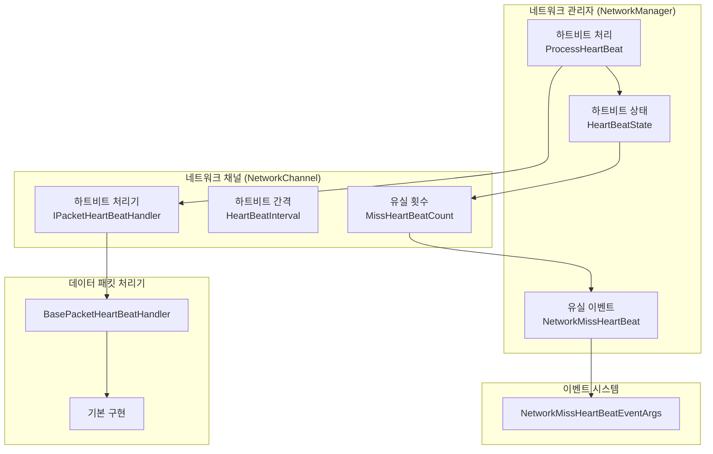
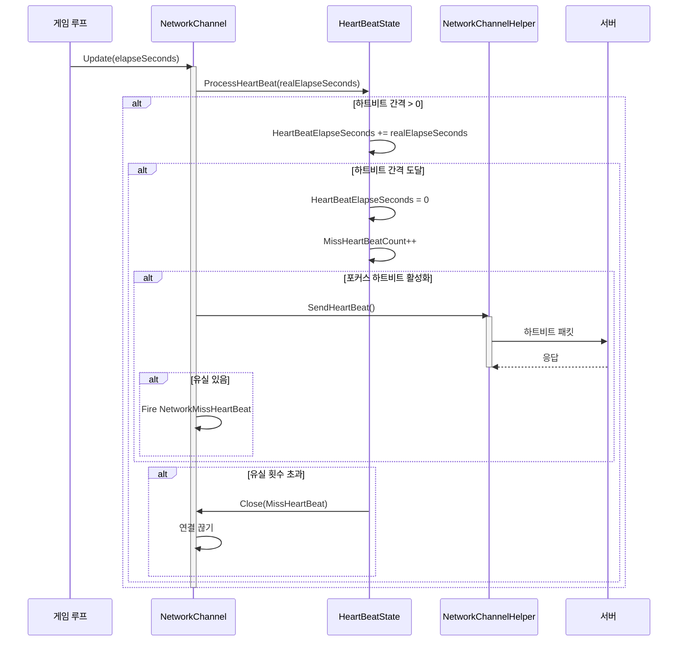

# 하트비트 메커니즘

하트비트 메커니즘은 네트워크 통신에서 연결存活 상태를 감지하는 데 사용되는 중요한 기능입니다. 정기적으로 하트비트 패킷을 송신하여 네트워크 중단이나 상대방에 도달할 수 없는 상황을 즉시 발견하고, 대응하는 처리 조치를 취할 수 있습니다.

## 개요

GameFrameX 네트워크 모듈은 완전한 하트비트 메커니즘을 제공하며, 주요 기능은 다음과 같습니다:

1. **정기 하트비트 감지**: 클라이언트가 고정 간격으로 서버에 하트비트 패킷을 송신합니다
2. **유실 감지**: 서버 측에서 하트비트 유실 횟수를 감지하여, 임계값을 초과하면 능동적으로 연결을 끊습니다
3. **애플리케이션 포커스 제어**: 애플리케이션이 포커스를 획득했는지 여부에 따라 하트비트 송신 제어를 지원합니다
4. **이벤트 알림**: 하트비트 유실 시 이벤트를 트리거하여上层 로직이 처리할 수 있도록 합니다

하트비트 메커니즘의 핵심 설계 철학은: **살아있게 유지(Keep-Alive)**. 롱컬렉션 통신에서 TCP 프로토콜의 반关闭 특성으로 인해, 연결 양쪽 모두 상대방이 이미 오프라인 상태인 것을 즉시 감지하지 못할 수 있습니다. 하트비트 메커니즘은 정기적으로 경량 메시지를 교환하여 양쪽 모두 연결 상태 이상이 있으면 즉시 발견할 수 있도록 합니다.

## 아키텍처 설계

하트비트 메커니즘은 여러 핵심 컴포넌트가 관여하며, 협동하여 연결 살려주기 기능을 완료합니다:



### 컴포넌트 책임

| 컴포넌트 | 책임 | 주요 속성/메서드 |
|------|------|--------------|
| `HeartBeatState` | 하트비트 상태 데이터 관리 | `HeartBeatElapseSeconds`, `MissHeartBeatCount`, `Reset()` |
| `IPacketHeartBeatHandler` | 하트비트 메시지 처리기 인터페이스 정의 | `HeartBeatInterval`, `MissHeartBeatCountByClose`, `Handler()` |
| `BasePacketHeartBeatHandler` | 하트비트 처리기의 기본 구현 | 기본 하트비트 간격 5초, 5번 유실 시 연결 끊기 |
| `ProcessHeartBeat()` | 핵심 하트비트 처리 로직 | 타임아웃 감지, 하트비트 송신, 연결 끊기 트리거 |
| `NetworkMissHeartBeatEventArgs` | 하트비트 유실 이벤트 매개변수 | `NetworkChannel`, `MissCount` |

## 핵심 프로세스

하트비트 메커니즘의 핵심 처리 프로세스는 다음과 같습니다:



### 처리 단계 상세 설명

1. **시간累加**: 매 프레임 업데이트 시 시간增量을 하트비트 경과 시간에累加합니다
2. **송신 판단**: 경과 시간이 하트비트 간격을 초과하면 하트비트 송신을 트리거합니다
3. **메시지 송신**: `IPacketHeartBeatHandler.Handler()`를 호출하여 하트비트 메시지를 가져오고 송신합니다
4. **유실 카운트 증가**: 하트비트 송신 후 유실 횟수를 증가시킵니다
5. **이벤트 트리거**: 유실이 존재하면 `NetworkMissHeartBeat` 이벤트를 트리거합니다
6. **연결 끊기 판단**: 유실 횟수가 임계값을 초과하면 연결을 닫습니다

## 사용 예시

### 기본 구성

네트워크 채널 생성 시 하트비트 처리기가 자동으로 등록됩니다:

```csharp
// 네트워크 채널 생성 시 기본 하트비트 처리기가 자동 사용
var networkChannel = networkManager.CreateNetworkChannel("GameServer", networkChannelHelper, 5000);

// 기본 구성:
// - 하트비트 간격: 30초
// - 유실 임계값: 10번
```
> Source: [NetworkManager.NetworkChannelBase.cs](https://github.com/GameFrameX/com.gameframex.unity.network/blob/main/Runtime/Network/Network/NetworkManager.NetworkChannelBase.cs#L52-L57)

### 사용자 정의 하트비트 처리기

`IPacketHeartBeatHandler` 인터페이스를 구현하여 하트비트 동작을 사용자 정의할 수 있습니다:

```csharp
using GameFrameX.Network.Runtime;

// 사용자 정의 하트비트 처리기
public class CustomHeartBeatHandler : BasePacketHeartBeatHandler
{
    // 사용자 정의 하트비트 간격: 10초
    public override float HeartBeatInterval => 10f;
    
    // 사용자 정의 유실 임계값: 3번
    public override int MissHeartBeatCountByClose => 3;
    
    public override MessageObject Handler()
    {
        // 사용자 정의 하트비트 메시지 객체 반환
        return new HeartBeatMessage();
    }
}

// 사용자 정의 처리기 등록
networkChannel.RegisterHeartBeatHandler(new CustomHeartBeatHandler());
```
> Source: [BasePacketHeartBeatHandler.cs](https://github.com/GameFrameX/com.gameframex.unity.network/blob/main/Runtime/Network/Helper/DefaultPacketHeartBeatHandler.cs#L7-L26)

### 하트비트 유실 이벤트 리스닝

`NetworkMissHeartBeat` 이벤트를 구독하여 하트비트 유실 상황을 처리할 수 있습니다:

```csharp
// NetworkComponent 또는 초기화 코드에서 이벤트 구독
m_NetworkManager.NetworkMissHeartBeat += OnNetworkMissHeartBeat;

private void OnNetworkMissHeartBeat(object sender, NetworkMissHeartBeatEventArgs eventArgs)
{
    var channelName = eventArgs.NetworkChannel.Name;
    var missCount = eventArgs.MissCount;
    
    Log.Warning($"하트비트 유실! 채널: {channelName}, 유실 횟수: {missCount}");
    
    // 여기서 재연결 로직 또는 기타 처리 구현 가능
    if (missCount >= 5)
    {
        // 유실 횟수过多, 연결 끊기 준비
    }
}
```
> Source: [NetworkMissHeartBeatEventArgs.cs](https://github.com/GameFrameX/com.gameframex.unity.network/blob/main/Runtime/EventArgs/NetworkMissHeartBeatEventArgs.cs#L41-L97)

### 애플리케이션 포커스 제어

`NetworkComponent`를 통해 애플리케이션이 포커스를 잃었을 때 하트비트 송신 여부를 구성할 수 있습니다:

```csharp
// NetworkComponent의 Inspector 패널에서:
// - "Focus Send Heartbeat" 체크: 애플리케이션이 포커스를 획득하면 하트비트 송신
// - 체크 해제: 애플리케이션이 포커스를 잃어도 하트비트 계속 송신(기본 동작)

// 또는 코드를 통해 동적으로 제어:
m_NetworkManager.SetFocusHeartbeat(true);  // 포커스 획득 시 송신
m_NetworkManager.SetFocusHeartbeat(false); // 포커스 잃어도 송신
```
> Source: [NetworkComponent.cs](https://github.com/GameFrameX/com.gameframex.unity.network/blob/main/Runtime/Network/NetworkComponent.cs#L65-L91)

### 메시지 수신 시 하트비트 재설정

기본적으로 모든 메시지 패킷을 수신하면 하트비트 경과 시간이 재설정됩니다. 이 동작을 비활성화해야 하는 경우:

```csharp
// 메시지 수신 시 하트비트 재설정 비활성화
networkChannel.ResetHeartBeatElapseSecondsWhenReceivePacket = false;

// 메시지 수신 시 하트비트 재설정 활성화(기본)
networkChannel.ResetHeartBeatElapseSecondsWhenReceivePacket = true;
```
> Source: [INetworkChannel.cs](https://github.com/GameFrameX/com.gameframex.unity.network/blob/main/Runtime/Network/Interface/INetworkChannel.cs#L79-L82)

## 구성 옵션

### 하트비트 관련 속성

| 속성 | 유형 | 기본값 | 설명 |
|------|------|--------|------|
| `HeartBeatInterval` | float | 30초 | 하트비트 송신 간격, 단위: 초 |
| `MissHeartBeatCount` | int | 10 | 몇 번 하트비트 유실 후 연결 끊기 |
| `ResetHeartBeatElapseSecondsWhenReceivePacket` | bool | false | 메시지 수신 시 하트비트 경과 시간 재설정 여부 |
| `PFocusHeartbeat` | bool | true | 애플리케이션이 포커스를 획득했을 때 하트비트 송신 여부 |

### IPacketHeartBeatHandler 구성

| 속성 | 유형 | 기본값 | 설명 |
|------|------|--------|------|
| `HeartBeatInterval` | float | 5초 | 하트비트 처리기의 하트비트 간격 |
| `MissHeartBeatCountByClose` | int | 5 | 하트비트 처리기가 정의한 연결 끊기 임계값 |

### 포커스 하트비트 구성

| 구성 항목 | 유형 | 기본값 | 설명 |
|--------|------|--------|------|
| `m_FocusHeartbeat` | bool | false | NetworkComponent의 직렬화 필드 |

## API 참고

### `IPacketHeartBeatHandler`

하트비트 메시지 처리기 인터페이스.

```csharp
public interface IPacketHeartBeatHandler
{
    /// <summary>
    /// 매 하트비트 간격
    /// </summary>
    float HeartBeatInterval { get; }

    /// <summary>
    /// 몇 번 하트비트 유실 시 네트워크 연결 해제
    /// </summary>
    int MissHeartBeatCountByClose { get; }

    /// <summary>
    /// 처리기, 하트비트 메시지 객체 반환
    /// </summary>
    MessageObject Handler();
}
```

> Source: [IPacketHeartBeatHandler.cs](https://github.com/GameFrameX/com.gameframex.unity.network/blob/main/Runtime/Network/Interface/IPacketHeartBeatHandler.cs#L1-L24)

### `INetworkChannel`

네트워크 채널 인터페이스의 하트비트 관련 속성 및 메서드:

```csharp
// 메시지 패킷 수신 시 하트비트 경과 시간 재설정 여부 가져오기 또는 설정
bool ResetHeartBeatElapseSecondsWhenReceivePacket { get; set; }

// 하트비트 유실 횟수 가져오기
int MissHeartBeatCount { get; }

// 하트비트 간격时长 가져오기 또는 설정, 단위: 초
float HeartBeatInterval { get; set; }

// 하트비트 대기时长 가져오기, 단위: 초
float HeartBeatElapseSeconds { get; }

// 하트비트 메시지 처리기 가져오기
IPacketHeartBeatHandler PacketHeartBeatHandler { get; }

// 네트워크 메시지 하트비트 처리 함수 등록
void RegisterHeartBeatHandler(IPacketHeartBeatHandler handler);
```

> Source: [INetworkChannel.cs](https://github.com/GameFrameX/com.gameframex.unity.network/blob/main/Runtime/Network/Interface/INetworkChannel.cs#L79-L174)

### `INetworkManager`

네트워크 관리자 인터페이스의 하트비트 관련 메서드:

```csharp
/// <summary>
/// 네트워크 하트비트 패킷 유실 이벤트
/// </summary>
event EventHandler<NetworkMissHeartBeatEventArgs> NetworkMissHeartBeat;

/// <summary>
/// 애플리케이션이 포커스를 획득했을 때 하트비트 패킷을 송신할지 설정
/// </summary>
void SetFocusHeartbeat(bool hasFocus);
```

> Source: [INetworkManager.cs](https://github.com/GameFrameX/com.gameframex.unity.network/blob/main/Runtime/Network/Interface/INetworkManager.cs#L57-L113)

### `HeartBeatState`

하트비트 상태 관리 클래스:

```csharp
public sealed class HeartBeatState
{
    /// <summary>
    /// 하트비트 간격时长
    /// </summary>
    public float HeartBeatElapseSeconds { get; set; }

    /// <summary>
    /// 하트비트 유실 횟수
    /// </summary>
    public int MissHeartBeatCount { get; set; }

    /// <summary>
    /// 하트비트 데이터 재설정=>살아있게 유지
    /// </summary>
    /// <param name="resetHeartBeatElapseSeconds">하트비트 경과时长 재설정 여부</param>
    public void Reset(bool resetHeartBeatElapseSeconds);
}
```

> Source: [NetworkManager.HeartBeatState.cs](https://github.com/GameFrameX/com.gameframex.unity.network/blob/main/Runtime/Network/Network/NetworkManager.HeartBeatState.cs#L39-L82)

### `NetworkMissHeartBeatEventArgs`

하트비트 유실 이벤트 매개변수:

```csharp
public sealed class NetworkMissHeartBeatEventArgs : GameEventArgs
{
    /// <summary>
    /// 네트워크 하트비트 패킷 유실 이벤트 번호
    /// </summary>
    public static readonly string EventId;

    /// <summary>
    /// 네트워크 채널 가져오기
    /// </summary>
    public INetworkChannel NetworkChannel { get; }

    /// <summary>
    /// 하트비트 패킷 유실 횟수 가져오기
    /// </summary>
    public int MissCount { get; }

    /// <summary>
    /// 네트워크 하트비트 패킷 유실 이벤트 생성
    /// </summary>
    public static NetworkMissHeartBeatEventArgs Create(INetworkChannel networkChannel, int missCount);
}
```

> Source: [NetworkMissHeartBeatEventArgs.cs](https://github.com/GameFrameX/com.gameframex.unity.network/blob/main/Runtime/EventArgs/NetworkMissHeartBeatEventArgs.cs#L41-L97)

## 설계 고려 사항

### 왜 하트비트 메커니즘이 필요한가?

1. **TCP 반닫기 문제**: TCP 연결的一方은 독립적으로 쓰기端을 닫고 읽기端을 열린 상태로 유지할 수 있습니다. 이 상황에서底层 socket 오류로 연결 끊김을 감지할 수 없습니다
2. **NAT 타임아웃**: 대부분의 NAT 장비는 연결이 유휴 상태일 때 일정 시간 후 상태를 정리합니다. 따라서 외부에서 내부 호스트에 접근할 수 없게 됩니다
3. **서버 부하**: 서버는 무효한 연결을 즉시 정리하여 리소스를 릴리즈해야 합니다

### 왜 애플리케이션 포커스 제어가 필요한가?

모바일 또는 브라우저 환경에서 애플리케이션이 포커스를 잃으면(예: 백그라운드로 전환, 전화 받기 등), 네트워크 통신이 불안정해지거나 시스템에 의해 일시 중단될 수 있습니다. 이때:
- 하트비트를 계속 송신하면 무효한 네트워크 요청이 발생합니다
- 배터리 전력이 소비될 수 있습니다
- 서버가 불필요하게 연결을 끊었다가 다시 연결하는 상황이 발생할 수 있습니다

`Focus Send Heartbeat` 기능을 통해 애플리케이션이 포커스를 획득하면 즉시 하트비트를 송신하고 정상적인 감지를 복원할 수 있습니다.

### 하트비트 간격 설정 제안

- **게임 클라이언트**: 5-30초 권장, 너무 짧으면 서버 부하가 증가하고, 너무 길면 연결 끊김 감지의 시의성이 떨어집니다
- **고신뢰성 시나리오**: 3-5초로 설정 가능, 연결 상태를 빠르게 감지합니다
- **저트래픽 시나리오**: 30-60초로 설정 가능, 네트워크 오버헤드를 줄입니다

## 관련 링크

- [네트워크 관리자](./4-core-concepts.1-network-manager)
- [네트워크 채널](./4-core-concepts.2-network-channel)
- [메시지 유형](./4-core-concepts.3-message-types)
- [데이터 패킷 처리기](./4-core-concepts.4-packet-handlers)
- [이벤트 시스템](./6-events)
- [RPC 원격 호출](./8-rpc)