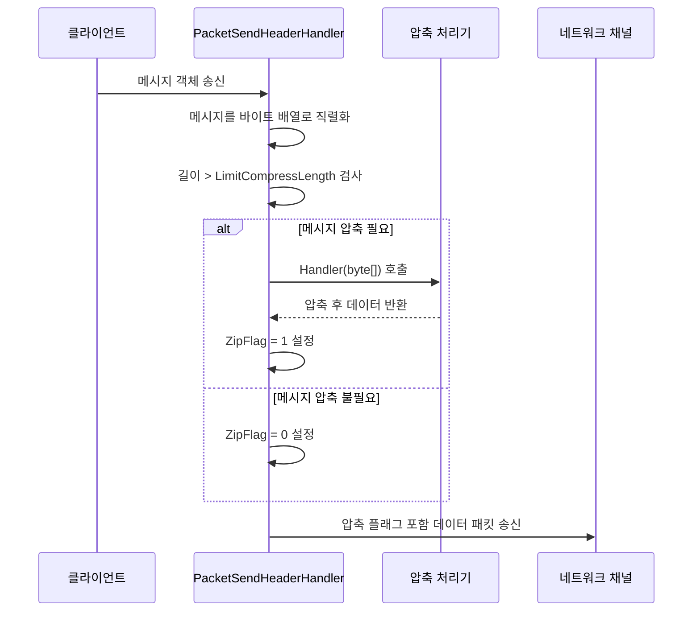
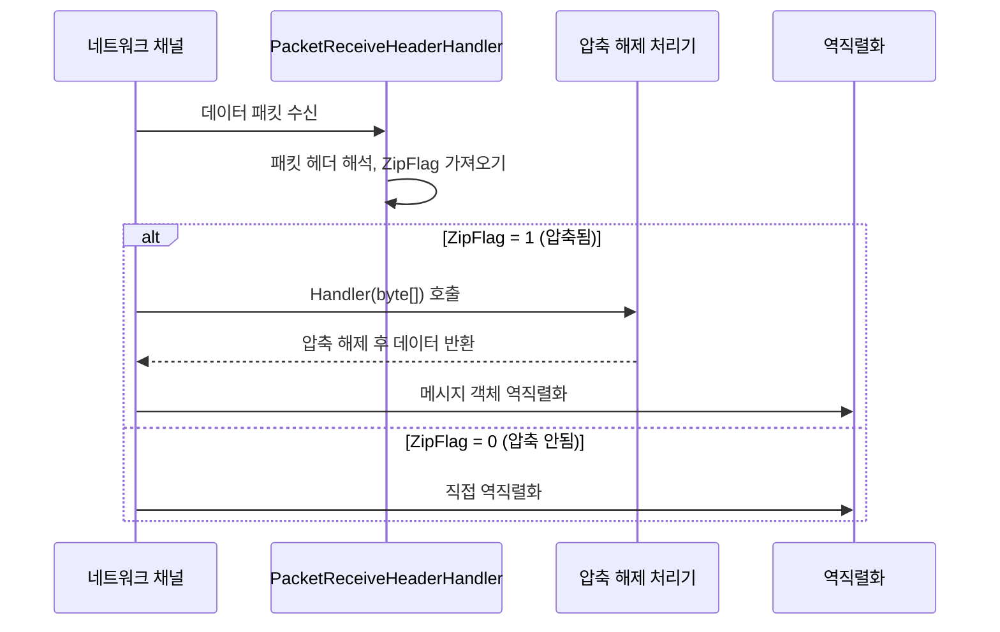

# 메시지 압축

메시지 압축 기능은 네트워크 전송 과정에서 메시지 페이로드압축하여 네트워크 대역폭 소비와 전송 시간을 줄이는 데 사용됩니다.

## 개요

GameFrameX Network는 확장 가능한 메시지 압축 메커니즘을 제공하며, 기본적으로 GZIP 압축 알고리즘을 사용합니다. 압축 시스템은 임계값 전략을 채택하여, 지정된 크기를 초과하는 메시지만 압축하여 작은 메시지에 대해 불필요한 압축 처리을 피합니다.

### 핵심 기능

- **자동 압축**: 메시지 송신 시 압축 필요 여부 자동 판단
- **자동 압축 해제**: 메시지 수신 시 압축 플래그에 따라 자동 압축 해제
- **확장 가능한 인터페이스**: 사용자 정의 압축 알고리즘 지원
- **임계값 제어**: `LimitCompressLength`로 압축 활성화 임계값 구성

## 아키텍처

```mermaid
flowchart TD
    subgraph Send["메시지 송신 프로세스"]
        S1[메시지 직렬화] --> S2{메시지 길이 > LimitCompressLength?}
        S2 -->|예| S3[압축 처리기 호출]
        S2 -->|아니오| S4[압축 안함]
        S3 --> S5[압축 플래그 설정]
        S5 --> S6[패킷 헤더 추가 후 송신]
        S4 --> S6
    end

    subgraph Receive["메시지 수신 프로세스"]
        R1[데이터 패킷 수신] --> R2[패킷 헤더 해석]
        R2 --> R3{ZipFlag = 1?}
        R3 -->|예| R4[압축 해제 처리기 호출]
        R3 -->|아니오| R5[직접 역직렬화]
        R4 --> R6[메시지 역직렬화]
        R5 --> R6
    end

    subgraph Handlers["압축 처리기"]
        H1[IMessageCompressHandler]
        H2[IMessageDecompressHandler]
        H3[DefaultMessageCompressHandler]
        H4[DefaultMessageDecompressHandler]
    end

    H1 <|.. H3
    H2 <|.. H4
    S3 -->|호출| H3
    R4 -->|호출| H4
```

## 핵심 컴포넌트

### 인터페이스 정의

#### IMessageCompressHandler

메시지 압축 처리기 인터페이스로, 메시지 데이터 압축 메서드를 정의합니다.

> Source: [IMessageCompressHandler.cs](https://github.com/GameFrameX/com.gameframex.unity.network/blob/main/Runtime/Network/Interface/IMessageCompressHandler.cs#L6-L14)

```csharp
public interface IMessageCompressHandler
{
    /// <summary>
    /// 압축 처리
    /// </summary>
    /// <param name="message">압축되지 않은 메시지 내용</param>
    /// <returns>압축 후 바이트 배열</returns>
    byte[] Handler(byte[] message);
}
```

#### IMessageDecompressHandler

메시지 압축 해제 처리기 인터페이스로, 압축 메시지 압축 해제 메서드를 정의합니다.

> Source: [IMessageDecompressHandler.cs](https://github.com/GameFrameX/com.gameframex.unity.network/blob/main/Runtime/Network/Interface/IMessageDecompressHandler.cs#L6-L14)

```csharp
public interface IMessageDecompressHandler
{
    /// <summary>
    /// 압축 해제 처리
    /// </summary>
    /// <param name="message">압축된 메시지 내용</param>
    /// <returns>압축 해제 후 바이트 배열</returns>
    byte[] Handler(byte[] message);
}
```

### 기본 구현

#### DefaultMessageCompressHandler

기본 메시지 압축 처리기로, GZIP 압축 알고리즘을 사용합니다.

> Source: [DefaultMessageCompressHandler.cs](https://github.com/GameFrameX/com.gameframex.unity.network/blob/main/Runtime/Network/Helper/DefaultMessageCompressHandler.cs#L9-L20)

```csharp
[UnityEngine.Scripting.Preserve]
public sealed class DefaultMessageCompressHandler : IMessageCompressHandler, IPacketHandler
{
    public byte[] Handler(byte[] message)
    {
        return ZipHelper.Compress(message);
    }
}
```

#### DefaultMessageDecompressHandler

기본 메시지 압축 해제 처리기로, GZIP 압축 해제 알고리즘을 사용합니다.

> Source: [DefaultMessageDecompressHandler.cs](https://github.com/GameFrameX/com.gameframex.unity.network/blob/main/Runtime/Network/Helper/DefaultMessageDecompressHandler.cs#L9-L20)

```csharp
[UnityEngine.Scripting.Preserve]
public sealed class DefaultMessageDecompressHandler : IMessageDecompressHandler, IPacketHandler
{
    public byte[] Handler(byte[] message)
    {
        return ZipHelper.Decompress(message);
    }
}
```

## 압축 프로세스 상세

### 메시지 송신 시 압축 프로세스



송신 프로세스의 핵심 로직은 `DefaultPacketSendHeaderHandler`에 있습니다:

> Source: [DefaultPacketSendHeaderHandler.cs#L83-L97](https://github.com/GameFrameX/com.gameframex.unity.network/blob/main/Runtime/Network/Helper/DefaultPacketSendHeaderHandler.cs#L83-L97)

```csharp
public bool Handler<T>(T messageObject, IMessageCompressHandler messageCompressHandler, 
    MemoryStream destination, out byte[] messageBodyBuffer) where T : MessageObject
{
    var messageType = messageObject.GetType();
    Id = ProtoMessageIdHandler.GetReqMessageIdByType(messageType);
    messageBodyBuffer = SerializerHelper.Serialize(messageObject);
    
    if (messageCompressHandler != null && messageBodyBuffer.Length > LimitCompressLength)
    {
        IsZip = true;
        messageBodyBuffer = messageCompressHandler.Handler(messageBodyBuffer);
    }
    else
    {
        IsZip = false;
    }
    // ... 후속 처리
}
```

### 메시지 수신 시 압축 해제 프로세스

네트워크 데이터 패킷을 수신하면, 네트워크 채널은 패킷 헤더의 `ZipFlag` 플래그에 따라 압축 해제 필요 여부를 판단합니다:



TCP 네트워크 채널의 압축 해제 구현:

> Source: [NetworkManager.SystemTcpNetworkChannel.cs#L225-L230](https://github.com/GameFrameX/com.gameframex.unity.network/blob/main/Runtime/Network/Network/SystemSocket/NetworkManager.SystemTcpNetworkChannel.cs#L225-L230)

```csharp
if (PReceiveState.PacketHeader.ZipFlag != 0)
{
    // 압축 해제
    GameFrameworkGuard.NotNull(MessageDecompressHandler, nameof(MessageDecompressHandler));
    buffer = MessageDecompressHandler.Handler(buffer);
}
```

## 자동 등록 메커니즘

메시지 압축 처리기는 `IPacketHandler` 인터페이스로 마킹되어, 리플렉션을 통해 네트워크 채널에 자동 등록됩니다.

> Source: [DefaultNetworkChannelHelper.cs#L91-L100](https://github.com/GameFrameX/com.gameframex.unity.network/blob/main/Runtime/Network/Helper/DefaultNetworkChannelHelper.cs#L91-L100)

```csharp
// 리플렉션을 통해 메시지 압축 처리기 등록
var messageCompressHandlerBaseType = typeof(IMessageCompressHandler);
var messageDecompressHandlerBaseType = typeof(IMessageDecompressHandler);

foreach (var type in types)
{
    // ...
    else if (type.IsImplWithInterface(messageCompressHandlerBaseType))
    {
        var handler = (IMessageCompressHandler)Activator.CreateInstance(type);
        m_NetworkChannel.RegisterMessageCompressHandler(handler);
    }
    else if (type.IsImplWithInterface(messageDecompressHandlerBaseType))
    {
        var handler = (IMessageDecompressHandler)Activator.CreateInstance(type);
        m_NetworkChannel.RegisterMessageDecompressHandler(handler);
    }
}
```

## 사용 예시

### 기본 압축 처리기 사용

기본적으로 시스템은 `DefaultMessageCompressHandler`와 `DefaultMessageDecompressHandler`를 자동으로 등록하므로, 수동 구성은 필요하지 않습니다:

```csharp
// 메시지는 자동으로 압축 처리됩니다
// 메시지 본문이 LimitCompressLength (기본값 512바이트)를 초과할 때만 압축됩니다
networkChannel.Send(new TestMessage { Data = "Hello World" });
```

### 사용자 정의 압축 처리기

다른 압축 알고리즘(예: LZ4, Zstd)을 사용해야 하는 경우, 사용자 정의 처리기를 생성할 수 있습니다:

```csharp
// 사용자 정의 압축 처리기 예시
public class LZ4CompressHandler : IMessageCompressHandler, IPacketHandler
{
    public byte[] Handler(byte[] message)
    {
        // LZ4 알고리즘으로 압축
        return LZ4.Compress(message);
    }
}

public class LZ4DecompressHandler : IMessageDecompressHandler, IPacketHandler
{
    public byte[] Handler(byte[] message)
    {
        // LZ4 알고리즘으로 압축 해제
        return LZ4.Decompress(message);
    }
}
```

사용자 정의 처리기는 시스템에 의해 자동으로 발견되어 등록되나, 다음 조건을 충족해야 합니다:
1. `IMessageCompressHandler` 또는 `IMessageDecompressHandler` 인터페이스 구현
2. `IPacketHandler` 인터페이스 구현(자동 등록용 마킹)
3. 프로그램 어셈블리에 배치(리플렉션 스캔 대상)

### 압축 비활성화

메시지 압축이 필요하지 않은 경우, 압축 처리기를 프로그램 어셈블리에 추가하지 않거나, 수동으로 처리기를 null로 설정할 수 있습니다:

> Source: [NetworkManager.NetworkChannelBase.cs#L496-L502](https://github.com/GameFrameX/com.gameframex.unity.network/blob/main/Runtime/Network/Network/NetworkManager.NetworkChannelBase.cs#L496-L502)

```csharp
// null로 설정하면 압축 비활성화
networkChannel.RegisterMessageCompressHandler(null);
networkChannel.RegisterMessageDecompressHandler(null);
```

## 구성 옵션

### LimitCompressLength

압축 임계값 구성으로, 메시지가 어느 크기를 초과할 때 압축을 활성화할지 제어합니다.

> Source: [DefaultPacketSendHeaderHandler.cs#L66-L69](https://github.com/GameFrameX/com.gameframex.unity.network/blob/main/Runtime/Network/Helper/DefaultPacketSendHeaderHandler.cs#L66-L69)

| 속성 | 유형 | 기본값 | 설명 |
|------|------|--------|------|
| LimitCompressLength | uint | 512 | 메시지 본문이 이 길이를 초과하면 압축 활성화(바이트) |

### 기본 임계값 수정

압축 임계값을 수정해야 하는 경우, `DefaultPacketSendHeaderHandler`를 상속할 수 있습니다:

```csharp
public class CustomPacketSendHeaderHandler : DefaultPacketSendHeaderHandler
{
    // 압축 임계값을 1024바이트로 설정
    public override uint LimitCompressLength { get; } = 1024;
}
```

## 패킷 헤더 구조

메시지 패킷 헤더에는 메시지 본문이 압축되었는지 식별하는 압축 플래그가 포함됩니다:

| 필드 | 길이 | 설명 |
|------|------|------|
| PacketLength | 4바이트 | 데이터 패킷 총 길이 |
| OperationType | 1바이트 | 작업 유형 (1=하트비트, 4=일반 메시지) |
| **ZipFlag** | **1바이트** | **압축 플래그 (0=압축 안됨, 1=압축됨)** |
| UniqueId | 4바이트 | 메시지 고유 번호 |
| Id | 4바이트 | 메시지 프로토콜 번호 |

> Source: [DefaultPacketSendHeaderHandler.cs#L30-L31](https://github.com/GameFrameX/com.gameframex.unity.network/blob/main/Runtime/Network/Helper/DefaultPacketSendHeaderHandler.cs#L30-L31)

## API 참고

### IMessageCompressHandler

```csharp
byte[] Handler(byte[] message)
```

**매개변수:**
- `message` (byte[]): 압축되지 않은 원본 메시지 바이트 배열

**반환:** 압축 후 바이트 배열

**예외:**
- 빈 구현은 null을 반환할 수 있습니다

### IMessageDecompressHandler

```csharp
byte[] Handler(byte[] message)
```

**매개변수:**
- `message` (byte[]): 압축된 메시지 바이트 배열

**반환:** 압축 해제 후 원본 바이트 배열

### INetworkChannel

```csharp
void RegisterMessageCompressHandler(IMessageCompressHandler handler)
```

메시지 압축 처리기 등록.

```csharp
void RegisterMessageDecompressHandler(IMessageDecompressHandler handler)
```

메시지 압축 해제 처리기 등록.

```csharp
IMessageCompressHandler MessageCompressHandler { get; }
```

현재 구성된 압축 처리기 가져오기.

```csharp
IMessageDecompressHandler MessageDecompressHandler { get; }
```

현재 구성된 압축 해제 처리기 가져오기.

## 관련 링크

- [네트워크 관리자](./4-core-concepts.1-network-manager) - 네트워크 관리자 개요
- [네트워크 채널](./4-core-concepts.2-network-channel) - 네트워크 채널 구성
- [데이터 패킷 처리기](./4-core-concepts.4-packet-handlers) - 패킷 처리기 상세
- [하트비트 메커니즘](./5-heartbeat) - 하트비트와 압축 플래그
- [이벤트 시스템](./6-events) - 네트워크 이벤트 처리