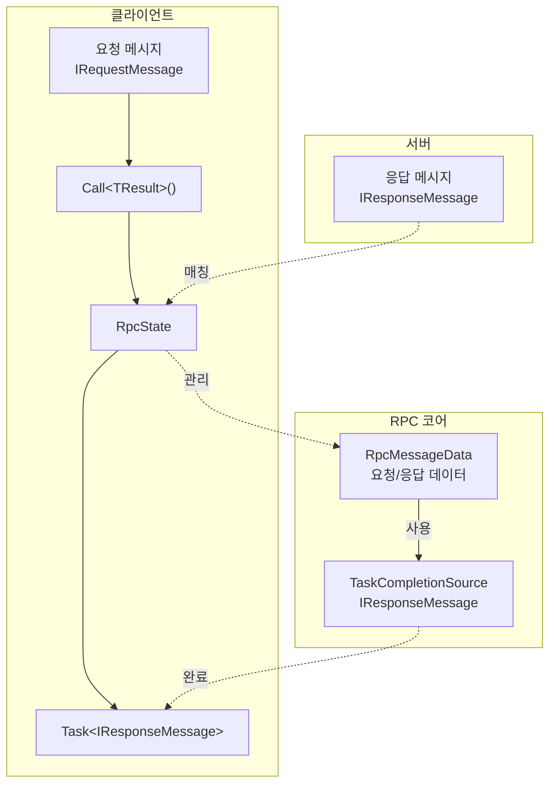
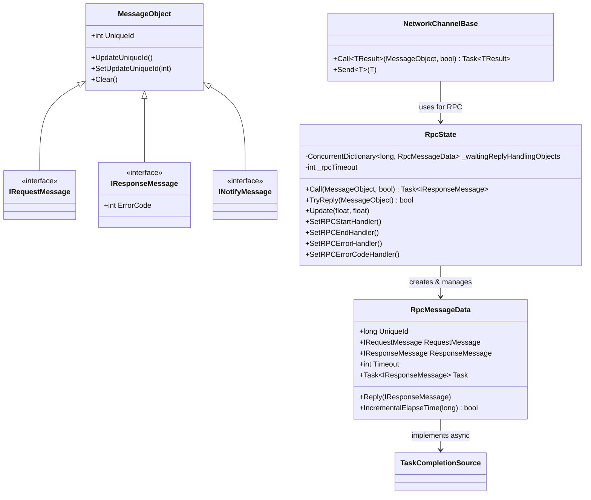
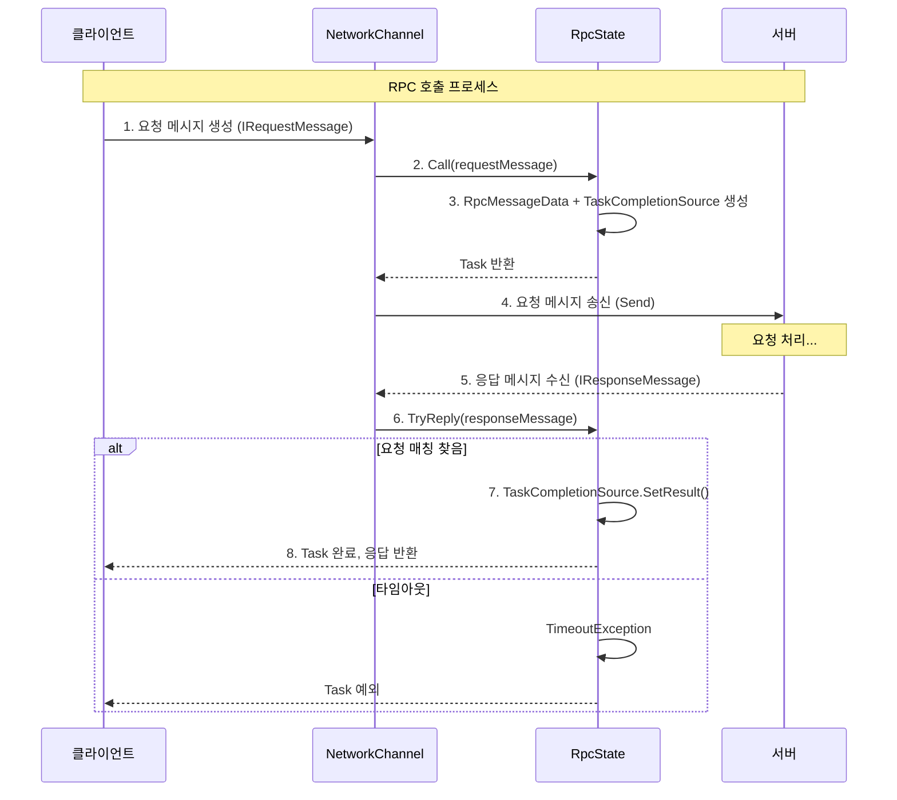

# RPC 원격 호출

RPC(Remote Procedure Call, 원격 프로시저 호출) 메커니즘은 클라이언트가 서버에 요청을 송신하고 응답을 기다릴 수 있게 하여, 네트워크 게임에서 가장 많이 사용되는 클라이언트-서버 통신 방식입니다.

## 개요

GameFrameX 네트워크 라이브러리는 완전한 RPC 구현을 제공합니다:

- **동기 호출**: 요청 송신 후 응답 대기 블로킹
- **비동기 호출**: async/await 패턴으로 비동기 응답 대기
- **타임아웃 처리**: RPC 타임아웃 자동 감지 및 처리
- **오류 처리**: 오류 코드 콜백 및 예외 처리 지원
- **이벤트 알림**: RPC 시작, 완료, 오류의 전 과정 이벤트 리스닝

### 메시지 유형

시스템은 다양한 통신 시나리오를 위해 세 가지 메시지 유형을 정의합니다:

| 유형 | 인터페이스 | 용도 |
|------|------|------|
| 요청 메시지 | `IRequestMessage` | 클라이언트가 서버에 송신하는 요청 |
| 응답 메시지 | `IResponseMessage` | 서버가 클라이언트에 반환하는 응답으로, ErrorCode 포함 |
| 알림 메시지 | `INotifyMessage` | 서버가 클라이언트에 능동적으로 송신하는 알림으로, 응답 불필요 |

## 아키텍처

RPC 시스템은 다음 핵심 컴포넌트로 구성됩니다:



### 핵심 컴포넌트



## 메시지 정의

GameFrameX 네트워크 라이브러리에서 모든 네트워크 메시지는 `MessageObject` 베이스 클래스를 상속하고 대응하는 인터페이스를 구현합니다:

### 요청 메시지

```csharp
namespace GameFrameX.Network.Runtime
{
    /// <summary>
    /// 클라이언트가 서버에 송신하는 메시지의 베이스 클래스 인터페이스
    /// </summary>
    public interface IRequestMessage
    {
    }
}
```

> Source: [IRequestMessage.cs](https://github.com/GameFrameX/com.gameframex.unity.network/blob/main/Runtime/Network/Base/IRequestMessage.cs#L1-L9)

### 응답 메시지

```csharp
namespace GameFrameX.Network.Runtime
{
    /// <summary>
    /// 서버가 클라이언트에 반환하는 메시지 베이스 클래스 인터페이스
    /// </summary>
    public interface IResponseMessage
    {
        /// <summary>
        /// 오류 코드, 0이 아니면 오류 의미
        /// </summary>
        int ErrorCode { get; }
    }
}
```

> Source: [IResponseMessage.cs](https://github.com/GameFrameX/com.gameframex.unity.network/blob/main/Runtime/Network/Base/IResponseMessage.cs#L1-L13)

### 알림 메시지

```csharp
namespace GameFrameX.Network.Runtime
{
    /// <summary>
    /// 서버가 클라이언트에 송신하는 메시지 베이스 클래스 인터페이스
    /// </summary>
    public interface INotifyMessage
    {
    }
}
```

> Source: [INotifyMessage.cs](https://github.com/GameFrameX/com.gameframex.unity.network/blob/main/Runtime/Network/Base/INotifyMessage.cs#L1-L9)

### 메시지 베이스 클래스

```csharp
namespace GameFrameX.Network.Runtime
{
    public class MessageObject : IReference
    {
        /// <summary>
        /// 메시지 고유 번호
        /// </summary>
        public int UniqueId { get; private set; }

        protected MessageObject()
        {
            UpdateUniqueId();
        }

        public void UpdateUniqueId()
        {
            UniqueId = Utility.IdGenerator.GetNextUniqueIntId();
        }

        public virtual void Clear()
        {
        }
    }
}
```

> Source: [MessageObject.cs](https://github.com/GameFrameX/com.gameframex.unity.network/blob/main/Runtime/Network/Base/MessageObject.cs#L1-L56)

## RPC 호출 프로세스

RPC 호출의 완전한 프로세스는 다음과 같습니다:



## 사용 예시

### 기본 RPC 호출

```csharp
using GameFrameX.Network.Runtime;

// 요청 메시지 정의
public class LoginRequest : MessageObject, IRequestMessage
{
    public string Username { get; set; }
    public string Password { get; set; }
}

// 응답 메시지 정의
public class LoginResponse : MessageObject, IResponseMessage
{
    public int ErrorCode { get; set; }
    public string Token { get; set; }
    public long UserId { get; set; }
}

// RPC 호출
var channel = networkComponent.GetNetworkChannel("Game");
var request = new LoginRequest 
{ 
    Username = "player1", 
    Password = "password123" 
};

// 비동기 호출
var response = await channel.Call<LoginResponse>(request);

if (response.ErrorCode == 0)
{
    Debug.Log($"로그인 성공, 사용자 ID: {response.UserId}");
}
else
{
    Debug.LogError($"로그인 실패, 오류 코드: {response.ErrorCode}");
}
```

> Sources:
> - [NetworkChannelBase.cs](https://github.com/GameFrameX/com.gameframex.unity.network/blob/main/Runtime/Network/Network/NetworkManager.NetworkChannelBase.cs#L765-L771)
> - [RpcState.cs](https://github.com/GameFrameX/com.gameframex.unity.network/blob/main/Runtime/Network/Network/NetworkManager.RpcState.cs#L125-L144)

### 오류 코드 처리

```csharp
// 오류 코드 콜백 설정
channel.SetRPCErrorCodeHandler((sender, message) =>
{
    var response = message as IResponseMessage;
    Debug.LogError($"RPC 오류 코드: {response?.ErrorCode}");
});

// 호출 시 오류 코드 무시 (예외 발생 안 함)
var response = await channel.Call<LoginResponse>(request, isIgnoreErrorCode: true);
```

> Source: [NetworkChannelBase.cs](https://github.com/GameFrameX/com.gameframex.unity.network/blob/main/Runtime/Network/Network/NetworkManager.NetworkChannelBase.cs#L592-L629)

### 타임아웃 처리

```csharp
// RPC 타임아웃 오류 콜백 설정
channel.SetRPCErrorHandler((sender, message) =>
{
    Debug.LogError($"RPC 타임아웃: {message.GetType().Name}");
});
```

> Source: [RpcState.cs](https://github.com/GameFrameX/com.gameframex.unity.network/blob/main/Runtime/Network/Network/NetworkManager.RpcState.cs#L195-L232)

### RPC 이벤트 리스닝

```csharp
// RPC 시작 송신
channel.SetRPCStartHandler((sender, message) =>
{
    Debug.Log($"RPC 시작: {message.GetType().Name}");
});

// RPC 성공 완료
channel.SetRPCEndHandler((sender, message) =>
{
    Debug.Log($"RPC 완료: {message.GetType().Name}");
});

// RPC 타임아웃
channel.SetRPCErrorHandler((sender, message) =>
{
    Debug.LogError($"RPC 오류: {message.GetType().Name}");
});

// RPC 오류 코드 반환
channel.SetRPCErrorCodeHandler((sender, message) =>
{
    var response = message as IResponseMessage;
    Debug.LogError($"RPC 오류 코드: {response?.ErrorCode}");
});
```

## 구성 옵션

### NetworkComponent 구성

Unity 편집기에서 NetworkComponent를 통해 RPC 타임아웃 시간을 구성할 수 있습니다:

| 속성 | 유형 | 기본값 | 설명 |
|------|------|--------|------|
| m_rpcTimeout | int | 5000 | RPC 타임아웃 시간(밀리초) |
| m_FocusHeartbeat | bool | false | 애플리케이션이 포커스를 잃었을 때 하트비트 계속 송신 여부 |

```csharp
// 네트워크 채널 생성 시 구성 적용
public INetworkChannel CreateNetworkChannel(string channelName, INetworkChannelHelper networkChannelHelper)
{
    var networkChannel = m_NetworkManager.CreateNetworkChannel(channelName, networkChannelHelper, m_rpcTimeout);
    return networkChannel;
}
```

> Source: [NetworkComponent.cs](https://github.com/GameFrameX/com.gameframex.unity.network/blob/main/Runtime/Network/NetworkComponent.cs#L176-L182)

### RpcState 구성

RpcState 생성자는 타임아웃 시간이 3000밀리초보다 작을 수 없도록 요구합니다:

```csharp
public RpcState(int timeout)
{
    _rpcTimeout = timeout;
    if (_rpcTimeout < 3000)
    {
        throw new ArgumentOutOfRangeException(nameof(timeout), "RPC 타임아웃 시간은 3000밀리초보다 작을 수 없습니다");
    }
}
```

> Source: [RpcState.cs](https://github.com/GameFrameX/com.gameframex.unity.network/blob/main/Runtime/Network/Network/NetworkManager.RpcState.cs#L61-L68)

## API 참고

### `INetworkChannel.Call<TResult>`

```csharp
Task<TResult> Call<TResult>(MessageObject messageObject, bool isIgnoreErrorCode = false) where TResult : MessageObject, IResponseMessage
```

원격 호스트에 RPC 요청을 송신하고 응답을 기다립니다.

**제네릭 매개변수:**
- `TResult` : 응답 메시지 유형으로, MessageObject를 상속하고 IResponseMessage를 구현해야 합니다

**매개변수:**
- `messageObject` (MessageObject): 요청 메시지 객체
- `isIgnoreErrorCode` (bool): 오류 코드 무시 여부, 기본값 false

**반환:**
- `Task<TResult>`: 응답 메시지를 포함하는 비동기 Task

**예외:**
- `ArgumentNullException`: messageObject가 null인 경우
- `TimeoutException`: RPC 타임아웃
- `GameFrameworkException`: 송신 실패

> Source: [NetworkChannelBase.cs](https://github.com/GameFrameX/com.gameframex.unity.network/blob/main/Runtime/Network/Network/NetworkManager.NetworkChannelBase.cs#L765-L771)

### INetworkChannel.SetRPCStartHandler

```csharp
void SetRPCStartHandler(EventHandler<MessageObject> handler)
```

RPC 시작 송신 시 콜백 함수를 설정합니다.

**매개변수:**
- `handler` (`EventHandler<MessageObject>`): 콜백 처리 함수

> Source: [NetworkChannelBase.cs](https://github.com/GameFrameX/com.gameframex.unity.network/blob/main/Runtime/Network/NetworkManager.NetworkChannelBase.cs#L613-L618)

### INetworkChannel.SetRPCEndHandler

```csharp
void SetRPCEndHandler(EventHandler<MessageObject> handler)
```

RPC 성공 완료 시 콜백 함수를 설정합니다.

**매개변수:**
- `handler` (`EventHandler<MessageObject>`): 콜백 처리 함수

> Source: [NetworkChannelBase.cs](https://github.com/GameFrameX/com.gameframex.unity.network/blob/main/Runtime/Network/NetworkManager.NetworkChannelBase.cs#L624-L629)

### INetworkChannel.SetRPCErrorHandler

```csharp
void SetRPCErrorHandler(EventHandler<MessageObject> handler)
```

RPC 오류(타임아웃) 시 콜백 함수를 설정합니다.

**매개변수:**
- `handler` (`EventHandler<MessageObject>`): 콜백 처리 함수

> Source: [NetworkChannelBase.cs](https://github.com/GameFrameX/com.gameframex.unity.network/blob/main/Runtime/Network/NetworkManager.NetworkChannelBase.cs#L602-L607)

### INetworkChannel.SetRPCErrorCodeHandler

```csharp
void SetRPCErrorCodeHandler(EventHandler<MessageObject> handler)
```

RPC 오류 코드 반환 시 콜백 함수를 설정합니다.

**매개변수:**
- `handler` (`EventHandler<MessageObject>`): 콜백 처리 함수

> Source: [NetworkChannelBase.cs](https://github.com/GameFrameX/com.gameframex.unity.network/blob/main/Runtime/Network/NetworkManager.NetworkChannelBase.cs#L591-L596)

## 메시지 처리기

RPC 유형이 아닌 메시지(알림 메시지)의 경우, `MessageHandlerAttribute`를 사용하여 메시지 처리기를 등록합니다:

```csharp
public class GameMessageHandler : IMessageHandler
{
    [MessageHandler(typeof(ServerNotifyMessage), nameof(OnServerNotify))]
    private void OnServerNotify(MessageObject message)
    {
        var notify = message as ServerNotifyMessage;
        Debug.Log($"서버 알림 수신: {notify.Content}");
    }
}

// 메시지 처리기 등록
ProtoMessageHandler.Add(new GameMessageHandler());
```

> Source: [MessageHandlerAttribute.cs](https://github.com/GameFrameX/com.gameframex.unity.network/blob/main/Runtime/Network/Base/MessageHandlerAttribute.cs#L1-L195)

## 모범 사례

### 1. 합리적인 타임아웃 시간 설정

```csharp
// 비즈니스 요구에 따라 적합한 타임아웃 시간 설정
// 중요 비즈니스 작업(로그인, 결제): 10-30초
// 일반 게임 작업: 5-10초
// 고빈도 작업: 3-5초
var channel = networkComponent.CreateNetworkChannel("Game", helper);
// 또는 NetworkComponent에서 m_rpcTimeout 설정
```

### 2. 오류 코드 콜백 사용

```csharp
// 통합 오류 코드 처리
channel.SetRPCErrorCodeHandler((sender, message) =>
{
    var response = message as IResponseMessage;
    switch (response.ErrorCode)
    {
        case 1001:
            // 특정 오류 처리
            break;
        default:
            // 일반 오류 처리
            break;
    }
});
```

### 3. 중복 요청 피하기

```csharp
// CancellationToken을 사용하여 중복 요청 취소
private CancellationTokenSource _loginCts;

async Task LoginAsync()
{
    // 이전 로그인 요청 취소
    _loginCts?.Cancel();
    _loginCts = new CancellationTokenSource();
    
    try
    {
        var response = await channel.Call<LoginResponse>(request);
        // 응답 처리
    }
    catch (OperationCanceledException)
    {
        // 요청이 취소됨
    }
}
```

### 4. 메시지 정의 분리

```csharp
// 모듈별로 메시지 정의 분리 권장
// Messages/LoginMessages.cs
public class LoginRequest : MessageObject, IRequestMessage { ... }
public class LoginResponse : MessageObject, IResponseMessage { ... }

// Messages/BattleMessages.cs
public class BattleStartRequest : MessageObject, IRequestMessage { ... }
public class BattleStartResponse : MessageObject, IResponseMessage { ... }
```

## 관련 링크

- [메시지 유형](./4-core-concepts.3-message-types)
- [네트워크 관리자](./4-core-concepts.1-network-manager)
- [네트워크 채널](./4-core-concepts.2-network-channel)
- [하트비트 메커니즘](./5-heartbeat)
- [이벤트 시스템](./6-events)
- [메시지 압축](./7-message-compression)