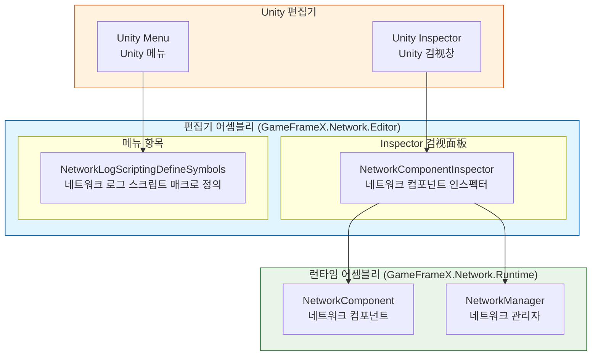
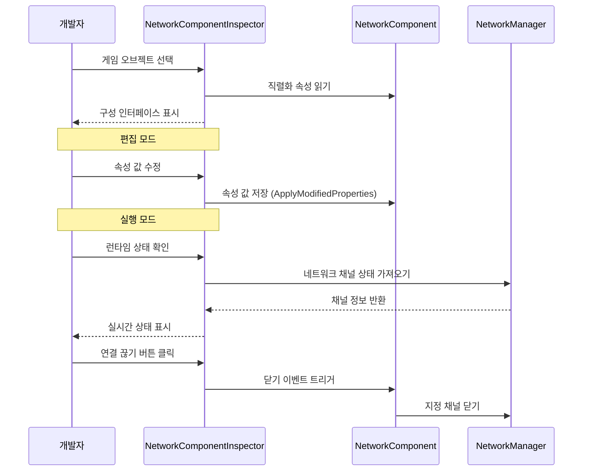
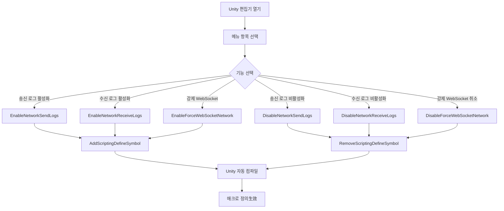

# 편집기 구성

GameFrameX Network 플러그인은 Unity 편집기 구성 기능을 풍부하게 제공하여, 개발자가 Inspector 패널과 메뉴 항목을 통해 네트워크 모듈의 각 매개변수를 유연하게 구성할 수 있게 합니다.

## 개요

편집기 구성은 GameFrameX Network 프레임워크의 중요한 구성 부분으로, 다음 두 가지 방식을 통해 제공됩니다:

1. **Inspector 패널 구성**: 사용자 정의检视面板(Inspector)를 통해 NetworkComponent의 각 속성을 실시간으로 확인하고 수정할 수 있습니다
2. **메뉴 항목 구성**: Unity 메뉴를 통해 스크립트 매크로 정의의 빠른 스위치를 제공하여, 네트워크 로그 출력 및 동작을 제어합니다

이러한 편집기 도구는 전체 개발 주기에 걸쳐 개발자에게 네트워크 기능 디버깅, 성능 최적화 및 런타임 네트워크 상태 실시간 모니터링을 도와줍니다.

## 아키텍처

GameFrameX Network의 편집기 모듈은 계층화된 아키텍처 설계를 채택하며, 핵심 컴포넌트는 다음과 같습니다:



### 컴포넌트 책임

| 컴포넌트 | 책임 | 파일 위치 |
|------|------|----------|
| NetworkComponentInspector | NetworkComponent의 Inspector 인터페이스 제공, 속성 편집 및 런타임 상태 표시 지원 | Editor/Inspector/NetworkComponentInspector.cs |
| NetworkLogScriptingDefineSymbols | 스크립트 매크로 정의 관리 메뉴 항목 제공, 로그 출력 제어 | Editor/NetworkLogScriptingDefineSymbols.cs |
| NetworkComponent | 네트워크 핵심 컴포넌트, 구성 속성 저장 | Runtime/Network/NetworkComponent.cs |

### 어셈블리 구성

편집기 어셈블리 구성 파일은 모듈의 컴파일 환경과 의존 관계를 정의합니다:

> Source: [GameFrameX.Network.Editor.asmdef](https://github.com/GameFrameX/com.gameframex.unity.network/blob/main/Editor/GameFrameX.Network.Editor.asmdef#L1-L19)

```json
{
    "name": "GameFrameX.Network.Editor",
    "references": [
        "GameFrameX.Network.Runtime",
        "GameFrameX.Editor",
        "GameFrameX.Runtime"
    ],
    "includePlatforms": [
        "Editor"
    ]
}
```

**설계 의도**: 편집기 어셈블리는 Unity 편집기 환경에서만 컴파일되어, 편집기 코드가 릴리스 버전으로 패키징되는 것을 방지하여 릴리스 패키지 크기를 줄입니다.

## Inspector 패널 구성

NetworkComponentInspector는 NetworkComponent의 사용자 정의 검视面板로, 시각화된 구성 인터페이스를 제공합니다.

### 구성 속성

| 속성 | 유형 | 기본값 | 설명 |
|------|------|--------|------|
| RPC Timeout Time In Milliseconds | int | 5000 | RPC 호출 타임아웃 시간(밀리초), 범위 3000-50000 |
| Focus Send Heartbeat | bool | false | 애플리케이션이 포커스를 획득했을 때 하트비트 패킷을 송신할지 여부 |
| Ignore Log Printing For Sent Message IDs | `List<int>` | 빈 리스트 | 송신 시 로그 인쇄를 무시할 메시지ID 목록 |
| Ignore Log Printing Of Received Message IDs | `List<int>` | 빈 리스트 | 수신 시 로그 인쇄를 무시할 메시지ID 목록 |

### 속성 상세 설명

#### RPC 타임아웃 시간

```csharp
// Source: Runtime/Network/NetworkComponent.cs#L60-L63
// RPC 타임아웃 시간, 밀리초 단위, 기본값 5초
[SerializeField] private int m_rpcTimeout = 5000;
```

RPC 타임아웃 시간은 원격 프로시저 호출(RPC)의 최대 대기 시간을 결정합니다. 원격 메서드를 호출할 때 이 시간 내에 응답을 받지 못하면 타임아웃 콜백이 트리거됩니다. 이 값을 합리적으로 설정하는 것은 사용자 경험에 매우 중요합니다:

- **값이 너무 작음**: 네트워크 환경이 나쁜 경우 거짓 타임아웃이 발생하기 쉽습니다
- **값이 너무 큼**: 사용자의 대기 시간이 길어져用户体验不佳
- **권장 값**: 네트워크 환경에 따라 조정, 개발 환경에서는 짧게 설정 가능, 프로덕션 환경에서는 5000-10000 밀리초 권장

#### 포커스 하트비트

```csharp
// Source: Runtime/Network/NetworkComponent.cs#L65-L68
// 애플리케이션이 포커스를 획득했을 때 하트비트 패킷을 송신할지 여부, 기본값 false
[SerializeField] private bool m_FocusHeartbeat = false;
```

이 옵션은 애플리케이션이 포커스를 획득하거나 잃었을 때 하트비트 전략을 조정할지 여부를 제어합니다. 게임이 백그라운드로 전환될 때:

- **비활성화 시(기본)**: 기존 하트비트 전략 유지
- **활성화 시**: 포커스를 획득하면 하트비트 복원, 포커스를 잃으면 하트비트 일시 중단(리소스 절약)

#### 로그 무시 메시지ID

```csharp
// Source: Runtime/Network/NetworkComponent.cs#L50-L58
// 송신 네트워크 메시지ID의 로그 인쇄 무시
[SerializeField] private List<int> m_IgnoredSendNetworkIds = new List<int>();
// 수신 네트워크 메시지ID의 로그 인쇄 무시
[SerializeField] private List<int> m_IgnoredReceiveNetworkIds = new List<int>();
```

네트워크 통신은 대량의 로그를 생성하며, 빈번하지만 주목할 필요가 없는(예: 하트비트, 프레임 동기화) 메시지ID를 무시 목록에 추가하여 로그 간섭을 줄일 수 있습니다.

### 런타임 상태 표시

게임 실행 중 Inspector 패널은 현재 네트워크 채널의 실시간 상태를 표시합니다:

```csharp
// Source: Editor/Inspector/NetworkComponentInspector.cs#L95-L119
private void DrawNetworkChannel(INetworkChannel networkChannel)
{
    EditorGUILayout.BeginVertical("box");
    {
        EditorGUILayout.LabelField(networkChannel.Name, networkChannel.Connected ? "Connected" : "Disconnected");
        EditorGUILayout.LabelField("Address Family", networkChannel.AddressFamily.ToString());
        EditorGUILayout.LabelField("Local Address", networkChannel.Connected ? networkChannel.Socket.LocalEndPoint.ToString() : "Unavailable");
        EditorGUILayout.LabelField("Remote Address", networkChannel.Connected ? networkChannel.Socket.RemoteEndPoint.ToString() : "Unavailable");
        EditorGUILayout.LabelField("Send Packet", Utility.Text.Format("{0} / {1}", networkChannel.SendPacketCount, networkChannel.SentPacketCount));
        EditorGUILayout.LabelField("Miss Heart Beat Count", networkChannel.MissHeartBeatCount.ToString());
        EditorGUILayout.LabelField("Heart Beat", Utility.Text.Format("{0:F2} / {1:F2}", networkChannel.HeartBeatElapseSeconds, networkChannel.HeartBeatInterval));
        // ... 연결 끊기 버튼
    }
    EditorGUILayout.EndVertical();
}
```

**런타임 시 표시되는 정보:**

| 상태 항목 | 설명 |
|--------|------|
| 연결 상태 | 현재 연결되었는지 여부 |
| Address Family | 주소 유형(IPv4/IPv6) |
| Local Address | 로컬 터미널 주소 |
| Remote Address | 원격 터미널 주소 |
| Send Packet | 송신 데이터 패킷 통계 |
| Miss Heart Beat Count | 하트비트 유실 카운트 |
| Heart Beat | 하트비트 간격 및 경과 시간 |

### 사용 예시

Unity 장면에서 NetworkComponent를 생성한 후 Inspector 패널에서 구성할 수 있습니다:

1. Hierarchy 패널에서 NetworkComponent가 포함된 게임 오브젝트 선택
2. Inspector 패널에서 Network 컴포넌트 확인
3. 구성 속성 편집(일부 속성은 런타임 시 읽기 전용)
4. 게임 실행 시 실시간 네트워크 상태 확인

```csharp
// NetworkComponent 생성 코드 예시
// Source: Runtime/Network/NetworkComponent.cs#L42-L45
[AddComponentMenu("GameFrameX/Network")]
[UnityEngine.Scripting.Preserve]
public sealed class NetworkComponent : GameFrameworkComponent
```

## 스크립트 매크로 정의 구성

NetworkLogScriptingDefineSymbols는 스크립트 매크로 정의를 관리하는 메뉴 항목을 제공하며, 이 매크로 정의는 네트워크 모듈의 컴파일 시 동작을 제어하는 데 사용됩니다.

### 사용 가능한 매크로 정의

| 매크로 정의 | 메뉴 항목 경로 | 용도 |
|--------|------------|------|
| ENABLE_GAMEFRAMEX_NETWORK_SEND_LOG | GameFrameX/Scripting Define Symbols/Enable Network Send Logs | 네트워크 송신 로그 활성화 |
| ENABLE_GAMEFRAMEX_NETWORK_RECEIVE_LOG | GameFrameX/Scripting Define Symbols/Enable Network Receive Logs | 네트워크 수신 로그 활성화 |
| FORCE_ENABLE_GAME_FRAME_X_WEB_SOCKET | GameFrameX/Scripting Define Symbols/Enable Force WebSocket | WebSocket 네트워크 강제 사용 |

### 메뉴 항목 구현

```csharp
// Source: Editor/NetworkLogScriptingDefineSymbols.cs#L42-L98
public static class NetworkLogScriptingDefineSymbols
{
    public const string EnableNetworkReceiveLogScriptingDefineSymbol = "ENABLE_GAMEFRAMEX_NETWORK_RECEIVE_LOG";
    public const string EnableNetworkSendLogScriptingDefineSymbol = "ENABLE_GAMEFRAMEX_NETWORK_SEND_LOG";
    public const string ForceEnableNetworkSendLogScriptingDefineSymbol = "FORCE_ENABLE_GAME_FRAME_X_WEB_SOCKET";

    /// <summary>
    /// 네트워크 송신 로그 스크립트 매크로 정의 활성화.
    /// </summary>
    [MenuItem("GameFrameX/Scripting Define Symbols/Enable Network Send Logs(네트워크 송신 로그 인쇄 활성화)", false, 201)]
    public static void EnableNetworkSendLogs()
    {
        ScriptingDefineSymbols.AddScriptingDefineSymbol(EnableNetworkSendLogScriptingDefineSymbol);
    }

    /// <summary>
    /// 네트워크 송신 로그 스크립트 매크로 정의 비활성화.
    /// </summary>
    [MenuItem("GameFrameX/Scripting Define Symbols/Disable Network Send Logs(네트워크 송신 로그 인쇄 비활성화)", false, 200)]
    public static void DisableNetworkSendLogs()
    {
        ScriptingDefineSymbols.RemoveScriptingDefineSymbol(EnableNetworkSendLogScriptingDefineSymbol);
    }
    // ... 기타 메서드 유사
}
```

### 사용 설명

1. Unity 편집기 열기
2. 메뉴바에서 **GameFrameX → Scripting Define Symbols** 선택
3. 활성화/비활성화할 매크로 정의 옵션 선택
4. Unity가 자동으로 스크립트 재컴파일

### 매크로 정의 상세 설명

#### 네트워크 로그 매크로

네트워크 로그 매크로를 활성화하면 시스템이 콘솔에 상세한 네트워크 통신 로그를 출력합니다:

- **ENABLE_GAMEFRAMEX_NETWORK_SEND_LOG**: 송신된 모든 네트워크 메시지 출력
- **ENABLE_GAMEFRAMEX_NETWORK_RECEIVE_LOG**: 수신된 모든 네트워크 메시지 출력

**적용 시나리오**:
- 개발 단계에서 네트워크 통신 디버깅
- 네트워크 연결 문제排查
- 메시지 직렬화 및 전송 효율성 분석

**성능 주의**: 로그 활성화는 대량 출력을 생성하여 성능에 영향을 미치므로, 개발 디버깅 시에만 활성화하는 것을 권장합니다.

#### 강제 WebSocket 매크로

- **FORCE_ENABLE_GAME_FRAME_X_WEB_SOCKET**: 네트워크 모듈이 WebSocket 프로토콜을 강제 사용하도록 합니다

**적용 시나리오**:
- 서버가 WebSocket 프로토콜만 지원
- 브라우저를 통한 테스트 필요
- 방화벽 제한 뚫기

## 핵심 프로세스

### Inspector 구성 프로세스



### 매크로 정의 구성 프로세스



## 관련 링크

- [네트워크 관리자](./4-core-concepts.1-network-manager) - 네트워크 핵심 관리 컴포넌트
- [네트워크 채널](./4-core-concepts.2-network-channel) - 네트워크 통신 채널
- [하트비트 메커니즘](./5-heartbeat) - 하트비트 감지 구성
- [이벤트 시스템](./6-events) - 네트워크 이벤트 처리
- [빠른 시작](./3-getting-started) - 빠른 시작 가이드