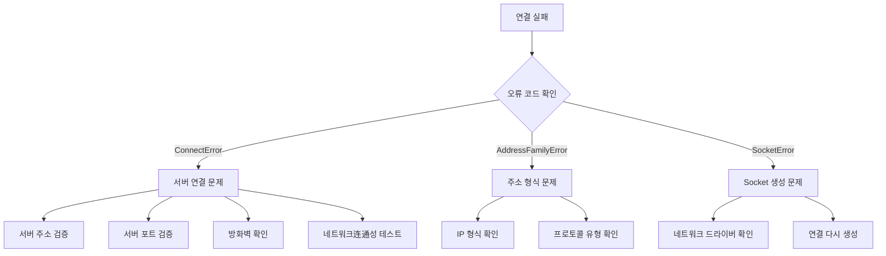

# 자주 묻는 질문

이 문서는 GameFrameX Network 네트워크 라이브러리 사용 과정에서 흔히 발생하는 오류 문제, 원인 분석 및 해결책을 정리합니다.

## 개요

GameFrameX Network는 Unity 게임 엔진용 롱컬렉션 네트워크 컴포넌트로, TCP와 WebSocket 두 가지 네트워크 프로토콜을 지원합니다. 실제 사용 과정에서 개발자는 연결 실패, 메시지 처리 오류, 하트비트 타임아웃 등의 문제에 직면할 수 있습니다. 이 문서는 개발자가 이러한 흔한 문제를 빠르게 파악하고 해결하는 데 도움을 줍니다.

## 흔한 오류 코드와 원인 분석

### 네트워크 오류 코드 상세

> Source: [NetworkErrorCode.cs](https://github.com/GameFrameX/com.gameframex.unity.network/blob/main/Runtime/Network/Base/NetworkErrorCode.cs#L80-L136)

| 오류 코드 | 설명 | 흔한 원인 |
|--------|------|---------|
| `Unknown` | 알 수 없는 오류 | 알 수 없는 예외 또는 포착되지 않은 오류 |
| `AddressFamilyError` | 주소族 오류 | IP 주소 형식不正确 또는 프로토콜 불일치 |
| `SocketError` | Socket 오류 | 네트워크 소켓 생성 또는 작업 실패 |
| `ConnectError` | 연결 오류 | 서버가 열리지 않음, 방화벽이 연결 차단, 네트워크 연결 불가 |
| `SendError` | 송신 오류 | 네트워크 중단, 버퍼 가득 참, 연결 이미 닫힘 |
| `ReceiveError` | 수신 오류 | 네트워크 중단, 서버가 능동적으로 연결 닫음 |
| `SerializeError` | 직렬화 오류 | 메시지 객체 직렬화 실패 |
| `DeserializePacketHeaderError` | 패킷 헤더 해석 오류 | 데이터 패킷 형식不正确 또는 변조됨 |
| `DeserializePacketError` | 패킷 본문 해석 오류 | 메시지 본문 해석 실패 |
| `MissHeartBeatError` | 하트비트 유실 오류 | 서버에서 오랫동안 하트비트 응답을 받지 못함 |
| `DisposeError` | 리소스 해제 오류 | 중복 해제 또는 해제 시점 부적절 |

### 네트워크 연결 닫기 원인

> Source: [NetworkErrorCode.cs](https://github.com/GameFrameX/com.gameframex.unity.network/blob/main/Runtime/Network/Base/NetworkErrorCode.cs#L38-L74)

| 닫기 원인 | 설명 | 처리 제안 |
|----------|------|---------|
| `Normal` | 정상 닫기 | 처리 불필요, 정상 비즈니스 프로세스 |
| `Timeout` | 타임아웃 닫기 | 네트워크状况 확인, 타임아웃 설정 조정 |
| `Dispose` | 능동적 해제 | 코드에서 잘못 호출되었는지 확인 |
| `ConnectClose` | 연결 끊김 | 서버 상태 및 네트워크 연결 확인 |
| `ConnectAddressError` | 주소 오류 닫기 | 서버 주소 및 포트 구성 확인 |
| `ConnectAddressExceptionError` | 주소 예외 닫기 | DNS 해석 및 서버 도달 가능성 확인 |
| `MissHeartBeat` | 하트비트 유실 닫기 | 하트비트 문제 섹션 참조 |

## 연결 문제

### 서버에 연결할 수 없음

**증상**: 연결 메서드 호출 후 `NetworkError` 이벤트가 트리거되지만 `NetworkConnected` 이벤트가 트리거되지 않음.

**가능한 원인**:

1. **서버 주소 오류**
   - IP 주소 또는 도메인 이름 잘못 입력
   - 포트 번호不正确
   - 방화벽이 연결 차단

2. **서버가 시작되지 않음**
   - 백엔드 서비스가 실행 중이지 않음
   - 서비스 포트가 올바르게 리스닝되지 않음

3. **네트워크 환경 문제**
   - 클라이언트 네트워크 연결 불가
   - 프록시 또는 VPN干扰

**排查 단계**:



**해결책**:

1. 서버 주소와 포트가 올바른지 확인
2. ping 또는 telnet으로 서버 도달 가능성 테스트
3. 방화벽 및 보안 그룹 구성 확인
4. 서버 측이 올바르게 시작되어 соответствую 포트에서 리스닝 중인지 확인

### 연결 성공 후 즉시 끊김

**증상**: `NetworkConnected` 이벤트 트리거 후 빠르게 `NetworkClosed` 이벤트 트리거.

**가능한 원인**:

1. 서버가 능동적으로 연결 끊김(인증 실패 등)
2. 클라이언트가 송신한 데이터 형식 오류
3. 하트비트 구성 문제

**해결책**:

1. 서버 로그를 확인하여 끊김 원인 파악
2. 메시지 프로토콜 형식이 서버와 일치하는지 검증
3. 하트비트 구성이 올바른지 확인

## 메시지 처리 문제

### 메시지 처리기 등록 실패

**증상**: 애플리케이션 시작 시 예외가 발생하거나 메시지가 올바르게 처리되지 않음.

> Source: [MessageHandlerAttribute.cs](https://github.com/GameFrameX/com.gameframex.unity.network/blob/main/Runtime/Network/Base/MessageHandlerAttribute.cs#L47-L63)

**흔한 오류**:

1. **메시지 유형이 MessageObject를 상속하지 않음**

```csharp
// 오류 예시
[MessageHandler(typeof(MyMessage), nameof(OnReceiveMyMessage))]
public class MyMessageHandler
{
    public void OnReceiveMyMessage(MyMessage msg) { }
}

// MyMessage 정의 오류 - MessageObject를 상속하지 않음
public class MyMessage  // 오류: MessageObject를 상속하지 않음
{
    public int Id;
}
```

```csharp
// 올바른 예시
public class MyMessage : MessageObject  // MessageObject를 상속해야 함
{
    public int Id;
}
```

2. **메시지 유형이 인터페이스를 구현하지 않음**

```csharp
// 오류 예시
public class MyMessage : MessageObject  // 인터페이스 구현 누락
{
    public int Id;
}

// 올바른 예시 - INotifyMessage 또는 IRequestMessage/IResponseMessage 구현 필요
public class MyMessage : MessageObject, INotifyMessage
{
    public int Id;
}
```

3. **처리 메서드 매개변수 오류**

> Source: [MessageHandlerAttribute.cs](https://github.com/GameFrameX/com.gameframex.unity.network/blob/main/Runtime/Network/Base/MessageHandlerAttribute.cs#L136-L144)

```csharp
// 오류 예시 1: 매개변수 개수가 1이 아님
[MessageHandler(typeof(MyMessage), nameof(OnReceiveMyMessage))]
public void OnReceiveMyMessage(MyMessage msg, string extra)  // 오류: 매개변수 개수가 2
{
}

// 오류 예시 2: 매개변수 유형 불일치
[MessageHandler(typeof(MyMessage), nameof(OnReceiveMyMessage))]
public void OnReceiveMyMessage(OtherMessage msg)  // 오류: 매개변수 유형 불일치
{
}

// 올바른 예시
[MessageHandler(typeof(MyMessage), nameof(OnReceiveMyMessage))]
public void OnReceiveMyMessage(MyMessage msg)  // 올바름: 매개변수 개수가 1, 유형이 MyMessage
{
}
```

### 메시지 처리기 메서드를 찾을 수 없음

**증상**: 런타임 시 `메서드를 찾을 수 없음: xxx. 등록되었는지 확인하세요` 예외 발생.

> Source: [MessageHandlerAttribute.cs](https://github.com/GameFrameX/com.gameframex.unity.network/blob/main/Runtime/Network/Base/MessageHandlerAttribute.cs#L77-L80)

**排查 단계**:

1. 메서드 이름이 `MessageHandlerAttribute`에 지정된 것과 일치하는지 확인
2. 메서드 접근 수정자가 올바른지 확인(public 또는 internal)
3. 메서드가 올바른 클래스에서 정의되었는지 확인
4. `[MessageHandler]` 특성을 사용했는지 확인

```csharp
// 메서드 이름이 정확히 일치하는지 확인
[MessageHandler(typeof(LoginResponse), nameof(OnLoginResponse))]  // 메서드 이름이 nameof의 이름과 완전히 일치해야 함
public class PlayerHandler : IMessageHandler
{
    // 메서드 이름이 nameof의 이름과 완전히 일치해야 함
    public void OnLoginResponse(LoginResponse msg) { }
}
```

### 메시지ID 중복 충돌

**증상**: 시작 시 `요청ID 중복` 또는 `반환ID 중복` 예외 발생.

> Source: [ProtoMessageIdHandler.cs](https://github.com/GameFrameX/com.gameframex.unity.network/blob/main/Runtime/Network/ProtoMessageIdHandler.cs#L140-L161)

**원인**:同一 메시지 유형에 중복된 메시지ID 사용

**해결책**: 메시지 유형 정의를 검토하여 각 메시지 유형의ID가 고유한지 확인

```csharp
// 오류 예시 - ID 중복
[MessageTypeHandler(MessageId = 1001)]
public class LoginRequest : MessageObject, IRequestMessage { }

[MessageTypeHandler(MessageId = 1001)]  // 오류: ID 중복
public class Login2Request : MessageObject, IRequestMessage { }

// 올바른 예시 - ID 고유
[MessageTypeHandler(MessageId = 1001)]
public class LoginRequest : MessageObject, IRequestMessage { }

[MessageTypeHandler(MessageId = 1002)]  // 올바름: 다른 ID 사용
public class Login2Request : MessageObject, IRequestMessage { }
```

### 하트비트 메시지 중복

**증상**: 시작 시 `하트비트 메시지 중복` 예외 발생.

> Source: [ProtoMessageIdHandler.cs](https://github.com/GameFrameX/com.gameframex.unity.network/blob/main/Runtime/Network/ProtoMessageIdHandler.cs#L126-L129)

**원인**:여러 메시지 유형이 하트비트 메시지로 마크됨

**해결책**: 하나의 메시지 유형만 하트비트 메시지로 마크되도록 确保

## 하트비트 문제

### 하트비트 타임아웃으로 연결 끊김

**증상**: `NetworkMissHeartBeat` 이벤트 트리거 후 연결이 닫힘

**가능한 원인**:

1. 네트워크 지연이 높음
2. 서버 하트비트 간격 구성과 클라이언트가 일치하지 않음
3. 서버 부하가 높아서 하트비트에 제때 응답하지 못함
4. 클라이언트가 백그라운드에 있을 때 하트비트 일시 중단(`FocusHeartbeat` 구성되지 않음)

> Source: [NetworkComponent.cs](https://github.com/GameFrameX/com.gameframex.unity.network/blob/main/Runtime/Network/NetworkComponent.cs#L68-L91)

**해결책**:

1. 네트워크 환경 확인, 네트워크 품질 최적화
2. 하트비트 타임아웃 구성 조정, 허용 범위 증가
3. 게임이 백그라운드 실행을 지원하는 경우 `FocusHeartbeat` 옵션 활성화
4. 애플리케이션이 백그라운드로 전환될 때 하트비트 감지 일시 중단

```csharp
// NetworkComponent에서 포커스 하트비트 활성화
// Unity 편집기에서: NetworkComponent -> Focus Send Heartbeat = true
// 또는 코드를 통해 설정
networkChannel.SetEnableHeartbeat(true);
```

### 하트비트 메시지가 올바르게 처리되지 않음

**증상**: 하트비트가 정상적으로 송신되지만 서버가 응답하지 않거나, 클라이언트가 하트비트를 수신했지만 올바르게 처리되지 않음

**해결책**:

1. 하트비트 메시지 유형이 `IHeartBeatMessage` 인터페이스를 구현했는지 확인
2. 하트비트 메시지ID가 서버와约定的 일치하는지 확인
3. 하트비트 처리기 구현 확인

> Source: [DefaultPacketHeartBeatHandler.cs](https://github.com/GameFrameX/com.gameframex.unity.network/blob/main/Runtime/Network/Helper/DefaultPacketHeartBeatHandler.cs#L22-L25)

```csharp
// 하트비트 처리기가 올바르게 구현되어야 함
public class HeartBeatHandler : IPacketHeartBeatHandler
{
    public MessageObject Handler()
    {
        // 하트비트 메시지 객체 반환, NotImplementedException 발생시켜서는 안 됨
        return new HeartBeatMessage();
    }
}
```

## RPC 호출 문제

### RPC 타임아웃

**증상**: RPC 호출이 예상 시간 내에 응답을 받지 못함

**가능한 원인**:

1. 네트워크 지연이 높음
2. 서버 처리 타임아웃
3. 네트워크 연결 불안정

> Source: [NetworkManager.RpcState.cs](https://github.com/GameFrameX/com.gameframex.unity.network/blob/main/Runtime/Network/Network/NetworkManager.RpcState.cs#L64-L67)

**중요한 알림**: RPC 타임아웃 시간의 최소값은 3000밀리초(3초)입니다

```csharp
// 오류 예시 - 타임아웃 시간이 3000ms보다 작음
var channel = networkManager.CreateNetworkChannel("game", helper, 1000);  // 오류: 최소값보다 작음

// 올바른 예시 - 타임아웃 시간이 3000ms 이상
var channel = networkManager.CreateNetworkChannel("game", helper, 5000);  // 올바름: 5000ms
```

**해결책**:

1. RPC 타임아웃 시간 구성 증가
2. 네트워크 환경 최적화
3. 서버 응답 시간 확인

```csharp
// NetworkComponent에서 RPC 타임아웃 구성
// 기본값: 5000ms (5초)
// 범위: 3000ms - 50000ms
```

### RPC 응답을 찾을 수 없음

**증상**: 응답을 수신했지만 대응하는 요청에 매칭할 수 없음

**排查 점**:

1. 요청 메시지의 `UniqueId`가 올바르게 설정되었는지 확인
2. 요청/응답 메시지ID가 일치하는지 확인
3. 응답 메시지 유형이 요청 유형에 대응하는지 확인

## 직렬화 문제

### 직렬화 실패

**증상**: 메시지 송신 시 `NetworkError` 이벤트가 트리거되고 오류 코드가 `SerializeError`임

> Source: [NetworkManager.NetworkChannelBase.cs](https://github.com/GameFrameX/com.gameframex.unity.network/blob/main/Runtime/Network/Network/NetworkManager.NetworkChannelBase.cs#L867-L870)

**가능한 원인**:

1. 메시지 객체에 직렬화할 수 없는 필드가 포함됨
2. 사용자 정의 직렬화기 구현 오류
3. 메시지가 너무 커서 버퍼 제한 초과

**해결책**:

1. 메시지 클래스의 필드 유형이 모두 직렬화 가능한지 확인
2. 사용자 정의 직렬화 로직 검증
3. 메시지 크기 제한 확인

### 역직렬화 실패

**증상**: 메시지 수신 시 `NetworkError` 이벤트가 트리거되고 오류 코드가 `DeserializePacketError` 또는 `DeserializePacketHeaderError`임

**가능한 원인**:

1. 서버가 송신한 데이터 형식이 클라이언트의 예상과 일치하지 않음
2. 데이터 패킷이 변조 또는 손상됨
3. 클라이언트와 서버의 프로토콜 버전이 일치하지 않음

**해결책**:

1. 서버와 클라이언트가 동일한 메시지 프로토콜을 사용하는지 확인
2. 데이터 패킷 완전성 확인
3. 프로토콜 버전이 일치하는지 确保

## 플랫폼 관련 문제

### WebGL 플랫폼 연결 문제

**증상**: WebGL 플랫폼에서 연결을 수립할 수 없음

**원인**: WebGL 플랫폼은 WebSocket 프로토콜만 지원하고 원시 TCP 연결을 지원하지 않음

> Source: [NetworkManager.cs](https://github.com/GameFrameX/com.gameframex.unity.network/blob/main/Runtime/Network/Network/NetworkManager.cs#L212-L216)

**해결책**:

```csharp
// WebGL 플랫폼은 자동으로 WebSocket 사용
// WebSocket 강제 사용이 필요한 경우 다음 매크로 정의 추가
// Unity 메뉴: GameFrameX -> Scripting Define Symbols -> Enable Force WebSocket
```

### 편집기에서 연결 문제

**증상**: Unity 편집기에서 연결이 정상인데 패키징 후 연결할 수 없음

**가능한 원인**:

1. 패키징된 플랫폼이 편집기 플랫폼과 다름
2. 해당 어셈블리 정의가 누락됨
3. 네트워크 권한이 구성되지 않음

**해결책**:

1. 목표 플랫폼의 네트워크 권한 구성 확인
2. 관련 어셈블리가 올바르게 참조되었는지 확인
3. 다양한 네트워크 환경에서 테스트

## 디버깅 기술

### 네트워크 로그 활성화

> Source: [Editor/NetworkLogScriptingDefineSymbols.cs](https://github.com/GameFrameX/com.gameframex.unity.network/blob/main/Editor/NetworkLogScriptingDefineSymbols.cs)

메뉴를 통해 네트워크 디버깅 로그 활성화:

```
GameFrameX -> Scripting Define Symbols -> Enable Network Send Log
GameFrameX -> Scripting Define Symbols -> Enable Network Receive Log
```

### 이벤트 리스닝 디버깅

모든 네트워크 이벤트를 리스닝하여 디버깅:

```csharp
private void Start()
{
    var networkManager = GameEntry.GetComponent<NetworkManager>();
    
    networkManager.NetworkConnected += OnNetworkConnected;
    networkManager.NetworkClosed += OnNetworkClosed;
    networkManager.NetworkError += OnNetworkError;
    networkManager.NetworkMissHeartBeat += OnNetworkMissHeartBeat;
}

private void OnNetworkConnected(object sender, NetworkConnectedEventArgs e)
{
    UnityEngine.Debug.Log($"연결 성공: {e.NetworkChannel.Name}");
}

private void OnNetworkClosed(object sender, NetworkClosedEventArgs e)
{
    UnityEngine.Debug.Log($"연결 닫기: {e.NetworkChannel.Name}, 원인: {e.Reason}, 오류 코드: {e.ErrorCode}");
}

private void OnNetworkError(object sender, NetworkErrorEventArgs e)
{
    UnityEngine.Debug.LogError($"네트워크 오류: {e.ErrorCode}, Socket 오류: {e.SocketErrorCode}, 메시지: {e.ErrorMessage}");
}

private void OnNetworkMissHeartBeat(object sender, NetworkMissHeartBeatEventArgs e)
{
    UnityEngine.Debug.LogWarning($"하트비트 유실: {e.MissCount}회");
}
```

### 특정 메시지 로그 무시

> Source: [NetworkComponent.cs](https://github.com/GameFrameX/com.gameframex.unity.network/blob/main/Runtime/Network/NetworkComponent.cs#L73-L79)

고빈도 메시지의 경우 로그 인쇄 무시를 구성할 수 있습니다:

```csharp
// 송신 로그 무시 메시지ID 구성
networkChannel.SetIgnoreLogNetworkIds(new[] { 1001, 1002 }, new[] { 1003, 1004 });
```

## 흔한 오류排查 체크리스트

| 오류 유형 | 확인 항목 |
|----------|----------|
| 연결 실패 | 서버 주소, 포트, 방화벽, 네트워크连通성 |
| 연결 끊김 | 하트비트 구성, 네트워크 품질, 서버 상태 |
| 메시지 처리 | 메시지 유형 상속, 구현 인터페이스, 메서드 시그니처 |
| 직렬화 실패 | 필드 유형, 프로토콜 버전, 데이터 완전성 |
| RPC 타임아웃 | 네트워크 지연, 서버 응답, 타임아웃 구성 |
| 플랫폼 문제 | 네트워크 권한, 프로토콜 지원, 어셈블리 참조 |

## 관련 링크

- [네트워크 관리자](./4-core-concepts.1-network-manager)
- [네트워크 채널](./4-core-concepts.2-network-channel)
- [메시지 유형](./4-core-concepts.3-message-types)
- [하트비트 메커니즘](./5-heartbeat)
- [이벤트 시스템](./6-events)
- [RPC 원격 호출](./8-rpc)
- [편집기 구성](./9-editor-configuration)