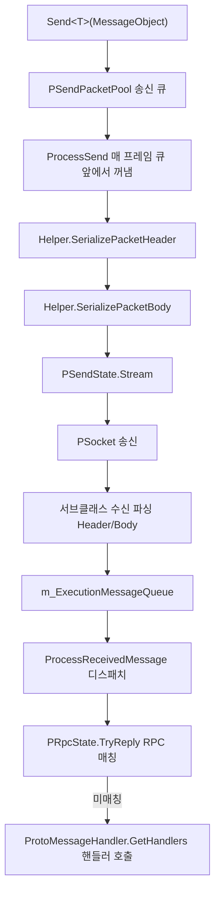

# 작동 원리: 네트워크 채널과 데이터 송수신 흐름

네트워크 채널(`NetworkChannelBase`)은 `NetworkManager`에서 하나의 연결을 담당하는 송수신 유닛입니다: 송신 메시지는 먼저 큐에 들어가고 매 프레임 `Update`에 의해 구동되어 직렬화된 후 출력되며; 수신 메시지는 서브클래스(TCP / WebSocket)에서 파싱된 후 스레드 안전 큐에 진입하고, 다시 메인 스레드에서 RPC 또는 메시지 핸들러로 일괄 디스패치됩니다. 동시에 하트비트 및 타임아웃 연결 끊김 메커니즘이 함께 제공됩니다.

## 전체 데이터 흐름



송신과 수신의 합류 지점은 모두 `NetworkChannelBase.Update`에 있으며, 서브클래스 구현은 구체적인 Socket 송수신만 담당합니다.

## 채널 폴링: Update 한 프레임에서 수행하는 작업

매 프레임 고정된 순서대로 송신, 수신, 하트비트, 메시지 디스패치 및 RPC 타임아웃 검사를 실행합니다:

```csharp
public virtual void Update(float elapseSeconds, float realElapseSeconds)
{
    if (PSocket == null || !PActive)
    {
        return;
    }

    ProcessSend();
    ProcessReceive();
    if (PSocket == null || !PActive)
    {
        return;
    }

    ProcessHeartBeat(realElapseSeconds);
    ProcessReceivedMessage();
    PRpcState.Update(elapseSeconds, realElapseSeconds);
}
```

Source: [NetworkManager.NetworkChannelBase.cs](https://github.com/GameFrameX/com.gameframex.unity.network/blob/main/Runtime/Network/Network/NetworkManager.NetworkChannelBase.cs#L378-L395)

## 송신 흐름

1. `Send<T>`를 호출하여 사전 검사를 수행한 후, 메시지를 송신 큐 `PSendPacketPool`(`GameFrameworkLinkedList<MessageObject>`)에 넣습니다.
2. 매 프레임 `ProcessSend`가 큐 앞에서 메시지를 꺼내 `ProcessSendMessage`를 호출합니다.
3. `ProcessSendMessage`는 채널 헬퍼 `INetworkChannelHelper.SerializePacketHeader`와 `SerializePacketBody`를 순서대로 호출하여 직렬화 결과를 `PSendState.Stream`에 기록하고, 이어서 `ReferencePool.Release(messageObject)`로 메시지 객체를 회수합니다.
4. 어느 단계에서든 직렬화가 실패하면 `NetworkChannelError`(`NetworkErrorCode.SerializeError`)를 트리거하거나 `GameFrameworkException`을 던집니다.

```csharp
public void Send<T>(T messageObject) where T : MessageObject
{
    GameFrameworkGuard.NotNull(messageObject, nameof(messageObject));
    if (PSocket == null)
    {
        const string errorMessage = "You must connect first.";
        // ... NetworkChannelError 트리거 또는 예외 발생
    }

    if (!PActive)
    {
        const string errorMessage = "Socket is not active.";
        // ...
    }

    lock (PSendPacketPool)
    {
        PSendPacketPool.AddLast(messageObject);
    }
}
```

Source: [NetworkManager.NetworkChannelBase.cs](https://github.com/GameFrameX/com.gameframex.unity.network/blob/main/Runtime/Network/Network/NetworkManager.NetworkChannelBase.cs#L799-L830)

```csharp
protected virtual bool ProcessSendMessage(MessageObject messageObject)
{
    bool serializeResult = PNetworkChannelHelper.SerializePacketHeader(messageObject, PSendState.Stream, out var messageBodyBuffer);
    if (serializeResult)
    {
        serializeResult = PNetworkChannelHelper.SerializePacketBody(messageBodyBuffer, PSendState.Stream);
    }
    else
    {
        const string errorMessage = "Serialized packet failure.";
        throw new InvalidOperationException(errorMessage);
    }

    ReferencePool.Release(messageObject);
    return serializeResult;
}
```

Source: [NetworkManager.NetworkChannelBase.cs](https://github.com/GameFrameX/com.gameframex.unity.network/blob/main/Runtime/Network/Network/NetworkManager.NetworkChannelBase.cs#L867-L882)

## 수신 흐름

수신된 메시지 객체는 `m_ExecutionMessageQueue`(`ConcurrentQueue<MessageObject>`, 서브클래스가 수신 스레드에서 기록)에 들어가며, 메인 스레드는 매 프레임 `ProcessReceivedMessage`에서 디스패치합니다:

1. 먼저 `PRpcState.TryReply(messageObject)`를 호출하여 완료되지 않은 RPC 호출과의 매칭을 시도하고, 매칭이 성공하면 해당 메시지의 처리를 종료합니다.
2. 매칭이 실패하면 메시지 타입에 따라 등록된 핸들러 `ProtoMessageHandler.GetHandlers(messageObject.GetType())`를 가져와, 각각 `SetMessageObject` 후 `Invoke()` 합니다.
3. 개별 핸들러가 던진 예외는 `Log.Fatal(e)`로 기록되며, 같은 프레임의 나머지 메시지 디스패치를 중단하지 않습니다.

```csharp
private void ProcessReceivedMessage()
{
    while (m_ExecutionMessageQueue.TryDequeue(out var messageObject))
    {
        try
        {
            // RPC 매칭 실행
            var replySuccess = PRpcState.TryReply(messageObject);
            if (replySuccess)
            {
                continue;
            }

            // 알림 메시지 실행
            var handlers = ProtoMessageHandler.GetHandlers(messageObject.GetType());
            foreach (var handler in handlers)
            {
                handler.SetMessageObject(messageObject);
                try
                {
                    handler.Invoke();
                }
                catch (Exception e)
                {
                    Log.Fatal(e);
                }
            }
        }
        catch (Exception e)
        {
            Log.Fatal(e);
        }
    }
}
```

Source: [NetworkManager.NetworkChannelBase.cs](https://github.com/GameFrameX/com.gameframex.unity.network/blob/main/Runtime/Network/Network/NetworkManager.NetworkChannelBase.cs#L400-L433)

기본 클래스의 `ProcessReceive()`는 현재 빈 구현이며, 실제 바이트 수신과 Header/Body 파싱은 서브클래스 `SystemTcpNetworkChannel`과 `WebSocketNetworkChannel`에서 수행되고, 파싱 성공 후 `m_ExecutionMessageQueue`에 일괄 기록됩니다.

## RPC 호출

`Call<TResult>`는 "송신 + 응답 대기"의 조합입니다: 먼저 `Send(messageObject)`로 큐에 넣고, 다시 `await PRpcState.Call(messageObject, isIgnoreErrorCode)`로 같은 채널의 수신 흐름에서 `TryReply`가 응답에 매칭되기를 기다립니다. 반환 타입이 `TResult`와 일치하지 않으면 다음을 던집니다:

```
RPC response type mismatch. Expected: {0}, Actual: {1}
```

Source: [NetworkManager.NetworkChannelBase.cs](https://github.com/GameFrameX/com.gameframex.unity.network/blob/main/Runtime/Network/Network/NetworkManager.NetworkChannelBase.cs#L777-L791)

## 하트비트 및 타임아웃 연결 끊김

하트비트 기본값: 간격 `DefaultHeartBeatInterval = 30f`초, 손실이 `DefaultMissHeartBeatCountByClose = 10`회를 초과하면 연결 끊김이 트리거됩니다. `RegisterHeartBeatHandler(IPacketHeartBeatHandler)`를 통해 재정의할 수 있습니다(handler의 `HeartBeatInterval`, `MissHeartBeatCountByClose`가 0보다 클 때 적용).

`ProcessHeartBeat`의 판정 로직:

- `HeartBeatElapseSeconds`에 `realElapseSeconds`를 누산하며, `PHeartBeatInterval`에 도달하면 `sendHeartBeat`를 설정하고 타이머를 0으로 초기화한 뒤 `MissHeartBeatCount++`를 수행합니다.
- 하트비트 송신(`PNetworkChannelHelper.SendHeartBeat()`)이 성공하고 이전에 하트비트를 손실한 적이 있으면 `NetworkChannelMissHeartBeat` 콜백을 트리거합니다.
- `MissHeartBeatCount > MissHeartBeatCountByClose`이면 `Close(NetworkCloseReason.MissHeartBeat, (ushort)NetworkErrorCode.MissHeartBeatError)`를 호출하여 능동적으로 연결을 끊습니다.

Source: [NetworkManager.NetworkChannelBase.cs](https://github.com/GameFrameX/com.gameframex.unity.network/blob/main/Runtime/Network/Network/NetworkManager.NetworkChannelBase.cs#L439-L488)

## 연결 및 닫기

`Connect(Uri address, object userData = null)`는 다음을 수행합니다: 기존 연결 닫기 → 호스트를 `IPEndPoint`로 파싱(파싱 실패 시 `NetworkCloseReason.ConnectAddressError` / `ConnectAddressExceptionError`로 닫고 `NetworkChannelError` 콜백) → `AddressFamily`에 따라 `PAddressFamily` 설정(IPv4/IPv6, 지원하지 않는 타입은 `NetworkErrorCode.AddressFamilyError` 보고) → `PSendState.Reset()`, `PReceiveState.PrepareForPacketHeader()`로 패킷 헤더 수신 준비.

`Close(string reason, ushort code = 0)`는 락 내에서 순서대로: `PActive = false` → `PSocket.Shutdown()` / `Close()` → `NetworkChannelClosed` 콜백 트리거 → 송신 큐, 하트비트 상태, RPC 상태 및 `m_ExecutionMessageQueue`의 미디스패치 메시지를 비웁니다.

Source: [NetworkManager.NetworkChannelBase.cs](https://github.com/GameFrameX/com.gameframex.unity.network/blob/main/Runtime/Network/Network/NetworkManager.NetworkChannelBase.cs#L723-L768)

## 채널의 핸들러 등록

| 메서드 | 핸들러 | 기능 |
|------|--------|------|
| `RegisterHandler(IPacketSendHeaderHandler)` | 송신 패킷 헤더 | 메시지 헤더 직렬화 |
| `RegisterHandler(IPacketSendBodyHandler)` | 송신 패킷 바디 | 메시지 바디 직렬화 |
| `RegisterHandler(IPacketReceiveHeaderHandler)` | 수신 패킷 헤더 | 메시지 헤더 파싱 |
| `RegisterHandler(IPacketReceiveBodyHandler)` | 수신 패킷 바디 | 메시지 바디 파싱 |
| `RegisterHeartBeatHandler(IPacketHeartBeatHandler)` | 하트비트 | 하트비트 메시지 정의 및 간격/연결 끊김 횟수 재정의 |
| `RegisterMessageCompressHandler(IMessageCompressHandler)` | 압축 | 송신 측 메시지 압축, null 전달 시 비활성화 |
| `RegisterMessageDecompressHandler(IMessageDecompressHandler)` | 압축 해제 | 수신 측 메시지 압축 해제, null 전달 시 비활성화 |
| `SetRPCErrorHandler(EventHandler<MessageObject>)` | RPC | RPC 오류 콜백 |

모든 등록 메서드는 내부에서 `GameFrameworkGuard.NotNull` 검증을 수행하며, null을 전달하면 파라미터 예외가 발생합니다. 기본 구현은 [DefaultNetworkChannelHelper.cs](https://github.com/GameFrameX/com.gameframex.unity.network/blob/main/Runtime/Network/Helper/DefaultNetworkChannelHelper.cs#L13)를 참고하십시오.

## 일반적인 오류

| 현상 | 원인 | 처리 |
|------|------|------|
| `You must connect first.` | `Send` 시 `PSocket == null`, 아직 연결되지 않음 | 먼저 `Connect`를 호출하고 연결 성공을 기다립니다 |
| `Socket is not active.` | 연결은 설정되었지만 `PActive`가 false | 채널이 닫혔거나 오류로 비활성 상태가 되었는지 확인 |
| `Serialized packet failure.` / `NetworkErrorCode.SerializeError` | Header 또는 Body 직렬화 실패 | `INetworkChannelHelper`의 직렬화 구현과 메시지 정의 확인 |
| 오류 없이 메시지 콜백을 받지 못함 | 응답이 `PRpcState.TryReply`에서 소비되었거나, 메시지 타입에 핸들러가 등록되지 않음 | `ProtoMessageHandler`를 통해 핸들러가 등록되었는지 확인 |
| 연결이 능동적으로 끊기고 오류 코드 `MissHeartBeatError` | 하트비트 손실 횟수가 `MissHeartBeatCountByClose` 초과 | 하트비트 핸들러 파라미터 조정 또는 네트워크 품질 점검 |

## 관련 링크

- 채널 서브클래스 구현: [NetworkManager.SystemTcpNetworkChannel.cs](https://github.com/GameFrameX/com.gameframex.unity.network/blob/main/Runtime/Network/Network/SystemSocket/NetworkManager.SystemTcpNetworkChannel.cs#L45), [NetworkManager.WebSocketNetworkChannel.cs](https://github.com/GameFrameX/com.gameframex.unity.network/blob/main/Runtime/Network/Network/WebSocket/NetworkManager.WebSocketNetworkChannel.cs#L48)
- 기본 채널 헬퍼: [DefaultNetworkChannelHelper.cs](https://github.com/GameFrameX/com.gameframex.unity.network/blob/main/Runtime/Network/Helper/DefaultNetworkChannelHelper.cs#L13)
- 하트비트 핸들러 기본 클래스: [BasePacketHeartBeatHandler.cs](https://github.com/GameFrameX/com.gameframex.unity.network/blob/main/Runtime/Network/Helper/BasePacketHeartBeatHandler.cs)
- 오류 코드 정의: [NetworkErrorCode.cs](https://github.com/GameFrameX/com.gameframex.unity.network/blob/main/Runtime/Network/Base/NetworkErrorCode.cs)