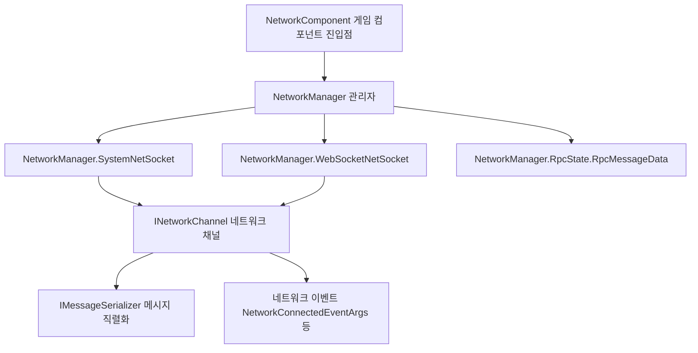

# 개요

Game Frame X Network는 GameFrameX의 **장기 연결 네트워크 컴포넌트**(패키지명 `com.gameframex.unity.network`)로, Unity 프로젝트에 TCP / WebSocket 장기 연결, RPC 호출, 하트비트 유지, 플러그 가능한 메시지 직렬화 및 네트워크 이벤트 등의 기능을 제공하며, Windows, macOS, Linux, Android, iOS 및 WebGL 플랫폼을 지원합니다.

## 빠른 시작

### 설치

아래 방법 중 하나를 선택하세요(내용은 공식 중국어 README에서 발췌):

1. Unity 프로젝트의 `Packages/manifest.json`을 편집하여 `scopedRegistries`를 추가하고 의존성을 선언합니다:

```json
{
  "scopedRegistries": [
    {
      "name": "GameFrameX",
      "url": "https://gameframex.upm.alianblank.uk",
      "scopes": [
        "com.gameframex"
      ]
    }
  ],
  "dependencies": {
    "com.gameframex.unity.network": "2.6.6"
  }
}
```

Source: [README.zh-CN.md](https://github.com/GameFrameX/com.gameframex.unity.network/blob/main/README.zh-CN.md#L44-L59)

2. `manifest.json`의 `dependencies` 노드에 직접 추가합니다:

```json
{
  "com.gameframex.unity.network": "https://github.com/gameframex/com.gameframex.unity.network.git"
}
```

Source: [README.zh-CN.md](https://github.com/GameFrameX/com.gameframex.unity.network/blob/main/README.zh-CN.md#L64-L69)

3. Unity의 `Package Manager`에서 `Git URL` 방식으로 저장소 주소를 추가합니다: `https://github.com/gameframex/com.gameframex.unity.network.git`.
4. 저장소를 직접 다운로드하여 Unity 프로젝트의 `Packages` 디렉터리에 배치하면 Unity가 자동으로 로드하여 인식합니다.

설치 완료 후 `scopedRegistries`가 적용되도록 Unity를 재시작하거나 Package Manager를 새로고침해야 합니다. `scopes`는 `com.gameframex`로 시작하는 패키지에만 적용됩니다.

### 의존성 요구 사항

| 의존성 패키지 | 버전 |
|--------|------|
| `com.gameframex.unity` | 1.1.1 |
| `com.gameframex.unity.event` | 1.0.0 |

Source: [README.zh-CN.md](https://github.com/GameFrameX/com.gameframex.unity.network/blob/main/README.zh-CN.md#L97-L102)

### 주요 기능

| 기능 | 설명 |
|------|------|
| 장기 연결 | TCP(`SystemNetSocket`)와 WebSocket(`WebSocketNetSocket`) 두 가지 Socket 구현 |
| RPC 호출 | RPC 호출 메커니즘 및 타임아웃 처리(`RpcState` / `RpcMessageData`) |
| 하트비트 패킷 | 하트비트 연결 유지, 애플리케이션 포커스 획득/상실 시 전송 설정 지원 |
| 플러그형 직렬화 | `IMessageSerializer` 인터페이스, 2단계 등록 지원(전역 기본값 + 채널별 오버라이드) |
| 네트워크 채널 관리 | 채널 단위로 연결 생성 및 관리(`INetworkChannel`) |
| 네트워크 이벤트 | 연결 / 연결 해제 / 오류 / 하트비트 유실 등의 이벤트 파라미터(`NetworkConnectedEventArgs` 등) |

Source: [README.zh-CN.md](https://github.com/GameFrameX/com.gameframex.unity.network/blob/main/README.zh-CN.md#L28-L36)

## 동작 원리 요약

이 컴포넌트는 `NetworkComponent`(Unity 씬에 배치되는 `GameFrameworkComponent`)를 통합 진입점으로 사용하며, 내부적으로 `NetworkManager`의 여러 partial 구현(`SystemNetSocket` / `WebSocketNetSocket` / `RpcState`)에 위임하여 서로 다른 전송 계층과 RPC 상태 관리를 수행합니다:



- 소스 코드 진입점: [NetworkComponent.cs](https://github.com/GameFrameX/com.gameframex.unity.network/blob/main/Runtime/Network/NetworkComponent.cs#L45)(`public sealed class NetworkComponent : GameFrameworkComponent`)
- 채널 인터페이스: [INetworkChannel.cs](https://github.com/GameFrameX/com.gameframex.unity.network/blob/main/Runtime/Network/Interface/INetworkChannel.cs#L42)(`public interface INetworkChannel`)
- 채널 헬퍼 인터페이스: [INetworkChannelHelper.cs](https://github.com/GameFrameX/com.gameframex.unity.network/blob/main/Runtime/Network/Interface/INetworkChannelHelper.cs#L39)(`public interface INetworkChannelHelper`)
- TCP 구현: [NetworkManager.SystemNetSocket.cs](https://github.com/GameFrameX/com.gameframex.unity.network/blob/main/Runtime/Network/Network/SystemSocket/NetworkManager.SystemNetSocket.cs#L7)
- WebSocket 구현: [NetworkManager.WebSocketNetSocket.cs](https://github.com/GameFrameX/com.gameframex.unity.network/blob/main/Runtime/Network/Network/WebSocket/NetworkManager.WebSocketNetSocket.cs#L10)
- RPC 상태: [NetworkManager.RpcState.RpcMessageData.cs](https://github.com/GameFrameX/com.gameframex.unity.network/blob/main/Runtime/Network/Network/NetworkManager.RpcState.RpcMessageData.cs#L7)

## 다음 단계

- 공식 문서: https://gameframex.doc.alianblank.com
- 업데이트 로그: 저장소의 [CHANGELOG.md](https://github.com/GameFrameX/com.gameframex.unity.network/blob/main/CHANGELOG.md) 참조
- 오픈소스 라이선스: [LICENSE.md](https://github.com/GameFrameX/com.gameframex.unity.network/blob/main/LICENSE.md) 참조
- 커뮤니티 지원: QQ 그룹 467608841 / 233840761([QR 코드](https://qm.qq.com/cgi-bin/qm/qr?k=ikT9gA5m2sKwOyNOfYmQvSAPK_c3GmD6)를 통해 가입)