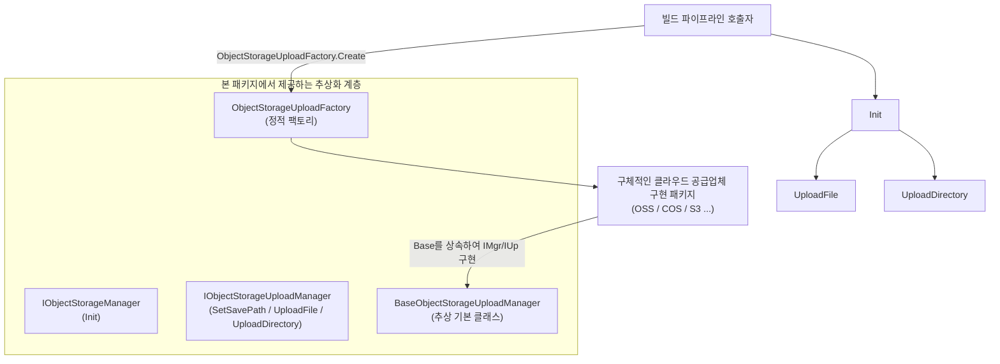

# 객체 스토리지 컴포넌트 개요

GameFrameX 객체 스토리지 컴포넌트(`com.gameframex.unity.objectstorage`)는 Unity 프로젝트에 파일과 디렉토리를 클라우드 객체 스토리지 서비스로 업로드하기 위한 기본 인터페이스와 추상화를 제공합니다. 자체는 특정 클라우드 공급업체에 종속되지 않으며, `IObjectStorageManager` / `IObjectStorageUploadManager` 인터페이스를 통해 핵심 계약을 정의하고, 각 서비스 제공업체(OSS, COS, S3 등)의 구체적인 구현은 독립된 패키지 형태로 제공됩니다.

## 빠른 시작

1. **패키지 설치**. Unity 프로젝트 루트 디렉터리의 `Packages/manifest.json`에 의존성을 추가합니다(아래 중 하나 선택):
   - GameFrameX의 scoped registry를 통해:
     ```json
     {
       "scopedRegistries": [
         {
           "name": "GameFrameX",
           "url": "https://gameframex.upm.alianblank.uk",
           "scopes": ["com.gameframex"]
         }
       ],
       "dependencies": {
         "com.gameframex.unity.objectstorage": "1.1.0"
       }
     }
     ```
   - Git URL 형식으로 직접 추가:
     ```json
     {
       "dependencies": {
         "com.gameframex.unity.objectstorage": "https://github.com/gameframex/com.gameframex.unity.objectstorage.git"
       }
     }
     ```
   - 또는 저장소를 `Packages/` 디렉터리로 클론하면 Unity가 자동으로 로드합니다.

   Source: [README.md](https://github.com/GameFrameX/com.gameframex.unity.objectstorage/blob/main/README.md#L37-L68)

2. **대상 플랫폼 지원 여부 확인**:

   | 플랫폼 | 지원 |
   |------|------|
   | Windows | 예 |
   | macOS | 예 |
   | Linux | 예 |
   | Android | 예 |
   | iOS | 예 |

   Source: [README.zh-CN.md](https://github.com/GameFrameX/com.gameframex.unity.objectstorage/blob/main/README.zh-CN.md#L69-L78)

3. **구체적인 구현 선택**. 본 패키지는 추상화와 기본 구현만 제공하므로, 클라우드 공급업체에 따라 해당 구현 패키지(예: OSS, COS, MinIO 등)를 연동해야 합니다.

4. **업로드 인터페이스 호출**. 에디터 빌드 파이프라인에서 `ObjectStorageUploadFactory`를 통해 업로드 관리자 인스턴스를 가져오고, `Init`을 호출하여 자격 증명을 설정한 다음, `UploadFile` / `UploadDirectory`를 호출하여 리소스를 업로드합니다.

## 작동 원리 요약



- `IObjectStorageManager` 인터페이스는 `Init`만 노출하며, 자격 증명과 버킷 이름 연동을 담당합니다;
- `IObjectStorageUploadManager`는 여기에 `SetSavePath`, `UploadFile`, `UploadDirectory`를 확장합니다;
- `BaseObjectStorageUploadManager`는 추상 기본 클래스이며, 서드 party 구현 패키지가 이를 상속받으면 `ObjectStorageUploadFactory`가 인스턴스를 생성합니다.

Source: [IObjectStorageManager.cs](https://github.com/GameFrameX/com.gameframex.unity.objectstorage/blob/main/Editor/IObjectStorageManager.cs#L1-L14)、[IObjectStorageUploadManager.cs](https://github.com/GameFrameX/com.gameframex.unity.objectstorage/blob/main/Editor/IObjectStorageUploadManager.cs#L1-L22)、[ObjectStorageUploadFactory.cs](https://github.com/GameFrameX/com.gameframex.unity.objectstorage/blob/main/Editor/ObjectStorageUploadFactory.cs)

## 다음 단계

- 인터페이스 계약과 시그니처 세부 사항은 《[인터페이스 참고](reference/interfaces)》을 참조하세요.
- 구체적인 클라우드 공급업체 구현을 연동하고 첫 업로드를 완료하는 방법은 《[객체 스토리지에 파일을 업로드하는 방법](tasks/upload-file)》을 참조하세요.
- 업로드 실패 시 문제 해결 방법은 《[업로드 실패 시 대처법](troubleshooting/upload-failures)》을 참조하세요.