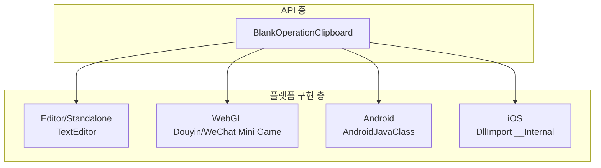
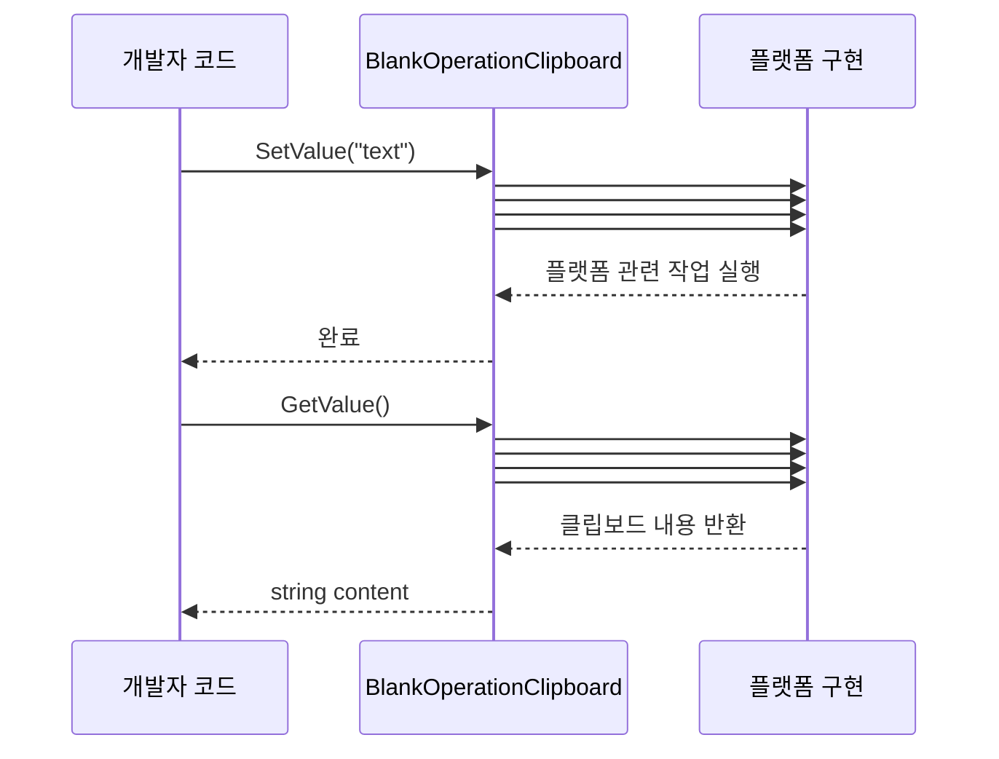

# 사용 방법

이 문서는 BlankOperationClipboard 플러그인으로 클립보드의 읽기/쓰기 작업을 수행하는 방법을 소개합니다.

## 개요

BlankOperationClipboard는 크로스 플랫폼 Unity 클립보드 작업 도구 클래스로, 시스템 클립보드 콘텐츠를 가져오고 설정하기 위한 간결한 API 인터페이스를 제공합니다. 이 라이브러리는 조건부 컴파일을 통해 Unity 에디터, 데스크톱 플랫폼, WebGL(抖音/微信小游戏), Android 및 iOS를 포함한 다양한 플랫폼을 지원합니다.

**설계 의도**: 통일된 정적 메서드 인터페이스를 통해 개발자는 하위 플랫폼 구현 세부 사항을 고려할 필요 없이 크로스 플랫폼 클립보드 작업을 완료할 수 있습니다.

## 아키텍처



**아키텍처 설명**:
- **API 층**: 통일된 `GetValue()` 및 `SetValue(string)` 정적 메서드 제공
- **플랫폼 구현 층**: C# 조건부 컴파일 (`#if`)을 통해 각 플랫폼의 네이티브 호출 구현

## 핵심 API

### `GetValue(): string`

현재 시스템 클립보드에서 텍스트 콘텐츠를 가져옵니다.

**반환값**: 클립보드의 텍스트 콘텐츠; 클립보드가 비어 있으면 빈 문자열 반환.

> Source: [BlankOperationClipboard.cs](https://github.com/GameFrameX/com.gameframex.unity.operationclipboard/blob/main/Runtime/BlankOperationClipboard.cs#L31-L69)

### `SetValue(text: string): void`

지정된 텍스트 콘텐츠를 시스템 클립보드에 설정합니다.

**매개변수**:
- `text` (string): 클립보드에 설정할 텍스트 콘텐츠

> Source: [BlankOperationClipboard.cs](https://github.com/GameFrameX/com.gameframex.unity.operationclipboard/blob/main/Runtime/BlankOperationClipboard.cs#L78-L106)

## 기본 사용법

### 클립보드 콘텐츠 읽기

```csharp
using UnityEngine;

public class ClipboardDemo : MonoBehaviour
{
    void ReadClipboard()
    {
        // 클립보드 콘텐츠 가져오기
        string clipboardContent = BlankOperationClipboard.GetValue();
        Debug.Log("클립보드 내용: " + clipboardContent);
    }
}
```
> Source: [BlankOperationClipboardExample.cs](https://github.com/GameFrameX/com.gameframex.unity.operationclipboard/blob/main/Samples~/BlankOperationClipboardExample.cs#L46-L50)

### 클립보드 콘텐츠 쓰기

```csharp
using UnityEngine;

public class ClipboardDemo : MonoBehaviour
{
    void WriteClipboard()
    {
        // 클립보드 콘텐츠 설정
        string textToCopy = "복사할 텍스트 내용";
        BlankOperationClipboard.SetValue(textToCopy);
        Debug.Log("클립보드 내용 설정 완료");
    }
}
```
> Source: [BlankOperationClipboardExample.cs](https://github.com/GameFrameX/com.gameframex.unity.operationclipboard/blob/main/Samples~/BlankOperationClipboardExample.cs#L44-L47)

### 완전한 예시

다음은 읽기/쓰기 작업을 결합하는 완전한 MonoBehaviour 예시입니다:

```csharp
using UnityEngine;

public class BlankOperationClipboardExample : MonoBehaviour
{
    private string text = "AAAA";
    private string result = "";

    void OnGUI()
    {
        // 텍스트 입력 필드
        text = GUILayout.TextField(text, GUILayout.Width(500), GUILayout.Height(100));

        // 클립보드 설정 버튼
        if (GUILayout.Button("SetValue", GUILayout.Width(500), GUILayout.Height(100)))
        {
            BlankOperationClipboard.SetValue(text);
        }

        // 클립보드 읽기 버튼
        if (GUILayout.Button("GetValue", GUILayout.Width(500), GUILayout.Height(100)))
        {
            result = BlankOperationClipboard.GetValue();
        }

        // 읽은 결과 표시
        GUILayout.Label(result);
    }
}
```
> Source: [BlankOperationClipboardExample.cs](https://github.com/GameFrameX/com.gameframex.unity.operationclipboard/blob/main/Samples~/BlankOperationClipboardExample.cs#L37-L53)

## 플랫폼 동작 차이

서로 다른 플랫폼에서 클립보드를 가져오는 동작에는 차이가 있습니다:

| 플랫폼 | 클립보드 가져오기 | 클립보드 설정 | 참고 |
|------|-----------|-----------|------|
| Unity Editor | TextEditor를 사용하여 붙여넣기 시뮬레이션 | TextEditor를 사용하여 복사 시뮬레이션 | 개발 디버깅용 |
| Standalone | TextEditor를 사용하여 붙여넣기 시뮬레이션 | TextEditor를 사용하여 복사 시뮬레이션 | 데스크톱 플랫폼 |
| WebGL (抖音) | 비동기 콜백으로 가져오기 | 동기 설정 | ENABLE_DOUYIN_MINI_GAME 활성화 필요 |
| WebGL (微信) | 비동기 콜백으로 가져오기 | 동기 설정 | ENABLE_WECHAT_MINI_GAME 활성화 필요 |
| Android | Java 메서드 GetClipBoard 호출 | Java 메서드 SetClipBoard 호출 | Android 네이티브 플러그인 필요 |
| iOS | 네이티브 메서드 GetClipBoard 호출 | 네이티브 메서드 SetClipBoard 호출 | iOS 네이티브 플러그인 필요 |

> ⚠️ 주의: Android 및 iOS 플랫폼은 올바르게 작동하려면 해당 네이티브 플러그인이 구성되어야 합니다. 상세 구성은 [플랫폼 구성](./05.platforms) 문서를 참고하세요.

## 핵심 흐름



## 주의 사항

1. **빈 값 처리**: `GetValue()` 메서드는 클립보드가 비어 있을 때 빈 문자열 `""`을 반환하며, `null`이 아닙니다.

2. **Unity 에디터 제한**: 에디터에서 실행할 때 `TextEditor` 클래스를 사용하여 클립보드 작업을 시뮬레이션합니다. 이는 에디터 창이 활성화된 상태여야 포커스를 올바르게 가져올 수 있음을 의미합니다.

3. **WebGL 비동기 가져오기**: WebGL 플랫폼(抖音/微信小游戏)에서 클립보드 콘텐츠 가져오기는 비동기 작업입니다. 현재 구현은 콜백 방식을 사용합니다.

4. **플랫폼 네이티브 플러그인**: Android 및 iOS 플랫폼은 네이티브 플러그인과 함께 사용해야 합니다. 플랫폼 관련 네이티브 코드가 올바르게 구성되었는지 확인하세요.

## 관련 링크

- [개요](./01.overview) - 프로젝트 전체 소개
- [설치](./02.installation) - 설치 가이드
- [플랫폼 구성](./05.platforms) - 각 플랫폼 상세 구성 설명
- [예제](./06.samples) - 더 많은 사용 예시
- [자주 묻는 질문](./07.troubleshooting) - 자주 묻는 질문과 해결책