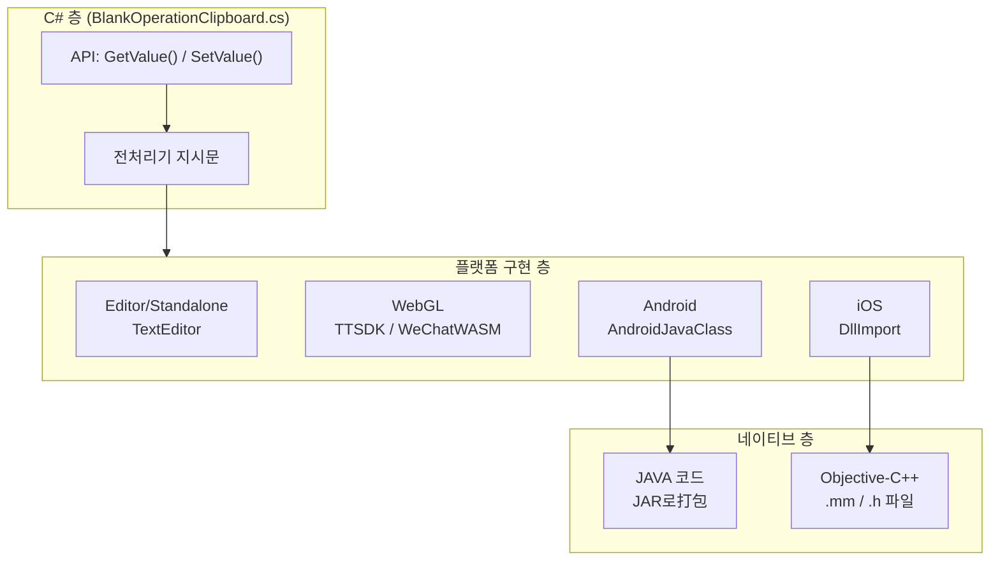

# 플랫폼 구성

이 문서는 BlankOperationClipboard 플러그인의 각 플랫폼에서의 구성 방법을 상세히 소개하며, Android, iOS, WebGL小游戏 등 플랫폼의 네이티브 코드 통합 및 구성 요구 사항을 포함합니다.

## 개요

BlankOperationClipboard 플러그인은 플랫폼 특정 전처리기 지시문을 통해 크로스 플랫폼 클립보드 작업을 구현합니다. 서로 다른 플랫폼은 서로 다른 네이티브 코드 구성이 필요합니다:

| 플랫폼 | 구현 방식 | 핵심 파일 |
|------|----------|----------|
| Android | AndroidJavaClass JAR 호출 | `Plugins/Android/com.alianhome.operationclipboard.jar` |
| iOS | DllImport Objective-C++ 호출 | `Plugins/iOS/BlankOperationClipboard/` |
| WebGL (抖音) | TTSDK.TT API | C# 조건부 컴파일 `ENABLE_DOUYIN_MINI_GAME` |
| WebGL (微信) | WeChatWASM API | C# 조건부 컴파일 `ENABLE_WECHAT_MINI_GAME` |
| Editor/Standalone | TextEditor 클래스 | 추가 구성 불필요 |

## 아키텍처



### 플랫폼 호출 흐름

```mermaid
sequenceDiagram
    participant User as 사용자 코드
    participant CSharp as C# 층
    participant Native as 네이티브 플랫폼
    participant System as 시스템 클립보드

    User->>CSharp: BlankOperationClipboard.GetValue()
    CSharp->>CSharp: #if UNITY_IOS 판단 플랫폼

    alt UNITY_IOS
        CSharp->>Native: DllImport 호출 GetClipBoard()
        Native->>System: UIPasteboard.generalPasteboard
        System-->>Native: 클립보드 내용
        Native-->>CSharp: char* 반환값
    elif UNITY_ANDROID
        CSharp->>Native: AndroidJavaClass.CallStatic()
        Native->>System: Android ClipboardManager
        System-->>Native: 클립보드 내용
        Native-->>CSharp: String 반환값
    elif UNITY_WEBGL
        CSharp->>Native: TTSDK.TT / WeChatWASM API
        Native-->>CSharp: 비동기 콜백
    else
        CSharp->>System: GUIUtility.systemCopyBuffer
    end

    CSharp-->>User: string 내용
```

## 플랫폼 상세 구성

### Android 플랫폼 구성

Android 플랫폼은 `Plugins/Android` 디렉토리에 네이티브 JAR 파일을 배치해야 합니다.

**파일 위치:**
```
Plugins/
└── Android/
    └── com.alianhome.operationclipboard.jar
```

**JAR 패키지 구조:**
JAR 파일에는 다음 정적 메서드를 제공하는 `MainActivity` 클래스가 포함되어 있습니다:
- `GetClipBoard()`: 클립보드 내용 가져오기
- `SetClipBoard(String text)`: 클립보드 내용 설정

**C# 호출 코드:**
```csharp
#if UNITY_ANDROID
using (AndroidJavaClass androidJavaClass = new AndroidJavaClass("com.alianhome.operationclipboard.MainActivity"))
{
    // 클립보드 가져오기
    string content = androidJavaClass.CallStatic<string>("GetClipBoard");

    // 클립보드 설정
    androidJavaClass.CallStatic("SetClipBoard", text);
}
#endif
```
> Source: [BlankOperationClipboard.cs](https://github.com/GameFrameX/com.gameframex.unity.operationclipboard/blob/main/Runtime/BlankOperationClipboard.cs#L58-L62)

### iOS 플랫폼 구성

iOS 플랫폼은 `Plugins/iOS` 디렉토리에 네이티브 Objective-C++ 코드 파일을 배치해야 합니다.

**파일 구조:**
```
Plugins/
└── iOS/
    └── BlankOperationClipboard/
        ├── BlankOperationClipboard.h
        └── BlankOperationClipboard.mm
```

**헤더 파일 (BlankOperationClipboard.h):**
```objc
#import <Foundation/Foundation.h>

@interface BlankOperationClipboard : NSObject

#if defined (__cplusplus)
extern "C" {
#endif
    char * GetClipBoard();
    void SetClipBoard(char* text);
#if defined (__cplusplus)
}
#endif

@end
```
> Source: [BlankOperationClipboard.h](https://github.com/GameFrameX/com.gameframex.unity.operationclipboard/blob/main/Plugins/iOS/BlankOperationClipboard/BlankOperationClipboard.h#L1-L14)

**구현 파일 (BlankOperationClipboard.mm):**
```objc
#import "BlankOperationClipboard.h"

@implementation BlankOperationClipboard

    char * GetClipBoard(){
        UIPasteboard * pasteboard = [UIPasteboard generalPasteboard];
        const char * a = [pasteboard.string UTF8String];
        char * b = (char*)malloc(strlen(a)+1);
        strcpy(b, a);
        return b;
    }
    void SetClipBoard(char * text){
        UIPasteboard * pasteboard = [UIPasteboard generalPasteboard];
        pasteboard.string = [NSString stringWithUTF8String:text];
    }

@end
```
> Source: [BlankOperationClipboard.mm](https://github.com/GameFrameX/com.gameframex.unity.operationclipboard/blob/main/Plugins/iOS/BlankOperationClipboard/BlankOperationClipboard.mm#L1-L22)

**C# 호출 코드:**
```csharp
#if UNITY_IOS
using System.Runtime.InteropServices;

[DllImport("__Internal")]
private static extern string GetClipBoard();

[DllImport("__Internal")]
private static extern void SetClipBoard(string text);
#endif
```
> Source: [BlankOperationClipboard.cs](https://github.com/GameFrameX/com.gameframex.unity.operationclipboard/blob/main/Runtime/BlankOperationClipboard.cs#L15-L21)

### WebGL 플랫폼 구성

WebGL 플랫폼은抖音와微信小游戏 지원하며, 조건부 컴파일을 통해 해당 기능을 활성화해야 합니다.

**抖音小游戏 구성:**

```csharp
#if ENABLE_DOUYIN_MINI_GAME
TTSDK.TT.GetClipboardData((b, text) =>
{
    if (b)
    {
        content = text;
    }
});
TTSDK.TT.SetClipboardData(text);
#endif
```
> Source: [BlankOperationClipboard.cs](https://github.com/GameFrameX/com.gameframex.unity.operationclipboard/blob/main/Runtime/BlankOperationClipboard.cs#L41-L49)

**微信小游戏 구성:**

```csharp
#if ENABLE_WECHAT_MINI_GAME
var clipboardDataOption = new WeChatWASM.GetClipboardDataOption
{
    success = option => { content = option.data; },
};
WeChatWASM.WX.GetClipboardData(clipboardDataOption);

WeChatWASM.WX.SetClipboardData(new WeChatWASM.SetClipboardDataOption
{
    data = text,
});
#endif
```
> Source: [BlankOperationClipboard.cs](https://github.com/GameFrameX/com.gameframex.unity.operationclipboard/blob/main/Runtime/BlankOperationClipboard.cs#L50-L56)

**조건부 컴파일 기호 활성화:**

Unity 프로젝트에서小游戏 지원 활성화를 위해 Player Settings에서 컴파일 기호를 추가해야 합니다:

| 컴파일 기호 | 플랫폼 | 설명 |
|----------|------|------|
| `ENABLE_DOUYIN_MINI_GAME` | WebGL |抖音小游戏 지원 활성화 |
| `ENABLE_WECHAT_MINI_GAME` | WebGL |微信小游戏 지원 활성화 |

### Editor와 Standalone 구성

Editor와 Standalone 플랫폼은 Unity 내장 `TextEditor` 클래스를 사용하며, 추가 네이티브 코드 구성이 필요하지 않습니다.

```csharp
#if UNITY_EDITOR || UNITY_STANDALONE
TextEditor textEditor = new TextEditor();
textEditor.OnFocus();
textEditor.Paste();  // 가져오기
textEditor.Copy();  // 설정
#endif
```
> Source: [BlankOperationClipboard.cs](https://github.com/GameFrameX/com.gameframex.unity.operationclipboard/blob/main/Runtime/BlankOperationClipboard.cs#L33-L38)

### 기타 플랫폼 구성

지원되지 않는 플랫폼의 경우, 플러그인은 `GUIUtility.systemCopyBuffer`로フォール백합니다:

```csharp
UnityEngine.GUIUtility.systemCopyBuffer = text;
```
> Source: [BlankOperationClipboard.cs](https://github.com/GameFrameX/com.gameframex.unity.operationclipboard/blob/main/Runtime/BlankOperationClipboard.cs#L67)

## 링커 구성

플러그인은 IL2CPP 컴파일 시 코드가 삭제되는 것을 방지하는 `link.xml` 파일을 포함합니다:

```xml
<?xml version="1.0" encoding="UTF-8"?>
<linker>
    <assembly fullname="BlankGetChannel.Runtime" preserve="all"/>
</linker>
```
> Source: [link.xml](https://github.com/GameFrameX/com.gameframex.unity.operationclipboard/blob/main/Runtime/link.xml#L1-L4)

## 플랫폼 호환성 요약

| 플랫폼 | 클립보드 읽기 | 클립보드 쓰기 | 참고 |
|------|------------|------------|------|
| Unity Editor | ✅ | ✅ | TextEditor 사용 |
| Standalone (PC/Mac) | ✅ | ✅ | TextEditor 사용 |
| Android | ✅ | ✅ | JAR 플러그인 필요 |
| iOS | ✅ | ✅ | .mm/.h 파일 필요 |
|抖音小游戏 | ✅ | ✅ | ENABLE_DOUYIN_MINI_GAME 필요 |
|微信小游戏 | ✅ | ✅ | ENABLE_WECHAT_MINI_GAME 필요 |
| 기타 플랫폼 | ✅ | ✅ | GUIUtility.systemCopyBuffer 사용 |

## 관련 링크

- [개요](./01.overview) - 프로젝트 개요 및 핵심 기능 소개
- [설치](./02.installation) - 플러그인 설치 방법
- [사용 방법](./04.usage) - API 사용 설명 및 코드 예제
- [예제](./06.samples) - 완전한 예제 코드
- [자주 묻는 질문](./07.troubleshooting) - 자주 묻는 질문排查