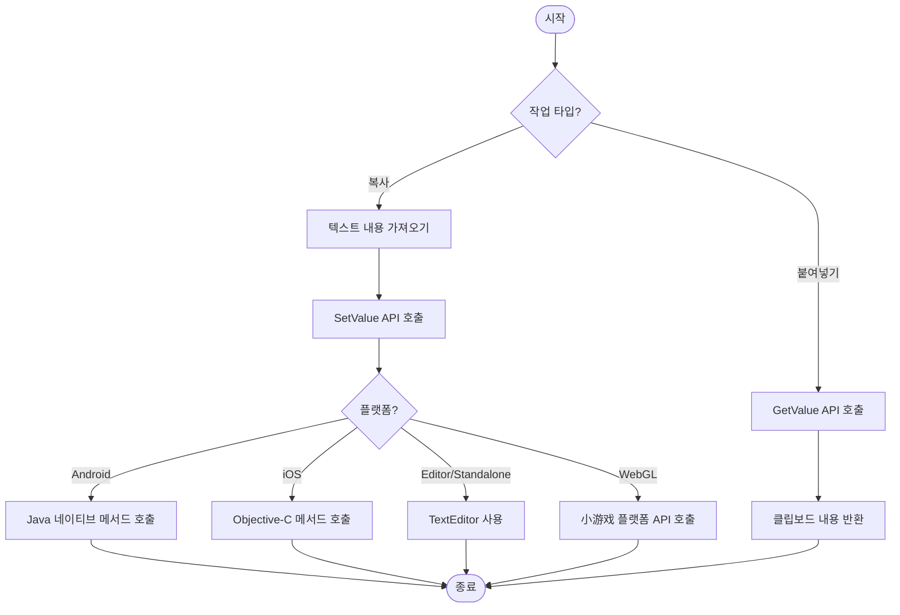

# 예제

이 문서는 `BlankOperationClipboard` 도구 클래스의 완전한 코드 예제를 제공하며, Unity 프로젝트에서 클립보드의 읽기 및 쓰기 작업을 구현하는 방법을 보여줍니다.

## 개요

`BlankOperationClipboard`는 크로스 플랫폼 정적 도구 클래스로, Unity 에디터, 데스크톱 플랫폼, WebGL(小游戏), Android 및 iOS를 포함한 다양한 플랫폼에서 클립보드 작업을 지원합니다. 이 클래스는 두 가지 핵심 API를 제공합니다: `GetValue()`는 클립보드 내용을 가져오고, `SetValue(string text)`는 클립보드 내용을 설정합니다.

> 참고: 완전한 API 메서드 시그니처 및 매개변수 설명은 [사용 방법](./04.usage) 문서를 참고하세요.

## 기본 사용 예제

다음 예제는 가장 기초적인 클립보드 읽기/쓰기 작업을 보여주며, Unity의 이전 OnGUI 시스템을 통해 간단한 인터랙션 인터페이스를 구현합니다.

```csharp
using UnityEngine;

public class BlankOperationClipboardExample : MonoBehaviour
{
    private string text = "AAAA";
    private string result = "";
    void OnGUI()
    {
        // 텍스트 입력 필드
        text = GUILayout.TextField(text, GUILayout.Width(500), GUILayout.Height(100));

        // 클립보드 설정 버튼
        if (GUILayout.Button("SetValue", GUILayout.Width(500), GUILayout.Height(100)))
        {
            BlankOperationClipboard.SetValue(text);
        }

        // 클립보드 가져오기 버튼
        if (GUILayout.Button("GetValue", GUILayout.Width(500), GUILayout.Height(100)))
        {
            result = BlankOperationClipboard.GetValue();
        }

        // 가져온 결과 표시
        GUILayout.Label(result);
    }
}
```

> Source: [BlankOperationClipboardExample.cs](https://github.com/GameFrameX/com.gameframex.unity.operationclipboard/blob/main/Samples~/BlankOperationClipboardExample.cs#L37-L54)

### 코드 분석

| 코드 단락 | 설명 |
|--------|------|
| `private string text = "AAAA"` | 클립보드에 복사할 텍스트 저장 |
| `private string result = ""` | 클립보드에서 읽은 결과 저장 |
| `GUILayout.TextField()` | 편집 가능한 텍스트 입력 필드 생성 |
| `BlankOperationClipboard.SetValue(text)` | 텍스트 내용을 시스템 클립보드에 작성 |
| `BlankOperationClipboard.GetValue()` | 시스템 클립보드에서 텍스트 내용 읽기 |
| `GUILayout.Label()` | 읽은 텍스트 결과 표시 |

##进阶使用 예제

### UI 버튼에서 사용

다음 예제는 최신 Unity UI 시스템에서 클립보드 기능을 사용하는 방법을 보여줍니다:

```csharp
using UnityEngine;
using UnityEngine.UI;

public class ClipboardUIExample : MonoBehaviour
{
    [SerializeField] private InputField inputField;
    [SerializeField] private Text resultText;
    [SerializeField] private Button copyButton;
    [SerializeField] private Button pasteButton;

    void Start()
    {
        // 버튼 클릭 이벤트 바인딩
        copyButton.onClick.AddListener(OnCopyClicked);
        pasteButton.onClick.AddListener(OnPasteClicked);
    }

    private void OnCopyClicked()
    {
        // 입력 필드 내용 가져와서 클립보드에 복사
        string content = inputField.text;
        BlankOperationClipboard.SetValue(content);
        Debug.Log($"클립보드에 복사됨: {content}");
    }

    private void OnPasteClicked()
    {
        // 클립보드에서 내용 읽기 및 표시
        string content = BlankOperationClipboard.GetValue();
        resultText.text = content;
        Debug.Log($"클립보드에서 읽기: {content}");
    }
}
```

### UGUI에서 사용

UGUI(Unity GUI) 시스템을 사용하는 프로젝트의 경우, 다음과 같이 통합할 수 있습니다:

```csharp
using UnityEngine;
using UnityEngine.UI;

public class UGUIClipboardExample : MonoBehaviour
{
    [SerializeField] private TMP_InputField inputField;
    [SerializeField] private TextMeshProUGUI resultText;

    public void CopyToClipboard()
    {
        if (string.IsNullOrEmpty(inputField.text))
        {
            Debug.LogWarning("입력 필드 내용이 비어 있습니다");
            return;
        }
        BlankOperationClipboard.SetValue(inputField.text);
    }

    public void PasteFromClipboard()
    {
        string clipboardContent = BlankOperationClipboard.GetValue();
        resultText.text = string.IsNullOrEmpty(clipboardContent)
            ? "클립보드가 비어 있습니다"
            : clipboardContent;
    }
}
```

### 게임 로직에서 사용

다음 예제는 게임 내 구매 또는兑换码 시나리오에서 클립보드 기능을 사용하는 방법을 보여줍니다:

```csharp
using UnityEngine;

public class GameClipboardExample : MonoBehaviour
{
    // 초대 링크 복사
    public void CopyInviteLink(string playerId)
    {
        string inviteLink = $"https://game.example.com/invite/{playerId}";
        BlankOperationClipboard.SetValue(inviteLink);
        Debug.Log($"초대 링크가 복사됨: {inviteLink}");
    }

    // 게임 내 지갑 주소 복사
    public void CopyWalletAddress(string walletAddress)
    {
        BlankOperationClipboard.SetValue(walletAddress);
        Debug.Log($"지갑 주소가 복사됨");
    }

    //兑换码 붙여넣기
    public string GetRedeemCode()
    {
        string code = BlankOperationClipboard.GetValue();
        //兑换码 형식 간단 검증
        if (string.IsNullOrWhiteSpace(code) || code.Length < 8)
        {
            Debug.LogWarning("유효하지 않은兑换码");
            return null;
        }
        return code.Trim().ToUpper();
    }
}
```

## 사용 흐름도

다음 흐름도는 클립보드 작업의 표준 프로세스를 보여줍니다:



## 플랫폼 주의 사항

| 플랫폼 | 주의 사항 |
|------|----------|
| Unity Editor | TextEditor 클래스를 사용하며, 에디터 창이 활성화된 상태여야 합니다 |
| Standalone | TextEditor를 사용하며, 대상 창이 포커스를 획득해야 합니다 |
| Android | Android 네이티브 코드에서 `GetClipBoard` 및 `SetClipBoard` 메서드를 구현해야 합니다 |
| iOS | iOS 네이티브 코드에서 해당 C 함수를 구현해야 합니다 |
| WebGL (微信/抖音) |小游戏 플랫폼에서 클립보드 권한을 올바르게 구성해야 합니다 |

> 상세한 플랫폼 특정 구성 설명은 [플랫폼 구성](./05.platforms) 문서를 참고하세요.

## 일반 오류 처리

### 빈 클립보드 처리

```csharp
public string SafeGetClipboardValue()
{
    string value = BlankOperationClipboard.GetValue();
    return value ?? string.Empty;
}
```

### 예외 상황 처리

```csharp
public bool TryCopyToClipboard(string text)
{
    try
    {
        if (string.IsNullOrEmpty(text))
        {
            Debug.LogWarning("복사할 텍스트가 비어 있습니다");
            return false;
        }
        BlankOperationClipboard.SetValue(text);
        return true;
    }
    catch (System.Exception ex)
    {
        Debug.LogError($"클립보드에 복사 실패: {ex.Message}");
        return false;
    }
}
```

## 관련 링크

- [개요](./01.overview) - 프로젝트 개요 및 기능 소개
- [설치](./02.installation) - 플러그인 설치 가이드
- [사용 방법](./04.usage) - API 상세 설명 및 매개변수 표
- [플랫폼 구성](./05.platforms) - 각 플랫폼 구체적인 구성 방법
- [자주 묻는 질문](./07.troubleshooting) - 자주 묻는 질문과 해결책