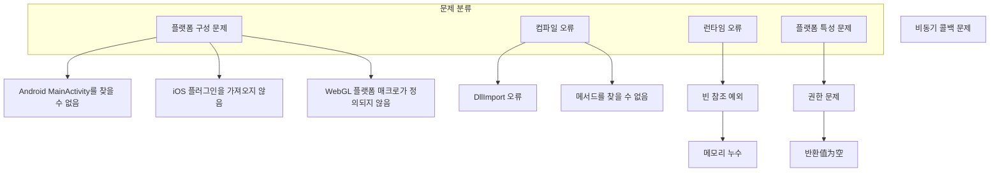

# 자주 묻는 질문

이 문서는 GameFrameX Unity Operation Clipboard 플러그인을 사용할 때 자주 묻는 문제와 그 해결책을 수집합니다.

## 개요

BlankOperationClipboard는 Editor, Standalone, WebGL(抖音小游戏,微信小游戏), Android 및 iOS 플랫폼을 지원하는 크로스 플랫폼 Unity 클립보드 작업 도구입니다. 실제 사용 과정에서 개발자는 다양한 플랫폼 관련 문제에 직면할 수 있습니다.



## 플랫폼 구성 문제

### Android 플랫폼

#### 문제: Android MainActivity를 찾을 수 없음

**증상**: Android 플랫폼에서 `GetValue()` 또는 `SetValue()`를 호출할 때 `AndroidJavaException` 또는 메서드를 찾을 수 없다는 오류가 발생합니다.

**원인**: Android 네이티브 구현은 `com.alianhome.operationclipboard.MainActivity` 클래스에 의존하며, 이 클래스는 Android 프로젝트에 존재해야 합니다.

**해결책**:

1. `Plugins/Android/com.alianhome.operationclipboard.jar` 파일이 Unity 프로젝트의 `Plugins/Android` 디렉토리에 올바르게 배치되었는지 확인합니다

2. Android 프로젝트에 대응하는 MainActivity 클래스가 구현되어 있는지 확인합니다:
   ```java
   public static String GetClipBoard() {
       ClipboardManager clipboard = (ClipboardManager) getSystemService(Context.CLIPBOARD_SERVICE);
       ClipData clip = clipboard.getPrimaryClip();
       if (clip != null && clip.getItemCount() > 0) {
           return clip.getItemAt(0).getText().toString();
       }
       return "";
   }

   public static void SetClipBoard(String text) {
       ClipboardManager clipboard = (ClipboardManager) getSystemService(Context.CLIPBOARD_SERVICE);
       ClipData clip = ClipData.newPlainText("text", text);
       clipboard.setPrimaryClip(clip);
   }
   ```

> Source: [BlankOperationClipboard.cs](https://github.com/GameFrameX/com.gameframex.unity.operationclipboard/blob/main/Runtime/BlankOperationClipboard.cs#L58-L62)

---

### iOS 플랫폼

#### 문제: iOS 네이티브 메서드를 찾을 수 없음

**증상**: iOS 플랫폼에서 메서드를 호출할 때 `EntryPointNotFoundException` 또는 유사한 오류가 발생합니다.

**원인**: iOS 네이티브 플러그인이 올바르게 가져오지 않았거나 메서드 이름이 일치하지 않습니다.

**해결책**:

1. `Plugins/iOS/BlankOperationClipboard` 폴더가 프로젝트에 올바르게 배치되었는지 확인합니다

2. Unity의 iOS Build Settings에 해당 플러그인이 포함되어 있는지 확인합니다

3. 메서드 이름이 올바르게 일치하는지 확인합니다:
   ```objc
   // iOS 네이티브 메서드 이름은 C# DllImport 선언과 일치해야 합니다
   extern "C" {
       char * GetClipBoard();    // C#의 GetClipBoard에 대응
       void SetClipBoard(char * text);  // C#의 SetClipBoard에 대응
   }
   ```

> Source: [BlankOperationClipboard.mm](https://github.com/GameFrameX/com.gameframex.unity.operationclipboard/blob/main/Plugins/iOS/BlankOperationClipboard/BlankOperationClipboard.mm#L8-L18)

---

### WebGL 플랫폼

#### 문제: WebGL 플랫폼 클립보드 기능이 작동하지 않음

**증상**: WebGL 플랫폼으로 빌드한 후 클립보드 읽기 또는 쓰기 기능이无效합니다.

**원인**: WebGL 플랫폼은 해당小游戏의 플랫폼 매크로가 활성화되어야 관련 코드가 컴파일됩니다.

**해결책**:

1. **抖音小游戏의 경우**, Player Settings에 `ENABLE_DOUYIN_MINI_GAME` 기호를 추가해야 합니다

2. **微信小游戏의 경우**, `ENABLE_WECHAT_MINI_GAME` 기호를 추가해야 합니다

3. 추가 단계:
   - Unity 메뉴 열기: `Edit > Project Settings > Player`
   - WebGL 플랫폼으로 전환
   - `Publishing Settings` > `Scripting Define Symbols`에서 대응하는 매크로 추가

> Source: [BlankOperationClipboard.cs](https://github.com/GameFrameX/com.gameframex.unity.operationclipboard/blob/main/Runtime/BlankOperationClipboard.cs#L39-L57)

---

## 컴파일 오류

### 문제: DllImport 가져오기 실패

**증상**: 컴파일 시 `DllImport` 관련 오류 메시지가 발생합니다.

**원인**: Unity가 컴파일 시 대응하는 네이티브 플러그인을 찾을 수 없습니다.

**해결책**:

1. 플랫폼 대응 Plugins 폴더 구조가 올바른지 확인합니다:
   ```
   Assets/
   └── Plugins/
       ├── Android/
       │   └── com.alianhome.operationclipboard.jar
       └── iOS/
           └── BlankOperationClipboard/
               ├── BlankOperationClipboard.h
               └── BlankOperationClipboard.mm
   ```

2. 파일 확장자가 올바른지 확인합니다 (.jar이 아니라 .zip)

3. iOS의 경우 .mm 및 .h 파일의 Metafile도 함께 제출되었는지 확인합니다

---

## 런타임 오류

### 문제: 빈 참조 예외 (NullReferenceException)

**증상**: `GetValue()` 또는 `SetValue()`를 호출할 때 빈 참조 예외가 발생합니다.

**원인**: 현재 실행 플랫폼이 어떤 전처리기 브랜치와도 일치하지 않아 기본 브랜치 실행 시 문제가 발생합니다.

**해결책**:

1. Player Settings에서 대상 플랫폼이 올바르게 구성되었는지 확인합니다

2. 지원되지 않는 플랫폼의 경우 코드에 기본 구현이 있습니다:
   ```csharp
   // 모든 플랫폼 매크로가 일치하지 않으면 GUIUtility.systemCopyBuffer 사용
   return UnityEngine.GUIUtility.systemCopyBuffer ?? string.Empty;
   ```

3. 호출 전에 플랫폼 검사를 추가합니다:
   ```csharp
   #if UNITY_ANDROID || UNITY_IOS || UNITY_WEBGL
       string clipboardText = BlankOperationClipboard.GetValue();
   #else
       Debug.LogWarning("현재 플랫폼은 클립보드 작업을 지원하지 않습니다");
   #endif
   ```

> Source: [BlankOperationClipboard.cs](https://github.com/GameFrameX/com.gameframex.unity.operationclipboard/blob/main/Runtime/BlankOperationClipboard.cs#L67-L68)

---

### 문제: iOS 메모리 누수

**증상**: iOS 플랫폼에서 클립보드 기능을 장시간 사용하면 메모리가 지속적으로 증가합니다.

**원인**: iOS 네이티브 코드에서 `GetClipBoard()` 메서드가 `malloc()`으로 메모리를 할당하지만 해제 메커니즘이 없습니다.

**문제 코드**:
```objc
char * GetClipBoard(){
    UIPasteboard * pasteboard = [UIPasteboard generalPasteboard];
    const char * a = [pasteboard.string UTF8String];
    char * b = (char*)malloc(strlen(a)+1);  // 메모리 할당
    strcpy(b, a);
    return b;  // 메모리 해제되지 않음
}
```

**해결책**:

1. **방식 1**: C# 측에서 `Marshal.FreeHGlobal`을 사용하여 메모리 해제
   ```csharp
   [DllImport("__Internal")]
   private static extern IntPtr GetClipBoard();

   public static string GetValueSafe()
   {
       IntPtr ptr = GetClipBoard();
       try
       {
           return Marshal.PtrToStringAnsi(ptr);
       }
       finally
       {
           if (ptr != IntPtr.Zero)
               Marshal.FreeHGlobal(ptr);
       }
   }
   ```

2. **방식 2**: iOS 네이티브 코드 수정하여 autorelease 사용
   ```objc
   char * GetClipBoard(){
       UIPasteboard * pasteboard = [UIPasteboard generalPasteboard];
       NSString * str = pasteboard.string;
       const char * a = [str UTF8String];
       char * b = (char*)malloc(strlen(a)+1);
       strcpy(b, a);
       return b;
   }
   // 호출 측이 메모리 해제 책임
   ```

> Source: [BlankOperationClipboard.mm](https://github.com/GameFrameX/com.gameframex.unity.operationclipboard/blob/main/Plugins/iOS/BlankOperationClipboard/BlankOperationClipboard.mm#L8-L14)

---

## 플랫폼 특성 문제

### 문제: WebGL 비동기 콜백으로 인해 반환 값이 올바르지 않음

**증상**:抖音小游戏 플랫폼에서 `GetValue()`를 사용하여 클립보드 내용을 가져올 때 빈 문자열이 반환됩니다.

**원인**:抖音小游戏의 클립보드 API는 비동기이며, 메서드는 비동기 콜백 완료 전에 반환됩니다.

**문제 코드**:
```csharp
// 현재 구현
public static string GetValue()
{
    var content = string.Empty;
#if ENABLE_DOUYIN_MINI_GAME
    TTSDK.TT.GetClipboardData((b, text) =>
    {
        if (b)
        {
            content = text;  // 비동기 콜백, 콜백 완료 시 메서드가 이미 반환됨
        }
    });
#endif
    return content;  // 항상 빈 문자열 반환
}
```

**해결책**:

콜백 함수 모드를 사용하여 동기 반환 대체:

```csharp
public delegate void ClipboardCallback(string text);

public static void GetValueAsync(ClipboardCallback callback)
{
#if ENABLE_DOUYIN_MINI_GAME
    TTSDK.TT.GetClipboardData((b, text) =>
    {
        callback?.Invoke(b ? text : string.Empty);
    });
#else
    callback?.Invoke(string.Empty);
#endif
}

// 사용 예시
BlankOperationClipboard.GetValueAsync(result =>
{
    Debug.Log("클립보드 내용: " + result);
});
```

> Source: [BlankOperationClipboard.cs](https://github.com/GameFrameX/com.gameframex.unity.operationclipboard/blob/main/Runtime/BlankOperationClipboard.cs#L41-L49)

---

### 문제: 클립보드 반환 값이 null

**증상**: `GetValue()`가 `null`而不是 빈 문자열을 반환합니다.

**원인**: 일부 플랫폼 구현은 null 대신 빈 문자열을 반환할 수 있습니다.

**해결책**:

null 병합 연산자를 사용하여 반환 값이 null이 아닌지 확인합니다:

```csharp
public static string GetValue()
{
    string result = // 플랫폼 특정 구현

    // null 반환하지 않도록 보장
    return result ?? string.Empty;
}
```

---

### 문제: Android 6.0+ 클립보드 권한

**증상**: Android 6.0及以上版本에서 클립보드 기능이正常に 작동하지만 일부 기기에서 권한 문제가 발생할 수 있습니다.

**원인**: Android 10부터 클립보드 접근에 대한 제한이 더 많아졌습니다.

**해결책**:

1. 대부분의 애플리케이션에서 클립보드 접근은 특수 권한이 필요하지 않습니다

2. 애플리케이션을 입력법으로 사용해야 하는 경우 AndroidManifest.xml에서 권한을 선언해야 합니다:
   ```xml
   <uses-permission android:name="android.permission.FOREGROUND_SERVICE" />
   ```

3. 백그라운드 서비스에서 클립보드에 접근하는 경우 `ClipboardManager`의前台服务 사용을 권장합니다

---

## 디버깅 기술

### 상세 로그 활성화

개발 단계에서 문제 위치 파악을 위해 디버그 로그를 추가할 수 있습니다:

```csharp
public static string GetValue()
{
    string result;

#if UNITY_ANDROID
    using (AndroidJavaClass androidJavaClass = new AndroidJavaClass("com.alianhome.operationclipboard.MainActivity"))
    {
        result = androidJavaClass.CallStatic<string>("GetClipBoard");
        Debug.Log($"[클립보드] Android GetValue 결과: {result}");
    }
#elif UNITY_IOS
    result = GetClipBoard();
    Debug.Log($"[클립보드] iOS GetValue 결과: {result}");
#else
    result = UnityEngine.GUIUtility.systemCopyBuffer ?? string.Empty;
    Debug.Log($"[클립보드] 기본 GetValue 결과: {result}");
#endif

    return result ?? string.Empty;
}
```

### 플랫폼 확인

전처리기 지시문을 사용하여 현재 컴파일 플랫폼을 확인합니다:

```csharp
void Start()
{
    Debug.Log($"현재 컴파일 플랫폼: ");
#if UNITY_EDITOR
    Debug.Log(" - Unity Editor");
#endif
#if UNITY_ANDROID
    Debug.Log(" - Android");
#endif
#if UNITY_IOS
    Debug.Log(" - iOS");
#endif
#if UNITY_WEBGL
    Debug.Log(" - WebGL");
#if ENABLE_DOUYIN_MINI_GAME
    Debug.Log("   + 抖音小游戏");
#endif
#if ENABLE_WECHAT_MINI_GAME
    Debug.Log("   + 微信小游戏");
#endif
#endif
}
```

---

## 관련 링크

- [개요](./01.overview) - 프로젝트 개요 및 기능 소개
- [설치](./02.installation) - 플러그인 설치 가이드
- [사용 방법](./04.usage) - API 사용 설명
- [플랫폼 구성](./05.platforms) - 각 플랫폼 상세 구성 설명
- [예제](./06.samples) - 코드 예제 및 데모