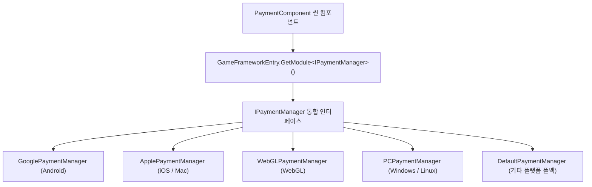

# 설치 및 빠른 시작

Game Frame X Payment는 인앱 구매와 구독을 위한 통합 인터페이스를 제공하는 Unity 결제 패키지로, Google Play와 Apple App Store를 지원합니다. 이 페이지에서는 패키지 설치부터 컴포넌트 부착, 첫 번째 구매 진행까지 몇 분 안에 전체 흐름을 완주할 수 있도록 안내합니다.

## 빠른 시작

### 1. 환경 확인

| 종속성 | 버전 요구 사항 |
|--------|----------|
| Unity | 2019.4 이상 |
| `com.gameframex.unity` | 2.5.1 |
| `com.gameframex.unity.payment.google` | 1.0.1 |

위 종속성 선언은 패키지의 `package.json`에서 가져온 것이며, 설치 시 UPM이 자동으로 해석합니다.

출처: [package.json](https://github.com/GameFrameX/com.gameframex.unity.payment/blob/main/package.json#L24-L27)

### 2. 패키지 설치

아래 방법 중 하나를 선택하세요:

**방법 1: scopedRegistries (권장)**

Unity 프로젝트의 `Packages/manifest.json`을 편집하여 `scopedRegistries` 섹션을 추가합니다:

```json
{
  "scopedRegistries": [
    {
      "name": "GameFrameX",
      "url": "https://gameframex.upm.alianblank.uk",
      "scopes": [
        "com.gameframex"
      ]
    }
  ],
  "dependencies": {
    "com.gameframex.unity.payment": "1.1.0"
  }
}
```

`scopes`는 어떤 패키지가 이 레지스트리를 통해 해석되는지 제어하며, `com.gameframex`로 시작하는 패키지만 이 레지스트리에서 가져옵니다.

출처: [README.zh-CN.md](https://github.com/GameFrameX/com.gameframex.unity.payment/blob/main/README.zh-CN.md#L40-L58)

**방법 2: Git 주소 직접 입력**

`manifest.json`의 `dependencies` 노드에 추가합니다:

```json
{
   "com.gameframex.unity.payment": "https://github.com/gameframex/com.gameframex.unity.payment.git"
}
```

출처: [README.zh-CN.md](https://github.com/GameFrameX/com.gameframex.unity.payment/blob/main/README.zh-CN.md#L60-L65)

**방법 3: Package Manager에서 Git URL 추가**

Unity 메뉴에서 `Window > Package Manager > + > Add package from git URL`을 선택하고, 주소에 `https://github.com/gameframex/com.gameframex.unity.payment.git`를 입력합니다.

**방법 4: 소스 코드 직접 배치**

저장소를 직접 다운로드하여 Unity 프로젝트의 `Packages` 디렉터리 아래에 배치하면 Unity가 자동으로 로드하고 인식합니다.

출처: [README.zh-CN.md](https://github.com/GameFrameX/com.gameframex.unity.payment/blob/main/README.zh-CN.md#L66-L67)

### 3. PaymentComponent 컴포넌트 부착

씬에 GameFrameX 오브젝트를 생성하고, `AddComponentMenu` 경로 `GameFrameX/Payment`를 통해 `PaymentComponent`를 추가합니다. 컴포넌트에는 `[RequireComponent(typeof(GameFrameXPaymentCroppingHelper))]`가 지정되어 있어 크로핑 헬퍼 컴포넌트가 자동으로 함께 추가되며, `[DisallowMultipleComponent]`에 의해 같은 오브젝트에는 하나만 부착할 수 있습니다.

```csharp
[DisallowMultipleComponent]
[RequireComponent(typeof(GameFrameXPaymentCroppingHelper))]
[AddComponentMenu("GameFrameX/Payment")]
[UnityEngine.Scripting.Preserve]
public class PaymentComponent : GameFrameworkComponent
```

출처: [PaymentComponent.cs](https://github.com/GameFrameX/com.gameframex.unity.payment/blob/main/Runtime/PaymentComponent.cs#L17-L21)

컴포넌트는 `Awake()`에서 현재 컴파일 플랫폼에 따라 해당 플랫폼의 결제 관리자 구현을 자동으로 선택합니다 (Android는 Google, iOS/Mac은 Apple, WebGL과 PC는 각각 독립적으로, 나머지 플랫폼은 `DefaultPaymentManager`로 폴백). 수동으로 지정할 필요가 없습니다:

```csharp
#if UNITY_ANDROID
    componentType = m_componentAndroidType;
#elif UNITY_IOS
    componentType = m_componentIOSType;
#elif UNITY_WEBGL
    componentType = m_componentWebGLType;
#elif UNITY_STANDALONE_WIN || UNITY_STANDALONE_LINUX
    componentType = m_componentPCType;
#elif UNITY_STANDALONE_OSX
    componentType = m_componentMacType;
#else
    componentType = typeof(DefaultPaymentManager).FullName;
#endif
    ImplementationComponentType = Utility.Assembly.GetType(componentType);
    InterfaceComponentType = typeof(IPaymentManager);
    base.Awake();
```

출처: [PaymentComponent.cs](https://github.com/GameFrameX/com.gameframex.unity.payment/blob/main/Runtime/PaymentComponent.cs#L69-L86)

### 4. 결제 시스템 초기화

시작 시 `Init`을 호출하며, 매개변수 `isDebug`는 샌드박스 모드를 제어하고 `isClientVerify`는 클라이언트 구매 검증 수행 여부를 제어합니다:

```csharp
public void Init(bool isDebug = false, bool isClientVerify = true)
{
    _paymentManager.Init(isDebug, isClientVerify);
}
```

출처: [PaymentComponent.cs](https://github.com/GameFrameX/com.gameframex.unity.payment/blob/main/Runtime/PaymentComponent.cs#L102-L105)

상품 정보를 미리 로드해야 하는 경우, 초기화 전에 `SetPredefinedProductIds`를 호출합니다 (소스 코드 주석에 이 메서드를 `Initialize()` 이전에 호출해야 한다고 명시되어 있습니다). 인앱 상품 ID 목록과 구독 상품 ID 목록을 각각 전달합니다:

```csharp
public void SetPredefinedProductIds(List<string> inAppProductIds, List<string> subsProductIds)
{
    _paymentManager.SetPredefinedProductIds(inAppProductIds, subsProductIds);
}
```

출처: [PaymentComponent.cs](https://github.com/GameFrameX/com.gameframex.unity.payment/blob/main/Runtime/PaymentComponent.cs#L122-L126)

초기화 후 `IsReady()`로 결제 시스템이 준비되었는지 확인할 수 있으며, `bool`을 반환합니다.

### 5. 이벤트 구독 및 구매 진행

먼저 결과 이벤트를 구독합니다 (컴포넌트에 네 개의 이벤트가 직접 노출되어 있습니다: `OnPurchaseSuccess`, `OnPurchaseFailed`, `OnQueryPurchasesResult`, `OnConsumePurchaseResult`, 모두 `EventHandler<PaymentEventArgs>` 타입입니다). 그런 다음 권장 방식인 `Buy(PurchaseParams)`로 구매를 진행합니다:

```csharp
public void Buy(PurchaseParams purchaseParams)
```

출처: [PaymentComponent.cs](https://github.com/GameFrameX/com.gameframex.unity.payment/blob/main/Runtime/PaymentComponent.cs#L233-L238)

`PurchaseParams`는 상품 ID, 주문 ID 등의 매개변수를 담고 있으며, 각 결제 채널은 해당 하위 클래스를 사용하여 채널 고유의 매개변수를 전달할 수 있습니다. 참고로 이전의 `BuyInApp` / `BuySubs` / `Buy(productId, productType, ...)`는 `[Obsolete("请使用 Buy(PurchaseParams) 替代")]`로 표시되어 있으므로 새 코드에서는 사용하지 마세요.

출처: [PaymentComponent.cs](https://github.com/GameFrameX/com.gameframex.unity.payment/blob/main/Runtime/PaymentComponent.cs#L161-L163)

### 6. 구매 결과 처리 및 소비

구매 성공 후, 일회성 상품에 대해서는 `ConsumePurchase(purchaseToken)`을 호출하여 구매를 소비합니다 (`purchaseToken`이 비어 있으면 컴포넌트가 `Log.Warning("Purchase token is null or empty.")`를 출력하고 즉시 반환합니다). `QueryPurchases(PaymentProductType)`로 과거 구매 기록을 조회할 수 있으며, `productType`에는 `PaymentProductType` 열거형의 inapp 또는 subs 값을 사용합니다.

출처: [PaymentComponent.cs](https://github.com/GameFrameX/com.gameframex.unity.payment/blob/main/Runtime/PaymentComponent.cs#L133-L151)

## 동작 원리 요약

컴포넌트 자체는 단순한 얇은 래퍼입니다: `PaymentComponent`는 `Awake()`에서 플랫폼에 따라 구현 클래스 타입을 해석한 뒤, `GameFrameworkEntry.GetModule<IPaymentManager>()`를 통해 현재 플랫폼의 결제 관리자를 가져오고, 이후 모든 API 호출을 해당 관리자에게 전달합니다.



## 다음 단계

- 전체 API 설명 및 매개변수 세부 사항: 저장소의 [README.zh-CN.md](https://github.com/GameFrameX/com.gameframex.unity.payment/blob/main/README.zh-CN.md#L68-L126) 참조
- 버전 기록: [CHANGELOG.md](https://github.com/GameFrameX/com.gameframex.unity.payment/blob/main/CHANGELOG.md)
- 공식 문서 및 지원: [https://gameframex.doc.alianblank.com](https://gameframex.doc.alianblank.com), QQ 그룹 467608841 / 233840761