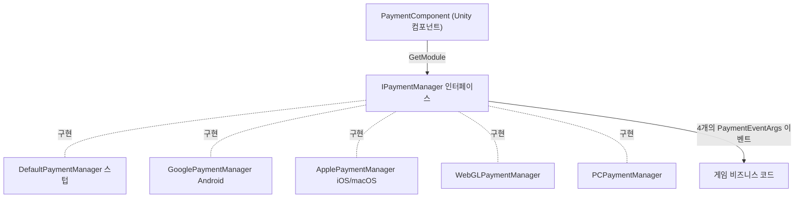

# 결제 컴포넌트 개요

Payment 결제 컴포넌트는 GameFrameX의 Unity 인앱 결제 패키지로, 인앱 구매와 구독을 위한 통합 인터페이스 `IPaymentManager`를 제공합니다. 씬에 `PaymentComponent`를 하나 부착해 두면 런타임에 플랫폼에 따라 해당 채널 구현이 자동으로 장착되며(Android → Google Play, iOS/macOS → App Store 등), 비즈니스 코드는 동일한 `Init` / `Buy` / `QueryPurchases` / `ConsumePurchase` API만 다루면 됩니다.

## 빠른 시작

### 1. 패키지 설치

Unity 프로젝트의 `Packages/manifest.json`을 편집하며, 아래 방법 중 하나를 선택하면 됩니다:

```json
{
  "scopedRegistries": [
    {
      "name": "GameFrameX",
      "url": "https://gameframex.upm.alianblank.uk",
      "scopes": [
        "com.gameframex"
      ]
    }
  ],
  "dependencies": {
    "com.gameframex.unity.payment": "1.1.0"
  }
}
```

`dependencies` 아래에 Git 주소 `https://github.com/gameframex/com.gameframex.unity.payment.git`를 직접 입력하거나, Package Manager의 Add package from git URL 기능으로 추가할 수도 있습니다.

출처: [README.zh-CN.md](https://github.com/GameFrameX/com.gameframex.unity.payment/blob/main/README.zh-CN.md#L40-L66)

### 2. 결제 컴포넌트 부착

Unity 메뉴에서 `GameFrameX/Payment`를 선택해 컴포넌트를 추가하면, 크로핑 헬퍼 컴포넌트가 필수로 함께 부착됩니다:

```csharp
[DisallowMultipleComponent]
[RequireComponent(typeof(GameFrameXPaymentCroppingHelper))]
[AddComponentMenu("GameFrameX/Payment")]
[UnityEngine.Scripting.Preserve]
public class PaymentComponent : GameFrameworkComponent
```

출처: [PaymentComponent.cs](https://github.com/GameFrameX/com.gameframex.unity.payment/blob/main/Runtime/PaymentComponent.cs#L17-L21)

컴포넌트는 `Awake`에서 컴파일 플랫폼에 따라 구현 타입을 선택하고, 프레임워크 모듈 시스템에서 `IPaymentManager`를 가져옵니다:

```csharp
#if UNITY_ANDROID
    componentType = m_componentAndroidType;
#elif UNITY_IOS
    componentType = m_componentIOSType;
#elif UNITY_WEBGL
    componentType = m_componentWebGLType;
#elif UNITY_STANDALONE_WIN || UNITY_STANDALONE_LINUX
    componentType = m_componentPCType;
#elif UNITY_STANDALONE_OSX
    componentType = m_componentMacType;
#else
    componentType = typeof(DefaultPaymentManager).FullName;
#endif
    ImplementationComponentType = Utility.Assembly.GetType(componentType);
    InterfaceComponentType = typeof(IPaymentManager);
    base.Awake();

    _paymentManager = GameFrameworkEntry.GetModule<IPaymentManager>();
```

출처: [PaymentComponent.cs](https://github.com/GameFrameX/com.gameframex.unity.payment/blob/main/Runtime/PaymentComponent.cs#L71-L93)

플랫폼과 기본 구현의 매핑:

| 플랫폼 | 기본 구현 타입 (Inspector에서 수정 가능) |
|------|------------------------------------|
| UNITY_ANDROID | `GameFrameX.Payment.Google.Runtime.GooglePaymentManager` |
| UNITY_IOS / UNITY_STANDALONE_OSX | `GameFrameX.Payment.Apple.Runtime.ApplePaymentManager` |
| UNITY_WEBGL | `GameFrameX.Payment.WebGL.Runtime.WebGLPaymentManager` |
| UNITY_STANDALONE_WIN / LINUX | `GameFrameX.Payment.PC.Runtime.PCPaymentManager` |
| 기타 플랫폼 | `DefaultPaymentManager` (스텁, 경고만 출력) |

### 3. 초기화 및 상품 사전 로드

`SetPredefinedProductIds`는 상품 캐시를 사전 로드하기 위해 `Init` 이전에 반드시 호출해야 합니다:

```csharp
public void Init(bool isDebug = false, bool isClientVerify = true)
{
    _paymentManager.Init(isDebug, isClientVerify);
}
```

출처: [PaymentComponent.cs](https://github.com/GameFrameX/com.gameframex.unity.payment/blob/main/Runtime/PaymentComponent.cs#L102-L105)

`isDebug`는 샌드박스 모드의 스위치이며, `isClientVerify`는 클라이언트에서 구매를 검증할지 여부입니다. 서버 검증(온라인 필수)을 사용하는 경우에는 `false`로 설정해야 합니다 (주의: 컴포넌트 레이어 `Init`의 기본값은 `true`이고, 인터페이스 `IPaymentManager.Init`의 기본값은 `false`입니다).

### 4. 결제 이벤트 구독

컴포넌트는 네 가지 이벤트를 노출하며, 현재 플랫폼의 `IPaymentManager` 구현으로 직접 전달됩니다: `OnPurchaseSuccess`, `OnPurchaseFailed`, `OnQueryPurchasesResult`, `OnConsumePurchaseResult`, 파라미터는 모두 `PaymentEventArgs`입니다.

출처: [PaymentComponent.cs](https://github.com/GameFrameX/com.gameframex.unity.payment/blob/main/Runtime/PaymentComponent.cs#L33-L64)

### 5. 구매 시작

`Buy(PurchaseParams)` 사용을 권장하며, 각 채널은 해당 서브클래스를 사용해 채널 고유의 파라미터를 전달합니다. 컴포넌트 레이어에서는 먼저 파라미터를 검증합니다 (`ProductId`, `OrderId`가 비어 있으면 `Log.Warning`을 출력하고 바로 반환):

```csharp
public void Buy(PurchaseParams purchaseParams)
{
    if (purchaseParams == null)
    {
        Log.Warning("Purchase params is null.");
        return;
    }

    if (string.IsNullOrEmpty(purchaseParams.ProductId))
    {
        Log.Warning("Product ID is null or empty.");
        return;
    }

    if (string.IsNullOrEmpty(purchaseParams.OrderId))
    {
        Log.Warning("Order ID is null or empty.");
        return;
    }

    _paymentManager.Buy(purchaseParams);
}
```

출처: [PaymentComponent.cs](https://github.com/GameFrameX/com.gameframex.unity.payment/blob/main/Runtime/PaymentComponent.cs#L238-L259)

구버전 `BuyInApp` / `BuySubs` / `Buy(productId, productType, orderId, ...)`는 모두 `[Obsolete("请使用 Buy(PurchaseParams) 替代")]`로 표시되어 있으며, 여전히 사용할 수 있지만 새 코드에서 사용하는 것은 권장하지 않습니다.

출처: [IPaymentManager.cs](https://github.com/GameFrameX/com.gameframex.unity.payment/blob/main/Runtime/IPaymentManager.cs#L79-L105)

### 6. 조회 및 소비

- `QueryPurchases(PaymentProductType productType)`: 제품 타입별로 구매 기록을 조회하며, 결과는 `OnQueryPurchasesResult` 이벤트로 전달됩니다.
- `ConsumePurchase(string purchaseToken)`: 구매를 소비하며, `purchaseToken`이 비어 있으면 `Purchase token is null or empty.`를 출력하고 반환합니다.
- `IsReady()`: 결제 시스템의 초기화 완료 여부입니다. 구매 전에 먼저 확인하는 것이 좋습니다.

출처: [PaymentComponent.cs](https://github.com/GameFrameX/com.gameframex.unity.payment/blob/main/Runtime/PaymentComponent.cs#L112-L152)

## 작동 원리 요약

`PaymentComponent`는 플랫폼 라우팅과 파라미터 검증만 수행하며, 실제 결제 로직은 각 채널의 `IPaymentManager` 구현에 있습니다. `DefaultPaymentManager`는 빈 스텁으로, 이 메서드를 호출하면 "You are using DefaultPaymentManager which is a stub. Please integrate a channel-specific implementation (e.g. Google, Apple)."이라는 안내만 출력합니다.



출처: [PaymentComponent.cs](https://github.com/GameFrameX/com.gameframex.unity.payment/blob/main/Runtime/PaymentComponent.cs#L23-L28), [DefaultPaymentManager.cs](https://github.com/GameFrameX/com.gameframex.unity.payment/blob/main/Runtime/DefaultPaymentManager.cs#L17-L27)

## 다음 단계

- 인터페이스 계약 및 이벤트 정의: [IPaymentManager.cs](https://github.com/GameFrameX/com.gameframex.unity.payment/blob/main/Runtime/IPaymentManager.cs#L16-L113)
- 컴포넌트 레이어의 모든 공개 API 및 검증 로직: [PaymentComponent.cs](https://github.com/GameFrameX/com.gameframex.unity.payment/blob/main/Runtime/PaymentComponent.cs)
- Editor에서의 Inspector 커스터마이징: [PaymentComponentInspector.cs](https://github.com/GameFrameX/com.gameframex.unity.payment/blob/main/Editor/PaymentComponentInspector.cs)
- 버전 히스토리: [CHANGELOG.md](https://github.com/GameFrameX/com.gameframex.unity.payment/blob/main/CHANGELOG.md)
- 공식 문서 사이트: <https://gameframex.doc.alianblank.com>