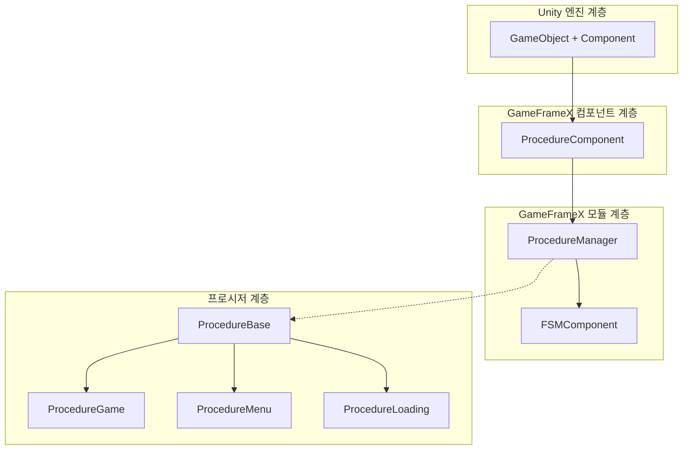
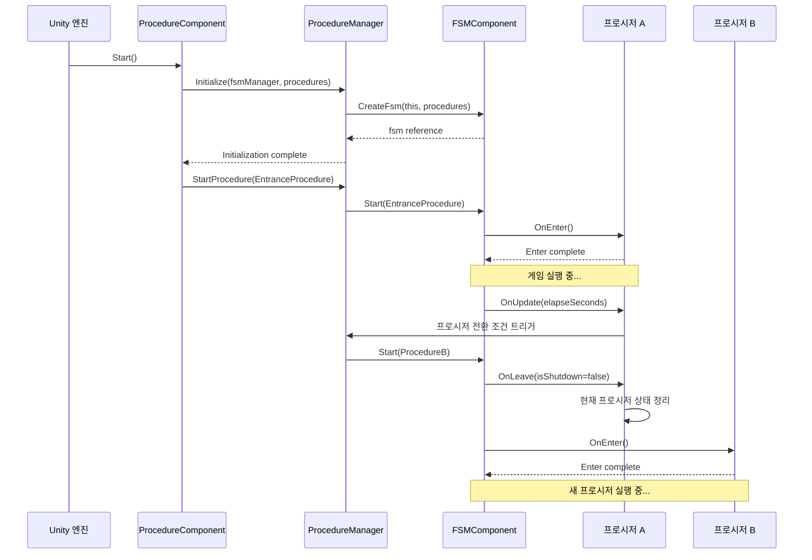

# 핵심 개념

GameFrameX Procedure 프로시저 관리 컴포넌트는 Unity 게임을 위한 완전한 게임 프로시저 상태 관리 솔루션을 제공하며, 유한 상태 머신(FSM)을 통해 게임의 각 단계를 관리합니다.

## 개요

Procedure 프로시저 관리 컴포넌트는 GameFrameX 프레임워크의 핵심 모듈 중 하나로, 게임의 업무 프로시저 및 상태 전환을 관리하는 데 특화되어 있습니다. 해당 컴포넌트는 유한 상태 머신(FSM) 설계를 기반으로, 개발자가 게임을 여러 독립적인 프로시저 단계로 분할할 수 있도록 합니다. 예: 시작 프로시저, 로딩 프로시저, 메인 메뉴 프로시저, 게임 프로시저, 일시 정지 프로시저, 종료 프로시저 등.

각 프로시저는 독립적인 상태로, 초기화, 진입, 업데이트, 종료,销毁 등 완전한 생명 주기 관리를 제공합니다. 이러한 설계는 게임 로직을 더욱 모듈화하여 유지보수와 확장을 용이하게 하며, 팀 협업을 위한 명확한 분업 경계를 제공합니다.

## 핵심 기능

### 프로시저 상태 관리

컴포넌트는 완전한 프로시저 상태 관리 기능을 제공하며, 게임 실행 중 다양한 프로시저 상태를 동적으로 전환할 수 있도록 지원합니다. 개발자는 간단한 API 호출을 통해 로딩 화면에서 게임 메인 메뉴,再到 구체적인 게임 플레이로의 부드러운 전환을 구현할 수 있습니다. 프로시저 관리자는 사용 가능한 모든 프로시저의 참조를 유지하며, 현재 프로시저 조회, 프로시저 경과 시간 가져오기 등의 실용 기능을 제공합니다.

```csharp
// 지정된 프로시저가 존재하는지 확인
bool hasProcedure = procedureComponent.HasProcedure<ProcedureGame>();

// 현재 실행 중인 프로시저 가져오기
ProcedureBase current = procedureComponent.CurrentProcedure;

// 현재 프로시저 경과 시간 가져오기
float elapsedTime = procedureComponent.CurrentProcedureTime;
```

> Source: [ProcedureComponent.cs](https://github.com/GameFrameX/com.gameframex.unity.procedure/blob/main/Runtime/Procedure/ProcedureComponent.cs#L114-L147)

### 자동 프로시저 초기화

컴포넌트는 게임 시작 시 모든 프로시저의 생성 및 초기화를 자동으로 완료합니다. 개발자는 Unity 편집기에서 사용 가능한 프로시저 유형만 구성하면 되며, 컴포넌트가 리플렉션 메커니즘을 사용하여 자동으로 프로시저 인스턴스를 생성하고, 게임 프레임 로드 완료 후 자동으로 진입 프로시저를 시작합니다. 이러한 설계는 게임의 시작 로직을 크게 간소화하여, 개발자가 업무 로직 구현에 집중할 수 있도록 합니다.

```csharp
// ProcedureComponent는 Start 메서드에서 자동으로 프로시저 초기화 완료
private IEnumerator Start()
{
    ProcedureBase[] procedures = new ProcedureBase[m_AvailableProcedureTypeNames.Length];
    for (int i = 0; i < m_AvailableProcedureTypeNames.Length; i++)
    {
        Type procedureType = Utility.Assembly.GetType(m_AvailableProcedureTypeNames[i]);
        procedures[i] = (ProcedureBase)Activator.CreateInstance(procedureType);
    }
    m_ProcedureManager.Initialize(GameFrameworkEntry.GetModule<IFsmManager>(), procedures);
    yield return new WaitForEndOfFrame();
    m_ProcedureManager.StartProcedure(m_EntranceProcedure.GetType());
}
```

> Source: [ProcedureComponent.cs](https://github.com/GameFrameX/com.gameframex.unity.procedure/blob/main/Runtime/Procedure/ProcedureComponent.cs#L71-L107)

### 프로시저 생명 주기 후크

각 사용자 정의 프로시저는 基类 메서드를 재정의하여 특정 업무 로직을 구현할 수 있습니다. 컴포넌트는 프로시저 생성부터销毁까지 완전한 생명 주기 후크를 제공합니다. 이러한 후크는 `OnInit`(초기화 시 호출), `OnEnter`(프로시저 진입 시 호출), `OnUpdate`(매 프레임 업데이트 시 호출), `OnFixedUpdate`(고정 프레임 레이트 업데이트 시 호출), `OnLeave`(프로시저 종료 시 호출), `OnDestroy`(프로시저销毁 시 호출)를 포함합니다.

```csharp
public abstract class ProcedureBase : FsmState<IProcedureManager>
{
    // 상태 초기화 시 호출
    protected override void OnInit(IFsm<IProcedureManager> procedureOwner) { }

    // 상태 진입 시 호출
    protected override void OnEnter(IFsm<IProcedureManager> procedureOwner) { }

    // 상태 폴링 시 호출
    protected override void OnUpdate(IFsm<IProcedureManager> procedureOwner, float elapseSeconds, float realElapseSeconds) { }

    // 고정 프레임 레이트 업데이트 시 호출
    protected override void OnFixedUpdate(IFsm<IProcedureManager> procedureOwner, float elapseSeconds, float realElapseSeconds) { }

    // 상태 종료 시 호출
    protected override void OnLeave(IFsm<IProcedureManager> procedureOwner, bool isShutdown) { }

    // 상태销毁 시 호출
    protected override void OnDestroy(IFsm<IProcedureManager> procedureOwner) { }
}
```

> Source: [ProcedureBase.cs](https://github.com/GameFrameX/com.gameframex.unity.procedure/blob/main/Runtime/Procedure/ProcedureBase.cs#L16-L76)

### 프로시저 조회 및 가져오기

유연한 프로그래밍 방식 조회 인터페이스를 제공하여, 유형 또는 유형 이름을 통해 프로시저 존재 여부를 확인하고, 특정 프로시저의 인스턴스 참조를 가져올 수 있습니다. 이러한 기능을 통해 게임 코드는 실행 시 동적으로 프로시저 시스템과 상호 작용할 수 있습니다. 예: 비프로시저 클래스에서 현재 게임 상태 확인 또는 특정 프로시저 가져와서 데이터 교환 수행.

```csharp
// 제네릭 메서드를 통해 프로시저 확인 및 가져오기
if (procedureComponent.HasProcedure<ProcedureMenu>())
{
    var menuProcedure = procedureComponent.GetProcedure<ProcedureMenu>();
}

// Type 객체를 통해 프로시저 확인 및 가져오기
Type menuType = typeof(ProcedureMenu);
if (procedureComponent.HasProcedure(menuType))
{
    var menuProcedure = (ProcedureMenu)procedureComponent.GetProcedure(menuType);
}
```

> Source: [IProcedureManager.cs](https://github.com/GameFrameX/com.gameframex.unity.procedure/blob/main/Runtime/Procedure/IProcedureManager.cs#L47-L73)

### 편집기 시각화 구성

컴포넌트는 사용자 정의 Unity 편집기 인스펙터를 제공하여, Inspector 패널에서 사용 가능한 프로시저 목록과 진입 프로시저를 직관적으로 구성할 수 있도록 지원합니다. 체크박스를 통해 프로시저 시스템에 포함할 프로시저 유형을 편리하게 선택할 수 있으며, 드롭다운 메뉴를 통해 게임 시작 시 첫 번째 프로시저를 설정할 수 있습니다. 실행 상태에서 인스펙터는 현재 실행 중인 프로시저 이름을 표시하여 디버깅을 용이하게 합니다.

```csharp
// 편집기 인스펙터 핵심 로직
foreach (string procedureTypeName in m_ProcedureTypeNames)
{
    bool selected = m_CurrentAvailableProcedureTypeNames.Contains(procedureTypeName);
    if (selected != EditorGUILayout.ToggleLeft(procedureTypeName, selected))
    {
        // 프로시저 선택 상태 변경 처리
    }
}

// 실행 상태에서 현재 프로시저 표시
if (EditorApplication.isPlaying)
{
    EditorGUILayout.LabelField("Current Procedure", t.CurrentProcedure == null ? "None" : t.CurrentProcedure.GetType().ToString());
}
```

> Source: [ProcedureComponentInspector.cs](https://github.com/GameFrameX/com.gameframex.unity.procedure/blob/main/Editor/Inspector/ProcedureComponentInspector.cs#L46-L96)

## 시스템 아키텍처



위 그림과 같이 시스템은 계층화 아키텍처 설계를 채택합니다. `ProcedureComponent`는 Unity 컴포넌트 계층으로, Unity 엔진과 상호 작용하고 공용 인터페이스를 노출하는 역할을 담당합니다. `ProcedureManager`는 핵심 모듈로, 실제 프로시저 관리 로직을 담당하며 `FSMComponent`가 제공하는 유한 상태 머신 기능에 의존합니다. `ProcedureBase`는 모든 사용자 정의 프로시저의 基類로, 생명 주기의 통일된 추상을 제공합니다.

## 프로시저 전환 메커니즘



프로시저 전환은 FSM 컴포넌트가 통일적으로 관리합니다. `StartProcedure` 메서드를 호출하면, FSM이 먼저 현재 프로시저의 `OnLeave` 콜백을 트리거하여 정리 작업을 실행한 후, 대상 프로시저의 `OnEnter` 콜백을 트리거하여 초기화를 완료합니다. 이러한 설계는 프로시저 전환 시 상태 일관성을 보장하며, 리소스泄漏 및 데이터 혼란을 방지합니다.

## 전형적인 사용 시나리오

### 게임 시작 프로시저

전형적인 게임 시작 프로시저는 일반적으로 여러 단계를 포함합니다: 리소스 로딩, 데이터 초기화, 구성 읽기, 로그인 검증 등. 각 단계는 독립적인 프로시저로 구현할 수 있으며, 프로시저 관리자를 통해 순차적으로 전환됩니다. 이러한 설계는 시작 로직을 명확하고 통제 가능하게 만들며, 각 단계에서 다른 로딩 인터페이스를 표시하는 데에도 용이합니다.

### 게임 상태 관리

게임 진행 과정에서 프로시저 시스템을 사용하여 다양한 게임 상태를 관리할 수 있습니다. 예: 게임 준비 상태,游戏中 상태, 게임 일시 정지 상태, 게임 정산 상태 등. 프로시저 간 전환 조건은 플레이어 조작, 타이머 만료, 또는 특정 게임 이벤트 트리거일 수 있습니다.

### 씬 전환 관리

게임이 서로 다른 씬 간 전환이 필요한 경우, 프로시저 시스템은 로딩 및 초기화 작업을 조정하는 데 효과적입니다. 예: 메인 메뉴에서 게임 씬으로 진입할 때, 먼저 로딩 프로시저로 전환하여 로딩 진행률 표시줄을 표시하고, 백그라운드에서 씬 리소스 로딩 및 초기화를 완료한 후, 게임 프로시저로 전환할 수 있습니다.

## 의존 관계

해당 컴포넌트는 GameFrameX 프레임워크의 다른 핵심 모듈에 의존합니다:

| 의존 컴포넌트 | 설명 |
|---------|------|
| FSMComponent | 유한 상태 머신 기능을 제공하여 프로시저 상태 전환 구현 |
| GameFrameworkEntry | 프레임워크 진입점으로, 각 모듈 가져오기 및 등록에 사용 |
| GameFrameworkComponent | 컴포넌트 基類로, 컴포넌트 공통 기능 제공 |
| GameFrameworkModule | 모듈 基類로, 모듈 공통 기능 제공 |

## 플랫폼 지원

해당 컴포넌트는 Unity 엔진 기반으로 개발되어 다음 플랫폼을 지원합니다:

- **iOS**: IL2CPP 또는 Mono 스크립트 백엔드 사용
- **Android**: IL2CPP 또는 Mono 스크립트 백엔드 사용
- **Windows**: 편집기 및 독립 실행 버전
- **macOS**: 편집기 및 독립 실행 버전
- **Linux**: 독립 실행 버전
- **WebGL**: WebGL 빌드 대상 기반

## 주의 사항

1. **프로시저 基類 상속**: 모든 사용자 정의 프로시저는 반드시 `ProcedureBase` 基類를 상속해야 합니다
2. **진입 프로시저 구성**: Inspector에서 진입 프로시저를 구성해야 하며, 그렇지 않으면 게임이 정상적으로 시작되지 않습니다
3. **프로시저 유형 등록**: 사용 가능한 모든 프로시저 유형을 `m_AvailableProcedureTypeNames` 배열에 추가해야 합니다
4. **단일 컴포넌트 제한**: 동일한 GameObject에는 `ProcedureComponent`를 하나만 추가할 수 있습니다(`[DisallowMultipleComponent]` 속성으로 제한됨)
5. **FSM 의존**: 컴포넌트가 정상 작동하려면 먼저 FSMComponent를 올바르게 구성하고 초기화해야 합니다

## 관련 링크

- [플러그인 소개](./1-overview.introduction) - 컴포넌트의 기본 개념 및 사용 전제 이해
- [설치 가이드](./2-installation) - 자세한 설치 및 구성 단계
- [ProcedureComponent](./3-core-concepts.procedure-component) - 컴포넌트의 자세한 API 문서
- [ProcedureBase](./3-core-concepts.procedure-base) - 프로시저 基類의 자세한 설명
- [IProcedureManager](./3-core-concepts.iprocedure-manager) - 프로시저 관리자 인터페이스
- [ProcedureManager](./3-core-concepts.procedure-manager) - 프로시저 관리자 구현
- [사용자 정의 프로시저](./4-custom-procedures) - 사용자 정의 프로시저 생성 방법
- [편집기 사용](./5-editor-usage) - 편집기 구성 가이드