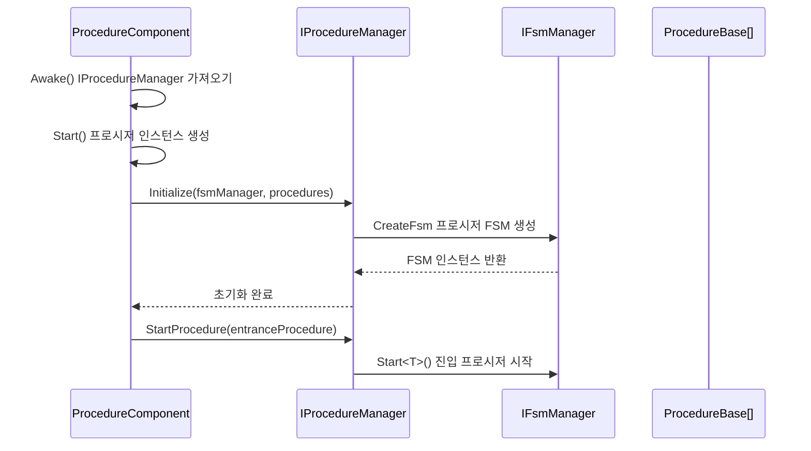
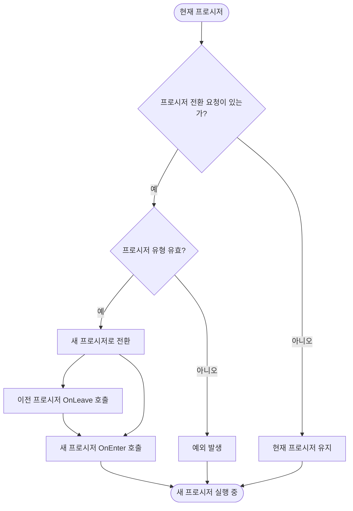

# IProcedureManager

프로시저 관리자 인터페이스로, 프로시저 관리의 기본 작업을 정의하며 게임의 다양한 프로시저 상태 전환을 관리하는 데 사용됩니다.

## 개요

IProcedureManager는 GameFrameX 프로시저 시스템의 핵심 인터페이스로, 게임의 다양한 프로시저(로그인 프로시저, 메인 메뉴 프로시저, 게임 프로시저 등)를 관리합니다. 유한 상태 머신(FSM) 패턴 기반으로 구현되어 프로시저의 초기화, 전환, 조회 등의 기능을 제공합니다.

**설계 의도:**
- 통일된 프로시저 관리 인터페이스 제공,底層 구현 세부 정보 차폐
- FSM 패턴 기반으로 프로시저 상태 전환의 신뢰성 및 추적 가능성 보장
- 제네릭 및 비제네릭 두 가지 API 지원, 다양한 사용 시나리오 충족

## 아키텍처

```mermaid
flowchart TD
    subgraph External["외부 호출자"]
        User[사용자 코드]
    end

    subgraph Component["Unity컴포넌트 계층"]
        PC[ProcedureComponent]
    end

    subgraph Interface["인터페이스 계층"]
        IPM[IProcedureManager]
    end

    subgraph Implementation["구현 계층"]
        PM[ProcedureManager]
    end

    subgraph FSM["FSM 하위 시스템"]
        FSM[IFsmManager]
        FSMState[IFsm&lt;IProcedureManager&gt;]
    end

    subgraph Procedure["프로시저 계층"]
        PB1[ProcedureBase - 로그인 프로시저]
        PB2[ProcedureBase - 메인 메뉴 프로시저]
        PB3[ProcedureBase - 게임 프로시저]
    end

    User --> PC
    PC --> IPM
    IPM <|.. PM
    PM --> FSM
    FSM --> FSMState
    FSMState --> PB1
    FSMState --> PB2
    FSMState --> PB3
```

**아키텍처 설명:**

| 컴포넌트 | 책임 |
|------|------|
| **ProcedureComponent** | Unity 컴포넌트로, 진입점으로 IProcedureManager 인스턴스 가져오기 |
| **IProcedureManager** | 프로시저 관리의 공용 인터페이스 정의 |
| **ProcedureManager** | 인터페이스의 구체적인 구현으로, 내부에서 FSM을 사용하여 프로시저 상태 관리 |
| **IFsmManager** | 유한 상태 머신 관리자로, 외부에서 주입 |
| **ProcedureBase** | 모든 구체적인 프로시저의 基類로, 하나의 프로시저 상태 표현 |

## 핵심 프로시저

### 초기화 프로시저



### 프로시저 전환 프로시저



## API 참고

### 속성

#### `CurrentProcedure: ProcedureBase`

현재 실행 중인 프로시저 인스턴스를 가져옵니다.

**반환:** 현재 프로시저 객체로, 초기화되지 않은 경우 예외 발생

---

#### `CurrentProcedureTime: float`

현재 프로시저가 지속된 시간(초)을 가져옵니다.

**반환:** 프로시저 지속 시간으로, 초기화되지 않은 경우 예외 발생

---

### 메서드

### `Initialize(fsmManager: IFsmManager, procedures: ProcedureBase[]): void`

프로시저 관리자를 초기화합니다.

**매개변수:**
- `fsmManager` (IFsmManager): 유한 상태 머신 관리자로, 비어 있을 수 없음
- `procedures` (params ProcedureBase[]): 관리할 프로시저 배열

**설명:** 
- 다른 메서드를 호출하기 전에 반드시 이 메서드를 호출해야 합니다
- 이 메서드는 모든 프로시저 상태를 관리하기 위해 내부 FSM을 생성합니다

> Source: [IProcedureManager.cs](https://github.com/GameFrameX/com.gameframex.unity.procedure/blob/main/Runtime/Procedure/IProcedureManager.cs#L28-L33)

---

### `StartProcedure<T>(): void` (제네릭 버전)

지정된 유형의 프로시저를 시작합니다.

**유형 매개변수:**
- `T`: 시작할 프로시저 유형으로, ProcedureBase에서 상속되어야 함

**설명:**
- 제네릭 버전은 컴파일 시 유형 검사 제공
- 프로시저 관리자가 초기화되지 않은 경우 GameFrameworkException 발생

> Source: [IProcedureManager.cs](https://github.com/GameFrameX/com.gameframex.unity.procedure/blob/main/Runtime/Procedure/IProcedureManager.cs#L35-L39)

---

### `StartProcedure(procedureType: Type): void` (비제네릭 버전)

지정된 유형의 프로시저를 시작합니다.

**매개변수:**
- `procedureType` (Type): 시작할 프로시저 유형

**설명:**
- 비제네릭 버전은 실행 시 동적으로 프로시저 유형 지정 지원
- 프로시저 관리자가 초기화되지 않은 경우 GameFrameworkException 발생

> Source: [IProcedureManager.cs](https://github.com/GameFrameX/com.gameframex.unity.procedure/blob/main/Runtime/Procedure/IProcedureManager.cs#L41-L45)

---

### `HasProcedure<T>(): bool` (제네릭 버전)

지정된 유형의 프로시저가 존재하는지 확인합니다.

**유형 매개변수:**
- `T`: 확인할 프로시저 유형

**반환:** 해당 프로시저가 존재하는지 여부

> Source: [IProcedureManager.cs](https://github.com/GameFrameX/com.gameframex.unity.procedure/blob/main/Runtime/Procedure/IProcedureManager.cs#L47-L52)

---

### `HasProcedure(procedureType: Type): bool` (비제네릭 버전)

지정된 유형의 프로시저가 존재하는지 확인합니다.

**매개변수:**
- `procedureType` (Type): 확인할 프로시저 유형

**반환:** 해당 프로시저가 존재하는지 여부

> Source: [IProcedureManager.cs](https://github.com/GameFrameX/com.gameframex.unity.procedure/blob/main/Runtime/Procedure/IProcedureManager.cs#L54-L59)

---

### `GetProcedure<T>(): ProcedureBase` (제네릭 버전)

지정된 유형의 프로시저 인스턴스를 가져옵니다.

**유형 매개변수:**
- `T`: 가져올 프로시저 유형

**반환:** 프로시저 인스턴스로, 존재하지 않는 경우 예외 발생

> Source: [IProcedureManager.cs](https://github.com/GameFrameX/com.gameframex.unity.procedure/blob/main/Runtime/Procedure/IProcedureManager.cs#L61-L66)

---

### `GetProcedure(procedureType: Type): ProcedureBase` (비제네릭 버전)

지정된 유형의 프로시저 인스턴스를 가져옵니다.

**매개변수:**
- `procedureType` (Type): 가져올 프로시저 유형

**반환:** 프로시저 인스턴스로, 존재하지 않는 경우 예외 발생

> Source: [IProcedureManager.cs](https://github.com/GameFrameX/com.gameframex.unity.procedure/blob/main/Runtime/Procedure/IProcedureManager.cs#L68-L73)

---

## 사용 예시

### 기본 사용

ProcedureComponent를 통해 IProcedureManager를 가져오고 프로시저를 전환합니다:

```csharp
// 프로시저 컴포넌트 가져오기
var procedureComponent = UnityEngine.Object.FindObjectOfType<ProcedureComponent>();

// 현재 프로시저 가져오기
var currentProcedure = procedureComponent.CurrentProcedure;

// 프로시저 관리자 가져오기
var procedureManager = procedureComponent.Procedure;

// 특정 프로시저가 존재하는지 확인
if (procedureManager.HasProcedure<MenuProcedure>())
{
    // 메뉴 프로시저로 전환
    procedureManager.StartProcedure<MenuProcedure>();
}
```

> Source: [ProcedureComponent.cs](https://github.com/GameFrameX/com.gameframex.unity.procedure/blob/main/Runtime/Procedure/ProcedureComponent.cs#L42-L52)

### 프로시저 초기화

IProcedureManager의 초기화는 ProcedureComponent가 자동으로 완료합니다:

```csharp
// ProcedureComponent.Start() 메서드에서
IEnumerator Start()
{
    // ... 프로시저 인스턴스 생성 ...

    // 프로시저 관리자 초기화
    m_ProcedureManager.Initialize(
        GameFrameworkEntry.GetModule<IFsmManager>(), 
        procedures
    );
    
    yield return new WaitForEndOfFrame();
    
    // 진입 프로시저 시작
    m_ProcedureManager.StartProcedure(m_EntranceProcedure.GetType());
}
```

> Source: [ProcedureComponent.cs](https://github.com/GameFrameX/com.gameframex.unity.procedure/blob/main/Runtime/Procedure/ProcedureComponent.cs#L102-L106)

## 주의 사항

1. **초기화 순서**: IFsmManager 초기화 후에야만 Initialize 메서드를 호출할 수 있습니다
2. **진입 프로시저**: 진입 프로시저(Entrance Procedure)를 지정해야 하며, 게임 시작 시 자동으로 실행됩니다
3. **예외 처리**: 대부분의 메서드는 초기화되지 않은 경우 GameFrameworkException을 발생시킵니다
4. **스레드 안전성**: 프로시저 관리자는 스레드 안전하지 않으며, 주 스레드에서만 조작해야 합니다
5. **FSM 의존**: IProcedureManager는 내부적으로 IFsmManager에 의존하며, FsmModule이 등록되어 있는지 확인해야 합니다

## 관련 링크

- [ProcedureComponent](./3-core-concepts.procedure-component) - 프로시저 컴포넌트
- [ProcedureBase](./3-core-concepts.procedure-base) - 프로시저 基類
- [ProcedureManager](./3-core-concepts.procedure-manager) - 프로시저 관리자 구현
- [사용자 정의 프로시저](./4-custom-procedures) - 사용자 정의 프로시저 생성 방법