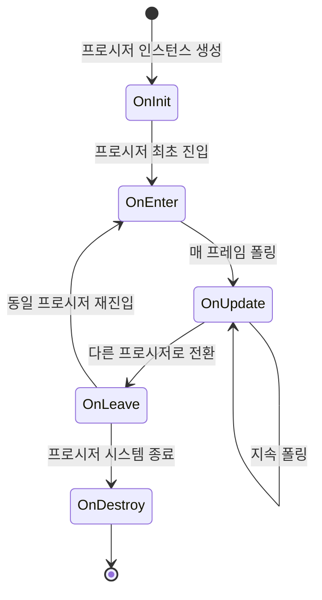

# ProcedureBase

프로시저 基類로, 게임의 각 프로시저 상태를 정의하는 데 사용됩니다.

## 개요

`ProcedureBase`는 GameFrameX 프로시저 관리 시스템의 핵심 추상 클래스로, `FsmState<IProcedureManager>`에서 상속됩니다. 게임 프로시저 생명 주기의 완전한 템플릿 메서드를 제공하며, 개발자는 이 클래스를 상속하여 사용자 정의 게임 프로시저(시작 프로시저, 메인 메뉴 프로시저, 게임 프로시저, 일시 정지 프로시저, 정산 프로시저 등)를 생성할 수 있습니다.

**설계 의도:**
GameFrameX의 프로시저管理系统는 유한 상태 머신(FSM) 패턴으로 설계되었습니다. `ProcedureBase`는 상태 基類로, 각 프로시저 상태에一套 표준 생명 주기 후크 메서드를 정의합니다. 이러한 설계는 게임 프로시저 관리를 명확하고 통제 가능하게 만들며, 서로 다른 프로시저 간의 부드러운 전환을 지원하며, 프로시저 간 데이터 전달 및 상태 유지도 지원합니다.

**핵심 특성:**
- 완전한 프로시저 생명 주기 관리(초기화 → 진입 → 업데이트 → 종료 →销毁)
- 프레임 업데이트(Update) 및 고정 프레임 업데이트(FixedUpdate) 지원
- 유한 상태 머신 기반의 프로시저 전환 메커니즘
- ProcedureManager와의 무缝 통합

## 아키텍처

```mermaid
graph TD
    subgraph GameFrameX 핵심 모듈
        FsmState[FsmState&lt;IProcedureManager&gt;]
    end

    subgraph Procedure 프로시저 모듈
        ProcedureBase["ProcedureBase<br/>(추상 基類)"]
        IProcedureManager[IProcedureManager<br/>(인터페이스)]
        ProcedureManager["ProcedureManager<br/>(프로시저 관리자)"]
    end

    subgraph Unity 통합 계층
        ProcedureComponent["ProcedureComponent<br/>(프로시저 컴포넌트)"]
    end

    subgraph 사용자 정의 프로시저
        CustomProcedure1["사용자 정의 프로시저 A<br/>(ProcedureBase 상속)"]
        CustomProcedure2["사용자 정의 프로시저 B<br/>(ProcedureBase 상속)"]
        CustomProcedureN["사용자 정의 프로시저 N<br/>(ProcedureBase 상속)"]
    end

    FsmState <|-- ProcedureBase
    ProcedureBase <|-- CustomProcedure1
    ProcedureBase <|-- CustomProcedure2
    ProcedureBase <|-- CustomProcedureN
    
    IProcedureManager <|.. ProcedureManager
    ProcedureManager --> ProcedureBase
    ProcedureComponent --> ProcedureManager
```

**아키텍처 설명:**

| 컴포넌트 | 역할 | 책임 |
|------|------|------|
| `FsmState<IProcedureManager>` | 基類 | 유한 상태 머신의 기본 기능 제공 |
| `ProcedureBase` | 추상 基類 | 프로시저의 표준 생명 주기 템플릿 정의 |
| `IProcedureManager` | 인터페이스 | 프로시저 관리자의 표준 작업 정의 |
| `ProcedureManager` | 구현 클래스 | 모든 프로시저 상태 관리 및 스케줄링 |
| `ProcedureComponent` | Unity컴포넌트 | Unity 환경에서 프로시저 시스템 초기화 |
| 사용자 정의 프로시저 | 구체적 구현 | ProcedureBase를 상속하여 구체적 업무 로직 구현 |

## 생명 주기



**생명 주기 단계 설명:**

| 단계 | 메서드 | 호출 시점 | 전형적인 용도 |
|------|------|----------|----------|
| 초기화 | `OnInit` | 프로시저 인스턴스 생성 후 최초 진입 전 | 프로시저 데이터 초기화, 구성 로딩 |
| 진입 | `OnEnter` | 프로시저 상태 진입 시 | 프로시저 리소스 준비, 인터페이스 표시 |
| 업데이트 | `OnUpdate` | 매 프레임 호출(로직 프레임) | 업무 로직 처리, 상태 확인 |
| 고정 업데이트 | `OnFixedUpdate` | 고정 시간 간격으로 호출 | 물리 관련 로직 |
| 종료 | `OnLeave` | 프로시저 상태 종료 시 | 임시 리소스 해제, 상태 저장 |
|销毁 | `OnDestroy` | 프로시저 시스템 종료 시 | 모든 리소스 정리 |

## 핵심 메서드

### OnInit - 프로시저 초기화

```csharp
protected override void OnInit(IFsm<IProcedureManager> procedureOwner)
```
> Source: [ProcedureBase.cs](https://github.com/GameFrameX/com.gameframex.unity.procedure/blob/main/Runtime/Procedure/ProcedureBase.cs#L22-L25)

프로시저 상태가 최초로 초기화될 때 호출됩니다. 이 메서드는 프로시저 인스턴스 생성 후, 프로시저 최초 진입 전에 호출됩니다.

**설계 의도:**
일회성 초기화 기회를 제공하여, 프로시저에 필요한 정적 데이터, 구성 정보 또는 사전 생성된 게임 객체를 로드하는 데 사용됩니다. 이 메서드는 전체 프로시저 생명 주기에서 한 번만 호출됩니다.

**매개변수:**
- `procedureOwner` (`IFsm<IProcedureManager>`): 프로시저 소유자의 유한 상태 머신

---

### OnEnter - 프로시저 진입

```csharp
protected override void OnEnter(IFsm<IProcedureManager> procedureOwner)
```
> Source: [ProcedureBase.cs](https://github.com/GameFrameX/com.gameframex.unity.procedure/blob/main/Runtime/Procedure/ProcedureBase.cs#L31-L34)

프로시저 상태가 다른 상태에서 현재 상태로 전환될 때 호출됩니다.

**설계 의도:**
프로시저에 진입할 때마다 호출되며, 프로시저에 필요한 리소스 준비, 해당 UI 인터페이스 표시, 특정音效 또는 애니메이션 시작 등에 적합합니다. 프로시저가 활성화될 때마다 트리거됩니다.

**매개변수:**
- `procedureOwner` (`IFsm<IProcedureManager>`): 프로시저 소유자의 유한 상태 머신

---

### OnUpdate - 프로시저 업데이트

```csharp
protected override void OnUpdate(IFsm<IProcedureManager> procedureOwner, float elapseSeconds, float realElapseSeconds)
```
> Source: [ProcedureBase.cs](https://github.com/GameFrameX/com.gameframex.unity.procedure/blob/main/Runtime/Procedure/ProcedureBase.cs#L42-L45)

프로시저 상태가 활동 상태에 있을 때 매 프레임 호출됩니다.

**설계 의도:**
프로시저 핵심 업무 로직을 구현하는 주요 후크입니다. 프로시저 전환 조건 확인, 게임 상태 업데이트, 사용자 입력 처리 등을 수행할 수 있습니다.

**매개변수:**
- `procedureOwner` (`IFsm<IProcedureManager>`): 프로시저 소유자의 유한 상태 머신
- `elapseSeconds` (float): 로직 경과 시간으로, 초 단위(시간 스케일 영향 받음)
- `realElapseSeconds` (float): 실제 경과 시간으로, 초 단위(시간 스케일 영향 받지 않음)

---

### OnFixedUpdate - 고정 주파수 업데이트

```csharp
protected override void OnFixedUpdate(IFsm<IProcedureManager> procedureOwner, float elapseSeconds, float realElapseSeconds)
```
> Source: [ProcedureBase.cs](https://github.com/GameFrameX/com.gameframex.unity.procedure/blob/main/Runtime/Procedure/ProcedureBase.cs#L53-L56)

고정 시간 간격으로 호출되며, 물리 관련 로직 처리에 사용됩니다.

**설계 의도:**
Unity의 FixedUpdate는 고정 시간 간격(기본 0.02초)으로 호출되어 물리 엔진 관련 로직 처리에 적합하며, 로직의 결정론성을 보장합니다.

**매개변수:**
- `procedureOwner` (`IFsm<IProcedureManager>`): 프로시저 소유자의 유한 상태 머신
- `elapseSeconds` (float): 로직 경과 시간으로, 초 단위
- `realElapseSeconds` (float): 실제 경과 시간으로, 초 단위

---

### OnLeave - 프로시저 종료

```csharp
protected override void OnLeave(IFsm<IProcedureManager> procedureOwner, bool isShutdown)
```
> Source: [ProcedureBase.cs](https://github.com/GameFrameX/com.gameframex.unity.procedure/blob/main/Runtime/Procedure/ProcedureBase.cs#L63-L66)

프로시저 상태가 현재 상태에서 다른 상태로 전환될 때 호출됩니다.

**설계 의도:**
현재 프로시저의 임시 리소스 정리, 상태 데이터 저장, UI 인터페이스 숨기기 등에 사용됩니다. 참고: `isShutdown`이 true인 경우 전체 프로시저 시스템을 종료하는 것이며, 프로시저 전환이 아닙니다.

**매개변수:**
- `procedureOwner` (`IFsm<IProcedureManager>`): 프로시저 소유자의 유한 상태 머신
- `isShutdown` (bool): 상태 머신 종료 시 트리거되는지 여부

---

### OnDestroy - 프로시저销毁

```csharp
protected override void OnDestroy(IFsm<IProcedureManager> procedureOwner)
```
> Source: [ProcedureBase.cs](https://github.com/GameFrameX/com.gameframex.unity.procedure/blob/main/Runtime/Procedure/ProcedureBase.cs#L72-L75)

프로시저 상태가销毁될 때 호출됩니다.

**설계 의도:**
전체 프로시저 시스템 종료 시 호출되어, 최종 정리 작업을 수행하고 모든 리소스를 해제합니다. 이는 프로시저 생명 주기의 마지막 단계입니다.

**매개변수:**
- `procedureOwner` (`IFsm<IProcedureManager>`): 프로시저 소유자의 유한 상태 머신

## 사용 예시

### 기본 사용자 정의 프로시저

간단한 시작 프로시저 생성:

```csharp
using GameFrameX.Procedure.Runtime;
using GameFrameX.Fsm.Runtime;

public class ProcedureLaunch : ProcedureBase
{
    protected override void OnInit(IFsm<IProcedureManager> procedureOwner)
    {
        base.OnInit(procedureOwner);
        // 시작 데이터 초기화
    }

    protected override void OnEnter(IFsm<IProcedureManager> procedureOwner)
    {
        base.OnEnter(procedureOwner);
        // 시작 인터페이스 표시
    }

    protected override void OnUpdate(IFsm<IProcedureManager> procedureOwner, float elapseSeconds, float realElapseSeconds)
    {
        base.OnUpdate(procedureOwner, elapseSeconds, realElapseSeconds);
        
        // 시작 완료 여부 확인, 다음 프로시저로 전환 가능
        // procedureOwner.Owner.StartProcedure<ProcedureMenu>();
    }

    protected override void OnLeave(IFsm<IProcedureManager> procedureOwner, bool isShutdown)
    {
        base.OnLeave(procedureOwner, isShutdown);
        // 시작 인터페이스 숨기기
    }
}
```

### 프로시저 전환 예시

프로시저에서 다른 프로시저로 전환:

```csharp
protected override void OnUpdate(IFsm<IProcedureManager> procedureOwner, float elapseSeconds, float realElapseSeconds)
{
    base.OnUpdate(procedureOwner, elapseSeconds, realElapseSeconds);
    
    // 특정 조건 충족 시 메뉴 프로시저로 전환
    if (someCondition)
    {
        // 프로시저 관리자를 가져와서 다음 프로시저 시작
        procedureOwner.Owner.StartProcedure<ProcedureMenu>();
    }
}
```

### 현재 프로시저 정보 가져오기

```csharp
// 임의의 위치에서 현재 프로시저 및 경과 시간 가져오기
var procedureComponent = UnityEngine.Object.FindObjectOfType<ProcedureComponent>();
var currentProcedure = procedureComponent.CurrentProcedure;
var elapsedTime = procedureComponent.CurrentProcedureTime;
```

## 다른 컴포넌트와의 관계

| 컴포넌트 | 관계 | 설명 |
|------|------|------|
| ProcedureComponent | 사용 | Unity 컴포넌트로, 프로시저 시스템 초기화에 사용 |
| ProcedureManager | 관리 | ProcedureBase 상태 전환을 실제 관리하는 클래스 |
| IProcedureManager | 구현 | ProcedureManager가 구현하는 인터페이스 |
| FsmState | 상속 | GameFrameX.Fsm의 基類 |

## 자주 묻는 질문

### Q: 왜 Update에서 직접 로직을 처리하지 않습니까?

**A:** `ProcedureBase`는 구조화된 생명 주기 메서드를 제공하며, 이러한 설계:
- 코드를 더 명확하게 만들고, 각 단계 책임이 명확함
- 디버깅 및 유지보수가 용이
- 상태의 올바른 진입/종료 처리 지원
- 다른 시스템(UI 시스템, 리소스 시스템 등)과 더 나은 통합 지원

### Q: 프로시저 간 데이터를 전달하려면 어떻게 합니까?

**A:** 다음 방법을 통해 전달할 수 있습니다:
1. 정적 변수 사용(권장하지 않음, 메모리 leak可能导致)
2. 독립적인 구성 클래스에 데이터를 저장하고, `procedureOwner.Owner`를 통해 ProcedureManager에 접근하여 저장
3. 게임 프레임워크의 데이터베이스 또는 구성 시스템 사용

### Q: OnInit과 OnEnter의 차이점은 무엇입니까?

**A:** 
- `OnInit`: 프로시저 인스턴스 생성 후 한 번만 호출되며, 전체 생명 주기에서 다시 호출되지 않음
- `OnEnter`: 해당 프로시저 상태에 진입할 때마다 호출되며, 여러 번 호출될 수 있음

## 관련 링크

- [ProcedureComponent](./3-core-concepts.procedure-component) - 프로시저 컴포넌트
- [IProcedureManager](./3-core-concepts.iprocedure-manager) - 프로시저 관리자 인터페이스
- [ProcedureManager](./3-core-concepts.procedure-manager) - 프로시저 관리자 구현
- [사용자 정의 프로시저](./4-custom-procedures) - 사용자 정의 프로시저 생성