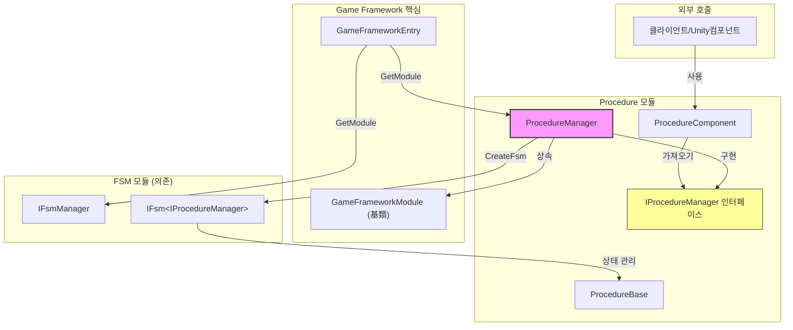

# ProcedureManager

ProcedureManager는 GameFrameX 프로시저 관리 시스템의 핵심 구현 클래스로, 게임의 다양한 프로시저 상태 및 그 전환을 관리합니다.

## 개요

ProcedureManager는 `IProcedureManager` 인터페이스를 구현하고 `GameFrameworkModule` 基類에서 상속하며, 프로시저 관리 모듈의 주요 구현입니다. 유한 상태 머신(FSM)을 기반으로 프로시저의 생성, 전환, 관리 기능을 구현합니다.

**설계 의도:**
- 게임의 다양한 단계(시작, 메뉴,游戏中, 일시 정지, 정산 등) 간의 부드러운 전환을 지원하는 통일된 프로시저 관리 메커니즘 제공
- FSM의 특성을 활용하여 프로시저 전환의 신뢰성 및 추적 가능성 보장
- GameFramework의 핵심 모듈로, 핫 업데이트 및 모듈화 확장 지원

## 아키텍처



### 컴포넌트 책임

| 컴포넌트 | 책임 |
|------|------|
| **ProcedureManager** | 핵심 구현 클래스로, 프로시저의 생성, 전환, 조회 관리 |
| **IProcedureManager** | 인터페이스 정의로, 프로시저 관리 작업 추상화 |
| **ProcedureComponent** | Unity 컴포넌트로, 씬에서 프로시저 구성 및 초기화 |
| **ProcedureBase** | 프로시저 基類로, 각 구체적 프로시저가 이 클래스를 상속 |
| **IFsmManager** | 유한 상태 머신 관리자(외부 의존) |

## 핵심 기능

### 1. 프로시저 관리자 초기화

프로시저 관리자를 사용하기 전에 먼저 초기화해야 합니다. 초기화 시 FSM 관리자와 사용 가능한 모든 프로시저 유형을 제공해야 합니다.

```csharp
public void Initialize(IFsmManager fsmManager, params ProcedureBase[] procedures)
```

> Source: [ProcedureManager.cs](https://github.com/GameFrameX/com.gameframex.unity.procedure/blob/main/Runtime/Procedure/ProcedureManager.cs#L104-L110)

**매개변수 설명:**
- `fsmManager`: 유한 상태 머신 관리자로, FSM 인스턴스 생성 및 관리 담당
- `procedures`: 사용 가능한 프로시저 인스턴스 배열

### 2. 프로시저 시작

초기화 완료 후 진입 프로시저를 지정하여 프로시저 관리자를 시작해야 합니다.

```csharp
// 제네릭 방식
public void StartProcedure<T>() where T : ProcedureBase

// Type 방식
public void StartProcedure(Type procedureType)
```

> Source: [ProcedureManager.cs](https://github.com/GameFrameX/com.gameframex.unity.procedure/blob/main/Runtime/Procedure/ProcedureManager.cs#L116-L138)

### 3. 프로시저 상태 조회

현재 프로시저 정보 조회 및 특정 프로시저 존재 여부 확인을 위한 다양한 방식을 제공합니다.

```csharp
// 현재 프로시저 가져오기
public ProcedureBase CurrentProcedure { get; }

// 현재 프로시저 경과 시간 가져오기
public float CurrentProcedureTime { get; }

// 지정된 프로시저 존재 여부 확인(제네릭)
public bool HasProcedure<T>() where T : ProcedureBase

// 지정된 프로시저 존재 여부 확인(Type)
public bool HasProcedure(Type procedureType)
```

> Source: [ProcedureManager.cs](https://github.com/GameFrameX/com.gameframex.unity.procedure/blob/main/Runtime/Procedure/ProcedureManager.cs#L44-L71), [L145-L168](https://github.com/GameFrameX/com.gameframex.unity.procedure/blob/main/Runtime/Procedure/ProcedureManager.cs#L145-L168)

### 4. 프로시저 인스턴스 가져오기

실행 시 등록된 임의의 프로시저 인스턴스를 가져와서 조작할 수 있습니다.

```csharp
// 제네릭 방식으로 가져오기
public ProcedureBase GetProcedure<T>() where T : ProcedureBase

// Type 방식으로 가져오기
public ProcedureBase GetProcedure(Type procedureType)
```

> Source: [ProcedureManager.cs](https://github.com/GameFrameX/com.gameframex.unity.procedure/blob/main/Runtime/Procedure/ProcedureManager.cs#L175-L198)

## 프로시저 전환 프로시저

```mermaid
sequenceDiagram
    participant Unity as Unity엔진
    participant PC as ProcedureComponent
    participant PM as ProcedureManager
    participant FSM as IFsmManager
    participant PB as ProcedureBase

    Unity->>PC: Awake()
    PC->>PM: GameFrameworkEntry.GetModule&lt;IProcedureManager&gt;()
    PC->>PC: Start() 코루틴
    PC->>PM: Initialize(fsmManager, procedures)
    PM->>FSM: CreateFsm(this, procedures)
    FSM-->>PM: IFsm&lt;IProcedureManager&gt;
    PM-->>PC: 초기화 완료
    PC->>PM: StartProcedure&lt;T&gt;()
    PM->>FSM: Start&lt;T&gt;()
    FSM->>PB: OnEnter() - 프로시저 진입
    Note over FSM,PB: 프로시저 실행 중...
    PB->>FSM: 프로시저 전환 트리거
    FSM->>PB: OnLeave() - 이전 프로시저 종료
    FSM->>PB: OnEnter() - 새 프로시저 진입
```

## 사용 예시

### 기본 사용 프로시저

1. **사용자 정의 프로시저 클래스 생성**

```csharp
using GameFrameX.Procedure.Runtime;

public class LoginProcedure : ProcedureBase
{
    protected override void OnEnter(IFsm<IProcedureManager> procedureOwner)
    {
        base.OnEnter(procedureOwner);
        // 로그인 프로시저 초기화
    }

    protected override void OnUpdate(IFsm<IProcedureManager> procedureOwner, float elapseSeconds, float realElapseSeconds)
    {
        base.OnUpdate(procedureOwner, elapseSeconds, realElapseSeconds);
        // 전환 조건 확인
        // 조건 충족 시 다음 프로시저로 전환
    }
}

public class GameProcedure : ProcedureBase
{
    protected override void OnEnter(IFsm<IProcedureManager> procedureOwner)
    {
        base.OnEnter(procedureOwner);
        // 게임 시작
    }
}
```

2. **ProcedureComponent 구성**

Unity 씬에 `ProcedureComponent` 컴포넌트를 추가하고 구성:
- `Available Procedure Type Names`: 모든 프로시저 유형 이름 추가
- `Entrance Procedure Type Name`: 진입 프로시저 유형 이름 설정

3. **코드에서 프로시저 전환**

```csharp
// 특정 Procedure에서 다음 프로시저로 전환한다고 가정
public class LoginProcedure : ProcedureBase
{
    protected override void OnUpdate(IFsm<IProcedureManager> procedureOwner, float elapseSeconds, float realElapseSeconds)
    {
        base.OnUpdate(procedureOwner, elapseSeconds, realElapseSeconds);
        
        // 로그인 완료 후 게임 프로시저로 전환
        if (IsLoginSuccess)
        {
            procedureOwner.ChangeState<GameProcedure>();
        }
    }
}
```

> Source: [ProcedureBase.cs](https://github.com/GameFrameX/com.gameframex.unity.procedure/blob/main/Runtime/Procedure/ProcedureBase.cs#L1-L77)

### ProcedureManager 직접 사용

ProcedureComponent를 통하지 않고 ProcedureManager를 직접 사용해야 하는 경우:

```csharp
// 프로시저 관리자 가져오기
IProcedureManager procedureManager = GameFrameworkEntry.GetModule<IProcedureManager>();

// FSM 관리자 가져오기
IFsmManager fsmManager = GameFrameworkEntry.GetModule<IFsmManager>();

// 초기화
procedureManager.Initialize(fsmManager, new LoginProcedure(), new GameProcedure());

// 진입 프로시저 시작
procedureManager.StartProcedure<LoginProcedure>();

// 게임 루프에서 조회
ProcedureBase current = procedureManager.CurrentProcedure;
float time = procedureManager.CurrentProcedureTime;
```

## API 참고

### 속성

| 속성 | 유형 | 설명 |
|------|------|------|
| **CurrentProcedure** | `ProcedureBase` | 현재 실행 중인 프로시저 인스턴스 가져오기 |
| **CurrentProcedureTime** | `float` | 현재 프로시저가 지속된 시간(초) 가져오기 |

### 메서드

#### `Initialize(IFsmManager fsmManager, params ProcedureBase[] procedures)`

프로시저 관리자를 초기화합니다.

**매개변수:**
- `fsmManager` (IFsmManager): 유한 상태 머신 관리자
- `procedures` (params ProcedureBase[]): 사용 가능한 프로시저 인스턴스 배열

**예외:**
- `GameFrameworkException`: fsmManager가 null일 때 발생

---

#### `StartProcedure<T>() where T : ProcedureBase`

지정된 프로시저 시작(제네릭 방식).

**매개변수:**
- 없음

**예외:**
- `GameFrameworkException`: 프로시저 관리자가 초기화되지 않았을 때 발생

---

#### `StartProcedure(Type procedureType)`

지정된 프로시저 시작(Type 방식).

**매개변수:**
- `procedureType` (Type): 시작할 프로시저 유형

**예외:**
- `GameFrameworkException`: 프로시저 관리자가 초기화되지 않았을 때 발생

---

#### `HasProcedure<T>() where T : ProcedureBase`

지정된 프로시저가 존재하는지 확인합니다.

**반환:** 
- `bool`: 존재하면 true, 그렇지 않으면 false

**예외:**
- `GameFrameworkException`: 프로시저 관리자가 초기화되지 않았을 때 발생

---

#### `GetProcedure<T>() where T : ProcedureBase`

지정된 유형의 프로시저 인스턴스를 가져옵니다.

**반환:** 
- `ProcedureBase`: 프로시저 인스턴스

**예외:**
- `GameFrameworkException`: 프로시저 관리자가 초기화되지 않았을 때 발생

---

### 생명 주기 메서드

ProcedureManager는 `GameFrameworkModule`에서 상속하여 주요 생명 주기 메서드:

| 메서드 | 설명 |
|------|------|
| `Update(elapseSeconds, realElapseSeconds)` | 폴링 메서드로, 현재 구현은 비어 있음(FSM이 자체 처리) |
| `Shutdown()` | 프로시저 관리자 종료 및 정리, FSM销毁 |

> Source: [ProcedureManager.cs](https://github.com/GameFrameX/com.gameframex.unity.procedure/blob/main/Runtime/Procedure/ProcedureManager.cs#L78-L97)

## 의존 관계

ProcedureManager는 다음 컴포넌트에 의존합니다:

| 의존 항목 | 설명 | 출처 |
|--------|------|------|
| **IFsmManager** | 유한 상태 머신 관리자 | GameFrameX.Fsm.Runtime |
| **IFsm\<IProcedureManager\>** | 프로시저 상태 머신 인스턴스 | GameFrameX.Fsm.Runtime |
| **GameFrameworkModule** | GameFramework 모듈 基類 | GameFrameX.Runtime |
| **ProcedureBase** | 프로시저 基類 | 본 모듈 |

## 관련 링크

- [IProcedureManager](./3-core-concepts.iprocedure-manager) - 프로시저 관리자 인터페이스 정의
- [ProcedureBase](./3-core-concepts.procedure-base) - 프로시저 基類
- [ProcedureComponent](./3-core-concepts.procedure-component) - Unity 프로시저 컴포넌트
- [FSM 모듈](https://github.com/GameFrameX/com.alianblank.gameframex.unity.fsm) - 유한 상태 머신 모듈
- [사용자 정의 프로시저](./4-custom-procedures) - 사용자 정의 프로시저 생성 방법