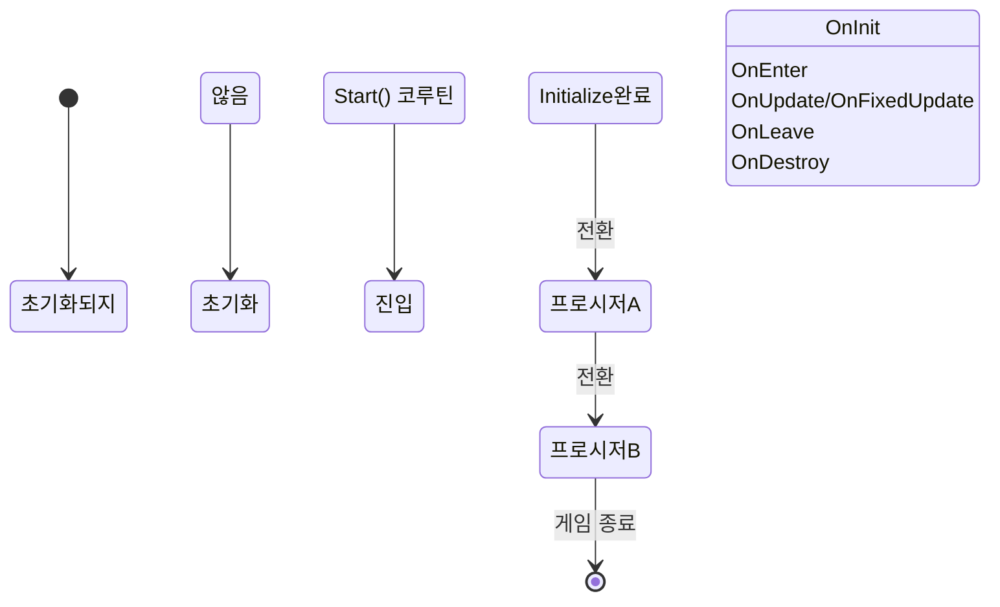

# ProcedureComponent

ProcedureComponent는 GameFrameX 프로시저 시스템의 핵심 Unity 컴포넌트로, 게임의 다양한 프로시저 상태를 관리하고 조정합니다.

## 개요

ProcedureComponent는 Unity MonoBehaviour 컴포넌트로, 게임 프로시저 관리의 진입점입니다. IProcedureManager 인터페이스를 캡슐화하여 Unity 지향 컴포넌트 인터페이스를 제공하며, Unity 편집기에서 구성 및 관리를 용이하게 합니다.

해당 컴포넌트의 주요 책임:
- 게임 시작 시 프로시저 관리자 초기화
- 리플렉션을 통해 모든 사용 가능한 프로시저 인스턴스 생성
- 진입 프로시저 자동 시작
- 프로시저 조회 및 가져오기 공용 인터페이스 제공

### 핵심 개념

| 개념 | 설명 |
|------|------|
| **프로시저 (Procedure)** | 게임의 서로 다른 단계 또는 상태로, 시작 프로시저, 메뉴 프로시저, 게임 프로시저 등 |
| **진입 프로시저 (Entrance Procedure)** | 게임 시작 시 가장 먼저 실행되는 프로시저 |
| **프로시저 관리자 (ProcedureManager)** | 모든 프로시저의 생성, 전환,销毁를 담당하여 관리 |

## 아키텍처

```mermaid
flowchart TD
    subgraph Unity["Unity 계층"]
        PC[ProcedureComponent]
        Inspector[ProcedureComponentInspector]
    end

    subgraph GameFramework["Game Framework 핵심"]
        GFC[GameFrameworkComponent]
        GFE[GameFrameworkEntry]
    end

    subgraph Procedure["프로시저 시스템"]
        IPM[IProcedureManager]
        PM[ProcedureManager]
        PB[ProcedureBase]
    end

    subgraph FSM["상태 머신 시스템"]
        FSMComp[FSMComponent]
        FSM[IFsmManager]
    end

    PC -->|상속| GFC
    PC -->|모듈 가져오기| GFE
    GFE -->|반환| IPM
    IPM -->|구현| PM
    PM -->|사용| FSM
    FSM -->|의존| FSMComp
    PB -->|상태| PM
    Inspector -->|편집| PC
```

### 컴포넌트 관계 설명

- **ProcedureComponent**: GameFrameworkComponent에서 상속되며, Unity 계층의 진입 컴포넌트
- **IProcedureManager**: 프로시저 관리 인터페이스를 정의하며, 모든 프로시저 작업을 캡슐화
- **ProcedureManager**: IProcedureManager의 구체적 구현으로, 내부에서 FSM을 사용하여 프로시저 관리
- **ProcedureBase**: 모든 사용자 정의 프로시저의 基類로, `FsmState<IProcedureManager>`에서 상속
- **FSMComponent**:底層 유한 상태 머신 기능을 제공하며, 프로시저 시스템의 의존성

## 핵심 기능

### 프로시저 초기화

ProcedureComponent는 컴포넌트 Awake 및 Start 단계에서 초기화를 완료합니다:

```csharp
protected override void Awake()
{
    ImplementationComponentType = Utility.Assembly.GetType(componentType);
    InterfaceComponentType = typeof(IProcedureManager);
    base.Awake();
    m_ProcedureManager = GameFrameworkEntry.GetModule<IProcedureManager>();
    // ...
}
```

> Source: [ProcedureComponent.cs](https://github.com/GameFrameX/com.gameframex.unity.procedure/blob/main/Runtime/Procedure/ProcedureComponent.cs#L58-L69)

```csharp
private IEnumerator Start()
{
    ProcedureBase[] procedures = new ProcedureBase[m_AvailableProcedureTypeNames.Length];
    for (int i = 0; i < m_AvailableProcedureTypeNames.Length; i++)
    {
        Type procedureType = Utility.Assembly.GetType(m_AvailableProcedureTypeNames[i]);
        // ... 오류 확인 ...
        procedures[i] = (ProcedureBase)Activator.CreateInstance(procedureType);
        // ... 진입 프로시저 기록 ...
    }
    
    m_ProcedureManager.Initialize(GameFrameworkEntry.GetModule<IFsmManager>(), procedures);
    yield return new WaitForEndOfFrame();
    m_ProcedureManager.StartProcedure(m_EntranceProcedure.GetType());
}
```

> Source: [ProcedureComponent.cs](https://github.com/GameFrameX/com.gameframex.unity.procedure/blob/main/Runtime/Procedure/ProcedureComponent.cs#L71-L107)

**설계 의도**: Start() 코루틴을 사용하여 모든 컴포넌트 Awake 완료 후 프로시저 초기화 및 시작을 수행합니다. WaitForEndOfFrame은 Unity가 완전히 초기화된 후 프로시저를 시작하도록 보장합니다.

### 프로시저 조회

ProcedureComponent는 현재 프로시저 상태를 조회하는 다양한 인터페이스를 제공합니다:

```csharp
/// <summary>
/// 현재 프로시저 관리자 가져오기.
/// </summary>
public IProcedureManager Procedure
{
    get { return m_ProcedureManager; }
}

/// <summary>
/// 현재 실행 중인 프로시저 가져오기.
/// </summary>
public ProcedureBase CurrentProcedure
{
    get { return m_ProcedureManager.CurrentProcedure; }
}

/// <summary>
/// 현재 프로시저가 지속된 시간 가져오기.
/// </summary>
public float CurrentProcedureTime
{
    get { return m_ProcedureManager.CurrentProcedureTime; }
}
```

> Source: [ProcedureComponent.cs](https://github.com/GameFrameX/com.gameframex.unity.procedure/blob/main/Runtime/Procedure/ProcedureComponent.cs#L31-L53)

### 프로시저 존재 여부 확인

```csharp
/// <summary>
/// 지정된 유형의 프로시저가 존재하는지 확인.
/// </summary>
public bool HasProcedure<T>() where T : ProcedureBase
{
    return m_ProcedureManager.HasProcedure<T>();
}

public bool HasProcedure(Type procedureType)
{
    return m_ProcedureManager.HasProcedure(procedureType);
}
```

> Source: [ProcedureComponent.cs](https://github.com/GameFrameX/com.gameframex.unity.procedure/blob/main/Runtime/Procedure/ProcedureComponent.cs#L109-L127)

### 프로시저 인스턴스 가져오기

```csharp
/// <summary>
/// 지정된 유형의 프로시저 인스턴스 가져오기.
/// </summary>
public ProcedureBase GetProcedure<T>() where T : ProcedureBase
{
    return m_ProcedureManager.GetProcedure<T>();
}

public ProcedureBase GetProcedure(Type procedureType)
{
    return m_ProcedureManager.GetProcedure(procedureType);
}
```

> Source: [ProcedureComponent.cs](https://github.com/GameFrameX/com.gameframex.unity.procedure/blob/main/Runtime/Procedure/ProcedureComponent.cs#L129-L147)

## 프로시저 생명 주기



### 프로시저 콜백 메서드

ProcedureBase는 완전한 생명 주기 콜백을 제공합니다:

| 콜백 메서드 | 호출 시점 | 용도 |
|----------|----------|------|
| OnInit | 프로시저 상태 초기화 시 | 프로시저 데이터 초기화 |
| OnEnter | 프로시저 진입 시 | 프로시저 리소스 준비 |
| OnUpdate | 매 프레임 업데이트 시 | 프로시저 로직 업데이트 |
| OnFixedUpdate | 물리 업데이트 시 | 물리 관련 로직 |
| OnLeave | 프로시저 종료 시 | 프로시저 리소스 정리 |
| OnDestroy | 프로시저销毁 시 | 모든 리소스 해제 |

> Source: [ProcedureBase.cs](https://github.com/GameFrameX/com.gameframex.unity.procedure/blob/main/Runtime/Procedure/ProcedureBase.cs#L16-L76)

## 사용 예시

### Unity 편집기에서 구성

1. 씬에 빈 GameObject 생성
2. `Procedure` 컴포넌트 추가(메뉴: `Game Framework` → `Procedure`)
3. Inspector 패널에서 구성:
   - **Available Procedures**: 관리할 프로시저 유형 선택
   - **Entrance Procedure**: 게임 시작 시 진입 프로시저 선택

### 코드에서 현재 프로시저 가져오기

```csharp
// ProcedureComponent 인스턴스 가져오기
var procedureComponent = UnityEngine.Object.FindObjectOfType<ProcedureComponent>();

// 현재 프로시저 가져오기
var currentProcedure = procedureComponent.CurrentProcedure;

// 현재 프로시저 지속 시간 가져오기
float elapsedTime = procedureComponent.CurrentProcedureTime;

// 지정된 프로시저가 존재하는지 확인
if (procedureComponent.HasProcedure<MenuProcedure>())
{
    // 지정된 프로시저 인스턴스 가져오기
    var menuProcedure = procedureComponent.GetProcedure<MenuProcedure>();
}
```

### 프로시저 전환

프로시저의 전환은 일반적으로 ProcedureBase의 OnUpdate 메서드에서 조건 판단에 따라 수행됩니다:

```csharp
public class MenuProcedure : ProcedureBase
{
    protected override void OnUpdate(IFsm<IProcedureManager> procedureOwner, 
        float elapseSeconds, float realElapseSeconds)
    {
        base.OnUpdate(procedureOwner, elapseSeconds, realElapseSeconds);
        
        // 시작 버튼 클릭 후 게임 프로시저로 전환한다고 가정
        if (Input.GetMouseButtonUp(0))
        {
            // 프로시저 관리자를 가져와서 프로시저 전환
            procedureOwner.GetComponent<ProcedureManager>()
                .StartProcedure<GameProcedure>();
        }
    }
}
```

> Source: [ProcedureManager.cs](https://github.com/GameFrameX/com.gameframex.unity.procedure/blob/main/Runtime/Procedure/ProcedureManager.cs#L112-L138)

## 구성 설명

| 속성 | 유형 | 설명 |
|------|------|------|
| m_AvailableProcedureTypeNames | string[] | 사용 가능한 프로시저 유형 이름 배열 |
| m_EntranceProcedureTypeName | string | 진입 프로시저 유형 이름 |

### 구성 제약

- `[DisallowMultipleComponent]`: 각 GameObject에는 ProcedureComponent를 하나만 추가 가능
- `[AddComponentMenu("Game Framework/Procedure")]`: Unity 메뉴에서 빠르게 추가 가능

## 주의 사항

1. **실행 순서**: ProcedureComponent는 FSMComponent에 의존하며, FSMComponent가 올바르게 구성되었는지 확인
2. **진입 프로시저**: 유효한 진입 프로시저를 설정해야 하며, 그렇지 않으면 게임이 시작되지 않음
3. **프로시저 유형**: 모든 프로시저 클래스는 ProcedureBase를 상속해야 함
4. **편집기 구성**: Play 모드에서는 사용 가능한 프로시저 목록을 수정할 수 없음

## 관련 링크

- [ProcedureBase](./3-core-concepts.procedure-base) - 프로시저 基類
- [IProcedureManager](./3-core-concepts.iprocedure-manager) - 프로시저 관리자 인터페이스
- [ProcedureManager](./3-core-concepts.procedure-manager) - 프로시저 관리자 구현
- [사용자 정의 프로시저](./4-custom-procedures) - 사용자 정의 프로시저 생성 방법
- [편집기 사용](./5-editor-usage) - 편집기 구성 가이드