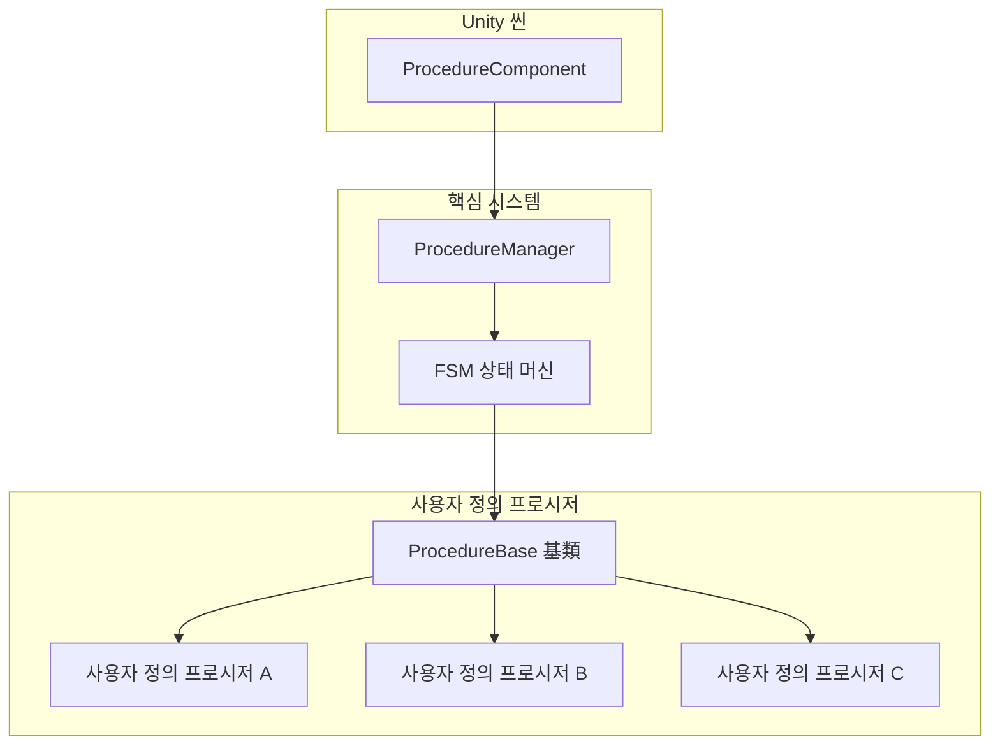
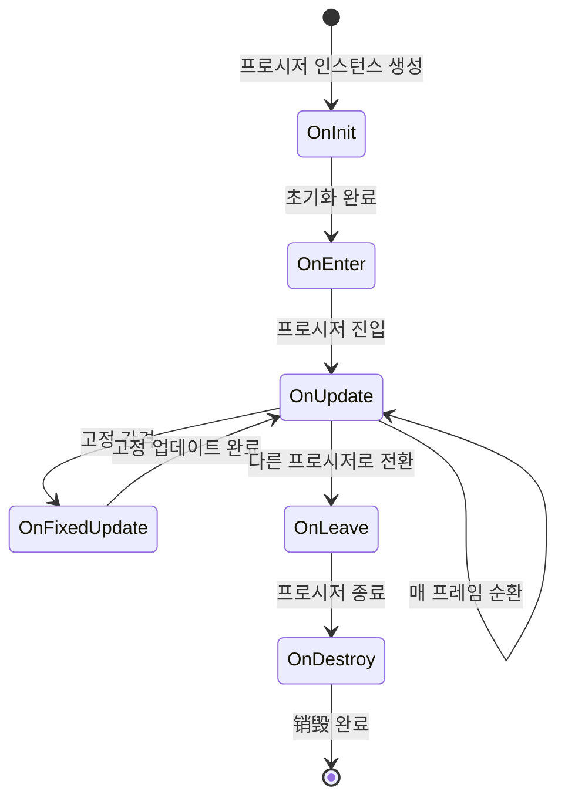

# 사용자 정의 프로시저

사용자 정의 프로시저는 GameFrameX 프로시저 시스템의 핵심 확장 메커니즘입니다. `ProcedureBase` 基類를 상속하고 해당 생명 주기 메서드를 재정의하여, 게임의 다양한 단계(시작 프로시저, 메뉴 프로시저, 게임 프로시저 등)에 적합한 사용자 정의 프로시저를 생성할 수 있습니다.

## 개요

GameFrameX의 프로시저 시스템은 유한 상태 머신(FSM) 기반으로 설계되었으며, 각 프로시저(Procedure)는 게임의 독립적인 상태 또는 단계를 표현합니다. 시스템은 `ProcedureComponent` 컴포넌트를 통해 Unity 씬에서 모든 프로시저를 관리하며, 구체적인 프로시저 로직은 사용자 정의 클래스를 통해 구현됩니다.



### 설계 의도

FSM 패턴으로 프로시저를 관리하는 이점:
- **상태 명확성**: 각 프로시저가 게임의 명확한 단계를 나타내어 관리 및 디버깅 용이
- **로직 분리**: 각 프로시저가 서로 독립적이어서 개별 개발 및 테스트 가능
- **부드러운 전환**: 프로시저 간 부드러운 전환 및 전환 애니메이션 지원
- **확장성**: 새 프로시저는 새 클래스 생성만으로 추가 가능하며 기존 코드 수정 불필요

## 사용자 정의 프로시저 생성

### 기본 구조

사용자 정의 프로시저 생성 시 `ProcedureBase` 클래스를 상속하고 필요한 생명 주기 메서드를 재정의해야 합니다.

```csharp
using GameFrameX.Procedure.Runtime;
using GameFrameX.Fsm.Runtime;

namespace MyGame.Procedure
{
    /// <summary>
    /// 예시 사용자 정의 프로시저.
    /// </summary>
    public class DemoProcedure : ProcedureBase
    {
        /// <summary>
        /// 프로시저 초기화 시 호출.
        /// </summary>
        protected override void OnInit(IFsm<IProcedureManager> procedureOwner)
        {
            base.OnInit(procedureOwner);
            // 초기화 코드, 예: 구성 로딩, 리소스 사전 로딩 등
        }

        /// <summary>
        /// 프로시저 진입 시 호출.
        /// </summary>
        protected override void OnEnter(IFsm<IProcedureManager> procedureOwner)
        {
            base.OnEnter(procedureOwner);
            // 프로시저 진입 로직, 예: 인터페이스 표시, 음악 재생 등
        }

        /// <summary>
        /// 프로시저 업데이트 시 매 프레임 호출.
        /// </summary>
        protected override void OnUpdate(IFsm<IProcedureManager> procedureOwner, float elapseSeconds, float realElapseSeconds)
        {
            base.OnUpdate(procedureOwner, elapseSeconds, realElapseSeconds);
            // 매 프레임 실행할 로직
            
            // 예시: 조건 충족 시 다음 프로시저로 전환
            // if (someCondition)
            // {
            //     ChangeState<NextProcedure>(procedureOwner);
            // }
        }

        /// <summary>
        /// 프로시저 고정 업데이트 시 호출.
        /// </summary>
        protected override void OnFixedUpdate(IFsm<IProcedureManager> procedureOwner, float elapseSeconds, float realElapseSeconds)
        {
            base.OnFixedUpdate(procedureOwner, elapseSeconds, realElapseSeconds);
            // 물리 관련 고정 업데이트 로직
        }

        /// <summary>
        /// 프로시저 종료 시 호출.
        /// </summary>
        protected override void OnLeave(IFsm<IProcedureManager> procedureOwner, bool isShutdown)
        {
            base.OnLeave(procedureOwner, isShutdown);
            // 프로시저 종료 정리 작업, 예: 인터페이스 숨기기, 음향 중단 등
        }

        /// <summary>
        /// 프로시저销毁 시 호출.
        /// </summary>
        protected override void OnDestroy(IFsm<IProcedureManager> procedureOwner)
        {
            base.OnDestroy(procedureOwner);
            // 리소스 해제, 메모리 정리 등
        }
    }
}
```
> Source: [ProcedureBase.cs](https://github.com/GameFrameX/com.gameframex.unity.procedure/blob/main/Runtime/Procedure/ProcedureBase.cs#L1-L77)

## 생명 주기 상세

### 프로시저 상태 흐름



### 각 생명 주기 메서드 설명

| 메서드 | 호출 시점 | 전형적인 용도 |
|------|----------|----------|
| `OnInit` | 프로시저 상태가 최초로 생성될 때 | 데이터 사전 로딩, 데이터 구조 초기화 |
| `OnEnter` | 해당 프로시저 상태에 진입할 때 | 인터페이스 표시, 음향 재생, 리소스 로딩 |
| `OnUpdate` | 매 프레임 업데이트 시 | 업무 로직 확인, 타임아웃 감지, 조건 판단 |
| `OnFixedUpdate` | 고정 시간 간격 업데이트 | 물리 계산, 입력 처리 |
| `OnLeave` | 해당 프로시저 상태를 종료할 때 | 인터페이스 숨기기, 상태 저장, 리소스 정리 |
| `OnDestroy` | 프로시저 상태가销毁될 때 | 참조 해제, 메모리 정리 |

### 프로시저 매개변수 설명

`OnUpdate` 및 `OnFixedUpdate` 메서드는 두 가지 시간 매개변수를 제공합니다:

- **`elapseSeconds`**: 로직 경과 시간(게임 일시 정지, 시간 스케일 영향 받음)
- **`realElapseSeconds`**: 실제 경과 시간(게임 일시 정지 영향 받지 않음)

```csharp
protected override void OnUpdate(IFsm<IProcedureManager> procedureOwner, float elapseSeconds, float realElapseSeconds)
{
    base.OnUpdate(procedureOwner, elapseSeconds, realElapseSeconds);
    
    // elapseSeconds를 사용하여 시간 스케일 영향받는 타이밍 계산
    // realElapseSeconds를 사용하여 실제 타임아웃 계산
}
```

## 프로시저 간 전환

### 다음 프로시저로 전환

`OnUpdate` 메서드에서 업무 조건에 따라 프로시저를 전환합니다:

```csharp
using GameFrameX.Fsm.Runtime;

protected override void OnUpdate(IFsm<IProcedureManager> procedureOwner, float elapseSeconds, float realElapseSeconds)
{
    base.OnUpdate(procedureOwner, elapseSeconds, realElapseSeconds);
    
    // 예시: 타임아웃 후 자동 전환
    if (procedureOwner.CurrentStateTime >= 3.0f)
    {
        // 다음 프로시저로 전환
        ChangeState<MenuProcedure>(procedureOwner);
    }
}
```

### 현재 프로시저 정보 가져오기

```csharp
protected override void OnUpdate(IFsm<IProcedureManager> procedureOwner, float elapseSeconds, float realElapseSeconds)
{
    base.OnUpdate(procedureOwner, elapseSeconds, realElapseSeconds);
    
    // 현재 프로시저 가져오기
    ProcedureBase current = procedureOwner.CurrentState;
    
    // 현재 프로시저 실행 시간 가져오기
    float time = procedureOwner.CurrentStateTime;
    
    // 예시: 5초 후 전환
    if (time > 5.0f)
    {
        ChangeState<NextProcedure>(procedureOwner);
    }
}
```

## 사용자 정의 프로시저 등록

### Editor를 통해 등록

1. Unity 씬에서 `ProcedureComponent`가 포함된 GameObject 생성 또는 선택
2. Inspector 패널에서 "Available Procedures" 목록 확인
3. 포함할 사용자 정의 프로시저 유형 체크
4. "Entrance Procedure" 드롭다운 메뉴에서 진입 프로시저 선택

```csharp
// ProcedureComponent의 Unity 편집기 구성
// 소스 위치: Runtime/Procedure/ProcedureComponent.cs
[SerializeField] private string[] m_AvailableProcedureTypeNames = null;
[SerializeField] private string m_EntranceProcedureTypeName = null;
```
> Source: [ProcedureComponent.cs](https://github.com/GameFrameX/com.gameframex.unity.procedure/blob/main/Runtime/Procedure/ProcedureComponent.cs#L27-L29)

### 실행 시 등록

실행 시 동적으로 프로시저를 등록해야 하는 경우, 리플렉션 또는 코드를 통해 직접 등록할 수 있습니다:

```csharp
// 코드를 통해 프로시저 관리자 초기화
IProcedureManager procedureManager = GameFrameworkEntry.GetModule<IProcedureManager>();
procedureManager.Initialize(fsmManager, 
    new ProcedureA(), 
    new ProcedureB(), 
    new ProcedureC());

// 진입 프로시저 시작
procedureManager.StartProcedure<EntranceProcedure>();
```
> Source: [ProcedureManager.cs](https://github.com/GameFrameX/com.gameframex.unity.procedure/blob/main/Runtime/Procedure/ProcedureManager.cs#L104-L124)

## 완전한 예시

다음은 전형적인 게임 프로시저 구현 예시입니다:

```csharp
using GameFrameX.Procedure.Runtime;
using GameFrameX.Fsm.Runtime;
using UnityEngine;

namespace MyGame.Procedure
{
    /// <summary>
    /// 시작 프로시저 - 게임 초기화 및 리소스 로딩 담당.
    /// </summary>
    public class LaunchProcedure : ProcedureBase
    {
        private float _loadingDuration = 2.0f; // 로딩 시간 시뮬레이션
        
        protected override void OnEnter(IFsm<IProcedureManager> procedureOwner)
        {
            base.OnEnter(procedureOwner);
            Debug.Log("시작 프로시저 진입, 초기화 시작...");
            // 로딩 인터페이스 표시
        }

        protected override void OnUpdate(IFsm<IProcedureManager> procedureOwner, float elapseSeconds, float realElapseSeconds)
        {
            base.OnUpdate(procedureOwner, elapseSeconds, realElapseSeconds);
            
            // 로딩 진행 상황 시뮬레이션
            float progress = procedureOwner.CurrentStateTime / _loadingDuration;
            
            if (procedureOwner.CurrentStateTime >= _loadingDuration)
            {
                Debug.Log("로딩 완료, 메뉴 프로시저로 전환");
                ChangeState<MenuProcedure>(procedureOwner);
            }
        }

        protected override void OnLeave(IFsm<IProcedureManager> procedureOwner, bool isShutdown)
        {
            base.OnLeave(procedureOwner, isShutdown);
            // 로딩 인터페이스 숨기기
            Debug.Log("시작 프로시저 종료");
        }
    }

    /// <summary>
    /// 메뉴 프로시저 - 메인 메뉴 표시 및 메뉴 조작 처리 담당.
    /// </summary>
    public class MenuProcedure : ProcedureBase
    {
        private bool _startGameRequested = false;
        
        protected override void OnEnter(IFsm<IProcedureManager> procedureOwner)
        {
            base.OnEnter(procedureOwner);
            Debug.Log("메뉴 프로시저 진입");
            // 메인 메뉴 인터페이스 표시
            // 게임 시작 버튼 이벤트 바인딩
        }

        protected override void OnUpdate(IFsm<IProcedureManager> procedureOwner, float elapseSeconds, float realElapseSeconds)
        {
            base.OnUpdate(procedureOwner, elapseSeconds, realElapseSeconds);
            
            // 게임 시작 요청 여부 확인
            if (_startGameRequested)
            {
                ChangeState<GameProcedure>(procedureOwner);
            }
        }

        protected override void OnLeave(IFsm<IProcedureManager> procedureOwner, bool isShutdown)
        {
            base.OnLeave(procedureOwner, isShutdown);
            // 메뉴 인터페이스 숨기기
            Debug.Log("메뉴 프로시저 종료");
        }

        // 외부 호출 메서드
        public void RequestStartGame()
        {
            _startGameRequested = true;
        }
    }

    /// <summary>
    /// 게임 프로시저 - 게임 핵심 로직 담당.
    /// </summary>
    public class GameProcedure : ProcedureBase
    {
        protected override void OnEnter(IFsm<IProcedureManager> procedureOwner)
        {
            base.OnEnter(procedureOwner);
            Debug.Log("게임 프로시저 진입");
            // 게임 씬 초기화, 게임 데이터 로딩 등
        }

        protected override void OnUpdate(IFsm<IProcedureManager> procedureOwner, float elapseSeconds, float realElapseSeconds)
        {
            base.OnUpdate(procedureOwner, elapseSeconds, realElapseSeconds);
            
            // 게임 메인 루프 로직
            // 게임 종료 여부, 일시 정지 여부 등 확인
            
            // 예시: ESC 키를 누르면 메뉴로 복귀
            // if (Input.GetKeyDown(KeyCode.Escape))
            // {
            //     ChangeState<MenuProcedure>(procedureOwner);
            // }
        }

        protected override void OnLeave(IFsm<IProcedureManager> procedureOwner, bool isShutdown)
        {
            base.OnLeave(procedureOwner, isShutdown);
            // 게임 데이터 저장, 게임 씬 정리
            Debug.Log("게임 프로시저 종료");
        }
    }
}
```

## 모범 사례

### 1. 단일 책임 원칙

각 프로시저는 하나의 명확한 게임 단계만 담당해야 하며, 하나의 프로시저에 여러 기능을 혼합하지 마세요:

```csharp
// 좋은 설계
public class LoadingProcedure : ProcedureBase { /* 로딩 담당 */ }
public class MenuProcedure : ProcedureBase { /* 메뉴 담당 */ }
public class GameProcedure : ProcedureBase { /* 게임 로직 담당 */ }

// 피해야 할 설계
public class LoadingAndMenuAndGameProcedure : ProcedureBase { /* 여러 기능 혼합 */ }
```

### 2. 프로시저 간 통신

이벤트 또는 데이터 컨테이너를 사용하여 프로시저 간 데이터를 전달합니다:

```csharp
// 데이터를 전달하기 위한 사용자 정의 데이터 클래스
public class ProcedureData
{
    public string PlayerName;
    public int LevelId;
}

// 프로시저에서 데이터 가져오기
protected override void OnEnter(IFsm<IProcedureManager> procedureOwner)
{
    base.OnEnter(procedureOwner);
    
    // 전달된 데이터 가져오기
    var data = procedureOwner.GetData<ProcedureData>("Key");
    if (data != null)
    {
        Debug.Log($"플레이어: {data.PlayerName}, 레벨: {data.LevelId}");
    }
}
```

### 3. 리소스 관리

`OnLeave` 및 `OnDestroy`에서 올바르게 리소스를 정리합니다:

```csharp
protected override void OnLeave(IFsm<IProcedureManager> procedureOwner, bool isShutdown)
{
    base.OnLeave(procedureOwner, isShutdown);
    
    // 모든 비동기 로딩 취소
    // 본 프로시저가 사용한 리소스 해제
}

protected override void OnDestroy(IFsm<IProcedureManager> procedureOwner)
{
    base.OnDestroy(procedureOwner);
    
    // 참조 완전히 정리
}
```

### 4. 디버깅 기법

`CurrentStateTime`을 활용하여 타임아웃 감지 및 진행률 표시를 수행합니다:

```csharp
protected override void OnUpdate(IFsm<IProcedureManager> procedureOwner, float elapseSeconds, float realElapseSeconds)
{
    base.OnUpdate(procedureOwner, elapseSeconds, realElapseSeconds);
    
    // 로딩 진행률 표시
    float progress = Mathf.Clamp01(procedureOwner.CurrentStateTime / 3.0f);
    Debug.Log($"로딩 진행률: {progress * 100}%");
}
```

## 관련 링크

- [ProcedureComponent 프로시저 컴포넌트](./3-core-concepts.procedure-component)
- [ProcedureBase 프로시저 基類](./3-core-concepts.procedure-base)
- [IProcedureManager 인터페이스](./3-core-concepts.iprocedure-manager)
- [ProcedureManager 관리자](./3-core-concepts.procedure-manager)
- [편집기 사용 가이드](./5-editor-usage)
- [설치 가이드](./2-installation)