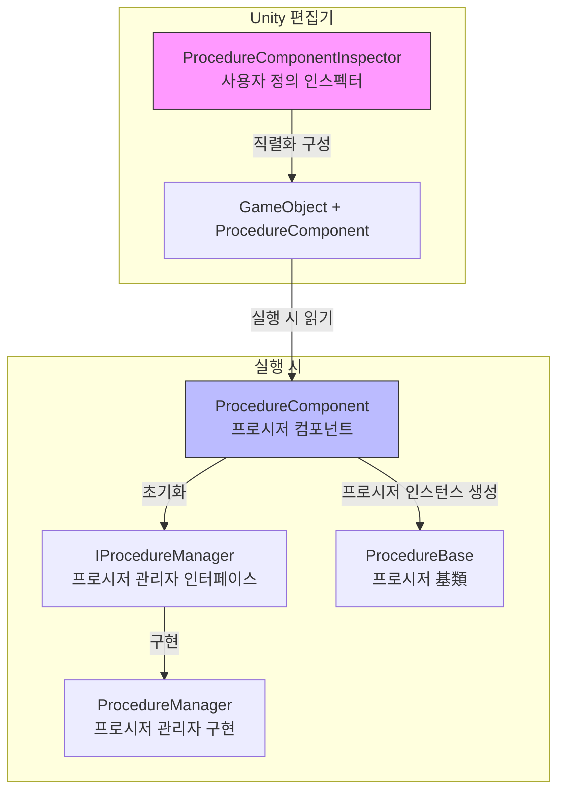
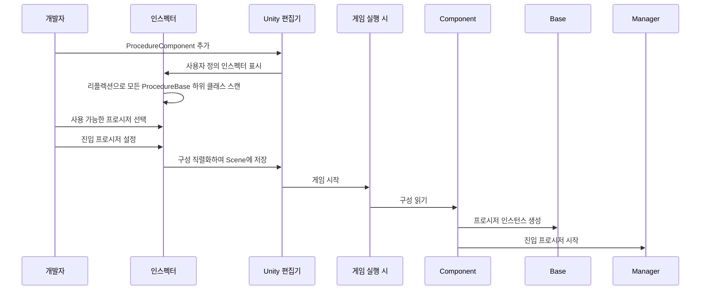

# 편집기 사용

이 문서는 Unity 편집기에서 Procedure 프로시저 관리 컴포넌트를 구성하고 사용하는 방법을 소개합니다.

## 개요

`ProcedureComponentInspector`는 GameFrameX Procedure 프로시저 관리 시스템의 편집기 확장 기능으로, 시각화된 프로시저 구성 인터페이스를 제공합니다. 이 인스펙터를 통해 개발자는:

- `ProcedureBase`를 상속하는 모든 프로시저 클래스를 자동으로 발견
- 게임 사용 가능한 프로시저를 시각적으로 선택
- 게임 시작 시 진입 프로시저 구성
- 실행 시 현재 실행 중인 프로시저 보기

## 아키텍처



### 작업 프로시저



## 씬에 프로시저 컴포넌트 추가

### 단계 1: 컴포넌트 추가

Unity 씬에 빈 오브젝트를 생성하거나 기존 오브젝트를 선택한 후 `Procedure` 컴포넌트를 추가합니다:

1. Hierarchy 패널에서 대상 GameObject 선택
2. Inspector 패널에서 **Add Component** 버튼 클릭
3. **Game Framework / Procedure** 검색하여 추가

> Source: [ProcedureComponent.cs](https://github.com/GameFrameX/com.gameframex.unity.procedure/blob/main/Runtime/Procedure/ProcedureComponent.cs#L20-L21)

```csharp
[DisallowMultipleComponent]
[AddComponentMenu("Game Framework/Procedure")]
public sealed class ProcedureComponent : GameFrameworkComponent
```

**주의:** 해당 컴포넌트는 `[DisallowMultipleComponent]` 속성을 사용하여, 각 GameObject에는 `ProcedureComponent`를 하나만 추가할 수 있습니다.

### 단계 2: 컴포넌트 구성

컴포넌트 추가 후 인스펙터 인터페이스가 자동으로 다음 내용을 표시합니다:

| 영역 | 설명 |
|------|------|
| **Available Procedures** | 사용 가능한 모든 프로시저 유형 나열(자동 발견) |
| **Entrance Procedure** | 게임 시작 시 첫 번째 프로시저 설정 |

## 인스펙터 인터페이스 상세

### 실행 시 정보 표시

게임 실행 시(Play 모드) 인스펙터는 추가 정보를 표시합니다:

- **Current Procedure**: 현재 실행 중인 프로시저 유형 이름

```csharp
if (EditorApplication.isPlaying)
{
    EditorGUILayout.LabelField("Current Procedure", t.CurrentProcedure == null ? "None" : t.CurrentProcedure.GetType().ToString());
}
```
> Source: [ProcedureComponentInspector.cs](https://github.com/GameFrameX/com.gameframex.unity.procedure/blob/main/Editor/Inspector/ProcedureComponentInspector.cs#L39-L42)

### 사용 가능한 프로시저 목록

인스펙터는 `ProcedureBase`를 상속하는 모든 유형을 자동으로 스캔합니다:

```csharp
m_ProcedureTypeNames = Type.GetRuntimeTypeNames(typeof(ProcedureBase));
```
> Source: [ProcedureComponentInspector.cs](https://github.com/GameFrameX/com.gameframex.unity.procedure/blob/main/Editor/Inspector/ProcedureComponentInspector.cs#L121)

개발자는 체크박스를 통해 게임에 포함할 프로시저를 선택할 수 있습니다.

### 진입 프로시저 구성

진입 프로시저는 게임 시작 시 가장 먼저 실행되는 프로시저로, 사용 가능한 프로시저 목록에서 선택해야 합니다:

```csharp
int selectedIndex = EditorGUILayout.Popup("Entrance Procedure", m_EntranceProcedureIndex, m_CurrentAvailableProcedureTypeNames.ToArray());
```
> Source: [ProcedureComponentInspector.cs](https://github.com/GameFrameX/com.gameframex.unity.procedure/blob/main/Editor/Inspector/ProcedureComponentInspector.cs#L80)

## 구성 예시

### 기본 구성 프로시저

1. **사용자 정의 프로시저 클래스 생성**

   먼저 `ProcedureBase`를 상속하는 프로시저 클래스를 생성합니다:

   ```csharp
   public class ProcedureLaunch : ProcedureBase
   {
       protected override void OnEnter(IFsm<IProcedureManager> procedureOwner)
       {
           base.OnEnter(procedureOwner);
           // 초기화 작업
       }

       protected override void OnUpdate(IFsm<IProcedureManager> procedureOwner, float elapseSeconds, float realElapseSeconds)
       {
           base.OnUpdate(procedureOwner, elapseSeconds, realElapseSeconds);
           // 다음 프로시저로 전환
       }
   }
   ```

   > Source: [ProcedureBase.cs](https://github.com/GameFrameX/com.gameframex.unity.procedure/blob/main/Runtime/Procedure/ProcedureBase.cs#L16)

2. **씬에서 ProcedureComponent 구성**

   - ProcedureComponent를 씬에 추가
   - 인스펙터에서 `ProcedureLaunch`를 사용 가능한 프로시저로 체크
   - `ProcedureLaunch`를 진입 프로시저로 설정

3. **게임 실행**

   게임 시작 후 자동으로 `ProcedureLaunch` 프로시저가 실행됩니다.

### 프로시저 전환

사용자 정의 프로시저에서 `IProcedureManager`를 사용하여 다른 프로시저로 전환할 수 있습니다:

```csharp
// 프로시저 관리자 가져오기
var procedureManager = Owner.GetComponent<ProcedureComponent>().Procedure;

// 다음 프로시저로 전환
procedureManager.StartProcedure<ProcedureMenu>();
```

## 컴포넌트 속성 설명

| 속성 | 유형 | 설명 |
|------|------|------|
| m_AvailableProcedureTypeNames | string[] | 사용 가능한 프로시저 유형 이름 배열 |
| m_EntranceProcedureTypeName | string | 진입 프로시저 유형 이름 |

> Source: [ProcedureComponent.cs](https://github.com/GameFrameX/com.gameframex.unity.procedure/blob/main/Runtime/Procedure/ProcedureComponent.cs#L27-L29)

## 자주 묻는 질문

### 인스펙터에 "사용 가능한 프로시저 없음" 표시

**원인**: 프로젝트에 `ProcedureBase`를 상속하는 클래스가 없음

**해결 방법**: `ProcedureBase`를 상속하는 프로시저 클래스를 최소 하나 생성하고, 해당 클래스가 오류 없이 컴파일되었는지 확인하세요.

### 진입 프로시저가 유효하지 않다고 표시

**원인**: 진입 프로시저가 설정되지 않았거나 설정된 프로시저가 사용 가능한 프로시저 목록에 없음

**해결 방법**: 인스펙터에서 먼저 사용 가능한 프로시저를 선택한 후, 드롭다운 메뉴에서 진입 프로시저를 선택하세요.

### 실행 시 현재 프로시저가 표시되지 않음

**원인**: 게임이 올바르게 시작되지 않았거나 ProcedureComponent가 올바르게 초기화되지 않음

**해결 방법**: ProcedureComponent가 씬에 추가되어 있고 Start() 메서드에서 올바르게 초기화되었는지 확인하세요.

## 관련 링크

- [플러그인 소개](./1-overview.introduction)
- [기능 특성](./1-overview.features)
- [설치 가이드](./2-installation)
- [ProcedureComponent 핵심 개념](./3-core-concepts.procedure-component)
- [ProcedureBase 핵심 개념](./3-core-concepts.procedure-base)
- [IProcedureManager 핵심 개념](./3-core-concepts.iprocedure-manager)
- [ProcedureManager 핵심 개념](./3-core-concepts.procedure-manager)
- [사용자 정의 프로시저](./4-custom-procedures)
- [자주 묻는 질문](./6-troubleshooting)