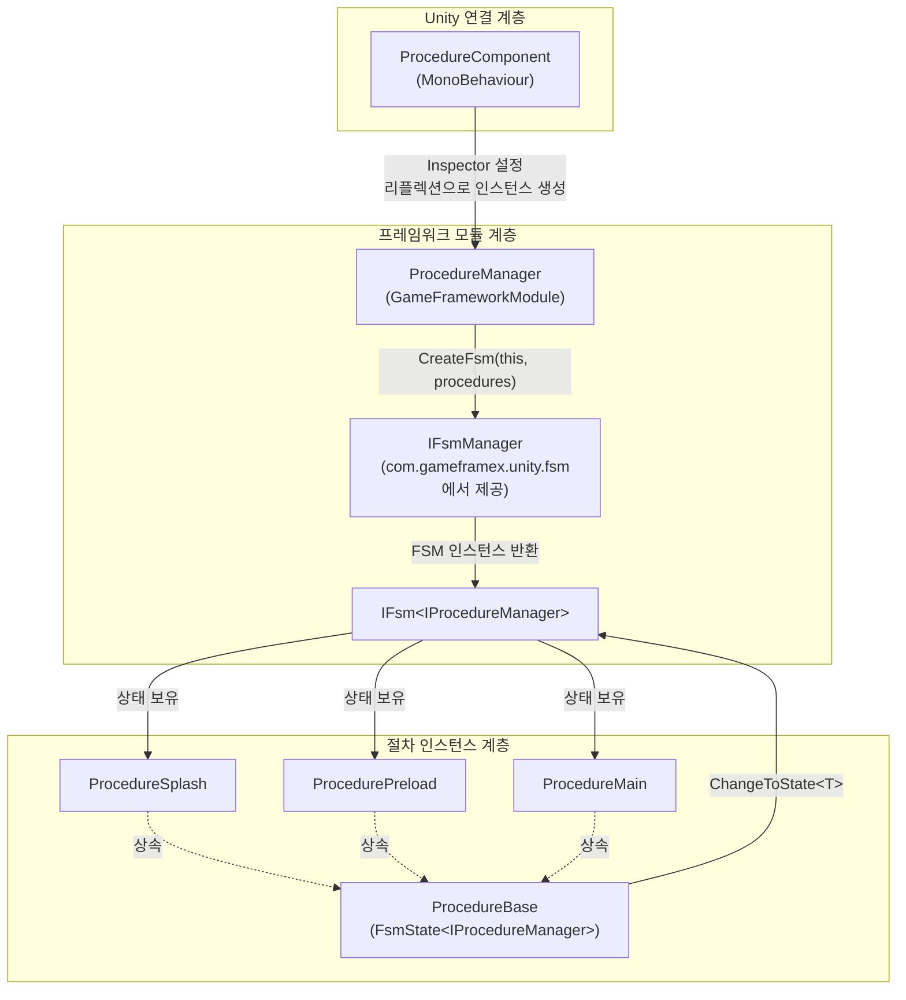

# 작동 원리 빠른 보기

GameFrameX Procedure는 유한 상태 머신(FSM)을 기반으로 하는 Unity 게임 흐름 관리 패키지입니다. 전환 가능한 "절차 상태"를 통해 게임 수명 주기 단계(스플래시, 프리로드, 로그인, 메인 메뉴 등)를 구동하며, 각 단계에서 완전한 수명 주기 콜백을 제공합니다. 기본적으로 [com.gameframex.unity.fsm](https://github.com/GameFrameX/com.gameframex.unity.fsm)에 의존하며, 이 패키지는 FSM을 "절차" 의미로 캡슐화하고 GameFrameX 프레임워크에 연결하는 역할만 합니다.

## 빠른 시작

최소 사용 가능한 절차는 세 단계로 구성됩니다:

1. **`ProcedureBase`를 상속하여 절차 클래스 작성**, 수명 주기 콜백에 비즈니스 로직을 배치합니다.

   ```csharp
   using GameFrameX.Fsm.Runtime;
   using GameFrameX.Procedure.Runtime;

   public class ProcedurePreload : ProcedureBase
   {
       protected internal override void OnEnter(IFsm<IProcedureManager> procedureOwner)
       {
           // 리소스, 설정 등을 로드
       }

       protected internal override void OnUpdate(IFsm<IProcedureManager> procedureOwner, float elapseSeconds, float realElapseSeconds)
       {
           // 로드 진행 상황을 확인하고 완료 후 다음 절차로 전환
           ChangeToState<ProcedureMain>(procedureOwner);
       }
   }

   public class ProcedureMain : ProcedureBase
   {
       protected internal override void OnEnter(IFsm<IProcedureManager> procedureOwner)
       {
           // 메인 메뉴 표시
       }
   }
   ```

   Source: [README.zh-CN.md](https://github.com/GameFrameX/com.gameframex.unity.procedure/blob/main/README.zh-CN.md#L88-L110)

2. **`ProcedureComponent` 부착**: 게임 오브젝트에 `GameFrameX/Procedure` 컴포넌트를 추가합니다(메뉴 `GameFrameX > Procedure`를 통해). Source: [ProcedureComponent.cs](https://github.com/GameFrameX/com.gameframex.unity.procedure/blob/main/Runtime/Procedure/ProcedureComponent.cs#L43-L46)

3. **Inspector에서** `Available Procedures`(사용 가능한 절차 타입 이름 배열)와 `Entrance Procedure`(진입 절차)를 설정하면, 게임 실행 시 진입 절차부터 자동으로 진행됩니다. Source: [ProcedureComponent.cs](https://github.com/GameFrameX/com.gameframex.unity.procedure/blob/main/Runtime/Procedure/ProcedureComponent.cs#L51-L53)

## 작동 원리 빠른 보기

전체 메커니즘은 세 개의 계층으로 구성됩니다: `ProcedureComponent`(Unity 연결 계층) → `ProcedureManager`(프레임워크 모듈 계층) → `ProcedureBase`(절차 인스턴스 계층). 컴포넌트는 Inspector에서 절차 타입 목록을 읽은 후 리플렉션으로 인스턴스를 생성하여 관리자에 전달하고 초기화합니다. 관리자 내부에서 FSM 관리자가 상태 머신을 생성하며, 각 절차는 하나의 FSM 상태에 대응되고 상태 간 전환은 `ChangeToState<T>`에 의해 트리거됩니다.



핵심 사항:

- **연결 진입점**: `ProcedureComponent`는 `[GameFrameXAutoComponent(-1000)]`로 표시되어 프레임워크가 우선순위에 따라 자동으로 마운트합니다. Source: [ProcedureComponent.cs](https://github.com/GameFrameX/com.gameframex.unity.procedure/blob/main/Runtime/Procedure/ProcedureComponent.cs#L43-L46)
- **관리자 인스턴스**: `ProcedureManager`는 `GameFrameworkModule`이며, `Priority`는 `-2`로 모든 일반 비즈니스 모듈보다 먼저 폴링되고 마지막에 종료됩니다. Source: [ProcedureManager.cs](https://github.com/GameFrameX/com.gameframex.unity.procedure/blob/main/Runtime/Procedure/ProcedureManager.cs#L59-L62)
- **상태 머신 생성**: `Initialize`는 모든 절차를 상태로 `IFsmManager.CreateFsm`에 전달하여 `IProcedureManager`를 소유자로 하는 FSM을 얻습니다. Source: [ProcedureManager.cs](https://github.com/GameFrameX/com.gameframex.unity.procedure/blob/main/Runtime/Procedure/ProcedureManager.cs#L130-L141)
- **절차 기본 클래스**: `ProcedureBase : FsmState<IProcedureManager>`, FSM의 여섯 가지 수명 주기 콜백을 직접 재사용: `OnInit` / `OnEnter` / `OnUpdate` / `OnFixedUpdate` / `OnLeave` / `OnDestroy`. Source: [ProcedureBase.cs](https://github.com/GameFrameX/com.gameframex.unity.procedure/blob/main/Runtime/Procedure/ProcedureBase.cs#L38-L79)
- **상태 전환 진입점**: `ProcedureBase`는 `ChangeToState<T>(procedureOwner)`를 노출하여 동일 FSM 내의 상태 전환을 트리거합니다; FSM은 자동으로 이전 상태의 `OnLeave`와 새 상태의 `OnEnter`를 호출합니다. Source: [ProcedureManager.cs](https://github.com/GameFrameX/com.gameframex.unity.procedure/blob/main/Runtime/Procedure/ProcedureManager.cs#L130-L156)

## 시작 및 실행 흐름

1. 컴포넌트의 `Awake`/`Start` 단계에서 `m_AvailableProcedureTypeNames`와 `m_EntranceProcedureTypeName`을 읽어 리플렉션으로 `ProcedureBase` 배열을 얻습니다. Source: [ProcedureComponent.cs](https://github.com/GameFrameX/com.gameframex.unity.procedure/blob/main/Runtime/Procedure/ProcedureComponent.cs#L51-L53)
2. 프레임워크 내부에서 `GameEntry`로부터 `IFsmManager`를 가져와 `ProcedureManager.Initialize(fsmManager, procedures)`를 호출합니다. Source: [ProcedureManager.cs](https://github.com/GameFrameX/com.gameframex.unity.procedure/blob/main/Runtime/Procedure/ProcedureManager.cs#L130-L141)
3. `StartProcedure<T>()`를 호출하면, FSM이 현재 상태를 진입 절차로 전환하여 첫 번째 `OnEnter`를 트리거합니다. Source: [ProcedureManager.cs](https://github.com/GameFrameX/com.gameframex.unity.procedure/blob/main/Runtime/Procedure/ProcedureManager.cs#L148-L156)
4. 실행 중 FSM은 매 프레임 현재 절차의 `OnUpdate` / `OnFixedUpdate`를 폴링하며, 각 절차가 조건 충족 시 `ChangeToState<T>`를 호출하여 상태 전환을 추진합니다.
5. 종료 시 `ProcedureManager.Shutdown`이 FSM을 파괴하고 참조를 해제합니다. Source: [ProcedureManager.cs](https://github.com/GameFrameX/com.gameframex.unity.procedure/blob/main/Runtime/Procedure/ProcedureManager.cs#L110-L122)

### `UseStartupRunner` 모드

기본값(`m_UseStartupRunner = false`)에서는 `ProcedureComponent.Start`가 자체적으로 Inspector 설정을 읽고 절차를 시작합니다. 체크 활성화 시:

- 컴포넌트는 `Awake`에서 `IProcedureManager`만 등록하며, **절차를 자동으로 초기화하거나 시작하지 않습니다**.
- 시작은 `ApplicationStartupEntry`가 `StartupRunner.Run`을 통해 인계받아, 다중 모듈 통합 시작 시퀀스 또는 절차 시작 전에 다른 초기화를 먼저 완료해야 하는 시나리오에 적합합니다. Source: [ProcedureComponent.cs](https://github.com/GameFrameX/com.gameframex.unity.procedure/blob/main/Runtime/Procedure/ProcedureComponent.cs#L56-L66)

## 다음 단계

- 자체 절차를 작성하고 연결하려면: `ProcedureBase` 서브클래스 정의부터 시작하여 README의 "사용 예제"를 참조하세요.
- 각 수명 주기 콜백의 세부 사항을 알고 싶다면: `ProcedureBase`의 여섯 가지 콜백 의미(`OnInit` → `OnEnter` → `OnUpdate` / `OnFixedUpdate` → `OnLeave` → `OnDestroy`)를 참조하세요.
- "이미 FSM 존재 / 중복 시작" 등의 문제를排查(排查는 중국어로 '문제 진단/조사'를 의미하지만, 한국어 맥락에서는 '문제 진단'으로 번역)하려면: `UseStartupRunner` 모드와 기본 모드를 동시에 사용하고 있는지 확인하세요.
- 기본 FSM 동작을 알고 싶다면: 의존 패키지 [com.gameframex.unity.fsm](https://github.com/GameFrameX/com.gameframex.unity.fsm)을 참조하세요.