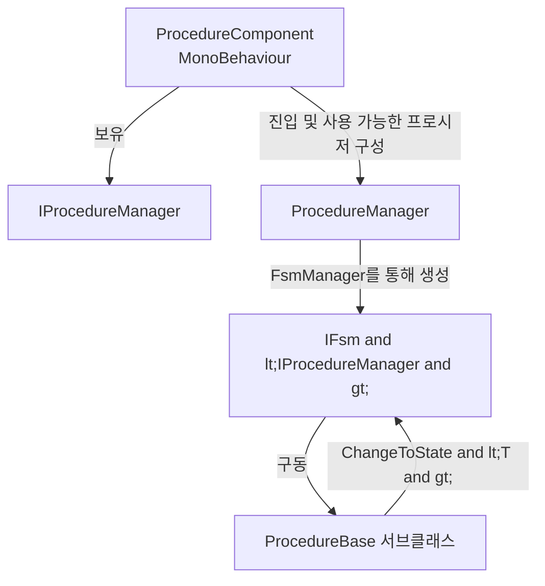

# Procedure이란 무엇인가

Procedure는 GameFrameX가 Unity를 위해 제공하는, 유한 상태 머신(FSM) 기반의 게임 플로우 관리 솔루션입니다. 게임 생명 주기를 전환 가능한 일련의 「프로시저 상태」(스플래시 화면, 프리로드, 로그인, 메인 메뉴 등)로 분할하고, `ProcedureComponent`가 `ProcedureManager` 내부의 FSM을 구동하여 상태 간 자동 전환이 이루어지도록 합니다. 이를 통해 시작 순서, 리소스 로딩, 씬 전환이 흩어진 `MonoBehaviour`가 아닌 코드로 제어됩니다.

## 빠른 시작

1. Unity 프로젝트의 `Packages/manifest.json`에 의존성을 추가합니다 (둘 중 하나 선택):
   - scoped registry 사용: `https://gameframex.upm.alianblank.uk`, 스코프 `com.gameframex`, 의존성 `com.gameframex.unity.procedure`.
   - 직접 Git URL: `https://github.com/gameframex/com.gameframex.unity.procedure.git`.
2. 자신의 프로시저 클래스를 생성하여 [ProcedureBase.cs](https://github.com/GameFrameX/com.gameframex.unity.procedure/blob/main/Runtime/Procedure/ProcedureBase.cs#L38-L99)를 상속받고 생명 주기 콜백을 재정의합니다.
3. 씬에서 메뉴 `GameFrameX/Procedure`를 통해 `ProcedureComponent`를 추가하고, 프로시저 클래스 이름을 Inspector의 *Available Procedures*에 입력한 뒤 *Entrance Procedure*를 지정합니다.
4. 게임을 실행하면 프레임워크가 진입 프로시저를 통해 시작되며, `OnUpdate`에서 `ChangeToState<T>`를 통해 다음 단계로 전환됩니다.

다음은 「스플래시 → 프리로드 → 메인 메뉴」 3단계 프로시저의 최소 예제입니다:

```csharp
using GameFrameX.Procedure.Runtime;
using GameFrameX.Fsm.Runtime;

public class ProcedureSplash : ProcedureBase
{
    protected internal override void OnEnter(IFsm<IProcedureManager> procedureOwner)
    {
        // 스플래시 화면 표시
    }

    protected internal override void OnUpdate(IFsm<IProcedureManager> procedureOwner, float elapseSeconds, float realElapseSeconds)
    {
        ChangeToState<ProcedurePreload>(procedureOwner);
    }
}

public class ProcedurePreload : ProcedureBase
{
    protected internal override void OnEnter(IFsm<IProcedureManager> procedureOwner)
    {
        // 게임 리소스 로드
    }

    protected internal override void OnUpdate(IFsm<IProcedureManager> procedureOwner, float elapseSeconds, float realElapseSeconds)
    {
        ChangeToState<ProcedureMain>(procedureOwner);
    }
}

public class ProcedureMain : ProcedureBase
{
    protected internal override void OnEnter(IFsm<IProcedureManager> procedureOwner)
    {
        // 메인 메뉴 표시
    }
}
```

Source: [README.zh-CN.md](https://github.com/GameFrameX/com.gameframex.unity.procedure/blob/main/README.zh-CN.md#L86-L110)

## 동작 원리 개요

Procedure 패키지는 다음 세 가지 핵심 타입이 협력하여 동작합니다:



- **ProcedureComponent** — 게임 오브젝트에 부착되는 진입점으로, `IProcedureManager` 등록, Inspector 구성 읽기 및 시작 트리거를 담당합니다. [ProcedureComponent.cs](https://github.com/GameFrameX/com.gameframex.unity.procedure/blob/main/Runtime/Procedure/ProcedureComponent.cs#L46-L99)를 참조하세요.
- **ProcedureManager** — FSM의 실제 소유자로, 모든 프로시저 인스턴스와 상태 전환을 관리합니다.
- **ProcedureBase** — `FsmState<IProcedureManager>`를 상속하며, `OnInit / OnEnter / OnUpdate / OnFixedUpdate / OnLeave / OnDestroy` 등 6개의 생명 주기 콜백을 제공합니다.

각 프로시저 클래스는 `ChangeToState<T>(procedureOwner)`를 통해 「조건이 충족되면 어디로 이동할지」를 능동적으로 선언하여, 전환 로직을 프로시저 자체에 집중시킴으로써 다양한 UI / 리소스 스크립트에 분산되는 것을 방지합니다.

## 다음 단계

- 생명 주기 콜백의 전체 목록과 일반적인 사용법을 알고 싶다면 《프로시저 생명 주기》를 참조하세요.
- 초기화 단계에서 커스텀 로직을 삽입하거나 `Already exist FSM` 충돌을 피하고 싶다면 《UseStartupRunner 패턴》을 참조하세요.
- 전체 공개 API(속성, 메서드 시그니처)를 확인하려면 《API 레퍼런스》를 참조하세요.
- `Procedure not found` 또는 프로시저가 전환되지 않는 등의 문제가 발생하면 《일반적인 오류 및 문제 해결》을 참조하세요.