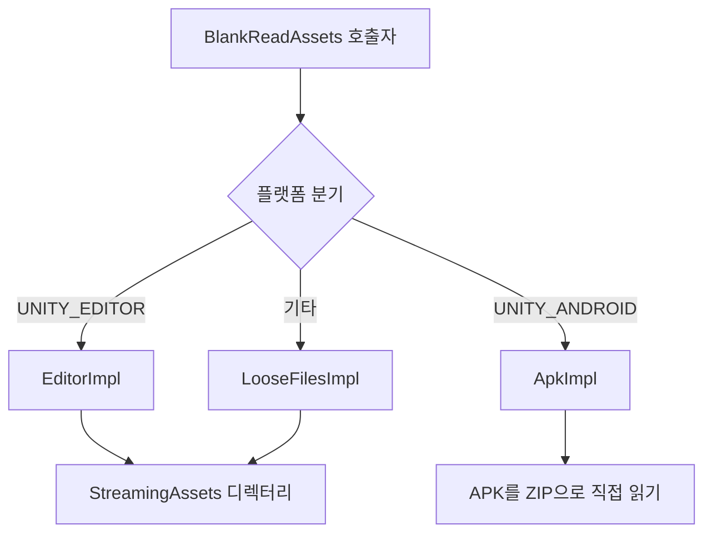

# 작동 원리 빠른 보기: StreamingAssets와 APK 통합 접근

GameFrameX.ReadAssets는 통일된 `System.IO` 스타일 API를 통해 「일반 플랫폼에서 StreamingAssets 디렉터리 읽기」와 「Android에서 APK 내부의 `assets/` 직접 읽기」 두 가지 시나리오를 동시에 지원하며, 런타임에 플랫폼에 따라 자동으로 구현을 전환하고, 처음 API를 호출할 때 자동으로 초기화됩니다.

## 빠른 시작

1. UPM으로 패키지 설치:
   ```json
   {
     "scopedRegistries": [
       {
         "name": "GameFrameX",
         "url": "https://gameframex.upm.alianblank.uk",
         "scopes": ["com.gameframex"]
       }
     ],
     "dependencies": {
       "com.gameframex.unity.readassets": "1.2.0"
     }
   }
   ```
2. 코드에서 직접 정적 API를 호출하면 되며, 수동으로 `Initialize`를 호출할 필요가 없습니다 (첫 접근 시 자동 초기화):
   ```csharp
   using GameFrameX.ReadAssets.Runtime;
   using System.IO;

   // 텍스트 읽기
   string text = BlankReadAssets.ReadAllText("config/game.json");

   // 스트림 방식으로 읽기
   using (Stream s = BlankReadAssets.OpenRead("data/level1.bin"))
   {
       // ...
   }

   // AssetBundle 직접 로드 (APK 압축 해제 불필요)
   var ab = BlankReadAssets.LoadAssetBundle("bundles/ui.ab");
   ```

> 모든 공개 API에는 `[Preserve]`가 표시되어 있어, IL2CPP / AOT 빌드에서 안전하게 사용할 수 있습니다.

## 작동 원리 빠른 보기

진입점 `BlankReadAssets`는 `partial class`이며, `using` 별칭을 통해 플랫폼별로 내부 구현 클래스를 선택하여 컴파일 시점에 어느 로직을 호출할지 결정합니다:

```csharp
#if UNITY_EDITOR
using BlankReadAssetsImpl = GameFrameX.ReadAssets.Runtime.BlankReadAssets.EditorImpl;
#elif UNITY_ANDROID
using BlankReadAssetsImpl = GameFrameX.ReadAssets.Runtime.BlankReadAssets.ApkImpl;
#else
using BlankReadAssetsImpl = GameFrameX.ReadAssets.Runtime.BlankReadAssets.LooseFilesImpl;
#endif
```

Source: [BlankReadAssets.cs](https://github.com/GameFrameX/com.gameframex.unity.readassets/blob/main/Runtime/BlankReadAssets.cs#L11-L17)

세 가지 구현은 각각 다음을 담당합니다:

| 구현 클래스 | 플랫폼 | 읽기 방식 |
|--------|------|----------|
| `EditorImpl` | Unity Editor | `StreamingAssets` 실제 디렉터리 사용 |
| `ApkImpl` | Android (및 Editor에서 APK 디버그) | APK 파일을 직접 열고, ZIP 로컬 파일 헤더로 위치를 찾아 `assets/` 내 항목을 읽음 |
| `LooseFilesImpl` | 기타 플랫폼 (PC, iOS, WebGL 등) | 파일 시스템 사용 |



### Android APK 읽기의 핵심 아이디어

Android에서 `StreamingAssets`는 실제로 APK 내부의 `assets/` 경로에 위치합니다. `ApkImpl`은 초기화 시 APK의 ZIP 중앙 디렉터리를 파싱하여 `assets/` 아래의 모든 항목을 경로별로 정렬한 후 `s_paths` / `s_streamingAssets` 두 배열에 캐시합니다:

```csharp
public static void Initialize(string dataPath, string streamingAssetsPath)
{
    s_root = dataPath;
    // ...
    GetStreamingAssetsInfoFromJar(s_root, paths, parts);
    s_paths = paths.ToArray();
    s_streamingAssets = parts.ToArray();
}
```

Source: [BlankReadAssets.ApkImpl.cs](https://github.com/GameFrameX/com.gameframex.unity.readassets/blob/main/Runtime/BlankReadAssets.ApkImpl.cs#L27-L56)

읽기 시, `TryGetInfo`는 이진 탐색으로 항목을 찾아 해당 파일의 `offset` / `size` / `crc32`를 얻은 다음, `File.OpenRead`으로 APK 본체 파일을 열고, `SubReadOnlyStream`을 사용해 `offset` / `size` 범위를 읽기 전용 서브 스트림으로 노출합니다:

```csharp
public static Stream OpenRead(string path)
{
    ReadInfo info;
    if (!TryGetInfo(path, out info))
    {
        ThrowFileNotFound(path);
    }

    Stream fileStream = File.OpenRead(info.readPath);
    try
    {
        return new SubReadOnlyStream(fileStream, info.offset, info.size, leaveOpen: false);
    }
    catch (System.Exception)
    {
        fileStream.Dispose();
        throw;
    }
}
```

Source: [BlankReadAssets.ApkImpl.cs](https://github.com/GameFrameX/com.gameframex.unity.readassets/blob/main/Runtime/BlankReadAssets.ApkImpl.cs#L208-L226)

> 이것이 바로 `AssetBundle.LoadFromFileAsync`가 Android에서도 작동하는 이유입니다. 이는 「읽기 가능 + 오프셋 알기」만 필요로 하며, `ApkImpl`은 ZIP 중앙 디렉터리를 통해 미리 오프셋을 얻음으로써 전체 APK를 압축 해제할 필요가 없습니다.

### 지연 초기화와 스레드 안전성

`BlankReadAssets`는 `s_initialized` 플래그를 사용해 `Initialize`가 한 번만 실행되도록 보장합니다:

```csharp
private static void EnsureInitialized()
{
    if (!s_initialized)
    {
        Initialize();
        s_initialized = true;
    }
}
```

Source: [BlankReadAssets.cs](https://github.com/GameFrameX/com.gameframex.unity.readassets/blob/main/Runtime/BlankReadAssets.cs#L37-L44)

모든 읽기 관련 API(`FileExists` / `OpenRead` / `ReadAllBytes` / `GetFiles` 등)는 먼저 `EnsureInitialized()`를 호출한 후 `BlankReadAssetsImpl`에 위임하므로, 대부분의 시나리오에서 호출자는 초기화 시점을 신경 쓸 필요가 없습니다.

## 다음 단계

- 파일이나 텍스트를 직접 읽고 싶다면, 《StreamingAssets 텍스트와 바이너리 읽기 방법》 참조
- AssetBundle을 직접 로드하고 싶다면, 《StreamingAssets의 AssetBundle 로드 방법》 참조
- "파일이 존재하지 않음" 또는 "압축된 리소스를 읽을 수 없음" 등의 문제가 발생하면, 《자주 묻는 질문 및 문제 해결》 참조