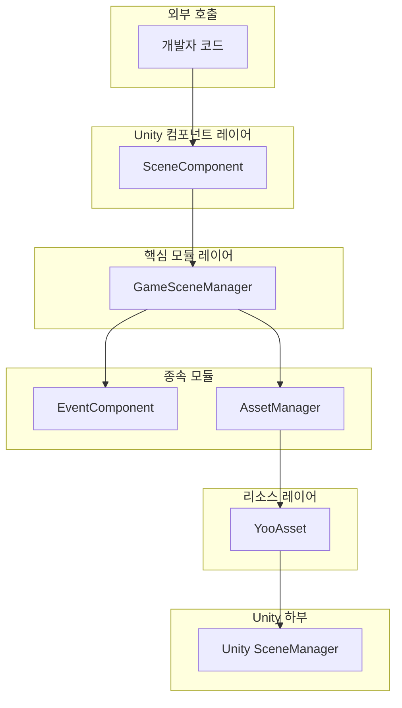
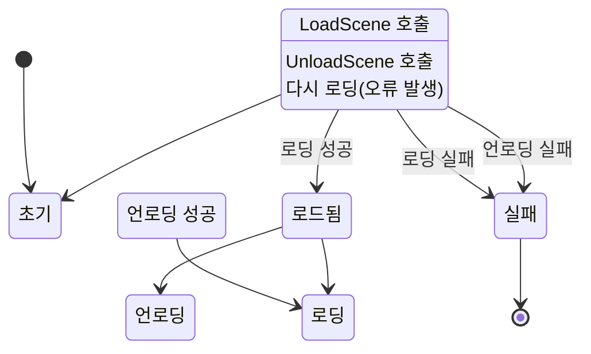
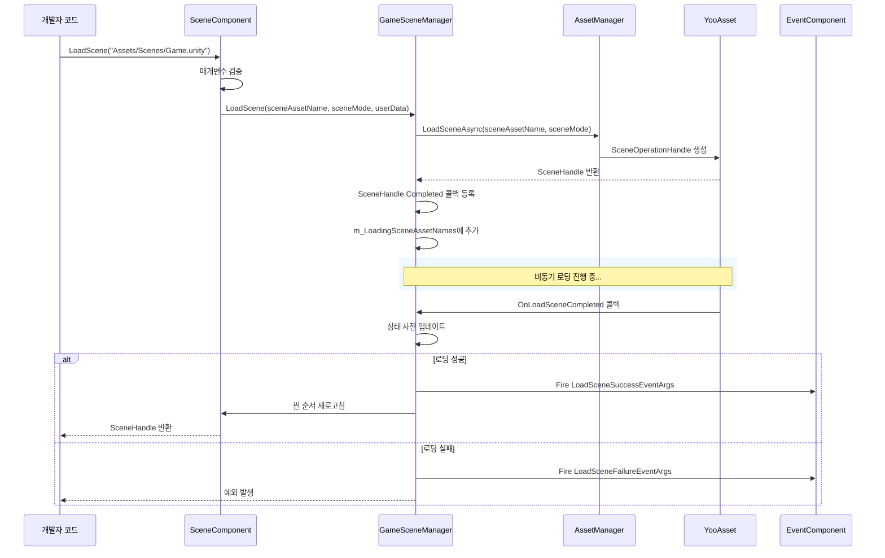

# 개요

GameFrameX Scene 씬 관리 컴포넌트는 GameFrameX 게임 프레임워크의 핵심 모듈 중 하나로, 완전한 Unity 씬 관리 솔루션을 제공합니다. 이 컴포넌트는 비동기 씬 로딩 및 언로딩, 로딩 진행률 추적, 씬 상태查询 및 이벤트 콜백等功能을 지원합니다.

## 개요

Scene 씬 관리 컴포넌트는 GameFrameX 프레임워크에서 Unity 씬 로딩 및 언로딩을 전문적으로 처리하는 모듈입니다. 내부 리소스 로딩 메커니즘을 캡슐화하여 YooAsset 리소스 관리 시스템을 통해 효율적인 비동기 씬 로딩을 구현하며, 씬 상태 변경을 listen하기 위한 완전한 이벤트 메커니즘을 제공합니다.

### 핵심 책임

Scene 컴포넌트의 주요 책임은 다음과 같습니다:

- **비동기 씬 로딩**: Unity 씬의 비동기 로딩을 지원하며 메인 스레드를阻塞하지 않음
- ** 씬 언로딩 관리**: 로드된 씬 리소스의 안전한 언로딩
- **상태 추적**: 모든 씬의 로딩 상태 유지 (로드됨, 로딩 중, 언로딩 중)
- **이벤트 알림**: 이벤트 시스템을 통해 씬 상태 변경 알림
- **메인 카메라 관리**: 메인 카메라의 자동 추적 및 관리
- ** 씬 순서 제어**: 씬 활성화 순서 설정 지원

### 설계 의도

이 컴포넌트는 계층화 아키텍처 설계를 채택하여 씬 관리 핵심 로직과 Unity 컴포넌트를 분리합니다. `GameSceneManager`는 핵심 모듈로서 모든 씬 操作을 처리하고, `SceneComponent`는 Unity 컴포넌트로서 개발자에게 편리한 인터페이스를 제공합니다. 이러한 설계는 핵심 로직을 더욱 명확하게 만들어 단위 테스트 및 모듈 재사용을 용이하게 합니다.

컴포넌트는 YooAsset을 기본 리소스 로딩 시스템으로 사용하여 씬 로딩의 효율성과 신뢰성을 보장합니다. 동시에 이벤트 시스템을 통해 GameFrameX의 다른 컴포넌트(EventComponent, AssetComponent)와 解耦되어 양호한 모듈화 설계를 实现합니다.

## 아키텍처



### 컴포넌트 레이어 설명

**Unity 컴포넌트 레이어 (SceneComponent)**

`SceneComponent`는 `GameFrameworkComponent`를 상속하는 Unity 컴포넌트로, GameObject에 붙이면 사용할 수 있습니다. `GameSceneManager` 모듈을 초기화하고 씬 이벤트를 `EventComponent`로 전달하는 역할을 합니다.

> Source: [SceneComponent.cs](https://github.com/GameFrameX/com.gameframex.unity.scene/blob/main/Runtime/Scene/SceneComponent.cs#L49-L50)

**핵심 모듈 레이어 (GameSceneManager)**

`GameSceneManager`는 `GameFrameworkModule`를 상속하는 핵심 모듈로, `IGameSceneManager` 인터페이스를 구현합니다. 씬 로딩, 언로딩, 상태 추적 등 모든 씬 관리 관련 핵심 로직을 담당합니다.

> Source: [GameSceneManager.cs](https://github.com/GameFrameX/com.gameframex.unity.scene/blob/main/Runtime/Scene/Scene/GameSceneManager.cs#L47-L47)

**종속 모듈**

- **EventComponent**: 이벤트 발송 및 수신 담당
- **AssetManager(IAssetManager)**: 리소스 관리 인터페이스로, YooAsset이 구현

## 핵심 개념

### 씬 로딩 모드

컴포넌트는 두 가지 Unity 씬 로딩 모드를 지원합니다:

| 모드 | 설명 | 사용 시나리오 |
|------|------|----------|
| `LoadSceneMode.Single` | 단일 모드, 새 씬 로딩 시 현재 씬 자동 언로딩 | 메인 씬 전환 |
| `LoadSceneMode.Additive` | 추가 모드, 새 씬이 기존 씬과 공존 | 다중 게임 하위 씬, UI 레이어 |

### 씬 상태

컴포넌트는 세 개의 사전을 통해 씬 상태를 유지합니다:



### 이벤트 시스템

컴포넌트는 씬 상태 변경 listen을 위해 다섯 개의 핵심 이벤트를 정의합니다:

| 이벤트 | 설명 | 트리거 시점 |
|------|------|----------|
| `LoadSceneSuccess` | 로딩 성공 이벤트 | 씬 성공적으로 로드 완료 후 |
| `LoadSceneFailure` | 로딩 실패 이벤트 | 씬 로딩 실패 시 |
| `LoadSceneUpdate` | 로딩 진행률 업데이트 이벤트 | 씬 로딩 진행 중 |
| `UnloadSceneSuccess` | 언로딩 성공 이벤트 | 씬 성공적으로 언로딩 후 |
| `UnloadSceneFailure` | 언로딩 실패 이벤트 | 씬 언로딩 실패 시 |

## 씬 로딩 흐름



## 핵심 기능 특성

### 1. 비동기 씬 로딩

컴포넌트는 완전한 비동기 설계를 기반으로 하며, 모든 씬 로딩 操作은 `Task<SceneHandle>`를 반환하여 메인 스레드를 block하지 않습니다. 로딩 인터페이스를 표시해야 하는 게임에尤为重要합니다.

```csharp
// 비동기 씬 로딩
var handle = await sceneComponent.LoadScene("Assets/Scenes/Main.unity");
```
> Source: [SceneComponent.cs#L280-L283](https://github.com/GameFrameX/com.gameframex.unity.scene/blob/main/Runtime/Scene/SceneComponent.cs#L280-L283)

### 2. 씬 상태 查询

개발자는 언제든지 씬의 현재 상태를 查询할 수 있습니다:

```csharp
// 씬이 로드되었는지 확인
if (sceneComponent.SceneIsLoaded("Assets/Scenes/Main.unity"))
{
    // 씬이 로드됨
}

// 씬이 로딩 중인지 확인
if (sceneComponent.SceneIsLoading("Assets/Scenes/GamePlay.unity"))
{
    // 씬이 로딩 중
}

// 모든 로드된 씬 가져오기
var loadedScenes = sceneComponent.GetLoadedSceneAssetNames();
```
> Source: [SceneComponent.cs#L174-L186](https://github.com/GameFrameX/com.gameframex.unity.scene/blob/main/Runtime/Scene/SceneComponent.cs#L174-L186)

### 3. 씬 순서 관리

컴포넌트는 씬의 활성화 순서 설정을 지원하여 여러 추가 씬이 올바른 순서로 활성화되도록 합니다:

```csharp
// 씬 순서 설정, 값이 클수록 우선 활성화
sceneComponent.SetSceneOrder("Assets/Scenes/Game.unity", 100);
```
> Source: [SceneComponent.cs#L338-L367](https://github.com/GameFrameX/com.gameframex.unity.scene/blob/main/Runtime/Scene/SceneComponent.cs#L338-L367)

### 4. 메인 카메라 관리

컴포넌트는 현재 활성화된 씬의 메인 카메라를 자동으로 추적합니다:

```csharp
// 메인 카메라 참조 새로고침
sceneComponent.RefreshMainCamera();

// 현재 메인 카메라 가져오기
var mainCamera = sceneComponent.MainCamera;
```
> Source: [SceneComponent.cs#L369-L375](https://github.com/GameFrameX/com.gameframex.unity.scene/blob/main/Runtime/Scene/SceneComponent.cs#L369-L375)

### 5. 이벤트 리스닝

개발자는 씬 이벤트를 구독하여 상태 변경에 대응할 수 있습니다:

```csharp
// 씬 로딩 성공 이벤트 구독
sceneComponent.LoadSceneSuccess += OnLoadSceneSuccess;

private void OnLoadSceneSuccess(object sender, LoadSceneSuccessEventArgs e)
{
    Debug.Log($"씬 {e.SceneAssetName} 로딩 성공, 소요 시간 {e.Duration}초");
}
```
> Source: [SceneComponent.cs#L89-L95](https://github.com/GameFrameX/com.gameframex.unity.scene/blob/main/Runtime/Scene/SceneComponent.cs#L89-L95)

## 종속 관계

Scene 컴포넌트는 다음 GameFrameX 모듈에 종속됩니다:

| 종속 모듈 | 설명 | 종속 유형 |
|----------|------|----------|
| GameFrameX.Runtime | 프레임워크 핵심 런타임 | 강 종속 |
| GameFrameX.Event.Runtime | 이벤트 시스템 | 강 종속 |
| GameFrameX.Asset.Runtime | 리소스 관리 시스템 | 강 종속 |
| YooAsset | 리소스 로딩 하부 구현 | 강 종속 |

> Source: [GameFrameX.Scene.Runtime.asmdef](https://github.com/GameFrameX/com.gameframex.unity.scene/blob/main/Runtime/GameFrameX.Scene.Runtime.asmdef#L3-L8)

## 버전 정보

| 버전 |发布日期 | 주요 변경 사항 |
|------|----------|--------------|
| 2.1.2 | 2026-03-16 | 로딩 성공 콜백 매개변수 수정 |
| 2.1.1 | 2026-03-13 | 씬 로딩 상태 판단 수정 |
| 2.1.0 | 2025-12-23 | 씬 관리자 업데이트 |
| 2.0.0 | 2025-10-25 | 아키텍처 대규모 업그레이드 |

> Source: [CHANGELOG.md](https://github.com/GameFrameX/com.gameframex.unity.scene/blob/main/CHANGELOG.md)

## 관련 링크

- [설치 가이드](./02.installation.md)
- [빠른 시작](./03.getting-started.md)
- [핵심 기능](./04.features.md)
- [API 참조](./05.api-reference.md)
- [이벤트 시스템](./06.events.md)
- [GitHub 저장소](https://github.com/GameFrameX/com.gameframex.unity.scene.git)
- [공식 문서](https://gameframex.doc.alianblank.com/)