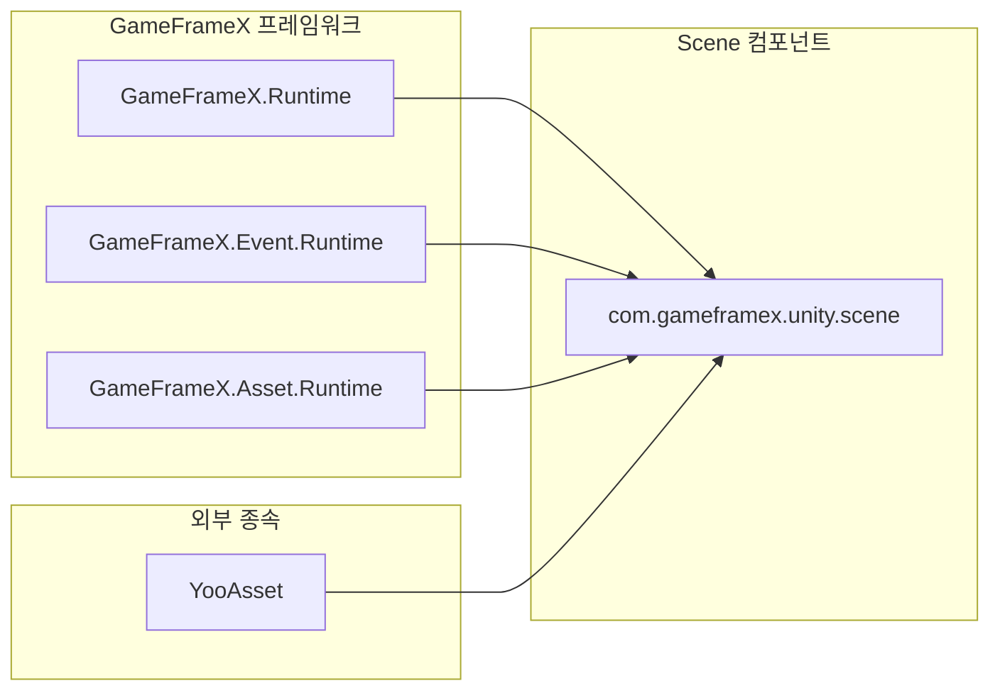
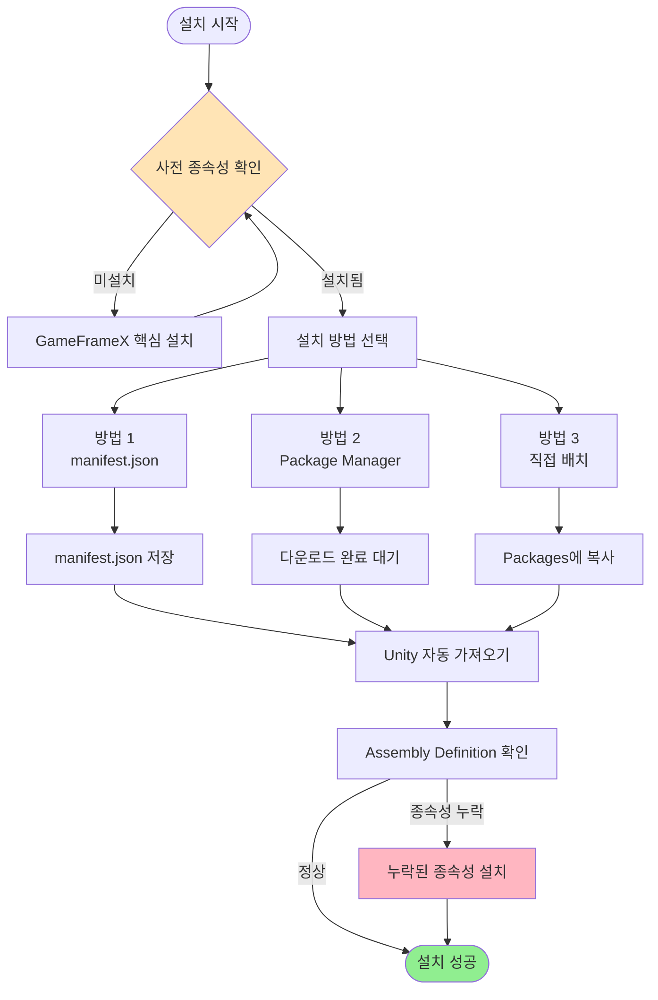

# 설치

GameFrameX Scene 씬 관리 컴포넌트의 설치 가이드입니다.

## 개요

GameFrameX Scene은 GameFrameX 프레임워크의 씬 관리 컴포넌트로, 통일된 씬 로딩, 언로딩 및 관리 기능을 제공합니다. 이 컴포넌트를 사용하기 전에 설치 구성을 완료해야 합니다. 이 문서에서는 세 가지 권장 설치 방법과 종속 항목 구성을 소개합니다.

> 현재 버전: 2.1.2
> 최소 Unity 버전: 2017.1

## 사전 요구 사항

Scene 컴포넌트를 설치하기 전에 프로젝트가 다음 요구 사항을 충족하는지 확인하십시오:

| 요구 사항 | 설명 |
|------|------|
| Unity 버전 | 2017.1 이상 |
| GameFrameX 핵심 | GameFrameX.Runtime을 먼저 설치해야 함 |
| YooAsset | YooAsset 리소스 관리 시스템을 설치해야 함 |

### 종속 항목 설명

Scene 컴포넌트는 다음 핵심 모듈에 종속됩니다:



**핵심 종속 항목**:
- **GameFrameX.Runtime**: 프레임워크 핵심 런타임
- **GameFrameX.Event.Runtime**: 이벤트 시스템 런타임
- **GameFrameX.Asset.Runtime**: 리소스 관리 런타임
- **YooAsset**: 리소스 패키징 및 관리 솔루션

## 설치 방법

### 방법 1: manifest.json을 통한 설치 (권장)

가장 권장되는 설치 방법으로, 버전 관리와 업데이트에 편리합니다.

1. Unity 프로젝트의 `Packages/manifest.json` 파일을 엽니다
2. `dependencies` 노드 아래에 다음 내용을 추가합니다:

```json
{
  "dependencies": {
    "com.gameframex.unity.scene": "https://github.com/GameFrameX/com.gameframex.unity.scene.git"
  }
}
```

3. 파일을 저장하면 Unity가 자동으로 패키지를 다운로드하고 가져옵니다

> Source: [README.md](https://github.com/GameFrameX/com.gameframex.unity.scene/blob/main/README.md#L11-L14)

### 방법 2: Unity Package Manager를 통한 설치

1. Unity 에디터를 엽니다
2. **Window > Package Manager**를 선택하여 패키지 관리자를 엽니다
3. 좌측 상단의 **+** 버튼을 클릭합니다
4. **Add package from git URL**를 선택합니다
5. 다음 Git URL을 입력합니다:
   ```
   https://github.com/GameFrameX/com.gameframex.unity.scene.git
   ```
6. **Add** 버튼을 클릭하고 설치가 완료될 때까지 기다립니다

> Source: [README.md](https://github.com/GameFrameX/com.gameframex.unity.scene/blob/main/README.md#L15-L15)

### 방법 3: Packages 폴더에 직접 배치

1. 이 저장소를 복제하거나 다운로드합니다:
   ```
   https://github.com/GameFrameX/com.gameframex.unity.scene.git
   ```
2. 전체 저장소 폴더를 Unity 프로젝트의 `Packages` 디렉토리에 복사합니다
3. Unity가 자동으로 패키지를 인식하고 로드합니다

> Source: [README.md](https://github.com/GameFrameX/com.gameframex.unity.scene/blob/main/README.md#L16-L16)

## 설치 흐름



## 설치 확인

설치가 완료되면 다음 방법으로 확인할 수 있습니다:

1. **Package Manager 확인**: Package Manager에서 `com.gameframex.unity.scene`이 표시되는지 확인합니다
2. **어셈블리 확인**: `GameFrameX.Scene.Runtime` 및 `GameFrameX.Scene.Editor` 어셈블리가 생성되었는지 확인합니다
3. **메뉴 확인**: Unity 메뉴에 Scene 관련 기능 메뉴가 나타나는지 확인합니다

## 종속 항목 설치

Scene 컴포넌트는 다음 종속 패키지를 미리 설치해야 하며, 순서대로 설치하십시오:

1. **GameFrameX.Runtime** - 핵심 런타임
2. **GameFrameX.Event.Runtime** - 이벤트 시스템
3. **GameFrameX.Asset.Runtime** - 리소스 관리
4. **YooAsset** - 리소스 패키징 시스템

이러한 종속 항목은 동일한 방식으로 설치할 수 있습니다:

```json
{
  "dependencies": {
    "com.gameframex.unity.core": "https://github.com/GameFrameX/com.gameframex.unity.core.git",
    "com.gameframex.unity.event": "https://github.com/GameFrameX/com.gameframex.unity.event.git",
    "com.gameframex.unity.asset": "https://github.com/GameFrameX/com.gameframex.unity.asset.git",
    "com.yooasset.rm": "https://github.com/yoopackage/yoosee.git"
  }
}
```

## 패키지 정보

| 속성 | 값 |
|------|------|
| 패키지 이름 | com.gameframex.unity.scene |
| 표시 이름 | Game Frame X Scene |
| 버전 | 2.1.2 |
| 분류 | Game Framework X |
| 저장소 | https://github.com/GameFrameX/com.gameframex.unity.scene.git |

> Source: [package.json](https://github.com/GameFrameX/com.gameframex.unity.scene/blob/main/package.json#L2-L8)

## 관련 링크

- [개요](./1-overview) - Scene 컴포넌트의 핵심 기능 알아보기
- [빠른 시작](./3-getting-started) - Scene 컴포넌트 사용 시작하기
- [핵심 기능](./4-core-features) - 더 많은 기능 특징 알아보기
- [API 참조](./5-api-reference) - 완전한 API 문서
- [GitHub 저장소](https://github.com/GameFrameX/com.gameframex.unity.scene.git) - 소스 코드 및 업데이트 로그
