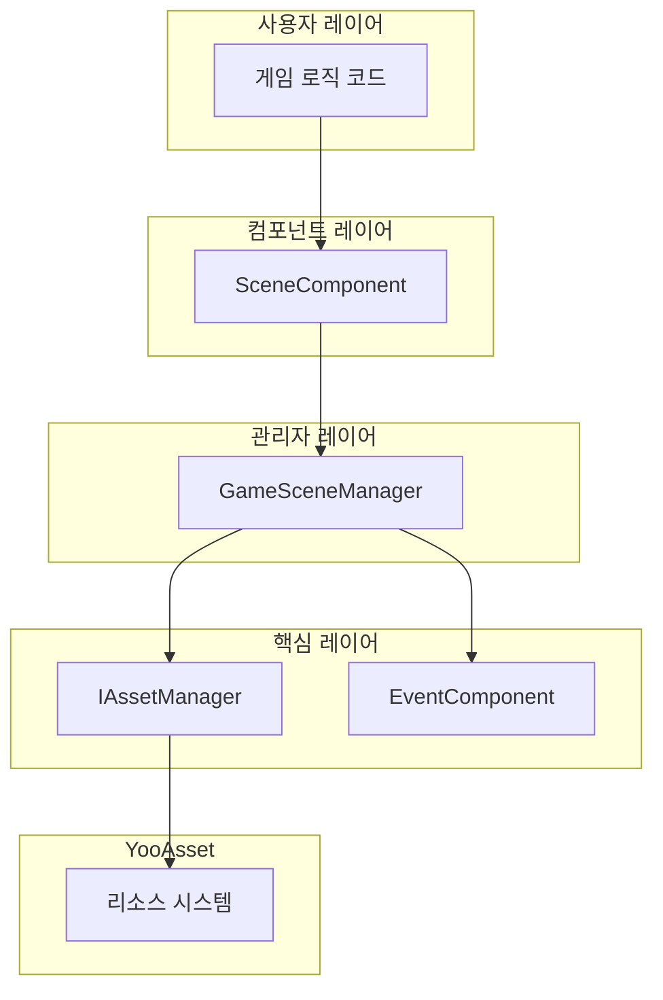
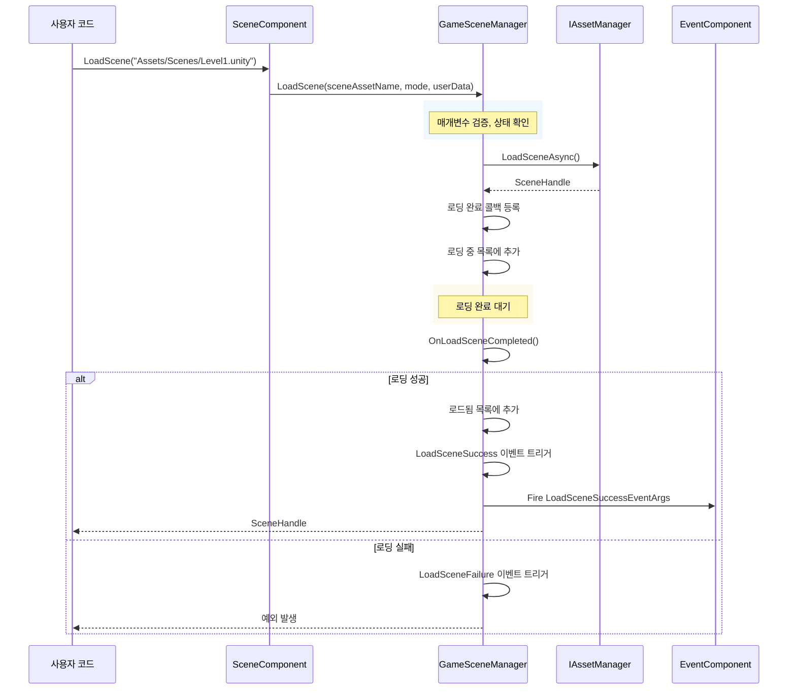

# 빠른 시작

이 가이드는 GameFrameX Scene 씬 관리 컴포넌트를 빠르게 시작할 수 있도록 도와줍니다. 이 문서를 통해 Unity 프로젝트에서 씬 관리 시스템을 구성하고 사용하는 방법을 알게 될 것입니다.

## 개요

GameFrameX Scene 컴포넌트는 GameFrameX 게임 프레임워크의 핵심 모듈 중 하나로, 통일된 씬 관리 기능을 제공합니다. 이 컴포넌트는 YooAsset 리소스 관리 시스템을 기반으로 구축되어 비동기 씬 로딩, 언로딩, 상태 추적 및 씬 이벤트 콜백을 지원합니다. 핵심 기능은 `SceneComponent`가 통일하게 외부 서비스를 제공하며, 이벤트 시스템을 통해 씬 상태 변경에 대응합니다.

## 아키텍처 개요



위는 Scene 컴포넌트의 계층 구조를 보여줍니다. 사용자는 `SceneComponent` 컴포넌트를 통해 씬 操作을 수행하며, 이 컴포넌트는 내부적으로 `GameSceneManager`를 호출하여 실제管理工作을 수행합니다. `GameSceneManager`는 `IAssetManager`와 YooAsset 리소스 시스템을 통해 상호작용하며, `EventComponent`는各类 씬 이벤트를 트리거하여 게임 로직이 대응할 수 있도록 합니다.

## 사전 조건

Scene 컴포넌트를 사용하기 전에 프로젝트가 다음 조건을 충족하는지 확인합니다:

1. Unity 2020.3 이상 버전이 설치되어 있음
2. 프로젝트에 YooAsset 리소스 관리 시스템이 올바르게 구성되어 있음
3. GameFrameX 프레임워크의 다른 종속 모듈(EventComponent, Asset 모듈 등)이 프로젝트에 추가되어 있음

## 기본 사용 흐름

### 단계 1: SceneComponent 추가

Unity 씬에서 빈 오브젝트를 생성하거나 기존 GameEntry 오브젝트를 사용하여 `SceneComponent` 컴포넌트를 추가합니다. 이 컴포넌트는 자동으로 GameFrameX 프레임워크에 등록됩니다.

```csharp
// SceneComponent는 MonoBehaviour로, GameObject에 붙여야 함
// Unity 에디터에서: 우클릭 -> GameFrameX -> Scene
// 또는 다음 스크립트를 씬 오브젝트에 직접 추가
```
> Source: [SceneComponent.cs](https://github.com/GameFrameX/com.gameframex.unity.scene/blob/main/Runtime/Scene/SceneComponent.cs#L47-L49)

컴포넌트 속성 설명:
- `Enable LoadScene Update Event`: 씬 로딩 진행률 업데이트 이벤트 활성화
- `Enable LoadScene Dependency Asset Event`: 씬 종속 리소스 로딩 이벤트 활성화

### 단계 2: 컴포넌트 인스턴스 가져오기

게임 코드에서 `GameEntry`를 통해 SceneComponent 인스턴스를 가져올 수 있습니다:

```csharp
// 씬 컴포넌트 인스턴스 가져오기
var sceneComponent = GameEntry.GetComponent<SceneComponent>();
if (sceneComponent == null)
{
    Debug.LogError("Scene component is not found.");
    return;
}
```
> Source: [SceneComponent.cs](https://github.com/GameFrameX/com.gameframex.unity.scene/blob/main/Runtime/Scene/SceneComponent.cs#L77-L87)

### 단계 3: 씬 로딩

Scene 컴포넌트는 두 가지 로딩 모드를 지원합니다:

**단일 모드 (LoadSceneMode.Single)**
새 씬을 로딩할 때 먼저 모든 로드된 씬을 언로드합니다. 게임 메인 메뉴, 레벨 전환 등에 적합합니다.

**추가 모드 (LoadSceneMode.Additive)**
기존 씬을 기반으로 새 씬을叠加하여 로딩합니다. 오픈 월드, 동적 레벨 로딩 등에 적합합니다.

```csharp
// 단일 씬 로딩 (단일 모드, 기본값)
// 주의: 씬 이름은 반드시 "Assets/"로 시작하고 ".unity"로 끝나야 함
string sceneAssetName = "Assets/Scenes/MainMenu.unity";
var handle = await sceneComponent.LoadScene(sceneAssetName, LoadSceneMode.Single);

// 씬 로딩 및 사용자 정의 데이터 전달
string gameScene = "Assets/Scenes/GameLevel1.unity";
var handle2 = await sceneComponent.LoadScene(gameScene, LoadSceneMode.Single, "myUserData");
```
> Source: [SceneComponent.cs](https://github.com/GameFrameX/com.gameframex.unity.scene/blob/main/Runtime/Scene/SceneComponent.cs#L276-L307)

### 단계 4: 씬 언로딩

더 이상 필요하지 않은 씬이 있을 때, 메모리를 확보하기 위해 언로드할 수 있습니다:

```csharp
// 지정된 씬 언로드
string sceneAssetName = "Assets/Scenes/OldLevel.unity";
sceneComponent.UnloadScene(sceneAssetName);

// 씬 언로드 및 사용자 정의 데이터 전달
sceneComponent.UnloadScene(sceneAssetName, "cleanupData");
```
> Source: [SceneComponent.cs](https://github.com/GameFrameX/com.gameframex.unity.scene/blob/main/Runtime/Scene/SceneComponent.cs#L309-L331)

### 단계 5: 씬 이벤트 리스닝

Scene 컴포넌트는 씬 상태 변경에 대응하기 위한 완전한 이벤트 시스템을 제공합니다:

```csharp
// 씬 로딩 성공 이벤트 구독
sceneComponent.LoadSceneSuccess += OnLoadSceneSuccess;

// 씬 로딩 실패 이벤트 구독
sceneComponent.LoadSceneFailure += OnLoadSceneFailure;

// 씬 로딩 진행률 업데이트 이벤트 구독 (EnableLoadSceneUpdateEvent 활성화 필요)
sceneComponent.LoadSceneUpdate += OnLoadSceneUpdate;

// 씬 언로딩 성공 이벤트 구독
sceneComponent.UnloadSceneSuccess += OnUnloadSceneSuccess;

// 씬 언로딩 실패 이벤트 구독
sceneComponent.UnloadSceneFailure += OnUnloadSceneFailure;

// 씬 로딩 성공 콜백
private void OnLoadSceneSuccess(object sender, LoadSceneSuccessEventArgs e)
{
    Debug.Log($"씬 성공적으로 로드됨: {e.SceneAssetName}, 소요 시간: {e.Duration}");
}

// 씬 로딩 실패 콜백
private void OnLoadSceneFailure(object sender, LoadSceneFailureEventArgs e)
{
    Debug.LogError($"씬 로드 실패: {e.SceneAssetName}, 오류: {e.ErrorMessage}");
}

// 씬 로딩 진행률 업데이트 콜백
private void OnLoadSceneUpdate(object sender, LoadSceneUpdateEventArgs e)
{
    Debug.Log($"로딩 진행률: {e.Progress * 100}%");
}

// 씬 언로딩 성공 콜백
private void OnUnloadSceneSuccess(object sender, UnloadSceneSuccessEventArgs e)
{
    Debug.Log($"씬 언로드됨: {e.SceneAssetName}");
}
```
> Source: [IGameSceneManager.cs](https://github.com/GameFrameX/com.gameframex.unity.scene/blob/main/Runtime/Scene/Scene/IGameSceneManager.cs#L44-L69)

## 씬 상태 查询

Scene 컴포넌트는 씬 상태를 查询하기 위한 다양한 메서드를 제공합니다:

```csharp
// 씬이 로드되었는지 확인
bool isLoaded = sceneComponent.SceneIsLoaded("Assets/Scenes/MainMenu.unity");

// 씬이 로딩 중인지 확인
bool isLoading = sceneComponent.SceneIsLoading("Assets/Scenes/MainMenu.unity");

// 씬이 언로딩 중인지 확인
bool isUnloading = sceneComponent.SceneIsUnloading("Assets/Scenes/MainMenu.unity");

// 모든 로드된 씬 이름 가져오기
string[] loadedScenes = sceneComponent.GetLoadedSceneAssetNames();

// 모든 로딩 중인 씬 이름 가져오기
string[] loadingScenes = sceneComponent.GetLoadingSceneAssetNames();

// 씬 리소스가 존재하는지 확인
bool exists = sceneComponent.HasScene("Assets/Scenes/MainMenu.unity");
```
> Source: [SceneComponent.cs](https://github.com/GameFrameX/com.gameframex.unity.scene/blob/main/Runtime/Scene/SceneComponent.cs#L169-L274)

## 씬 순서 관리

SceneComponent는 씬의 표시 순서를 설정하여 메인 카메라가 현재 활성화된 씬을 올바르게 가리키도록 합니다:

```csharp
// 씬의 표시 순서 설정 (값이 클수록 우선 표시)
sceneComponent.SetSceneOrder("Assets/Scenes/GameLevel1.unity", 10);
sceneComponent.SetSceneOrder("Assets/Scenes/GameUI.unity", 20);

// 메인 카메라 새로고침
sceneComponent.RefreshMainCamera();
```
> Source: [SceneComponent.cs](https://github.com/GameFrameX/com.gameframex.unity.scene/blob/main/Runtime/Scene/SceneComponent.cs#L333-L376)

## 씬 로딩 흐름



위는 씬 로딩의 전체 흐름을 보여줍니다. 사용자가 LoadScene을 호출하는 것으로 시작하여, 매개변수 검증, 리소스 로딩, 상태 관리 단계를 거쳐, 최종적으로相应的 이벤트通知를 트리거하여 사용자 코드에通知합니다.

## 완전한 사용 예시

다음은 씬 관리의 완전한 사용 예시입니다:

```csharp
using System;
using System.Threading.Tasks;
using UnityEngine;
using GameFrameX.Scene.Runtime;
using GameFrameX.Event.Runtime;

public class SceneManagerExample : MonoBehaviour
{
    private SceneComponent _sceneComponent;

    private void Start()
    {
        // 씬 컴포넌트 가져오기
        _sceneComponent = GameEntry.GetComponent<SceneComponent>();
        if (_sceneComponent == null)
        {
            Debug.LogError("Scene component not found!");
            return;
        }

        // 이벤트 구독
        _sceneComponent.LoadSceneSuccess += OnLoadSceneSuccess;
        _sceneComponent.LoadSceneFailure += OnLoadSceneFailure;
        _sceneComponent.UnloadSceneSuccess += OnUnloadSceneSuccess;
    }

    private void OnDestroy()
    {
        // 이벤트 구독 취소
        if (_sceneComponent != null)
        {
            _sceneComponent.LoadSceneSuccess -= OnLoadSceneSuccess;
            _sceneComponent.LoadSceneFailure -= OnLoadSceneFailure;
            _sceneComponent.UnloadSceneSuccess -= OnUnloadSceneSuccess;
        }
    }

    // 게임 씬으로 전환
    public async void LoadGameScene(string sceneName)
    {
        string sceneAssetName = $"Assets/Scenes/{sceneName}.unity";

        try
        {
            Debug.Log($"씬 로딩 시작: {sceneAssetName}");
            var handle = await _sceneComponent.LoadScene(sceneAssetName, LoadSceneMode.Single);
            Debug.Log($"씬 핸들: {handle}");
        }
        catch (Exception ex)
        {
            Debug.LogError($"씬 로딩 실패: {ex.Message}");
        }
    }

    // 추가 씬 로딩
    public async void LoadAdditiveScene(string sceneName)
    {
        string sceneAssetName = $"Assets/Scenes/{sceneName}.unity";

        try
        {
            var handle = await _sceneComponent.LoadScene(sceneAssetName, LoadSceneMode.Additive);
        }
        catch (Exception ex)
        {
            Debug.LogError($"추가 씬 로딩 실패: {ex.Message}");
        }
    }

    // 씬 언로드
    public void UnloadScene(string sceneName)
    {
        string sceneAssetName = $"Assets/Scenes/{sceneName}.unity";
        _sceneComponent.UnloadScene(sceneAssetName);
    }

    // 이벤트 콜백
    private void OnLoadSceneSuccess(object sender, LoadSceneSuccessEventArgs e)
    {
        Debug.Log($"씬 로드됨: {e.SceneAssetName}, 소요 시간: {e.Duration:F2}s");
    }

    private void OnLoadSceneFailure(object sender, LoadSceneFailureEventArgs e)
    {
        Debug.LogError($"씬 로드 실패: {e.SceneAssetName}, 오류: {e.ErrorMessage}");
    }

    private void OnUnloadSceneSuccess(object sender, UnloadSceneSuccessEventArgs e)
    {
        Debug.Log($"씬 언로드됨: {e.SceneAssetName}");
    }
}
```

## 주의 사항

1. **씬 경로 형식**: 씬 리소스 이름은 반드시 `Assets/`로 시작하고 `.unity`로 끝나야 합니다. 예: `Assets/Scenes/MainMenu.unity`

2. **상태 확인**: 새 씬을 로딩하기 전에 씬이 로딩 중이거나 이미 로드되었는지 확인하여 중복 로딩으로 인한 예외를 방지하는 것이 좋습니다

3. **리소스 종속성**: YooAsset이 씬의 AssetBundle 패키징 규칙을 올바르게 구성했는지 확인합니다

4. **이벤트 구독 타이밍**: Start 또는 그 이전의 생명 주기에서 이벤트를 구독하고, OnDestroy에서 구독을 취소하여 메모리 누수를 방지하는 것이 좋습니다

5. **비동기 操作**: LoadScene은 비동기 메서드로, 로딩 완료를 기다리려면 await를 사용해야 합니다

## 관련 링크

- [핵심 기능](./04.features.md) - 씬 관리 고급 기능 자세히 알아보기
- [API 참조](./05.api-reference.md) - 완전한 API 문서 보기
- [이벤트 시스템](./06.events.md) - 씬 이벤트 시스템의详细信息 알아보기
- [자주 묻는 질문](./07.troubleshooting.md) - 일반 문제 해결
- [설치 가이드](./02.installation.md) - 설치 구성 설명 보기