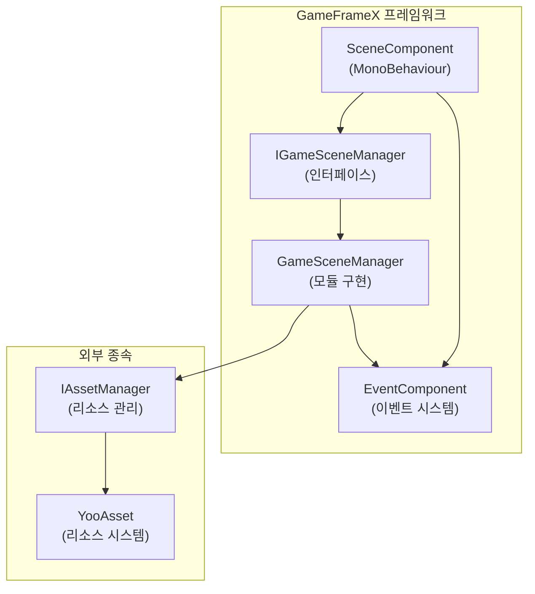
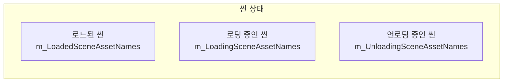
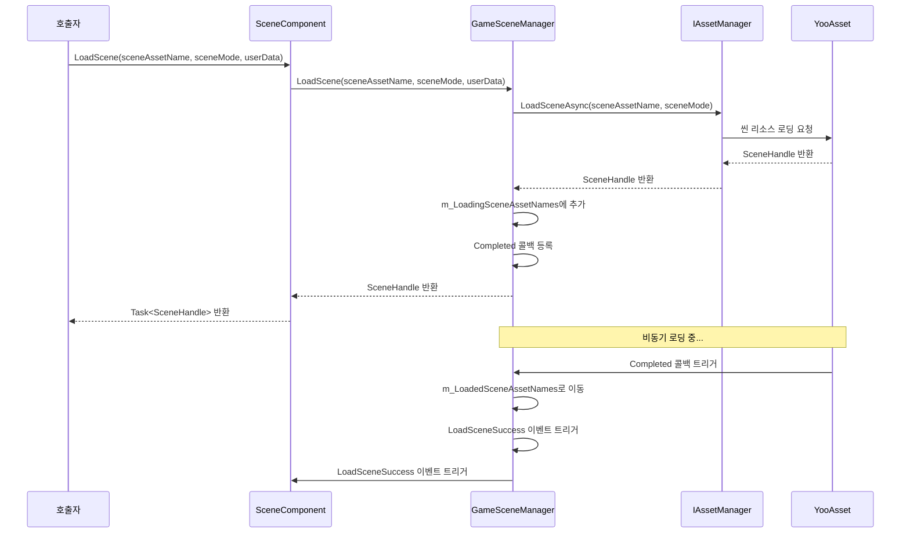
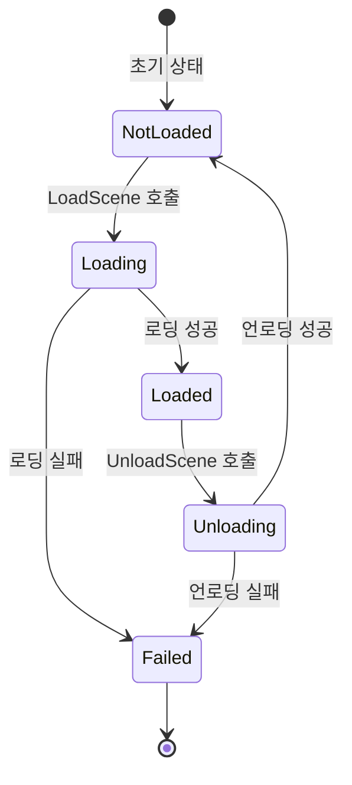
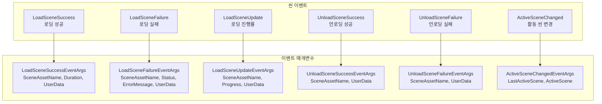

# 핵심 기능

GameFrameX Scene 씬 관리 컴포넌트는 완전한 비동기 씬 로딩, 언로딩, 상태 查询 및 이벤트 알림 기능을 제공하며, 게임 개발에서 여러 씬을 관리하는 핵심 모듈입니다.

## 개요

Scene 컴포넌트는 GameFrameX 프레임워크의 핵심 모듈 중 하나로, Unity 게임의 씬 리소스를 전문적으로 관리합니다. 이 컴포넌트는 YooAsset 리소스 관리 시스템을 기반으로 구축되어 다음 핵심 기능을 제공합니다:

- **비동기 씬 로딩**: 씬 리소스를 비동기로 로딩하여 메인 스레드를 막지 않음
- ** 씬 상태 관리**: 씬의 로딩, 언로딩 상태 查询
- ** 씬 활성화 제어**: 현재 활성화된 씬 및 메인 카메라 관리
- **이벤트驱动**: 씬 상태 변경 listen을 위한 완전한 이벤트 시스템
- ** 씬 우선순위**: 씬 로딩 우선순위 설정 및 활성화 순서 제어 지원

### 핵심 설계 철학

Scene 컴포넌트는 모듈화 설계를 채택하여 비즈니스 로직과 Unity 컴포넌트를 분리합니다. `SceneComponent`는 Unity 컴포넌트로 GameObject에 붙이며, 핵심 로직은 `GameSceneManager` 모듈이 처리합니다. 이러한 설계는 코드를 더욱 명확하게 만들어 테스트와 유지보수를 용이하게 합니다.



## 씬 상태 관리

Scene 컴포넌트는 씬 상태를 추적하기 위해 세 개의 내부 사전을 유지합니다. 이 설계는 효율적인 상태 查询를 보장합니다:



### 상태 查询 메서드

Scene 컴포넌트는 완전한 씬 상태 查询 API를 제공하여 임의의 씬의 현재 상태를 정확하게 가져올 수 있습니다:

```csharp
// 씬이 로드되었는지 확인
bool isLoaded = sceneComponent.SceneIsLoaded("Assets/Scenes/MainMenu.unity");

// 씬이 로딩 중인지 확인
bool isLoading = sceneComponent.SceneIsLoading("Assets/Scenes/GamePlay.unity");

// 씬이 언로딩 중인지 확인
bool isUnloading = sceneComponent.SceneIsUnloading("Assets/Scenes/MainMenu.unity");

// 모든 로드된 씬 이름 가져오기
string[] loadedScenes = sceneComponent.GetLoadedSceneAssetNames();

// 모든 로딩 중인 씬 이름 가져오기
string[] loadingScenes = sceneComponent.GetLoadingSceneAssetNames();

// 모든 언로딩 중인 씬 이름 가져오기
string[] unloadingScenes = sceneComponent.GetUnloadingSceneAssetNames();
```
> Source: [SceneComponent.cs](https://github.com/GameFrameX/com.gameframex.unity.scene/blob/main/Runtime/Scene/SceneComponent.cs#L174-L251)

### 씬 존재성 확인

씬을 로딩하기 전에 씬 리소스가 존재하는지 확인할 수 있습니다:

```csharp
// 씬 리소스가 존재하는지 확인
bool hasScene = sceneComponent.HasScene("Assets/Scenes/GamePlay.unity");
```
> Source: [SceneComponent.cs](https://github.com/GameFrameX/com.gameframex.unity.scene/blob/main/Runtime/Scene/SceneComponent.cs#L258-L274)

## 씬 로딩 및 언로딩

### 씬 로딩

Scene 컴포넌트는 다양한 로딩 모드를 지원하여 게임 요구에 따라 적절한 로딩 방식을 선택할 수 있습니다:



#### 기본 로딩

가장 간단한 씬 로딩 방식으로, 로딩 모드를 지정할 필요가 없습니다:

```csharp
// 단일 씬 로딩 (기본 Additive 모드 사용)
var handle = await sceneComponent.LoadScene("Assets/Scenes/GamePlay.unity");
```
> Source: [SceneComponent.cs](https://github.com/GameFrameX/com.gameframex.unity.scene/blob/main/Runtime/Scene/SceneComponent.cs#L280-L283)

#### 모드 지정 로딩

로딩 모드(Single 또는 Additive)와 사용자 정의 데이터를 지정할 수 있습니다:

```csharp
// Single 모드로 로딩 (현재 씬 대체)
var handle = await sceneComponent.LoadScene(
    "Assets/Scenes/GamePlay.unity",
    LoadSceneMode.Single,
    null  // 사용자 정의 데이터
);

// Additive 모드로 로딩 (叠加 씬)
var handle = await sceneComponent.LoadScene(
    "Assets/Scenes/GamePlay.unity",
    LoadSceneMode.Additive,
    new { level = 1 }  // 사용자 정의 데이터
);
```
> Source: [SceneComponent.cs](https://github.com/GameFrameX/com.gameframex.unity.scene/blob/main/Runtime/Scene/SceneComponent.cs#L291-L307)

**LoadSceneMode 설명:**
- **Single**: 현재 활동 씬을 대체하고, 로딩 완료 후 새 씬만 유지
- **Additive**: 새 씬을 현재 씬에 추가하며, 모든 로드된 씬을 유지

### 씬 언로딩

씬을 언로드하면 로드된 씬이 메모리에서 제거됩니다:

```csharp
// 지정된 씬 언로드
sceneComponent.UnloadScene("Assets/Scenes/MainMenu.unity");

// 씬 언로드 및 사용자 정의 데이터 전달
sceneComponent.UnloadScene("Assets/Scenes/MainMenu.unity", new { reason = "quit" });
```
> Source: [SceneComponent.cs](https://github.com/GameFrameX/com.gameframex.unity.scene/blob/main/Runtime/Scene/SceneComponent.cs#L314-L331)

### 로딩 흐름 상세 설명

 씬 로딩 과정에서 컴포넌트는 여러 상태 전환을 거칩니다. 이러한 상태를 이해하면 비동기 로딩 로직을 더 잘 처리할 수 있습니다:

1. **초기 상태**: 씬이 어떤 사전에도 없음
2. **로딩 중**: 씬이 `m_LoadingSceneAssetNames`에 추가되고, `LoadSceneUpdate` 이벤트 트리거
3. **로딩 완료**: 씬이 `m_LoadedSceneAssetNames`로 이동되고, `LoadSceneSuccess` 이벤트 트리거
4. **언로딩 중**: 씬이 `m_UnloadingSceneAssetNames`에 추가됨
5. **언로딩 완료**: 씬이 모든 사전에서 제거되고, `UnloadSceneSuccess` 이벤트 트리거



## 씬 활성화 및 메인 카메라 관리

### 활동 씬 관리

Scene 컴포넌트는 씬의 로딩 순서를 설정하고, 순서에 따라 자동으로 가장 우선순위가 높은 씬을 활동 상태로 만들 수 있습니다:

```csharp
// 씬 로딩 우선순위 설정 (값이 클수록 우선순위 높음)
sceneComponent.SetSceneOrder("Assets/Scenes/MainMenu.unity", 1);
sceneComponent.SetSceneOrder("Assets/Scenes/GamePlay.unity", 10);
```
> Source: [SceneComponent.cs](https://github.com/GameFrameX/com.gameframex.unity.scene/blob/main/Runtime/Scene/SceneComponent.cs#L338-L367)

여러 씬이 추가 로딩될 때, 우선순위가 가장 높은 씬이 자동으로 활동 씬이 됩니다.

### 메인 카메라 새로고침

컴포넌트는 현재 활동 씬의 메인 카메라를 자동으로 추적합니다:

```csharp
// 메인 카메라 참조 새로고침
sceneComponent.RefreshMainCamera();

// 현재 메인 카메라 가져오기
Camera mainCam = sceneComponent.MainCamera;
```
> Source: [SceneComponent.cs](https://github.com/GameFrameX/com.gameframex.unity.scene/blob/main/Runtime/Scene/SceneComponent.cs#L372-L375)

### 활동 씬 변경 이벤트

활동 씬이 변경되면 entsprechende 이벤트가 트리거됩니다:

```csharp
m_EventComponent.Fire(this, ActiveSceneChangedEventArgs.Create(lastActiveScene, activeScene));
```
> Source: [SceneComponent.cs](https://github.com/GameFrameX/com.gameframex.unity.scene/blob/main/Runtime/Scene/SceneComponent.cs#L431)

## 이벤트 시스템

Scene 컴포넌트는 완전한 이벤트 시스템을 제공하여 개발자가 씬 상태 변경에 대응할 수 있습니다. 이러한 설계는 느슨한 결합의 통신 방식을 实现하여 서로 다른 모듈이 독립적으로 씬 이벤트에 대응할 수 있게 합니다.



### 씬 이벤트 구독

`SceneComponent` 초기화 시 내부 이벤트를 자동으로 구독하고 `EventComponent`로 전달합니다:

```csharp
_gameSceneManager.LoadSceneSuccess += OnLoadGameSceneSuccess;
_gameSceneManager.LoadSceneFailure += OnLoadGameSceneFailure;
_gameSceneManager.LoadSceneUpdate += OnLoadSceneUpdate;
_gameSceneManager.UnloadSceneSuccess += OnUnloadGameSceneSuccess;
_gameSceneManager.UnloadSceneFailure += OnUnloadGameSceneFailure;
```
> Source: [SceneComponent.cs](https://github.com/GameFrameX/com.gameframex.unity.scene/blob/main/Runtime/Scene/SceneComponent.cs#L89-L103)

### 이벤트 사용 예시

```csharp
// 로딩 성공 이벤트 구독
EventComponent.Subscribe<LoadSceneSuccessEventArgs>(OnLoadSceneSuccess);

private void OnLoadSceneSuccess(object sender, LoadSceneSuccessEventArgs e)
{
    Debug.Log($"씬 로딩 성공: {e.SceneAssetName}, 소요 시간: {e.Duration}초");
}

// 로딩 진행률 이벤트 구독
EventComponent.Subscribe<LoadSceneUpdateEventArgs>(OnLoadSceneUpdate);

private void OnLoadSceneUpdate(object sender, LoadSceneUpdateEventArgs e)
{
    Debug.Log($"로딩 진행률: {e.SceneAssetName}, {e.Progress * 100}%");
}

// 언로딩 성공 이벤트 구독
EventComponent.Subscribe<UnloadSceneSuccessEventArgs>(OnUnloadSceneSuccess);

private void OnUnloadSceneSuccess(object sender, UnloadSceneSuccessEventArgs e)
{
    Debug.Log($"씬 언로딩 성공: {e.SceneAssetName}");
}
```

## 컴포넌트 구성

### SceneComponent 속성

`SceneComponent`는 `GameFrameworkComponent`를 상속하며, Unity 씬에 붙으면 자동으로 초기화됩니다:

```csharp
[DisallowMultipleComponent]
[AddComponentMenu("GameFrameX/Scene")]
public sealed class SceneComponent : GameFrameworkComponent
{
    [SerializeField] private bool m_EnableLoadSceneUpdateEvent = true;
    [SerializeField] private bool m_EnableLoadSceneDependencyAssetEvent = true;
}
```
> Source: [SceneComponent.cs](https://github.com/GameFrameX/com.gameframex.unity.scene/blob/main/Runtime/Scene/SceneComponent.cs#L47-L64)

### 구성 설명

| 속성 | 타입 | 기본값 | 설명 |
|------|------|--------|------|
| `m_EnableLoadSceneUpdateEvent` | bool | true | 씬 로딩 진행률 업데이트 이벤트 활성화 여부 |
| `m_EnableLoadSceneDependencyAssetEvent` | bool | true | 종속 리소스 로딩 이벤트 활성화 여부 |

### 에디터 Inspector

Unity 에디터에서 현재 씬 상태를 볼 수 있습니다:

```csharp
// Inspector에 표시되는 정보
EditorGUILayout.LabelField("Loaded Scene Asset Names", GetSceneNameString(t.GetLoadedSceneAssetNames()));
EditorGUILayout.LabelField("Loading Scene Asset Names", GetSceneNameString(t.GetLoadingSceneAssetNames()));
EditorGUILayout.LabelField("Unloading Scene Asset Names", GetSceneNameString(t.GetUnloadingSceneAssetNames()));
EditorGUILayout.ObjectField("Main Camera", t.MainCamera, typeof(Camera), true);
```
> Source: [SceneComponentInspector.cs](https://github.com/GameFrameX/com.gameframex.unity.scene/blob/main/Editor/Inspector/SceneComponentInspector.cs#L64-L67)

## 핵심 흐름

### 완전한 씬 전환 흐름

다음은 각 컴포넌트의 협력 과정을 보여주는 완전한 씬 전환 예시입니다:

```csharp
public class GameSceneController : MonoBehaviour
{
    private SceneComponent _sceneComponent;
    private EventComponent _eventComponent;

    private void Start()
    {
        _sceneComponent = GameEntry.GetComponent<SceneComponent>();
        _eventComponent = GameEntry.GetComponent<EventComponent>();

        // 이벤트 구독
        _eventComponent.Subscribe<LoadSceneSuccessEventArgs>(OnLoadSceneSuccess);
        _eventComponent.Subscribe<LoadSceneFailureEventArgs>(OnLoadSceneFailure);
    }

    // 게임 씬으로 전환
    public async void SwitchToGameScene()
    {
        try
        {
            // 씬 우선순위 설정
            _sceneComponent.SetSceneOrder("Assets/Scenes/GamePlay.unity", 10);

            // 비동기 씬 로딩
            var handle = await _sceneComponent.LoadScene(
                "Assets/Scenes/GamePlay.unity",
                LoadSceneMode.Additive,
                new { timestamp = Time.time }
            );

            Debug.Log($"씬 로딩 완료: {handle.Scene.name}");
        }
        catch (Exception ex)
        {
            Debug.LogError($"씬 로딩 실패: {ex.Message}");
        }
    }

    private void OnLoadSceneSuccess(object sender, LoadSceneSuccessEventArgs e)
    {
        Debug.Log($"씬 {e.SceneAssetName} 로딩 성공, 소요 시간 {e.Duration}초");
    }

    private void OnLoadSceneFailure(object sender, LoadSceneFailureEventArgs e)
    {
        Debug.LogError($"씬 {e.SceneAssetName} 로딩 실패: {e.ErrorMessage}");
    }
}
```

### 오류 처리

`GameSceneManager`는 씬 로딩 및 언로딩 시 다중 상태 검사를 수행하여 중복 操作을 방지합니다:

```csharp
if (SceneIsUnloading(sceneAssetName))
{
    throw new GameFrameworkException(Utility.Text.Format("Scene asset '{0}' is being unloaded.", sceneAssetName));
}

if (SceneIsLoading(sceneAssetName))
{
    throw new GameFrameworkException(Utility.Text.Format("Scene asset '{0}' is being loaded.", sceneAssetName));
}

if (SceneIsLoaded(sceneAssetName))
{
    throw new GameFrameworkException(Utility.Text.Format("Scene asset '{0}' is already loaded.", sceneAssetName));
}
```
> Source: [GameSceneManager.cs](https://github.com/GameFrameX/com.gameframex.unity.scene/blob/main/Runtime/Scene/Scene/GameSceneManager.cs#L360-L373)

## 관련 링크

- [빠른 시작](./03.getting-started.md) - Scene 컴포넌트를 빠르게 통합하는 방법 알아보기
- [API 참조](./05.api-reference.md) - 완전한 API 인터페이스 문서
- [이벤트 시스템](./06.events.md) - 상세한 이벤트 시스템 설명
- [자주 묻는 질문](./07.troubleshooting.md) - 일반 문제 및 해결책
- [GameFrameX 공식 웹사이트](https://gameframex.doc.alianblank.com/) - 공식 문서
- [GitHub 저장소](https://github.com/GameFrameX/com.gameframex.unity.scene.git) - 프로젝트 소스 코드