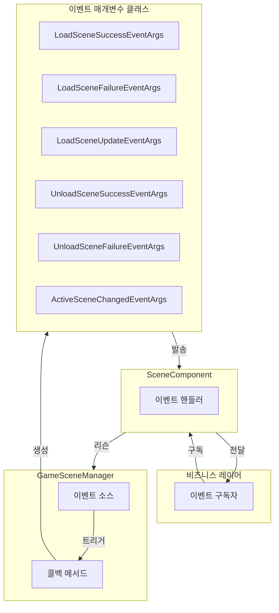
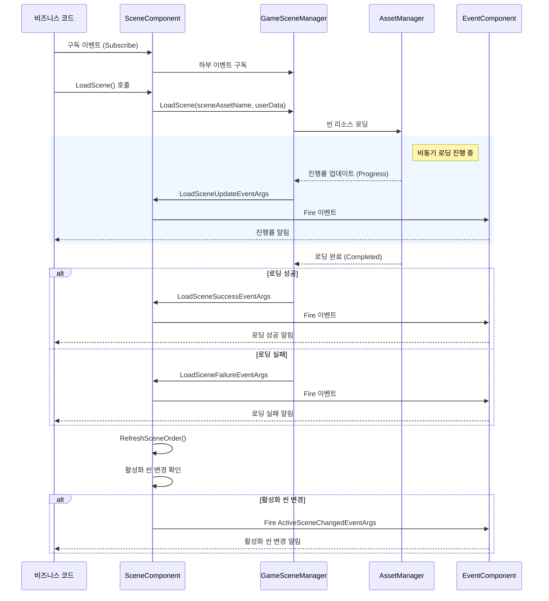

# 이벤트 시스템

GameFrameX Scene 씬 관리 모듈은 씬 로딩, 언로딩 및 활성화 상태 변경을 알리기 위한 완전한 이벤트 시스템을 제공합니다. 이 문서는 Scene 모듈의 이벤트 유형, 이벤트 흐름 및 프로젝트에서 이러한 이벤트를 사용하는 방법을 상세히 소개합니다.

## 개요

이벤트 시스템은 Scene 모듈의 핵심 구성 부분으로, 옵저버 패턴(Observer Pattern)을 채택하여 구현됩니다. 이를 통해 개발자는 씬 상태가 변경될 때 알림을 받고 соответствую 로직을 실행할 수 있습니다. 이벤트 시스템을 통해 다음을 实现할 수 있습니다:

- **解耦**: 씬 관리자와 비즈니스 로직이 이벤트를 통해 통신하여 모듈 간 결합도 감소
- **비동기 지원**: 씬 로딩은 비동기 操作이며, 이벤트 시스템은 진행률 콜백 및 완료 알림을 제공
- **상태 추적**: 씬의 로딩, 언로딩, 활성화 상태를 실시간으로 파악
- **객체 풀 최적화**: `ReferencePool`을 사용하여 이벤트 매개변수를 재활용하여 메모리 할당 감소

Scene 모듈은 씬 操作의 완전한生命周期을涵盖하는 6가지 이벤트 유형을 정의합니다:

| 이벤트 유형 | 설명 | 트리거 시점 |
|---------|------|---------|
| `LoadSceneSuccessEventArgs` | 씬 로딩 성공 이벤트 | 씬 성공적으로 로드 완료 후 |
| `LoadSceneFailureEventArgs` | 씬 로딩 실패 이벤트 | 씬 로딩 실패 시 |
| `LoadSceneUpdateEventArgs` | 씬 로딩 업데이트 이벤트 | 씬 로딩 진행 중 (진행률 업데이트) |
| `UnloadSceneSuccessEventArgs` | 씬 언로딩 성공 이벤트 | 씬 성공적으로 언로딩 완료 후 |
| `UnloadSceneFailureEventArgs` | 씬 언로딩 실패 이벤트 | 씬 언로딩 실패 시 |
| `ActiveSceneChangedEventArgs` | 활성화 씬 변경 이벤트 | 현재 활성화된 씬이 변경될 때 |

## 아키텍처

Scene 모듈의 이벤트 시스템은 계층화 아키텍처 설계를 채택하며, 다음과 같은 핵심 구성 요소가 포함됩니다:



### 이벤트 흐름

씬 이벤트는 다음典型적인 흐름을 따릅니다:



### 이벤트 매개변수 클래스 계층 구조

모든 씬 이벤트 매개변수 클래스는 `GameEventArgs` 기본 클래스( GameFrameX.Event 모듈에서)를 상속하며, 객체 풀화 메커니즘을 구현합니다:

```mermaid
classDiagram
    class GameEventArgs {
        <<abstract>>
        +Id: string { get; }
        +Clear() void
    }

    class LoadSceneSuccessEventArgs {
        +EventId: string
        +SceneAssetName: string
        +Duration: float
        +UserData: object
        +Create() LoadSceneSuccessEventArgs
    }

    class LoadSceneFailureEventArgs {
        +EventId: string
        +SceneAssetName: string
        +ErrorMessage: string
        +Status: EOperationStatus
        +UserData: object
        +Create() LoadSceneFailureEventArgs
    }

    class LoadSceneUpdateEventArgs {
        +EventId: string
        +SceneAssetName: string
        +Progress: float
        +UserData: object
        +Create() LoadSceneUpdateEventArgs
    }

    class UnloadSceneSuccessEventArgs {
        +EventId: string
        +SceneAssetName: string
        +UserData: object
        +Create() UnloadSceneSuccessEventArgs
    }

    class UnloadSceneFailureEventArgs {
        +EventId: string
        +SceneAssetName: string
        +UserData: object
        +Create() UnloadSceneFailureEventArgs
    }

    class ActiveSceneChangedEventArgs {
        +EventId: string
        +LastActiveScene: Scene
        +ActiveScene: Scene
        +Create() ActiveSceneChangedEventArgs
    }

    GameEventArgs <|-- LoadSceneSuccessEventArgs
    GameEventArgs <|-- LoadSceneFailureEventArgs
    GameEventArgs <|-- LoadSceneUpdateEventArgs
    GameEventArgs <|-- UnloadSceneSuccessEventArgs
    GameEventArgs <|-- UnloadSceneFailureEventArgs
    GameEventArgs <|-- ActiveSceneChangedEventArgs
```

## 이벤트 상세

### 씬 로딩 성공 이벤트 (LoadSceneSuccessEventArgs)

씬이 성공적으로 로드 완료된 후 트리거되며, 로딩 소요 시간 정보를 포함합니다.

> Source: [LoadSceneSuccessEventArgs.cs](https://github.com/GameFrameX/com.gameframex.unity.scene/blob/main/Runtime/EventArgs/LoadSceneSuccessEventArgs.cs#L40-L105)

**속성 설명:**

| 속성 | 타입 | 설명 |
|-----|------|------|
| `SceneAssetName` | string | 씬 리소스 이름 |
| `Duration` | float | 로딩 소요 시간 (초) |
| `UserData` | object | 사용자 정의 데이터 |

### 씬 로딩 실패 이벤트 (LoadSceneFailureEventArgs)

씬 로딩 실패 시 트리거되며, 오류 정보를 포함합니다.

> Source: [LoadSceneFailureEventArgs.cs](https://github.com/GameFrameX/com.gameframex.unity.scene/blob/main/Runtime/EventArgs/LoadSceneFailureEventArgs.cs#L41-L113)

**속성 설명:**

| 속성 | 타입 | 설명 |
|-----|------|------|
| `SceneAssetName` | string | 씬 리소스 이름 |
| `ErrorMessage` | string | 오류 정보 |
| `Status` | EOperationStatus | 操作 상태 |
| `UserData` | object | 사용자 정의 데이터 |

### 씬 로딩 업데이트 이벤트 (LoadSceneUpdateEventArgs)

씬 로딩 진행 중 지속적으로 트리거되어 로딩 진행률을 표시하는 데 사용됩니다.

> Source: [LoadSceneUpdateEventArgs.cs](https://github.com/GameFrameX/com.gameframex.unity.scene/blob/main/Runtime/EventArgs/LoadSceneUpdateEventArgs.cs#L40-L105)

**속성 설명:**

| 속성 | 타입 | 설명 |
|-----|------|------|
| `SceneAssetName` | string | 씬 리소스 이름 |
| `Progress` | float | 로딩 진행률 (0.0 - 1.0) |
| `UserData` | object | 사용자 정의 데이터 |

### 씬 언로딩 성공 이벤트 (UnloadSceneSuccessEventArgs)

씬이 성공적으로 언로딩 완료된 후 트리거됩니다.

> Source: [UnloadSceneSuccessEventArgs.cs](https://github.com/GameFrameX/com.gameframex.unity.scene/blob/main/Runtime/EventArgs/UnloadSceneSuccessEventArgs.cs#L40-L96)

**속성 설명:**

| 속성 | 타입 | 설명 |
|-----|------|------|
| `SceneAssetName` | string | 씬 리소스 이름 |
| `UserData` | object | 사용자 정의 데이터 |

### 씬 언로딩 실패 이벤트 (UnloadSceneFailureEventArgs)

씬 언로딩 실패 시 트리거됩니다.

> Source: [UnloadSceneFailureEventArgs.cs](https://github.com/GameFrameX/com.gameframex.unity.scene/blob/main/Runtime/EventArgs/UnloadSceneFailureEventArgs.cs#L40-L96)

**속성 설명:**

| 속성 | 타입 | 설명 |
|-----|------|------|
| `SceneAssetName` | string | 씬 리소스 이름 |
| `UserData` | object | 사용자 정의 데이터 |

### 활성화 씬 변경 이벤트 (ActiveSceneChangedEventArgs)

현재 활성화된 씬이 변경될 때 트리거됩니다.

> Source: [ActiveSceneChangedEventArgs.cs](https://github.com/GameFrameX/com.gameframex.unity.scene/blob/main/Runtime/EventArgs/ActiveSceneChangedEventArgs.cs#L40-L96)

**속성 설명:**

| 속성 | 타입 | 설명 |
|-----|------|------|
| `LastActiveScene` | Scene | 이전에 활성화된 씬 |
| `ActiveScene` | Scene | 현재 활성화된 씬 |

## 사용 예시

### 기본 사용: 씬 이벤트 구독

게임에서는 일반적으로 게임 진입점 또는 특정 관리자에서 씬 이벤트를 구독합니다. 다음 예시는 로딩 성공 및 실패 이벤트를 구독하는 방법을 보여줍니다:

```csharp
using GameFrameX.Scene.Runtime;
using GameFrameX.Runtime;
using UnityEngine;

// MonoBehaviour를 상속하는 스크립트
public class SceneEventExample : MonoBehaviour
{
    private SceneComponent _sceneComponent;

    private void Start()
    {
        // SceneComponent 인스턴스 가져오기
        _sceneComponent = GameEntry.GetComponent<SceneComponent>();

        // 로딩 성공 이벤트 구독
        _sceneComponent.LoadSceneSuccess += OnLoadSceneSuccess;

        // 로딩 실패 이벤트 구독
        _sceneComponent.LoadSceneFailure += OnLoadSceneFailure;

        // 언로딩 성공 이벤트 구독
        _sceneComponent.UnloadSceneSuccess += OnUnloadSceneSuccess;

        // 언로딩 실패 이벤트 구독
        _sceneComponent.UnloadSceneFailure += OnUnloadSceneFailure;

        // 활성화 씬 변경 이벤트 구독
        _sceneComponent.ActiveSceneChanged += OnActiveSceneChanged;
    }

    private void OnLoadSceneSuccess(object sender, LoadSceneSuccessEventArgs e)
    {
        Debug.Log($"씬 로딩 성공: {e.SceneAssetName}, 소요 시간: {e.Duration:F2}초");

        // UserData를 통해 사용자 정의 데이터 전달 가능
        if (e.UserData != null)
        {
            Debug.Log($"사용자 데이터: {e.UserData}");
        }
    }

    private void OnLoadSceneFailure(object sender, LoadSceneFailureEventArgs e)
    {
        Debug.LogError($"씬 로딩 실패: {e.SceneAssetName}, 오류: {e.ErrorMessage}");
    }

    private void OnUnloadSceneSuccess(object sender, UnloadSceneSuccessEventArgs e)
    {
        Debug.Log($"씬 언로딩 성공: {e.SceneAssetName}");
    }

    private void OnUnloadSceneFailure(object sender, UnloadSceneFailureEventArgs e)
    {
        Debug.LogError($"씬 언로딩 실패: {e.SceneAssetName}");
    }

    private void OnActiveSceneChanged(object sender, ActiveSceneChangedEventArgs e)
    {
        Debug.Log($"활성 씬 변경: {e.LastActiveScene.name} -> {e.ActiveScene.name}");
    }

    private void OnDestroy()
    {
        // 컴포넌트 파괴 시 구독을 취소하여 메모리 누수 방지
        if (_sceneComponent != null)
        {
            _sceneComponent.LoadSceneSuccess -= OnLoadSceneSuccess;
            _sceneComponent.LoadSceneFailure -= OnLoadSceneFailure;
            _sceneComponent.UnloadSceneSuccess -= OnUnloadSceneSuccess;
            _sceneComponent.UnloadSceneFailure -= OnUnloadSceneFailure;
            _sceneComponent.ActiveSceneChanged -= OnActiveSceneChanged;
        }
    }
}
```
> Source: [SceneComponent.cs](https://github.com/GameFrameX/com.gameframex.unity.scene/blob/main/Runtime/Scene/SceneComponent.cs#L89-L103)

### 고급 사용: 진행률 이벤트를 사용하여 로딩 인터페이스 구현

실제 프로젝트에서는 일반적으로 로딩 인터페이스를 표시하여 로딩 진행률을 피드백해야 합니다:

```csharp
using UnityEngine;
using UnityEngine.UI;
using GameFrameX.Scene.Runtime;
using GameFrameX.Runtime;

public class LoadingSceneExample : MonoBehaviour
{
    [SerializeField] private Slider _progressSlider;
    [SerializeField] private Text _progressText;
    [SerializeField] private GameObject _loadingPanel;

    private SceneComponent _sceneComponent;

    private void Awake()
    {
        _loadingPanel.SetActive(false);
    }

    public void LoadSceneWithProgress(string sceneAssetName)
    {
        _sceneComponent = GameEntry.GetComponent<SceneComponent>();

        // 로딩 진행률 업데이트 이벤트 구독
        _sceneComponent.LoadSceneUpdate += OnLoadSceneUpdate;

        // 로딩 인터페이스 표시
        _loadingPanel.SetActive(true);

        // 씬 로딩 시작, 사용자 정의 데이터 전달
        var userData = new LoadSceneData { SceneName = sceneAssetName };
        _ = _sceneComponent.LoadScene(sceneAssetName, UnityEngine.SceneManagement.LoadSceneMode.Single, userData);
    }

    private void OnLoadSceneUpdate(object sender, LoadSceneUpdateEventArgs e)
    {
        // UI 업데이트하여 로딩 진행률 표시
        float progress = e.Progress * 100f;
        _progressSlider.value = e.Progress;
        _progressText.text = $"{progress:F1}%";

        Debug.Log($"로딩 진행률: {e.SceneAssetName} - {progress:F1}%");
    }

    private void OnLoadSceneSuccess(object sender, LoadSceneSuccessEventArgs e)
    {
        Debug.Log($"씬 로딩 완료: {e.SceneAssetName}");

        // 진행률 이벤트 구독 취소
        _sceneComponent.LoadSceneUpdate -= OnLoadSceneUpdate;

        // 로딩 인터페이스 숨김
        _loadingPanel.SetActive(false);
    }

    // 사용자 정의 데이터 클래스
    public class LoadSceneData
    {
        public string SceneName;
    }
}
```

### 이벤트 활성화 구성

SceneComponent는 이벤트 트리거를 제어하기 위한 구성 옵션을 제공합니다:

```csharp
public sealed class SceneComponent : GameFrameworkComponent
{
    // 씬 로딩 업데이트 이벤트 활성화 여부
    [SerializeField] private bool m_EnableLoadSceneUpdateEvent = true;

    // 씬 로딩 종속 리소스 이벤트 활성화 여부
    [SerializeField] private bool m_EnableLoadSceneDependencyAssetEvent = true;
}
```

> Source: [SceneComponent.cs](https://github.com/GameFrameX/com.gameframex.unity.scene/blob/main/Runtime/Scene/SceneComponent.cs#L62-L64)

Inspector 패널 또는 코드를 통해 불필요한 이벤트를 비활성화하여 성능을 최적화할 수 있습니다.

## API 참조

### SceneComponent 이벤트

> Source: [SceneComponent.cs](https://github.com/GameFrameX/com.gameframex.unity.scene/blob/main/Runtime/Scene/SceneComponent.cs#L89-L103)

#### `LoadSceneSuccess` 이벤트

```csharp
public event EventHandler<LoadSceneSuccessEventArgs> LoadSceneSuccess;
```

씬 로딩 성공 시 트리거됩니다.

**이벤트 매개변수:**
- `SceneAssetName` (string): 씬 리소스 이름
- `Duration` (float): 로딩 소요 시간
- `UserData` (object): 사용자 정의 데이터

---

#### `LoadSceneFailure` 이벤트

```csharp
public event EventHandler<LoadSceneFailureEventArgs> LoadSceneFailure;
```

씬 로딩 실패 시 트리거됩니다.

**이벤트 매개변수:**
- `SceneAssetName` (string): 씬 리소스 이름
- `ErrorMessage` (string): 오류 정보
- `Status` (EOperationStatus): 操作 상태
- `UserData` (object): 사용자 정의 데이터

---

#### `LoadSceneUpdate` 이벤트

```csharp
public event EventHandler<LoadSceneUpdateEventArgs> LoadSceneUpdate;
```

씬 로딩 진행 중 지속적으로 트리거됩니다.

**이벤트 매개변수:**
- `SceneAssetName` (string): 씬 리소스 이름
- `Progress` (float): 로딩 진행률 (0.0 - 1.0)
- `UserData` (object): 사용자 정의 데이터

---

#### `UnloadSceneSuccess` 이벤트

```csharp
public event EventHandler<UnloadSceneSuccessEventArgs> UnloadSceneSuccess;
```

씬 언로딩 성공 시 트리거됩니다.

**이벤트 매개변수:**
- `SceneAssetName` (string): 씬 리소스 이름
- `UserData` (object): 사용자 정의 데이터

---

#### `UnloadSceneFailure` 이벤트

```csharp
public event EventHandler<UnloadSceneFailureEventArgs> UnloadSceneFailure;
```

씬 언로딩 실패 시 트리거됩니다.

**이벤트 매개변수:**
- `SceneAssetName` (string): 씬 리소스 이름
- `UserData` (object): 사용자 정의 데이터

---

#### `ActiveSceneChanged` 이벤트

```csharp
public event EventHandler<ActiveSceneChangedEventArgs> ActiveSceneChanged;
```

활성 씬이 변경될 때 트리거됩니다.

**이벤트 매개변수:**
- `LastActiveScene` (Scene): 이전 활성화 씬
- `ActiveScene` (Scene): 현재 활성화 씬

### IGameSceneManager 이벤트

> Source: [IGameSceneManager.cs](https://github.com/GameFrameX/com.gameframex.unity.scene/blob/main/Runtime/Scene/Scene/IGameSceneManager.cs#L44-L70)

IGameSceneManager 인터페이스는 SceneComponent와 동일한 이벤트 세트를 정의합니다. 이 이벤트는 GameSceneManager 내부에서 트리거된 후 SceneComponent에 의해 전역 이벤트 시스템으로 전달됩니다.

### 이벤트 매개변수 생성 메서드

모든 이벤트 매개변수 클래스는 이벤트 인스턴스 생성을 위한 정적 `Create` 메서드와 데이터 정리를 위한 `Clear` 메서드(객체 풀 재활용용)를 제공합니다.

```csharp
// LoadSceneSuccessEventArgs 생성
LoadSceneSuccessEventArgs.Create(string sceneAssetName, float duration, object userData)

// LoadSceneFailureEventArgs 생성
LoadSceneFailureEventArgs.Create(string sceneAssetName, EOperationStatus status, string errorMessage, object userData)

// LoadSceneUpdateEventArgs 생성
LoadSceneUpdateEventArgs.Create(string sceneAssetName, float progress, object userData)

// UnloadSceneSuccessEventArgs 생성
UnloadSceneSuccessEventArgs.Create(string sceneAssetName, object userData)

// UnloadSceneFailureEventArgs 생성
UnloadSceneFailureEventArgs.Create(string sceneAssetName, object userData)

// ActiveSceneChangedEventArgs 생성
ActiveSceneChangedEventArgs.Create(Scene lastActiveScene, Scene activeScene)
```

> Source: [LoadSceneSuccessEventArgs.cs](https://github.com/GameFrameX/com.gameframex.unity.scene/blob/main/Runtime/EventArgs/LoadSceneSuccessEventArgs.cs#L87-L94)

## 모범 사례

### 1. 적시에 구독 취소

MonoBehaviour의 `OnDestroy` 또는 컴포넌트 비활성화 시 이벤트 구독을 적시에 취소하여 메모리 누수를 방지합니다:

```csharp
private void OnDestroy()
{
    if (_sceneComponent != null)
    {
        _sceneComponent.LoadSceneSuccess -= OnLoadSceneSuccess;
        // 다른 모든 구독 취소...
    }
}
```

### 2. UserData를 사용하여 컨텍스트 전달

`userData` 매개변수를 통해 씬 로딩 시 컨텍스트 정보를 전달하여 전역 변수 사용을 방지합니다:

```csharp
// 씬 로딩 시 데이터 전달
await sceneComponent.LoadScene("Assets/Scenes/Game.unity", LoadSceneMode.Single, new GameLoadData { LevelId = 1 });

// 이벤트에서 데이터 수신
private void OnLoadSceneSuccess(object sender, LoadSceneSuccessEventArgs e)
{
    if (e.UserData is GameLoadData data)
    {
        Debug.Log($"레벨 로딩: {data.LevelId}");
    }
}
```

### 3. 이벤트 유형 합리적으로 선택

- **진행률 표시 필요**: `LoadSceneUpdate` 이벤트 구독
- **결과만 필요**: `LoadSceneSuccess` / `LoadSceneFailure` 이벤트 구독
- **씬 전환 대응 필요**: `ActiveSceneChanged` 이벤트 구독

### 4. 불필요한 이벤트 비활성화

로딩 진행률 업데이트 이벤트가 필요하지 않은 경우 Inspector에서 비활성화하여 성능을 향상시킵니다:

```csharp
// 코드를 통해 비활성화
sceneComponent.m_EnableLoadSceneUpdateEvent = false;
```

## 관련 링크

- [핵심 기능](./04.features.md) - Scene 모듈의 핵심 기능 자세히 알아보기
- [API 참조](./05.api-reference.md) - 완전한 API 인터페이스 문서
- [빠른 시작](./03.getting-started.md) - Scene 모듈 빠르게 시작하기
- [자주 묻는 질문](./07.troubleshooting.md) - 일반 문제 및 해결책
- [GameFrameX 공식 웹사이트](https://gameframex.doc.alianblank.com/) - 공식 문서
- [GitHub 저장소](https://github.com/GameFrameX/com.gameframex.unity.scene) - 소스 코드