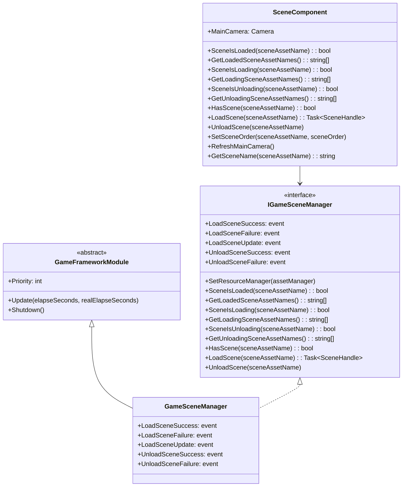
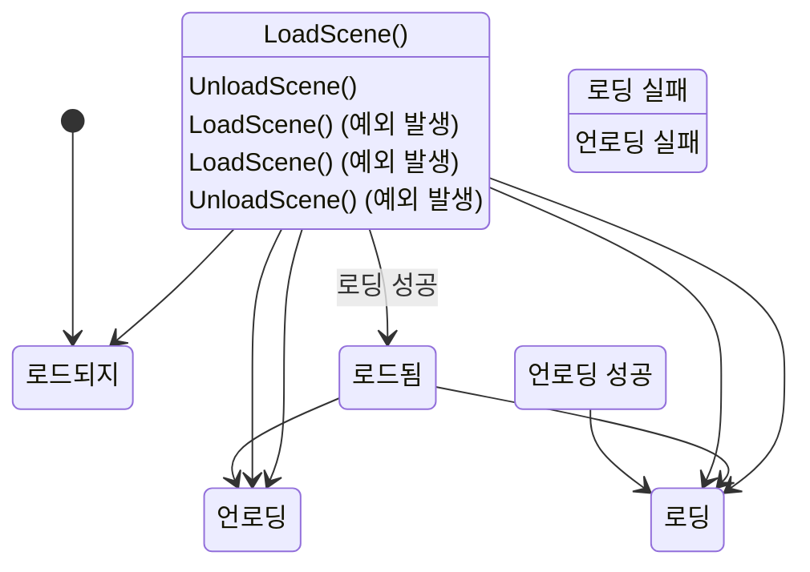

# API 참조

이 문서는 GameFrameX Scene 씬 관리 컴포넌트가 제공하는 모든 공개 API를 상세히 소개하며, 인터페이스 정의, 메서드 시그니처, 매개변수 설명 및 반환 타입을 포함합니다.

## 개요

GameFrameX Scene 컴포넌트는 완전한 씬 관리 솔루션을 제공하며, 주요 핵심 클래스는 다음과 같습니다:

- **IGameSceneManager** - 씬 관리자의 추상 인터페이스로, 씬 操作의 표준 계약 정의
- **GameSceneManager** - IGameSceneManager의 구체적 구현으로, GameFrameworkModule 상속
- **SceneComponent** - Unity 컴포넌트 캡슐화로, Unity 통합 및 씬 활성화 순서 관리 제공

컴포넌트는 YooAsset 리소스 관리 시스템에 종속되어 씬 리소스의 비동기 로딩 및 언로딩을 수행합니다.

## 클래스 다이어그램



## IGameSceneManager 인터페이스

`IGameSceneManager`는 씬 관리자의 핵심 인터페이스로, 모든 씬 操作의 표준 메서드를 정의합니다.

> Source: [IGameSceneManager.cs](https://github.com/GameFrameX/com.gameframex.unity.scene/blob/main/Runtime/Scene/Scene/IGameSceneManager.cs#L1-L175)

### 이벤트 정의

| 이벤트 이름 | 이벤트 타입 | 설명 |
|---------|---------|------|
| LoadSceneSuccess | EventHandler~LoadSceneSuccessEventArgs~ | 씬 로딩 성공 시 트리거 |
| LoadSceneFailure | EventHandler~LoadSceneFailureEventArgs~ | 씬 로딩 실패 시 트리거 |
| LoadSceneUpdate | EventHandler~LoadSceneUpdateEventArgs~ | 씬 로딩 진행률 업데이트 시 트리거 |
| UnloadSceneSuccess | EventHandler~UnloadSceneSuccessEventArgs~ | 씬 언로딩 성공 시 트리거 |
| UnloadSceneFailure | EventHandler~UnloadSceneFailureEventArgs~ | 씬 언로딩 실패 시 트리거 |

### `SetResourceManager(assetManager: IAssetManager): void`

리소스 관리자를 설정합니다. 씬 관리자를 사용하기 전에 반드시 이 메서드를 호출하여 IAssetManager 구현을 설정해야 합니다.

**매개변수:**
- `assetManager` (IAssetManager): 리소스 관리자 인스턴스로, null일 수 없음

**예외 발생:**
- `GameFrameworkException`: assetManager가 null일 때 발생

---

### `SceneIsLoaded(sceneAssetName: string): bool`

지정된 씬이 로드되었는지 확인합니다.

**매개변수:**
- `sceneAssetName` (string): 씬 리소스 이름

**반환:**
- (bool): 씬이 로드되면 true, 그렇지 않으면 false

**예외 발생:**
- `GameFrameworkException`: sceneAssetName이 비어있거나 null일 때 발생

---

### `GetLoadedSceneAssetNames(): string[]`

모든 로드된 씬의 리소스 이름을 가져옵니다.

**반환:**
- (string[]): 로드된 씬의 리소스 이름 배열

---

### `GetLoadedSceneAssetNames(results: List<string>): void`

모든 로드된 씬의 리소스 이름을 가져옵니다 (메모리 할당 방지 위해 리스트 매개변수 사용).

**매개변수:**
- `results` (List<string>): 결과를 저장하는 리스트로, null일 수 없음

**예외 발생:**
- `GameFrameworkException`: results가 null일 때 발생

---

### `SceneIsLoading(sceneAssetName: string): bool`

지정된 씬이 로딩 중인지 확인합니다.

**매개변수:**
- `sceneAssetName` (string): 씬 리소스 이름

**반환:**
- (bool): 씬이 로딩 중이면 true, 그렇지 않으면 false

**예외 발생:**
- `GameFrameworkException`: sceneAssetName이 비어있거나 null일 때 발생

---

### `GetLoadingSceneAssetNames(): string[]`

모든 로딩 중인 씬의 리소스 이름을 가져옵니다.

**반환:**
- (string[]): 로딩 중인 씬의 리소스 이름 배열

---

### `GetLoadingSceneAssetNames(results: List<string>): void`

모든 로딩 중인 씬의 리소스 이름을 가져옵니다 (메모리 할당 방지 위해 리스트 매개변수 사용).

**매개변수:**
- `results` (List<string>): 결과를 저장하는 리스트로, null일 수 없음

**예외 발생:**
- `GameFrameworkException`: results가 null일 때 발생

---

### `SceneIsUnloading(sceneAssetName: string): bool`

지정된 씬이 언로딩 중인지 확인합니다.

**매개변수:**
- `sceneAssetName` (string): 씬 리소스 이름

**반환:**
- (bool): 씬이 언로딩 중이면 true, 그렇지 않으면 false

**예외 발생:**
- `GameFrameworkException`: sceneAssetName이 비어있거나 null일 때 발생

---

### `GetUnloadingSceneAssetNames(): string[]`

모든 언로딩 중인 씬의 리소스 이름을 가져옵니다.

**반환:**
- (string[]): 언로딩 중인 씬의 리소스 이름 배열

---

### `GetUnloadingSceneAssetNames(results: List<string>): void`

모든 언로딩 중인 씬의 리소스 이름을 가져옵니다 (메모리 할당 방지 위해 리스트 매개변수 사용).

**매개변수:**
- `results` (List<string>): 결과를 저장하는 리스트로, null일 수 없음

**예외 발생:**
- `GameFrameworkException`: results가 null일 때 발생

---

### `HasScene(sceneAssetName: string): bool`

씬 리소스가 존재하는지 확인합니다.

**매개변수:**
- `sceneAssetName` (string): 확인할 씬 리소스 이름

**반환:**
- (bool): 씬 리소스가 존재하면 true, 그렇지 않으면 false

---

### `LoadScene(sceneAssetName: string): Task<SceneHandle>`

씬을 로딩합니다 (기본 매개변수 사용). Single 모드로 씬을 로딩하며 사용자 데이터를 전달하지 않습니다.

**매개변수:**
- `sceneAssetName` (string): 씬 리소스 이름

**반환:**
- (Task~SceneHandle~): 비동기 操作으로, 완료 후 SceneHandle 반환

**오버로드 메서드:**
```csharp
Task<SceneHandle> LoadScene(string sceneAssetName, object userData)
Task<SceneHandle> LoadScene(string sceneAssetName, LoadSceneMode sceneMode, object userData)
```

**매개변수 설명:**
- `sceneAssetName` (string): 씬 리소스 이름 (예: "Assets/Scenes/Game.unity")
- `sceneMode` (LoadSceneMode): 로딩 모드, Single 또는 Additive
- `userData` (object): 사용자 정의 데이터로, 이벤트에서 回传됨

**예외 발생:**
- `GameFrameworkException`: sceneAssetName이 비어있거나 null일 때 발생
- `GameFrameworkException`: 리소스 관리자가 설정되지 않았을 때 발생
- `GameFrameworkException`: 씬이 언로딩 중일 때 발생
- `GameFrameworkException`: 씬이 로딩 중일 때 발생
- `GameFrameworkException`: 씬이 이미 로드되었을 때 발생

---

### `UnloadScene(sceneAssetName: string): void`

씬을 언로딩합니다 (기본 매개변수 사용). 사용자 데이터를 전달하지 않습니다.

**매개변수:**
- `sceneAssetName` (string): 씬 리소스 이름

**오버로드 메서드:**
```csharp
void UnloadScene(string sceneAssetName, object userData)
```

**매개변수 설명:**
- `sceneAssetName` (string): 씬 리소스 이름
- `userData` (object): 사용자 정의 데이터로, 이벤트에서 回传됨

**예외 발생:**
- `GameFrameworkException`: sceneAssetName이 비어있거나 null일 때 발생
- `GameFrameworkException`: 리소스 관리자가 설정되지 않았을 때 발생
- `GameFrameworkException`: 씬이 언로딩 중일 때 발생
- `GameFrameworkException`: 씬이 로딩 중일 때 발생
- `GameFrameworkException`: 씬이 로드되지 않았을 때 발생

---

## SceneComponent 클래스

SceneComponent는 Unity 컴포넌트 캡슐화르, GameFrameworkComponent를 상속하며 Unity 생태계와의 통합을 제공합니다.

> Source: [SceneComponent.cs](https://github.com/GameFrameX/com.gameframex.unity.scene/blob/main/Runtime/Scene/SceneComponent.cs#L1-L472)

### 속성

| 속성명 | 타입 | 설명 |
|-------|------|------|
| MainCamera | Camera | 현재 씬의 메인 카메라 가져오기 |

### 직렬화 필드

| 필드명 | 타입 | 기본값 | 설명 |
|-------|------|--------|------|
| m_EnableLoadSceneUpdateEvent | bool | true | 씬 로딩 업데이트 이벤트 활성화 여부 |
| m_EnableLoadSceneDependencyAssetEvent | bool | true | 씬 종속 리소스 로딩 이벤트 활성화 여부 |

---

### `GetSceneName(sceneAssetName: string): string`

씬 리소스 경로에서 씬 이름을 추출합니다.

**매개변수:**
- `sceneAssetName` (string): 씬 리소스 경로 (예: "Assets/Scenes/Game.unity")

**반환:**
- (string): 씬 이름 (예: "Game"),无效 입력 시 null 반환

**예시:**
```csharp
// 입력: "Assets/Scenes/MainMenu.unity"
// 출력: "MainMenu"
string sceneName = SceneComponent.GetSceneName("Assets/Scenes/MainMenu.unity");
```
> Source: [SceneComponent.cs](https://github.com/GameFrameX/com.gameframex.unity.scene/blob/main/Runtime/Scene/SceneComponent.cs#L144-L167)

---

### `LoadScene(sceneAssetName: string): Task<SceneHandle>`

씬을 로딩합니다 (기본 매개변수 사용). Additive 모드로 씬을 로딩합니다.

> 참고: SceneComponent의 기본 로딩 모드는 Additive이며, IGameSceneManager의 기본 모드(Single)와 다릅니다.

**매개변수:**
- `sceneAssetName` (string): 씬 리소스 이름

**반환:**
- (Task~SceneHandle~): 비동기 操作으로, 완료 후 SceneHandle 반환

**오버로드 메서드:**
```csharp
Task<SceneHandle> LoadScene(string sceneAssetName, LoadSceneMode sceneMode, object userData = null)
```

**검증 규칙:**
- sceneAssetName은 반드시 "Assets/"로 시작해야 함
- sceneAssetName은 반드시 ".unity"로 끝나야 함

**예시:**
```csharp
// 비동기 씬 로딩
var sceneComponent = GameEntry.GetComponent<SceneComponent>();
var handle = await sceneComponent.LoadScene("Assets/Scenes/Game.unity", LoadSceneMode.Additive);
Debug.Log($"씬 로딩 완료, 소요 시간: {handle.Duration}");
```
> Source: [SceneComponent.cs](https://github.com/GameFrameX/com.gameframex.unity.scene/blob/main/Runtime/Scene/SceneComponent.cs#L280-L307)

---

### `UnloadScene(sceneAssetName: string, userData: object = null): void`

씬을 언로딩합니다.

**매개변수:**
- `sceneAssetName` (string): 씬 리소스 이름
- `userData` (object): 사용자 정의 데이터 (선택사항)

**검증 규칙:**
- sceneAssetName은 반드시 "Assets/"로 시작해야 함
- sceneAssetName은 반드시 ".unity"로 끝나야 함

**예시:**
```csharp
var sceneComponent = GameEntry.GetComponent<SceneComponent>();
sceneComponent.UnloadScene("Assets/Scenes/MainMenu.unity");
```
> Source: [SceneComponent.cs](https://github.com/GameFrameX/com.gameframex.unity.scene/blob/main/Runtime/Scene/SceneComponent.cs#L314-L331)

---

### `SetSceneOrder(sceneAssetName: string, sceneOrder: int): void`

씬의 활성화 순서를 설정합니다. 이 메서드는 여러 Additive 로딩 씬 관리 시 활동 씬 우선순위를 관리하는 데 사용됩니다.

**매개변수:**
- `sceneAssetName` (string): 씬 리소스 이름
- `sceneOrder` (int): 씬 순서로, 값이 클수록 우선순위 높음

**동작 설명:**
- 씬이 로딩 중이면 씬 순서를 내부 사전에 기록하여 로딩 완료 후 적용
- 씬이 이미 로드되었으면 즉시 씬 순서 새로고침
- 씬이 로드되지 않았고 로딩 중이지 않으면 오류 로그 기록

**예시:**
```csharp
var sceneComponent = GameEntry.GetComponent<SceneComponent>();
// Main 씬의 우선순위를 가장 높게 설정
sceneComponent.SetSceneOrder("Assets/Scenes/Main.unity", 100);
sceneComponent.SetSceneOrder("Assets/Scenes/UI.unity", 50);
```
> Source: [SceneComponent.cs](https://github.com/GameFrameX/com.gameframex.unity.scene/blob/main/Runtime/Scene/SceneComponent.cs#L338-L367)

---

### `RefreshMainCamera(): void`

현재 씬의 메인 카메라 참조를 새로고침합니다. 일반적으로 씬 로딩 또는 활성화 씬 변경 후 호출합니다.

> Source: [SceneComponent.cs](https://github.com/GameFrameX/com.gameframex.unity.scene/blob/main/Runtime/Scene/SceneComponent.cs#L372-L375)

---

## 이벤트 매개변수 클래스

모든 씬 이벤트 매개변수 클래스는 GameEventArgs를 상속하며, Create 팩토리 메서드와 Clear 메서드를 구현하여 객체 풀 관리를 지원합니다.

> Source: [LoadSceneSuccessEventArgs.cs](https://github.com/GameFrameX/com.gameframex.unity.scene/blob/main/Runtime/EventArgs/LoadSceneSuccessEventArgs.cs#L1-L106)

### LoadSceneSuccessEventArgs

씬 로딩 성공 이벤트 매개변수.

| 속성명 | 타입 | 설명 |
|-------|------|------|
| SceneAssetName | string | 씬 리소스 이름 |
| Duration | float | 로딩 소요 시간 (초) |
| UserData | object | 사용자 정의 데이터 |

**이벤트 ID:** `GameFrameX.Scene.Runtime.LoadSceneSuccessEventArgs`

---

### LoadSceneFailureEventArgs

씬 로딩 실패 이벤트 매개변수.

| 속성명 | 타입 | 설명 |
|-------|------|------|
| SceneAssetName | string | 씬 리소스 이름 |
| ErrorMessage | string | 오류 정보 |
| UserData | object | 사용자 정의 데이터 |
| Status | EOperationStatus | 操作 상태 |

**이벤트 ID:** `GameFrameX.Scene.Runtime.LoadSceneFailureEventArgs`

> Source: [LoadSceneFailureEventArgs.cs](https://github.com/GameFrameX/com.gameframex.unity.scene/blob/main/Runtime/EventArgs/LoadSceneFailureEventArgs.cs#L1-L114)

---

### LoadSceneUpdateEventArgs

씬 로딩 진행률 업데이트 이벤트 매개변수.

| 속성명 | 타입 | 설명 |
|-------|------|------|
| SceneAssetName | string | 씬 리소스 이름 |
| Progress | float | 로딩 진행률 (0.0 - 1.0) |
| UserData | object | 사용자 정의 데이터 |

**이벤트 ID:** `GameFrameX.Scene.Runtime.LoadSceneUpdateEventArgs`

> Source: [LoadSceneUpdateEventArgs.cs](https://github.com/GameFrameX/com.gameframex.unity.scene/blob/main/Runtime/EventArgs/LoadSceneUpdateEventArgs.cs#L1-L106)

---

### UnloadSceneSuccessEventArgs

씬 언로딩 성공 이벤트 매개변수.

| 속성명 | 타입 | 설명 |
|-------|------|------|
| SceneAssetName | string | 씬 리소스 이름 |
| UserData | object | 사용자 정의 데이터 |

**이벤트 ID:** `GameFrameX.Scene.Runtime.UnloadSceneSuccessEventArgs`

> Source: [UnloadSceneSuccessEventArgs.cs](https://github.com/GameFrameX/com.gameframex.unity.scene/blob/main/Runtime/EventArgs/UnloadSceneSuccessEventArgs.cs#L1-L97)

---

### UnloadSceneFailureEventArgs

씬 언로딩 실패 이벤트 매개변수.

| 속성명 | 타입 | 설명 |
|-------|------|------|
| SceneAssetName | string | 씬 리소스 이름 |
| UserData | object | 사용자 정의 데이터 |

**이벤트 ID:** `GameFrameX.Scene.Runtime.UnloadSceneFailureEventArgs`

> Source: [UnloadSceneFailureEventArgs.cs](https://github.com/GameFrameX/com.gameframex.unity.scene/blob/main/Runtime/EventArgs/UnloadSceneFailureEventArgs.cs#L1-L97)

---

### ActiveSceneChangedEventArgs

활성 씬 변경 이벤트 매개변수.

| 속성명 | 타입 | 설명 |
|-------|------|------|
| LastActiveScene | UnityEngine.SceneManagement.Scene | 이전에 활성화된 씬 |
| ActiveScene | UnityEngine.SceneManagement.Scene | 현재 활성화된 씬 |

**이벤트 ID:** `GameFrameX.Scene.Runtime.ActiveSceneChangedEventArgs`

> Source: [ActiveSceneChangedEventArgs.cs](https://github.com/GameFrameX/com.gameframex.unity.scene/blob/main/Runtime/EventArgs/ActiveSceneChangedEventArgs.cs#L1-L97)

---

## 씬 상태 흐름



---

## 일반 사용 패턴

### 1. SceneComponent를 통해 씬 로딩 및 언로딩

```csharp
// SceneComponent 인스턴스 가져오기
var sceneComponent = GameEntry.GetComponent<SceneComponent>();

// 씬 로딩 성공 이벤트 구독
sceneComponent.LoadSceneSuccess += OnLoadSceneSuccess;

// 씬 로딩
await sceneComponent.LoadScene("Assets/Scenes/Game.unity", LoadSceneMode.Additive);

private void OnLoadSceneSuccess(object sender, LoadSceneSuccessEventArgs e)
{
    Debug.Log($"씬 {e.SceneAssetName} 로딩 성공, 소요 시간: {e.Duration}초");
}
```

> Source: [SceneComponent.cs](https://github.com/GameFrameX/com.gameframex.unity.scene/blob/main/Runtime/Scene/SceneComponent.cs#L437-L446)

---

### 2. 씬 전환 (단일 씬 모드)

```csharp
var sceneComponent = GameEntry.GetComponent<SceneComponent>();

// 현재 씬 언로드
sceneComponent.UnloadScene(currentSceneName);

// 새 씬 로딩
await sceneComponent.LoadScene(newSceneName, LoadSceneMode.Single);
```

---

### 3. 다중 씬 관리 (Additive 모드)

```csharp
var sceneComponent = GameEntry.GetComponent<SceneComponent>();

// 기본 씬 로딩
await sceneComponent.LoadScene("Assets/Scenes/Base.unity", LoadSceneMode.Additive);

// 게임플레이 씬 로딩
await sceneComponent.LoadScene("Assets/Scenes/Gameplay.unity", LoadSceneMode.Additive);

// UI 씬 로딩 (우선순위 가장 높음)
sceneComponent.SetSceneOrder("Assets/Scenes/UI.unity", 100);
await sceneComponent.LoadScene("Assets/Scenes/UI.unity", LoadSceneMode.Additive);
```

---

### 4. 씬 로딩 실패 처리

```csharp
var sceneComponent = GameEntry.GetComponent<SceneComponent>();

sceneComponent.LoadSceneFailure += OnLoadSceneFailure;

try
{
    await sceneComponent.LoadScene("Assets/Scenes/Game.unity");
}
catch (Exception ex)
{
    Debug.LogError($"씬 로딩 예외: {ex.Message}");
}

private void OnLoadSceneFailure(object sender, LoadSceneFailureEventArgs e)
{
    Debug.LogError($"씬 로딩 실패: {e.ErrorMessage}");
    // 여기서 오류 UI 표시 또는 기타恢复 로직 실행 가능
}
```

---

### 5. 활동 씬 변경 리스닝

```csharp
var sceneComponent = GameEntry.GetComponent<SceneComponent>();

// 참고: ActiveSceneChangedEventArgs는 EventComponent를 통해 트리거됨
// 이벤트 시스템을 통해 구독해야 함
```

> 이벤트 시스템의 상세 사용 방법은 [이벤트 시스템](./06.events.md) 문서를 참조하세요.

---

## 오류 처리

씬 관리자는 다음 상황에서 GameFrameworkException을 발생합니다:

| 오류 시나리오 | 예외 메시지 |
|---------|---------|
| sceneAssetName이 비어있음 | "Scene asset name is invalid." |
| assetManager가 설정되지 않음 | "You must set resource manager first." |
| 씬이 언로딩 중임 | "Scene asset '{0}' is being unloaded." |
| 씬이 로딩 중임 | "Scene asset '{0}' is being loaded." |
| 씬이 이미 로드됨 | "Scene asset '{0}' is already loaded." |
| 씬이 로드되지 않음 | "Scene asset '{0}' is not loaded yet." |

> Source: [GameSceneManager.cs](https://github.com/GameFrameX/com.gameframex.unity.scene/blob/main/Runtime/Scene/Scene/GameSceneManager.cs#L350-L373)

---

## 관련 링크

- [핵심 기능](./04.features.md) - 씬 관리의 핵심 기능 설계 알아보기
- [이벤트 시스템](./06.events.md) - 이벤트 시스템의 상세 사용 알아보기
- [빠른 시작](./03.getting-started.md) - 씬 컴포넌트 사용 빠르게 시작하기
- [자주 묻는 질문](./07.troubleshooting.md) - 일반 문제 및 해결책