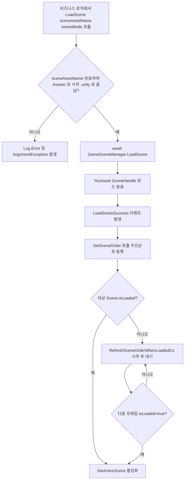

# 작동 원리: 비동기 로딩과 활성 씬 정렬

`SceneComponent`는 YooAsset의 `SceneHandle`을 기반으로 **비동기 로딩**을 구현하며, 여러 씬이 추가(Additive) 방식으로 중첩될 때 `m_SceneOrder` 정렬 딕셔너리와 `RefreshSceneOrder()`를 통해 현재 활성 씬을 선택합니다. 이 문서는 `LoadScene` 호출부터 Unity `SetActiveScene`까지의 핵심 흐름을 설명합니다.

## 핵심 필드 요약

| 필드 | 타입 | 역할 |
|------|------|------|
| `m_SceneOrder` | `SortedDictionary<string,int>` | 각 `sceneAssetName`의 활성 우선순위를 기록(값이 클수록 우선) |
| `m_GameFrameworkScene` | `UnityEngine.SceneManagement.Scene` | 프레임워크 내장 씬, 모든 비즈니스 씬이 로드되지 않았을 때 이 씬으로 폴백 |
| `m_RefreshSceneOrderCo` | `Coroutine` | YooAsset는 완료되었으나 Unity `isLoaded`가 아직 true가 아닐 때 사용하는 재시도 코루틴 |
| `DefaultPriority` | `const int = 0` | 기본 우선순위 상수 |
| `m_EnableLoadSceneUpdateEvent` | `bool` | `LoadSceneUpdate` 진행률 이벤트 활성화 여부(기본값 `true`) |

필드 정의는 [SceneComponent.cs](https://github.com/GameFrameX/com.gameframex.unity.scene/blob/main/Runtime/Scene/SceneComponent.cs#L51-L65)를 참조하세요.

## 비동기 로딩 흐름

`SceneComponent.LoadScene`은 `Task<YooAsset.SceneHandle>`을 반환하며, 내부적으로 요청을 `GameSceneManager`에 전달합니다. `GameSceneManager`는 세 개의 딕셔너리를 유지하여 로딩 상태를 구분합니다:

| 딕셔너리 | 의미 |
|------|------|
| `m_LoadedSceneAssetNames` | 로드가 완료된 씬 리소스 |
| `m_LoadingSceneAssetNames` | 로드 중인 씬(`SceneHandleData` 보유) |
| `m_UnloadingSceneAssetNames` | 언로드 중인 씬 |

딕셔너리와 초기화 로직은 [GameSceneManager.cs](https://github.com/GameFrameX/com.gameframex.unity.scene/blob/main/Runtime/Scene/Scene/GameSceneManager.cs#L59-L84)를 참조하세요.

`SceneComponent.Awake()`는 `GameSceneManager`의 다섯 이벤트를 구독합니다: `LoadSceneSuccess`, `LoadSceneFailure`, `LoadSceneUpdate`(기본 활성화), `UnloadSceneSuccess`, `UnloadSceneFailure`. 구독 코드:

```csharp
_gameSceneManager.LoadSceneSuccess += OnLoadGameSceneSuccess;
_gameSceneManager.LoadSceneFailure += OnLoadGameSceneFailure;
if (m_EnableLoadSceneUpdateEvent)
{
    _gameSceneManager.LoadSceneUpdate += OnLoadGameSceneUpdate;
}
_gameSceneManager.UnloadSceneSuccess += OnUnloadGameSceneSuccess;
_gameSceneManager.UnloadSceneFailure += OnUnloadGameSceneFailure;
```

출처: [SceneComponent.cs](https://github.com/GameFrameX/com.gameframex.unity.scene/blob/main/Runtime/Scene/SceneComponent.cs#L91-L105)

`LoadScene`의 외부 공개 시그니처는 다음과 같습니다:

```csharp
public async Task<YooAsset.SceneHandle> LoadScene(
    string sceneAssetName,
    UnityEngine.SceneManagement.LoadSceneMode sceneMode,
    object userData = null);
```

`sceneAssetName`이 반드시 `Assets/`로 시작하고 `.unity`로 끝나는지 검증한 후, 하위 계층의 `GameSceneManager.LoadScene`을 `await`합니다.

출처: [SceneComponent.cs](https://github.com/GameFrameX/com.gameframex.unity.scene/blob/main/Runtime/Scene/SceneComponent.cs#L306-L322)

## 활성 씬 정렬 메커니즘

정렬과 활성화의 핵심 진입점은 `SetSceneOrder`와 `RefreshSceneOrder`입니다.

```csharp
public void SetSceneOrder(string sceneAssetName, int sceneOrder)
{
    // ... sceneAssetName 유효성 검사 ...
    if (SceneIsLoading(sceneAssetName))
    {
        m_SceneOrder[sceneAssetName] = sceneOrder;
        return;
    }
    if (SceneIsLoaded(sceneAssetName))
    {
        m_SceneOrder[sceneAssetName] = sceneOrder;
        RefreshSceneOrder();
        return;
    }
    Log.Error("Scene '{0}' is not loaded or loading.", sceneAssetName);
}
```

출처: [SceneComponent.cs](https://github.com/GameFrameX/com.gameframex.unity.scene/blob/main/Runtime/Scene/SceneComponent.cs#L352-L381)

`RefreshSceneOrder`의 작동 방식:

1. `m_SceneOrder`를 순회하며 아직 로드 중인 씬(`SceneIsLoading`)은 건너뛰고, `sceneOrder.Value`가 가장 큰 씬을 후보 활성 씬으로 선택합니다.
2. 모든 씬이 로드 중이거나 딕셔너리가 비어 있으면 `SetActiveScene(m_GameFrameworkScene)`으로 프레임워크 씬에 폴백합니다.
3. `SceneManager.GetSceneByName(GetSceneName(maxSceneName))`으로 Unity 씬 객체를 가져오는데, `scene.isLoaded == false`라면 — YooAsset의 `await` 완료 시점은 일반적으로 Unity 레벨의 `isLoaded=true`보다 **이르기** 때문에, 곧바로 `SetActiveScene`을 호출하면 `ArgumentException`이 발생합니다.

이때 `RefreshSceneOrder`는 코루틴 `RefreshSceneOrderWhenLoadedCo`를 시작하여 다음 프레임에 `isLoaded`가 `true`가 된 후 활성화하며, 그 사이에 기존의 동일한 이름의 코루틴을 `StopCoroutine`으로 중지하여 새 코루틴과 활성화 순서를 두고 경합하는 것을 방지합니다.

출처: [SceneComponent.cs](https://github.com/GameFrameX/com.gameframex.unity.scene/blob/main/Runtime/Scene/SceneComponent.cs#L392-L437)



## 이벤트 페이로드(EventArgs)

비동기 로딩 과정은 `GameFrameX.Runtime`의 오브젝트 풀을 통해 이벤트를 발송하며, 페이로드는 모두 `GameEventArgs`의 하위 클래스입니다. 이들은 [GameFrameXSceneCroppingHelper.cs](https://github.com/GameFrameX/com.gameframex.unity.scene/blob/main/Runtime/GameFrameXSceneCroppingHelper.cs#L10-L21)에서 AOT 크로핑 헬퍼에 의해 명시적으로 참조되어 잘못 크로핑되는 것을 방지합니다.

| 이벤트 | 페이로드 클래스 | 용도 |
|------|--------|------|
| `LoadSceneSuccess` | `LoadSceneSuccessEventArgs` | 로드 성공 |
| `LoadSceneFailure` | `LoadSceneFailureEventArgs` | 로드 실패(`Status`, `ErrorMessage` 포함) |
| `LoadSceneUpdate` | `LoadSceneUpdateEventArgs` | 진행률 업데이트 |
| `UnloadSceneSuccess` | `UnloadSceneSuccessEventArgs` | 언로드 성공 |
| `UnloadSceneFailure` | `UnloadSceneFailureEventArgs` | 언로드 실패 |
| `ActiveSceneChanged` | `ActiveSceneChangedEventArgs` | Unity 활성 씬 변경 |

## 관련 링크

- [SceneComponent.cs](https://github.com/GameFrameX/com.gameframex.unity.scene/blob/main/Runtime/Scene/SceneComponent.cs#L294-L343) — `LoadScene`/`UnloadScene`/`SetSceneOrder` 진입점
- [GameSceneManager.cs](https://github.com/GameFrameX/com.gameframex.unity.scene/blob/main/Runtime/Scene/Scene/GameSceneManager.cs#L145-L164) — 비동기 로딩 구현, Update, Shutdown 시 로드된 모든 씬 회수
- [IGameSceneManager.cs](https://github.com/GameFrameX/com.gameframex.unity.scene/blob/main/Runtime/Scene/Scene/IGameSceneManager.cs) — 매니저 인터페이스 계약
- [GameFrameXSceneCroppingHelper.cs](https://github.com/GameFrameX/com.gameframex.unity.scene/blob/main/Runtime/GameFrameXSceneCroppingHelper.cs) — AOT 크로핑 보조 클래스
- 관련 EventArgs: `LoadSceneSuccessEventArgs`, `LoadSceneFailureEventArgs`, `LoadSceneUpdateEventArgs`, `UnloadSceneSuccessEventArgs`, `UnloadSceneFailureEventArgs`, `ActiveSceneChangedEventArgs`(모두 `Runtime/EventArgs/`에 위치)