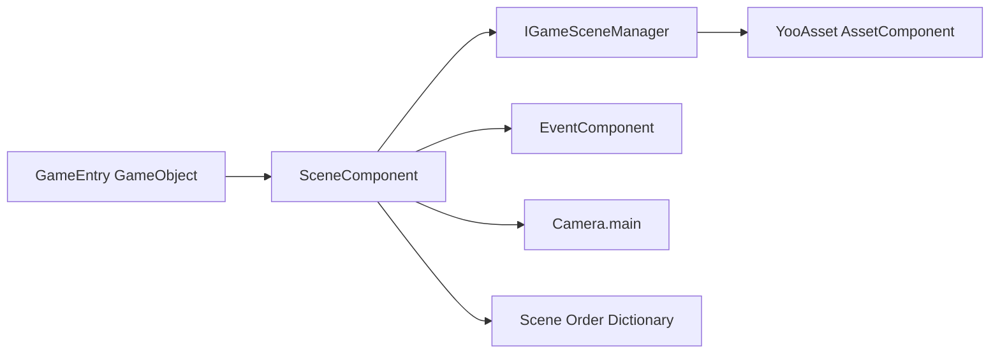

# 소개 및 기능 특징

GameFrameX Scene은 [YooAsset](https://github.com/tuyoogame/YooAsset) 기반의 Unity 씬 관리 패키지로, 비동기 씬 로드/언로드, 이벤트 기반 상태 알림, 진행률 추적 및 활성 씬 우선순위 정렬 기능을 제공하며, Game Frame X 체계에서 씬 하위 시스템의 통합 진입점 역할을 합니다.

## 빠른 시작

### 의존성

| 패키지 | 최소 버전 |
|---|---------|
| `com.gameframex.unity.asset` | >= 2.5.0 |
| `com.gameframex.unity.event` | >= 1.1.0 |

### 설치(UPM Scoped Registry)

Unity 프로젝트의 `Packages/manifest.json`을 편집하여 `scopedRegistries`에 GameFrameX 저장소를 추가하고, `dependencies`에 Scene 패키지를 추가합니다:

```json
{
  "scopedRegistries": [
    {
      "name": "GameFrameX",
      "url": "https://gameframex.upm.alianblank.uk",
      "scopes": ["com.gameframex"]
    }
  ],
  "dependencies": {
    "com.gameframex.unity.scene": "2.2.1"
  }
}
```

출처: [README.zh-CN.md](https://github.com/GameFrameX/com.gameframex.unity.scene/blob/main/README.zh-CN.md#L57-L73)

기타 설치 방법(Git URL / `Packages` 디렉터리에 수동 배치)과 자세한 단계는 《설치》를 참고하십시오.

### SceneComponent 추가

GameEntry GameObject에 `Add Component > GameFrameX > Scene`을 통해 `SceneComponent`를 추가하면, 프레임워크가 시작 시 자동으로 초기화하므로 별도의 호출이 필요 없습니다.

```csharp
[DisallowMultipleComponent]
[AddComponentMenu("GameFrameX/Scene")]
[GameFrameXAutoComponent(-4000)]
public sealed class SceneComponent : GameFrameworkComponent
```

출처: [SceneComponent.cs](https://github.com/GameFrameX/com.gameframex.unity.scene/blob/main/Runtime/Scene/SceneComponent.cs#L46-L49)

### 첫 번째 씬 실행하기

1. `SceneComponent.LoadScene`을 통해 씬을 비동기로 로드하여 `SceneHandle`을 얻습니다.
2. `SceneComponent.SetSceneOrder`로 우선순위를 설정하여 활성 씬으로 만듭니다.
3. `EventComponent`를 통해 `LoadSceneSuccessEventArgs` 콜백 알림을 구독합니다.

```csharp
var handle = await SceneComponent.LoadScene("Assets/Scenes/GameScene.unity");
SceneComponent.SetSceneOrder("Assets/Scenes/GameScene.unity", 10);

EventComponent.Subscribe<LoadSceneSuccessEventArgs>(e =>
{
    Debug.Log($"场景 {e.SceneAssetName} 加载完成,耗时 {e.Duration:F2}s");
});
```

출처: [README.zh-CN.md](https://github.com/GameFrameX/com.gameframex.unity.scene/blob/main/README.zh-CN.md#L107-L154)

## 기능 특징

| 기능 | 설명 |
|------|------|
| 비동기 씬 로드/언로드 | `Task` 기반의 `LoadScene` 및 `UnloadScene` API |
| `LoadSceneMode` 지원 | `Single`(전체 교체)와 `Additive`(추가) 두 가지 모드 |
| 진행률 추적 | `LoadSceneUpdateEventArgs` 실시간 진행률, 로딩 화면 구동 가능 |
| 활성 씬 정렬 | `SetSceneOrder`로 우선순위 설정, 값이 높을수록 활성 씬이 될 우선순위가 높음 |
| 자동 카메라 갱신 | 활성 씬 전환 시 `Camera.main` 참조 자동 갱신 |
| 이벤트 알림 | `EventComponent`를 통해 로드/언로드의 성공, 실패, 업데이트 이벤트 구독 |
| 상태 조회 | `SceneIsLoaded` / `SceneIsLoading` / `SceneIsUnloading` 언제든지 조회 가능 |
| 에디터 확장 | `SceneComponent` 커스텀 Inspector 패널 |

출처: [README.zh-CN.md](https://github.com/GameFrameX/com.gameframex.unity.scene/blob/main/README.zh-CN.md#L28-L37)

## 작동 원리 개요

Scene 하위 시스템은 `SceneComponent`를 통합 진입점으로 사용하며, 내부적으로 씬 비동기 로드를 `IGameSceneManager`와 `GameSceneManager`에 위임하고, 생명주기 이벤트를 `EventComponent` 버스로 전달합니다. 호출 측은 이벤트를 구독하거나 `SceneIsLoaded` 등의 조회 인터페이스를 호출하여 상태를 파악할 수 있습니다.



출처: [SceneComponent.cs](https://github.com/GameFrameX/com.gameframex.unity.scene/blob/main/Runtime/Scene/SceneComponent.cs#L49-L61)

## 다음 단계

- 씬 로드/언로드의 전체 단계와 예제는 《씬 로드 및 언로드》를 참고하십시오
- 이벤트 구독의 전체 목록은 《이벤트 참조》를 참고하십시오
- API 빠른 참조와 버전 변경 사항은 《API 참조》와 《업데이트 로그》를 참고하십시오