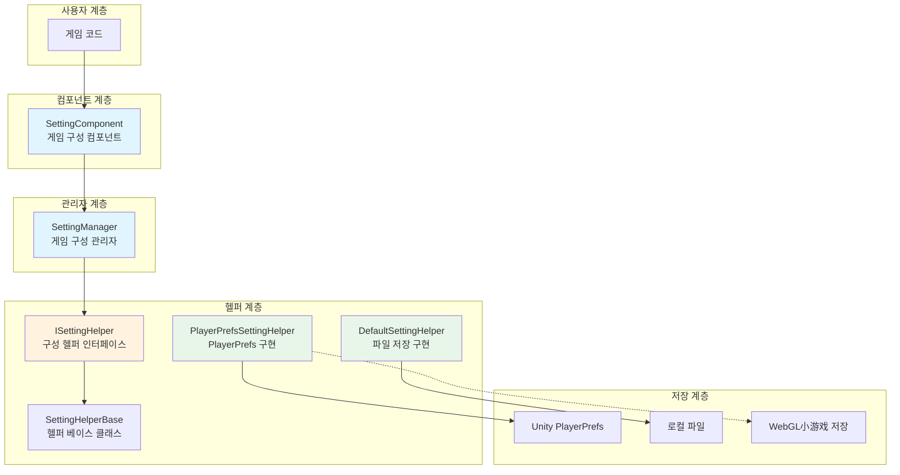
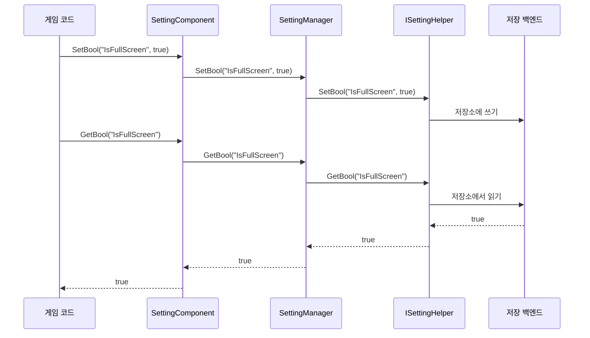

# 개요

GameFrameX Setting 구성 컴포넌트는 GameFrameX 게임 프레임워크의 핵심 컴포넌트 중 하나로, 게임의 구성 정보를 관리하고 다양한 유형의 구성 데이터 저장 및 가져오기 기능을 제공합니다. 이 컴포넌트는 계층화된 아키텍처 설계를 채택하여多种 저장 백엔드를 지원하며, 게임 설정 관리를 간단하고 효율적으로 만들어 줍니다.

## 개요

Setting 구성 컴포넌트는 게임 개발에서 흔히 발생하는 구성 관리 요구를 해결하기 위해 만들어졌습니다. 게임 개발 과정에서 개발자는 화면 품질, 볼륨 크기, 키 바인딩, 게임 진행 상황 등 다양한 유형의 설정 데이터를 저장해야 합니다. 전통적인 방법은 자체적으로一套 구성 시스템을 구현하는 것으로, 코드의 재사용성이 낮을 뿐 아니라 유지보수도 어렵습니다.

GameFrameX Setting 컴포넌트는 통합된 구성 관리 솔루션을 제공합니다:

- **타입 안전성**: 부울 값, 정수,浮点数, 문자열 및 임의의 직렬화 가능 객체 지원
- **다중 저장 백엔드**: 내장 PlayerPrefs와 파일 저장 두 가지 구현 지원, 사용자 정의 확장 지원
- **크로스 플랫폼 지원**: Unity 각 플랫폼을 전면 지원하며, WebGL小游戏(抖音, 웨이친, 케속) 포함
- **편집기 통합**: Unity 편집기 Inspector 패널을 제공하여 컴포넌트 시각화 구성 지원

## 아키텍처 설계



### 핵심 컴포넌트 설명

| 컴포넌트 | 설명 | 설계 의도 |
|------|------|----------|
| SettingComponent | Unity MonoBehaviour 컴포넌트 | 프레임워크와 게임 코드 간의 브리짓 역할, 편집기 통합 및 생명 주기 관리 제공 |
| SettingManager | 핵심 비즈니스 로직 모듈 | 설정 데이터 관리, 입력 검증, 헬퍼로 요청 전달 담당 |
| ISettingHelper | 저장 추상 인터페이스 | 저장 구현 분리, 새로운 저장 백엔드 확장 용이 |
| SettingHelperBase | 헬퍼 베이스 클래스 | 추상 메서드 정의 제공, 헬퍼 구현 간소화 |

### 데이터 흐름



## 기능 특성

### 지원 데이터 유형

Setting 컴포넌트는 게임 개발의 다양한 구성 요구를 충족하는 다음과 같은 데이터 유형을 지원합니다:

- **부울 값 (bool)**: 스위치類 설정용으로, 예: 전체 화면 여부, 사운드 활성화 여부 등
- **정수 (int)**: 수치類 설정용으로, 예: 해상도, 화질 등급 등
- **浮点数 (float)**: 정밀 수치 설정용으로, 예: 볼륨 크기, 감도 등
- **문자열 (string)**: 텍스트類 설정용으로, 예: 플레이어 이름, 서버 주소 등
- **객체 (Object)**: 복잡한 구성용으로, JSON 직렬화 저장 사용, 예: 게임 진행 상황, 캐릭터 데이터 등

### 저장 백엔드

#### PlayerPrefsSettingHelper（기본값）

Unity 내장 PlayerPrefs 기반 구현으로, 가장 간단하고 직접적인 저장 방식입니다:

- **장점**: 추가 구성 불필요, 꽂으면 바로 사용
- **단점**: 모든 키 이름을 가져오는 것不支持, 일괄 삭제 지원 안 함
- **적용 시나리오**: 간단한 구성 저장

```csharp
// 기본적으로 PlayerPrefsSettingHelper 사용
settingComponent.SetBool("IsFullScreen", true);
settingComponent.SetFloat("Volume", 0.8f);
settingComponent.Save();
```

#### DefaultSettingHelper

로컬 파일 저장 기반 구현으로, 더 완전한 기능을 제공합니다:

- **장점**: 모든 설정 항목 이름 가져오기 지원, 완전한 데이터 관리 지원
- **단점**: 수동으로 Save() 호출 필요
- **적용 시나리오**: 완전한 설정 관리 기능이 필요한 게임

```csharp
// 파일 저장 사용
settingComponent.SetInt("HighScore", 10000);
settingComponent.Save();
```

### 크로스 플랫폼 지원

PlayerPrefsSettingHelper는 다양한 플랫폼에 대해 특수 처리를 합니다:

| 플랫폼 | 저장 구현 | 특수 설명 |
|------|----------|----------|
| Unity Editor | Unity PlayerPrefs | 완전한 읽기 쓰기 지원 |
| Standalone | Unity PlayerPrefs | 완전한 읽기 쓰기 지원 |
| WebGL | 각 플랫폼 Storage API |抖音, 웨이친, 케속小游戏各自맞춤 |
| Mobile | Unity PlayerPrefs | 완전한 읽기 쓰기 지원 |
| Console | Unity PlayerPrefs | 완전한 읽기 쓰기 지원 |

### 객체 직렬화

컴포넌트는 JSON 직렬화를 사용하여 복잡한 객체를 저장하며,泛型와 비泛型 두 가지 인터페이스를 지원합니다:

```csharp
// 설정 클래스 정의
[Serializable]
public class GameSettings
{
    public bool IsFullScreen = true;
    public int ResolutionWidth = 1920;
    public int ResolutionHeight = 1080;
    public float Volume = 0.8f;
}

// 객체 저장
GameSettings settings = new GameSettings { IsFullScreen = true, Volume = 0.5f };
settingComponent.SetObject("GameSettings", settings);

// 객체 읽기
GameSettings loadedSettings = settingComponent.GetObject<GameSettings>("GameSettings");
```

## 사용 방식

### 기본 구성

Unity 장면에서 SettingComponent 생성:

1. Hierarchy 패널에서 빈 오브젝트 생성
2. `SettingComponent` 컴포넌트 추가(메뉴: GameFrameX → Setting)
3. 시스템이 자동으로 필요한 의존 컴포넌트 추가

### 구성 헬퍼 선택

Inspector 패널에서 다양한 구성 헬퍼를 선택할 수 있습니다:

- **PlayerPrefsSettingHelper**: 기본 사용,简便易用
- **DefaultSettingHelper**: 파일 저장, 기능 더 완전

`m_CustomSettingHelper` 필드에 사용자 정의 헬퍼를 드래그하여 넣을 수도 있습니다.

### 데이터 조작 프로세스

```csharp
public class GameExample : MonoBehaviour
{
    private SettingComponent settingComponent;

    private void Start()
    {
        // 설정 컴포넌트 가져오기(프레임워크를 통해 가져오거나 직접 가져오기)
        settingComponent = GameEntry.GetComponent<SettingComponent>();
    }

    private void SaveSettings()
    {
        // 설정 저장
        settingComponent.SetBool("IsFullScreen", true);
        settingComponent.SetFloat("Volume", 0.8f);
        settingComponent.SetString("PlayerName", "PlayerOne");
        
        // 중요: Save() 호출하여永続화 저장
        settingComponent.Save();
    }

    private void LoadSettings()
    {
        // 설정 읽기, 기본값 지원
        bool isFullScreen = settingComponent.GetBool("IsFullScreen", true);
        float volume = settingComponent.GetFloat("Volume", 0.5f);
        string playerName = settingComponent.GetString("PlayerName", "Default");
    }
}
```

## 관련 링크

- [설치 가이드](./02.installation)
- [빠른 시작](./03.getting-started)
- [기능 특성](./04.features)
- [설정 헬퍼 구현](./05.helper-implementation)
- [플랫폼 구성](./06.platforms)
- [API 참고](./07.api-reference)
- [자주 묻는 질문](./08.troubleshooting)
- [공식 문서](https://gameframex.doc.alianblank.com/)
- [GitHub 저장소](https://github.com/GameFrameX/com.gameframex.unity.setting)