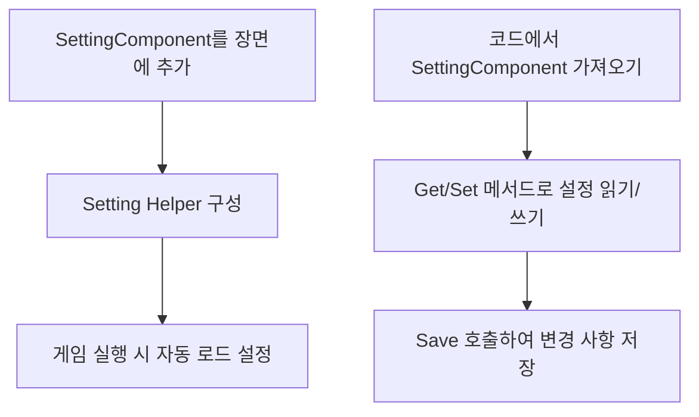
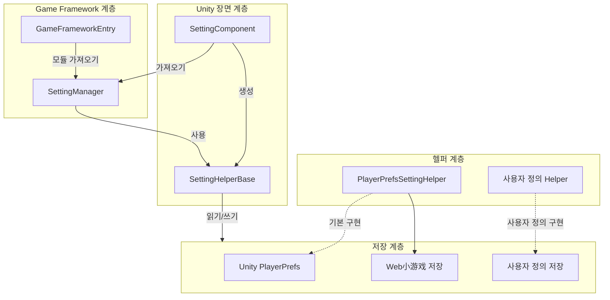

# 빠른 시작

이 가이드는 GameFrameX Setting 구성 컴포넌트를 빠르게 시작하고 Unity 프로젝트에서 설정 기능을 사용하는 방법을 이해하는 데 도움을 줍니다.

## 개요

SettingComponent는 GameFrameX 프레임워크의 핵심 컴포넌트로, 게임의 구성 정보 관리를 전문으로 합니다. 저장 및 로드를 위한简洁한 API를 제공하며, 부울 값, 정수,浮点数, 문자열 및 복잡한 사용자 정의 객체를 포함한 다양한 유형의 게임 설정을 지원합니다.

이 컴포넌트는 모듈식 설계를 채택하며, `ISettingHelper` 인터페이스를 통해 다양한 저장 구현을 지원합니다. 기본적으로 Unity의 PlayerPrefs를 사용하며, 사용자 정의 저장 방식 확장을 지원합니다.

## 빠른 시작 프로세스



## Unity 장면에 컴포넌트 추가

### 단계 1: Setting 컴포넌트 생성

1. Unity 편집기에서 게임 장면 열기
2. Hierarchy 패널에서 빈 GameObject 생성 또는 기존 오브젝트 선택
3. Inspector 패널에서 **Add Component** 버튼 클릭
4. 검색 상자에 "Setting" 입력하고 **GameFrameX/Setting** 컴포넌트 찾기
5. 클릭하여 추가

```csharp
// SettingComponent는 자동으로 다음 의존 컴포넌트를 추가합니다:
// - GameFrameXSettingCroppingHelper (필수)
```
> Source: [SettingComponent.cs](https://github.com/GameFrameX/com.gameframex.unity.setting/blob/main/Runtime/Setting/SettingComponent.cs#L46)

### 단계 2: Setting Helper 구성

SettingComponent는 기본 저장 헬퍼로 `PlayerPrefsSettingHelper`를 자동으로 생성합니다. Inspector 패널에서 확인하고 구성할 수 있습니다:

| 속성 | 유형 | 기본값 | 설명 |
|------|------|--------|------|
| Setting Helper Type Name | string | "GameFrameX.Setting.Runtime.PlayerPrefsSettingHelper" | 설정 헬퍼의 유형 이름 |
| Custom Setting Helper | SettingHelperBase | null | 사용자 정의 설정 헬퍼(선택사항) |

```csharp
// SettingComponent는 Awake에서 설정 헬퍼를 초기화합니다
private void Awake()
{
    // SettingManager 모듈 가져오기
    m_SettingManager = GameFrameworkEntry.GetModule<ISettingManager>();
    
    // 설정 헬퍼 생성
    SettingHelperBase settingHelper = Helper.CreateHelper(m_SettingHelperTypeName, m_CustomSettingHelper);
    
    // 설정 헬퍼 설정
    m_SettingManager.SetSettingHelper(settingHelper);
}
```
> Source: [SettingComponent.cs](https://github.com/GameFrameX/com.gameframex.unity.setting/blob/main/Runtime/Setting/SettingComponent.cs#L73-L98)

## 기본 사용 예시

### 코드에서 SettingComponent 가져오기

Unity 게임에서 여러 방식으로 SettingComponent를 가져올 수 있습니다:

```csharp
// 방식 1: 장면의 GameObject를 통해 가져오기
SettingComponent settingComponent = FindObjectOfType<SettingComponent>();

// 방식 2: GameFrameX의 MonoBehaviour 방식을 사용하는 경우
// GameFrameX의 MonoBehaviour를 상속하는 클래스라고 가정
private SettingComponent settingComponent;

private void Start()
{
    settingComponent = GetComponent<SettingComponent>();
}
```
> Source: [README.md](https://github.com/GameFrameX/com.gameframex.unity.setting/blob/main/README.md#L86-L100)

### 설정 저장 및 로드

SettingComponent는 게임 시작 시 `Start()` 메서드를 호출하여 저장된 설정을 자동으로 로드합니다:

```csharp
// 완전한 설정 관리 예시
public class GameSettingsManager : MonoBehaviour
{
    private SettingComponent settingComponent;

    private void Start()
    {
        // SettingComponent 가져오기
        settingComponent = GetComponent<SettingComponent>();
        
        // 일부 게임 구성 설정
        settingComponent.SetBool("IsFullScreen", true);
        settingComponent.SetInt("ResolutionWidth", 1920);
        settingComponent.SetFloat("Volume", 0.8f);
        settingComponent.SetString("PlayerName", "PlayerOne");
        
        // 구성 저장
        settingComponent.Save();
    }

    private void OnApplicationPause(bool pauseStatus)
    {
        // 애플리케이션 일시 중지 시 설정 저장(모바일 플랫폼에 적합)
        if (pauseStatus)
        {
            settingComponent.Save();
        }
    }

    private void OnApplicationQuit()
    {
        // 애플리케이션 종료 시 설정 저장
        settingComponent.Save();
    }
}
```
> Source: [README.md](https://github.com/GameFrameX/com.gameframex.unity.setting/blob/main/README.md#L86-L100)

### 설정 값 읽기

```csharp
// 설정 존재 여부 확인
bool hasVolumeSetting = settingComponent.HasSetting("Volume");

// 설정 값 가져오기, 기본값 사용하여 설정이 존재하지 않을 때 오류 방지
float volume = settingComponent.GetFloat("Volume", 0.5f);  // 존재하지 않으면 0.5f 반환
bool isFullScreen = settingComponent.GetBool("IsFullScreen", false);  // 기본값 전체 화면关闭
int resolutionWidth = settingComponent.GetInt("ResolutionWidth", 1920);  // 기본값 1920
string playerName = settingComponent.GetString("PlayerName", "Guest");  // 기본값 Guest
```
> Source: [README.md](https://github.com/GameFrameX/com.gameframex.unity.setting/blob/main/README.md#L104-L110)

### 설정 저장 및 삭제

```csharp
// 모든 수정 사항 저장
settingComponent.Save();

// 단일 설정 삭제
settingComponent.RemoveSetting("PlayerName");

// 모든 설정 삭제
settingComponent.RemoveAllSettings();
```
> Source: [README.md](https://github.com/GameFrameX/com.gameframex.unity.setting/blob/main/README.md#L114-L120)

### 복잡한 객체 저장

SettingComponent는 사용자 정의 객체 저장을 지원하며, 객체는 자동으로 JSON으로 직렬화됩니다:

```csharp
// 설정 클래스 정의
[Serializable]
public class GamePreferences
{
    public bool IsMusicEnabled = true;
    public bool IsSoundEnabled = true;
    public float MusicVolume = 0.7f;
    public float SoundVolume = 0.8f;
    public string Language = "en";
}

// 복잡한 객체 저장
var preferences = new GamePreferences
{
    IsMusicEnabled = true,
    MusicVolume = 0.8f,
    Language = "zh-CN"
};
settingComponent.SetObject("GamePreferences", preferences);

// 복잡한 객체 읽기
var loadedPreferences = settingComponent.GetObject<GamePreferences>("GamePreferences", new GamePreferences());
```
> Source: [PlayerPrefsSettingHelper.cs](https://github.com/GameFrameX/com.gameframex.unity.setting/blob/main/Runtime/Setting/PlayerPrefsSettingHelper.cs#L620-L623)

## 컴포넌트 아키텍처



## 런타임에 설정 가져오기

SettingComponent는 다양한 데이터 유형의 메서드를 제공합니다:

| 데이터 유형 | 읽기 메서드 | 쓰기 메서드 |
|---------|---------|---------|
| 부울 값 | `GetBool(name)` / `GetBool(name, default)` | `SetBool(name, value)` |
| 정수 | `GetInt(name)` / `GetInt(name, default)` | `SetInt(name, value)` |
| 浮点数 | `GetFloat(name)` / `GetFloat(name, default)` | `SetFloat(name, value)` |
| 문자열 | `GetString(name)` / `GetString(name, default)` | `SetString(name, value)` |
| 객체 | `GetObject<T>(name)` / `GetObject<T>(name, default)` | `SetObject<T>(name, obj)` |

```csharp
// 완전한 예시: 게임 설정 관리자
public class SettingsManager : MonoBehaviour
{
    private SettingComponent settingComponent;
    
    // 설정 키 이름常量
    private const string KEY_MUSIC_ON = "setting.music.on";
    private const string KEY_MUSIC_VOLUME = "setting.music.volume";
    private const string KEY_GRAPHICS_QUALITY = "setting.graphics.quality";
    private const string KEY_PLAYER_DATA = "player.data";

    private void Awake()
    {
        settingComponent = GetComponent<SettingComponent>();
    }

    // 음악 설정
    public bool MusicEnabled
    {
        get => settingComponent.GetBool(KEY_MUSIC_ON, true);
        set => settingComponent.SetBool(KEY_MUSIC_ON, value);
    }

    public float MusicVolume
    {
        get => settingComponent.GetFloat(KEY_MUSIC_VOLUME, 0.5f);
        set => settingComponent.SetFloat(KEY_MUSIC_VOLUME, Mathf.Clamp01(value));
    }

    // 그래픽 설정
    public int GraphicsQuality
    {
        get => settingComponent.GetInt(KEY_GRAPHICS_QUALITY, 1);
        set => settingComponent.SetInt(KEY_GRAPHICS_QUALITY, value);
    }

    // 플레이어 데이터 저장
    public void SavePlayerData(PlayerData data)
    {
        settingComponent.SetObject(KEY_PLAYER_DATA, data);
        settingComponent.Save();
    }

    // 플레이어 데이터 로드
    public PlayerData LoadPlayerData()
    {
        return settingComponent.GetObject<PlayerData>(KEY_PLAYER_DATA, new PlayerData());
    }
}
```

## 흔한 사용 시나리오

### 시나리오 1: 게임 설정界面

```csharp
public class SettingsUI : MonoBehaviour
{
    [SerializeField] private SettingComponent settingComponent;
    [SerializeField] private Slider volumeSlider;
    [SerializeField] private Toggle fullscreenToggle;

    private void Start()
    {
        // 기존 설정을 UI에 로드
        volumeSlider.value = settingComponent.GetFloat("Volume", 0.5f);
        fullscreenToggle.isOn = settingComponent.GetBool("Fullscreen", true);
    }

    public void OnVolumeChanged(float value)
    {
        settingComponent.SetFloat("Volume", value);
        settingComponent.Save();
    }

    public void OnFullscreenChanged(bool value)
    {
        settingComponent.SetBool("Fullscreen", value);
        settingComponent.Save();
    }
}
```

### 시나리오 2: 플레이어 데이터 영속성

```csharp
[Serializable]
public class PlayerData
{
    public string playerName;
    public int level;
    public int experience;
    public List<string> achievements;
}

public class PlayerDataManager : MonoBehaviour
{
    private SettingComponent settingComponent;
    private const string KEY = "player.data";

    public void SavePlayer(PlayerData data)
    {
        settingComponent.SetObject(KEY, data);
        bool success = settingComponent.Save();
        Debug.Log($"플레이어 데이터 저장{(success ? "성공" : "실패")}");
    }

    public PlayerData LoadPlayer()
    {
        return settingComponent.GetObject<PlayerData>(KEY, new PlayerData());
    }
}
```

## 주의 사항

1. **자동 로드**: SettingComponent는 `Start()` 메서드에서 자동으로 `Load()`를 호출하여 설정을 로드하므로, 수동으로 호출할 필요가 없습니다.
2. **수동 저장**: 설정 수정 후에는 `Save()` 메서드를 호출해야 저장소에永続화할 수 있습니다.
3. **플랫폼 차이**: 다양한 플랫폼(예: WebGL小游戏)에서는 저장 동작이 다소 다를 수 있습니다. 자세한 내용은 플랫폼 구성 문서를 참고하세요.
4. **객체 직렬화**: 복잡한 객체는 JSON 직렬화를 사용하므로, 클래스가 `[Serializable]`로 마크되어 있는지 확인하세요.

## 관련 링크

- [기능 특성](./04.features) - Setting 아키텍처 설계 자세히 알아보기
- [설정 헬퍼](./05.helper-implementation) - 사용자 정의 저장 구현
- [플랫폼 구성](./06.platforms) - 다양한 플랫폼의 구체적인 구성
- [API 참고](./07.api-reference) - 완전한 API 메서드 문서