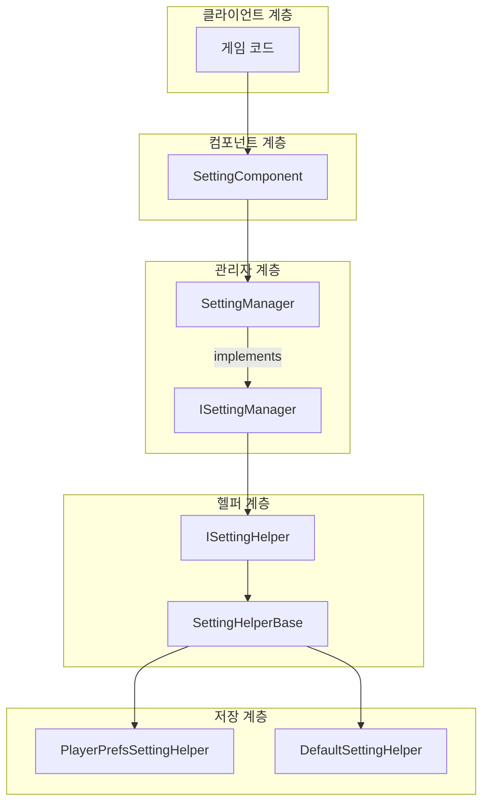
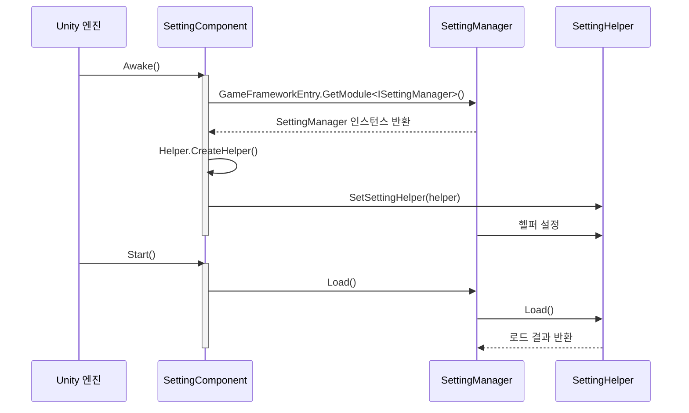

# 핵심 개념

GameFrameX Setting 구성 컴포넌트는 게임 프레임워크의 핵심 모듈 중 하나로, 다양한 저장 백엔드를 지원하여 개발자가 게임 구성 데이터를 효율적으로 관리할 수 있도록 통합된 구성 관리 추상 계층을 제공합니다.

## 개요

Setting 컴포넌트는 계층화된 아키텍처 설계를 채택하여 비즈니스 로직과 저장 구현을 분리합니다. 핵심 설계 철학은 다음과 같습니다:

1. **통일된 구성 인터페이스**: 타입 안전성을 갖춘 구성 읽기/쓰기 메서드를 제공하며, 부울, 정수, 浮点数, 문자열 및 복잡한 객체 지원
2. **플러그인식 저장 백엔드**: 전략 패턴을 통해 다양한 저장 구현 지원
3. **Unity 지향 컴포넌트화**: MonoBehaviour 컴포넌트로, 게임 오브젝트에 직접 탑재 가능

## 아키텍처 설계



### 각 계층 책임

| 계층 | 컴포넌트 | 책임 |
|------|------|------|
| 컴포넌트 계층 | SettingComponent | Unity 컴포넌트 진입점, Unity 지향 API 제공 |
| 관리자 계층 | SettingManager | 비즈니스 로직 처리, 매개변수 검증, 예외 관리 |
| 헬퍼 계층 | SettingHelperBase | 저장 인터페이스 추상화, 타입 변환 구현 |
| 저장 계층 | PlayerPrefsSettingHelper / DefaultSettingHelper | 구체적인 저장 구현 |

## 핵심 컴포넌트

### SettingComponent

SettingComponent는 전체 시스템의 진입점이며, GameFrameworkComponent를 상속하여 Unity 컴포넌트로 사용됩니다.

```csharp
[DisallowMultipleComponent]
[RequireComponent(typeof(GameFrameXSettingCroppingHelper))]
[AddComponentMenu("GameFrameX/Setting")]
public sealed class SettingComponent : GameFrameworkComponent
```
> Source: [SettingComponent.cs](https://github.com/GameFrameX/com.gameframex.unity.setting/blob/main/Runtime/Setting/SettingComponent.cs#L43-L47)

**설계 의도**: Unity 생태계의 진입점으로, SettingComponent는 `Awake()`에서 SettingManager를 초기화하고 `Start()`에서 구성 데이터를 로드합니다.

### ISettingManager

ISettingManager는 구성 관리의 핵심 인터페이스를 정의하여 비즈니스 로직 계층과 데이터 접근 계층의 분리를 담당합니다.

```csharp
public interface ISettingManager
{
    int Count { get; }
    void SetSettingHelper(ISettingHelper settingHelper);
    bool Load();
    bool Save();
    // ... 읽기/쓰기 메서드
}
```
> Source: [ISettingManager.cs](https://github.com/GameFrameX/com.gameframex.unity.setting/blob/main/Runtime/Setting/Setting/ISettingManager.cs#L42-L342)

**설계 의도**: 구성 관리자의 표준 인터페이스를 정의하여上层 컴포넌트가 구체적인 구현 세부 사항을 몰라도 사용할 수 있도록 합니다.

### SettingManager

SettingManager는 ISettingManager의 구현 클래스로, GameFrameworkModule을 상속합니다.

```csharp
public sealed class SettingManager : GameFrameworkModule, ISettingManager
{
    private ISettingHelper m_SettingHelper;
    // ... ISettingManager 인터페이스 구현
}
```
> Source: [SettingManager.cs](https://github.com/GameFrameX/com.gameframex.unity.setting/blob/main/Runtime/Setting/Setting/SettingManager.cs#L43-L736)

**설계 의도**:
- GameFrameworkModule을 상속하여 GameFrameX 프레임워크 생명 주기에 통합
- 모든 메서드에 空值 확인 및 매개변수 검증 포함
- 예외 정보는的统一通过 GameFrameworkException 발생

### ISettingHelper / SettingHelperBase

ISettingHelper는 저장 백엔드의 추상 인터페이스이며, SettingHelperBase는 그 추상 베이스 클래스입니다.

```csharp
public interface ISettingHelper
{
    int Count { get; }
    bool Load();
    bool Save();
    // ... 저장 작업 메서드
}

public abstract class SettingHelperBase : MonoBehaviour, ISettingHelper
{
    // ... 추상 메서드 정의
}
```
> Source: [ISettingHelper.cs](https://github.com/GameFrameX/com.gameframex.unity.setting/blob/main/Runtime/Setting/Setting/ISettingHelper.cs#L42-L332)
> Source: [SettingHelperBase.cs](https://github.com/GameFrameX/com.gameframex.unity.setting/blob/main/Runtime/Setting/SettingHelperBase.cs#L43-L333)

**설계 의도**:
- MonoBehaviour를 상속하여 GameObject에 탑재 가능
- 추상 메서드는 하위 클래스가 구체적인 저장 로직을 구현하도록 요구

### 저장 백엔드 구현

#### PlayerPrefsSettingHelper

Unity PlayerPrefs 기반 구현으로, 대부분의 Unity 프로젝트에 적합합니다.

```csharp
public class PlayerPrefsSettingHelper : SettingHelperBase
{
    // Unity PlayerPrefs API 사용
    public override bool Save()
    {
#if UNITY_WEBGL && (ENABLE_DOUYIN_MINI_GAME || ENABLE_WECHAT_MINI_GAME || ENABLE_KUAISHOU_MINI_GAME)
        return true;  //小游戏平台는 실제 저장 미실행
#else
        UnityEngine.PlayerPrefs.Save();
        return true;
#endif
    }
}
```
> Source: [PlayerPrefsSettingHelper.cs](https://github.com/GameFrameX/com.gameframex.unity.setting/blob/main/Runtime/Setting/PlayerPrefsSettingHelper.cs#L43-L638)

**플랫폼 적응**:
- **편집기/Standalone**: Unity PlayerPrefs 사용
- **抖音/웨이친/케속小游戏**: 각 플랫폼의原生 저장 API 사용

#### DefaultSettingHelper

로컬 파일 기반 구현으로, 구성 항목 목록 가져오기를 지원합니다.

```csharp
public class DefaultSettingHelper : SettingHelperBase
{
    private const string SettingFileName = "GameFrameworkSetting.dat";
    private string m_FilePath = null;
    private DefaultSetting m_Settings = null;
    private DefaultSettingSerializer m_Serializer = null;
}
```
> Source: [DefaultSettingHelper.cs](https://github.com/GameFrameX/com.gameframex.unity.setting/blob/main/Runtime/Setting/DefaultSettingHelper.cs#L46-L52)

**특징**:
- 저장 경로: `Application.persistentDataPath/GameFrameworkSetting.dat`
- `GetAllSettingNames()` 메서드 지원
- 이진 직렬화 사용

### DefaultSetting

메모리의 구성 데이터 구조로, SortedDictionary를 사용하여 저장합니다.

```csharp
public sealed class DefaultSetting
{
    private readonly SortedDictionary<string, string> m_Settings = new SortedDictionary<string, string>(StringComparer.Ordinal);
}
```
> Source: [DefaultSetting.cs](https://github.com/GameFrameX/com.gameframex.unity.setting/blob/main/Runtime/Setting/DefaultSetting.cs#L47-L49)

## 데이터 유형 지원

Setting 컴포넌트는 다양한 데이터 유형의 구성 저장을 지원합니다:

| 유형 | 읽기 메서드 | 쓰기 메서드 | 설명 |
|------|----------|----------|------|
| 부울 값 | GetBool / GetBool(name, default) | SetBool | 내부적으로 0/1로 저장 |
| 정수 | GetInt / GetInt(name, default) | SetInt | int 범위 지원 |
| 浮点数 | GetFloat / GetFloat(name, default) | SetFloat | InvariantCulture 직렬화 사용 |
| 문자열 | GetString / GetString(name, default) | SetString | 직접 저장 |
| 객체 | `GetObject<T>` / GetObject | `SetObject<T>` | JSON 직렬화 저장 |

## 초기화 프로세스



## 사용 모드

### 기본 모드: SettingComponent 사용

```csharp
// SettingComponent 컴포넌트 가져오기
var settingComponent = UnityEngine.Object.FindObjectOfType<SettingComponent>();

// 설정 저장
settingComponent.SetBool("IsFullScreen", true);
settingComponent.SetInt("ResolutionWidth", 1920);
settingComponent.SetFloat("Volume", 0.8f);
settingComponent.SetString("PlayerName", "PlayerOne");
settingComponent.Save();

// 설정 읽기(기본값 포함)
bool isFullScreen = settingComponent.GetBool("IsFullScreen", false);
int resolution = settingComponent.GetInt("ResolutionWidth", 1280);
float volume = settingComponent.GetFloat("Volume", 0.5f);
string playerName = settingComponent.GetString("PlayerName", "Guest");
```
> Source: [README.md](https://github.com/GameFrameX/com.gameframex.unity.setting/blob/main/README.md#L85-L100)

### 고급 모드: 사용자 정의 저장 백엔드

```csharp
// SettingHelperBase를 상속하여 사용자 정의 저장 구현
public class CustomSettingHelper : SettingHelperBase
{
    public override int Count => /* 카운트 로직 구현 */;
    public override bool Load() { /* 로드 로직 구현 */ }
    public override bool Save() { /* 저장 로직 구현 */ }
    // ... 기타 추상 메서드 구현
}
```

Unity 편집기에서 설정:
1. SettingComponent가 포함된 GameObject 생성
2. Setting Helper Type Name을 사용자 정의 클래스명으로 설정
3. 또는 사용자 정의 Helper 컴포넌트를 직접 탑재

## 플랫폼 지원

| 플랫폼 | PlayerPrefsSettingHelper | DefaultSettingHelper |
|------|--------------------------|----------------------|
| Unity Editor | ✅ | ✅ |
| Windows/Mac/Linux | ✅ | ✅ |
| iOS | ✅ | ✅ |
| Android | ✅ | ✅ |
| WebGL (抖音小游戏) | ✅ (플랫폼 적응) | ✅ |
| WebGL (웨이친小游戏) | ✅ (플랫폼 적응) | ✅ |
| WebGL (케속小游戏) | ✅ (플랫폼 적응) | ✅ |

## 관련 링크

- [설정 헬퍼 구현](./05.helper-implementation) - 사용자 정의 헬퍼 가이드
- [플랫폼 구성](./06.platforms) - 각 플랫폼 특정 구성
- [API 참고](./07.api-reference) - 완전한 API 문서
- [자주 묻는 질문](./08.troubleshooting) - 흔한 문제와 해결책