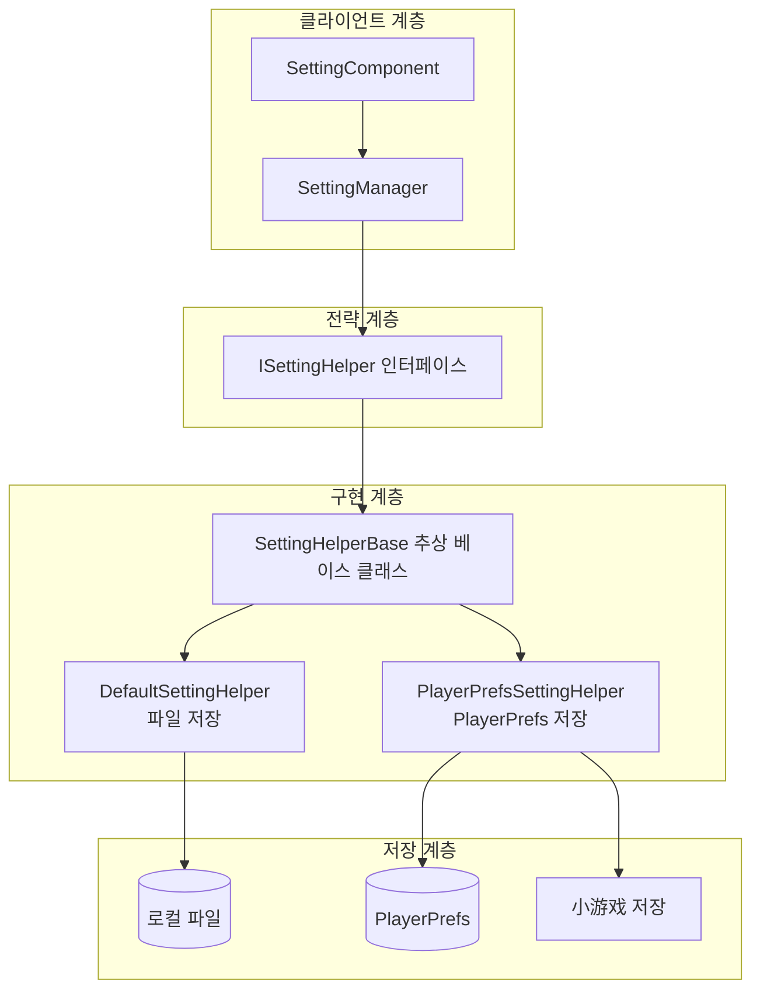

# 설정 헬퍼

설정 헬퍼(Setting Helper)는 GameFrameX 설정 모듈의 핵심 컴포넌트로, 게임 구성의底層 저장 및 읽기 작업을 담당합니다. 전략 패턴 설계를 통해 시스템은 다양한 저장 백엔드를 지원하며, 개발자는 프로젝트 요구 사항에 따라 적절한 저장 구현을 선택할 수 있습니다.

## 개요

설정 헬퍼는 `ISettingHelper` 인터페이스의 다양한 구현으로, 게임 설정 데이터를 서로 다른 저장 매체에永続화합니다. 이 시스템은 전략 패턴을 채택하여 저장 구현을 유연하게切换할 수 있도록 하여 상위 비즈니스 로직을 수정할 필요 없이 저장 방식을 변경할 수 있습니다(예: 파일 저장에서 PlayerPrefs로切换). 동시에 다양한 플랫폼(Unity原生, WebGL,小游戏)에 대한 사용자 정의 저장 구현을 지원합니다.

**설계 의도**: 설정 저장의底層 구현과 비즈니스 계층을 분리하여 저장 방식을切换해도 비즈니스 코드를 수정할 필요가 없도록 하며, 동시에 다양한 플랫폼(Unity原生, WebGL,小游戏)에 대한 사용자 정의 저장 구현을 지원합니다.



### 핵심 컴포넌트 설명

| 컴포넌트 | 책임 | 적용 시나리오 |
|------|------|------|
| `ISettingHelper` | 설정 저장의 통일된 인터페이스 정의 | 통일 API 사양 |
| `SettingHelperBase` | 추상 베이스 클래스 제공, MonoBehaviour 생명 주기 구현 | 새 저장 방식 확장 |
| `DefaultSettingHelper` | 로컬 파일의 이진 직렬화 저장 기반 | 완전한 데이터 제어권 필요 |
| `PlayerPrefsSettingHelper` | Unity PlayerPrefs의 키-값 저장 기반 | 간단한 구성, 빠른 프로토타입 |

## 내장 헬퍼 구현

### DefaultSettingHelper（파일 저장 헬퍼）

`DefaultSettingHelper`는 게임 설정을 로컬 이진 파일로 저장하며, 사용자 정의 직렬화 형식을 사용합니다. 이 구현은 완전한 데이터 제어권을 제공하며, 모든 구성 항목 이름 가져오기, 수량 통계 등 고급 기능을 지원합니다.

**저장 위치**: `<persistentDataPath>/GameFrameworkSetting.dat`

> Source: [DefaultSettingHelper.cs](https://github.com/GameFrameX/com.gameframex.unity.setting/blob/main/Runtime/Setting/DefaultSettingHelper.cs#L46-L529)

```csharp
public class DefaultSettingHelper : SettingHelperBase
{
    private const string SettingFileName = "GameFrameworkSetting.dat";
    private string m_FilePath = null;
    private DefaultSetting m_Settings = null;
    private DefaultSettingSerializer m_Serializer = null;

    private void Awake()
    {
        m_FilePath = Utility.Path.GetRegularPath(Path.Combine(Application.persistentDataPath, SettingFileName));
        m_Settings = new DefaultSetting();
        m_Serializer = new DefaultSettingSerializer();
        m_Serializer.RegisterSerializeCallback(0, SerializeDefaultSettingCallback);
        m_Serializer.RegisterDeserializeCallback(0, DeserializeDefaultSettingCallback);
    }
}
```

**특징**:
- 저장 경로 예측 가능하여 파일 관리 및 백업 용이
- 완전한 설정 열거 및 수량 기능 지원
- 이진 직렬화로 파일体积紧凑
- 사용자 정의 직렬화기 확장 지원

### PlayerPrefsSettingHelper（PlayerPrefs 저장 헬퍼）

`PlayerPrefsSettingHelper`는 Unity의 PlayerPrefs를 기반으로 구현하며, 동시에 WebGL小游戏 플랫폼(抖音, 웨이친, 케속)에 대한 플랫폼 특정 저장 적응을 제공합니다.

> Source: [PlayerPrefsSettingHelper.cs](https://github.com/GameFrameX/com.gameframex.unity.setting/blob/main/Runtime/Setting/PlayerPrefsSettingHelper.cs#L43-L638)

```csharp
public class PlayerPrefsSettingHelper : SettingHelperBase
{
    // 플랫폼 판단 예시: 지정된 구성 항목이 존재하는지 확인
    public override bool HasSetting(string settingName)
    {
#if UNITY_EDITOR
        return UnityEngine.PlayerPrefs.HasKey(settingName);
#endif
#if UNITY_WEBGL && ENABLE_DOUYIN_MINI_GAME
        return TTSDK.TTStorage.HasKeySync(settingName);
#elif UNITY_WEBGL && ENABLE_WECHAT_MINI_GAME
        return WeChatWASM.WXSDKManagerHandler.Instance.StorageHasKeySync(settingName);
#elif UNITY_WEBGL && ENABLE_KUAISHOU_MINI_GAME
        return KSWASM.KSBase.StorageHasKeySync(settingName);
#else
        return UnityEngine.PlayerPrefs.HasKey(settingName);
#endif
    }
}
```

**지원 플랫폼 저장**:

| 플랫폼 | 저장 구현 | 특수 처리 |
|------|----------|----------|
| Unity Editor | PlayerPrefs | 표준 구현 |
| Unity Standalone | PlayerPrefs | 표준 구현 |
| Unity WebGL (原生) | PlayerPrefs | 표준 구현 |
|抖音小游戏 | TTStorage | 동기 API |
| 웨이친小游戏 | WXStorage | 동기 API |
| 케속小游戏 | KSStorage | 동기 API |

**주의 사항**:
- `Count` 속성은 항상 `-1` 반환(PlayerPrefs는 수량 조회不支持)
- `GetAllSettingNames()`不支持, null 반환 및 경고 출력
- WebGL小游戏 플랫폼의 Save() 메서드는 空操作(小游戏는 자동 저장)

## 헬퍼 베이스 클래스

`SettingHelperBase`는 모든 설정 헬퍼의 추상 베이스 클래스로, `MonoBehaviour`를 상속하여 Unity 생명 주기 및 인터페이스 정의를 제공합니다.

> Source: [SettingHelperBase.cs](https://github.com/GameFrameX/com.gameframex.unity.setting/blob/main/Runtime/Setting/SettingHelperBase.cs#L43-L333)

### 추상 메서드 목록

| 메서드 | 설명 |
|------|------|
| `Count` | 구성 항목 수량 가져오기 |
| `Load()` | 구성 로드 |
| `Save()` | 구성 저장 |
| `GetAllSettingNames()` | 모든 구성 항목 이름 가져오기 |
| `HasSetting(name)` | 구성 항목 존재 여부 확인 |
| `RemoveSetting(name)` | 지정 구성 항목 제거 |
| `RemoveAllSettings()` | 모든 구성 비우기 |
| `GetBool/SetBool` | 부울 값 읽기/쓰기 |
| `GetInt/SetInt` | 정수 값 읽기/쓰기 |
| `GetFloat/SetFloat` | 浮点数 값 읽기/쓰기 |
| `GetString/SetString` | 문자열 읽기/쓰기 |
| `GetObject/SetObject` | 객체 직렬화 읽기/쓰기 |

## 사용자 정의 헬퍼 생성

사용자 정의 설정 헬퍼를 생성하려면 `SettingHelperBase`를 상속하고 모든 추상 메서드를 구현해야 합니다.

```csharp
using GameFrameX.Setting.Runtime;
using UnityEngine;

public class CustomSettingHelper : SettingHelperBase
{
    // 사용자 정의 저장 구현
    private Dictionary<string, string> _storage = new Dictionary<string, string>();

    public override int Count => _storage.Count;

    public override bool Load()
    {
        // 사용자 정의 저장소에서 데이터 로드
        return true;
    }

    public override bool Save()
    {
        // 데이터를 사용자 정의 저장소에 저장
        return true;
    }

    public override string[] GetAllSettingNames()
    {
        return _storage.Keys.ToArray();
    }

    public override bool HasSetting(string settingName)
    {
        return _storage.ContainsKey(settingName);
    }

    public override bool RemoveSetting(string settingName)
    {
        return _storage.Remove(settingName);
    }

    public override void RemoveAllSettings()
    {
        _storage.Clear();
    }

    // 모든 Get/Set 메서드 구현...
    // Bool, Int, Float, String, Object의 읽기/쓰기 구현
}
```

> Source: [SettingHelperBase.cs](https://github.com/GameFrameX/com.gameframex.unity.setting/blob/main/Runtime/Setting/SettingHelperBase.cs)

## 헬퍼 선택 구성

Unity 편집기에서 SettingComponent를 통해 사용할 헬퍼를 선택할 수 있습니다:

1. 장면에 `SettingComponent` 추가(GameFrameX/Setting 메뉴)
2. Inspector에서 `Setting Helper Type Name` 수정
3. 또는 사용자 정의 헬퍼를 `Custom Setting Helper` 필드에 드래그

```csharp
// SettingComponent의 헬퍼 생성 로직
private void Awake()
{
    // ... 초기화 코드 ...
    
    SettingHelperBase settingHelper = Helper.CreateHelper(m_SettingHelperTypeName, m_CustomSettingHelper);
    m_SettingManager.SetSettingHelper(settingHelper);
}
```

> Source: [SettingComponent.cs](https://github.com/GameFrameX/com.gameframex.unity.setting/blob/main/Runtime/Setting/SettingComponent.cs#L85-L97)

## 직렬화 메커니즘

### DefaultSetting 내부 데이터 구조

`DefaultSetting`은 `SortedDictionary<string, string>`을 사용하여 모든 구성 항목을 저장하며, 모든 값을統一 문자열로 변환하여 저장합니다.

> Source: [DefaultSetting.cs](https://github.com/GameFrameX/com.gameframex.unity.setting/blob/main/Runtime/Setting/DefaultSetting.cs#L47-L400)

```csharp
public sealed class DefaultSetting
{
    private readonly SortedDictionary<string, string> m_Settings = new SortedDictionary<string, string>(StringComparer.Ordinal);

    public void Serialize(Stream stream)
    {
        using (BinaryWriter binaryWriter = new BinaryWriter(stream, Encoding.UTF8))
        {
            binaryWriter.Write7BitEncodedInt32(m_Settings.Count);
            foreach (KeyValuePair<string, string> setting in m_Settings)
            {
                binaryWriter.Write(setting.Key);
                binaryWriter.Write(setting.Value);
            }
        }
    }
}
```

### DefaultSettingSerializer 파일 형식

저장 파일은 이진 형식을 사용하며, 다음 부분을 포함합니다:
- **파일 헤더**: `GFS` 세 바이트(형식 식별용)
- **버전 번호**: 7비트 압축 정수
- **데이터**: 키-값 쌍 목록

> Source: [DefaultSettingSerializer.cs](https://github.com/GameFrameX/com.gameframex.unity.setting/blob/main/Runtime/Setting/DefaultSettingSerializer.cs#L43-L66)

```csharp
public sealed class DefaultSettingSerializer : GameFrameworkSerializer<DefaultSetting>
{
    private static readonly byte[] Header = new byte[] { (byte)'G', (byte)'F', (byte)'S' };

    protected override byte[] GetHeader()
    {
        return Header;
    }
}
```

## 플랫폼 차이 비교

| 기능 | DefaultSettingHelper | PlayerPrefsSettingHelper |
|------|---------------------|------------------------|
| 저장 위치 | persistentDataPath/dat 파일 | PlayerPrefs 레지스트리 |
| Count 속성 | ✅ 실제 수량 | ❌ 항상 -1 반환 |
| GetAllSettingNames | ✅ 지원 | ❌ null 반환 |
| 크로스 플랫폼 일관성 | 자체 처리 필요 | 자동 적응 |
| 파일 이식성 | ✅ 복사 이동 가능 | ❌ 기기에 바인딩 |
| 데이터 용량 | 명백한 제한 없음 | 약 1MB 권장 상한 |

## 관련 링크

- [기능 특성](./04.features) - 설정 모듈 핵심 개념 상세
- [플랫폼 구성](./06.platforms) - 각 플랫폼 구성 설명
- [API 참고](./07.api-reference) - 설정 관리자 완전한 API 문서